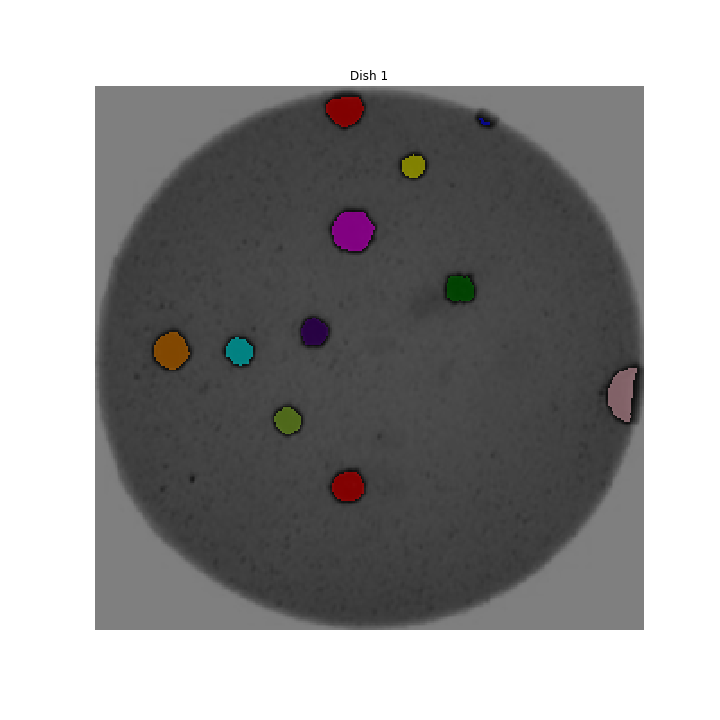

::::::::::::::::::::::::::::::::::::::: objectives

- Recognise scientific questions that could be solved with image processing / computer vision.
- Recognise morphometric problems (those dealing with the number, size, or shape of the objects in an image).

::::::::::::::::::::::::::::::::::::::::::::::::::

:::::::::::::::::::::::::::::::::::::::: questions

- What sort of scientific questions can we answer with image processing / computer vision?
- What are morphometric problems?

::::::::::::::::::::::::::::::::::::::::::::::::::

As computer systems have become faster and more powerful,
and cameras and other imaging systems have become commonplace
in many other areas of life,
the need has grown for researchers to be able to
process and analyse image data.
Considering the large volumes of data that can be involved -
high-resolution images that take up a lot of disk space/virtual memory,
and/or collections of many images that must be processed together -
and the time-consuming and error-prone nature of manual processing,
it can be advantageous or even necessary for this processing and analysis
to be automated as a computer program.

This lesson introduces an open source toolkit for processing image data:
the Python programming language
and [the *scikit-image* (`skimage`) library](https://scikit-image.org/).
With careful experimental design,
Python code can be a powerful instrument in answering many different kinds of questions.

## Uses of Image Processing in Research

Automated processing can be used to analyse many different properties of an image,
including the distribution and change in colours in the image,
the number, size, position, orientation, and shape of objects in the image,
and even - when combined with machine learning techniques for object recognition -
the type of objects in the image.

Some examples of image processing methods applied in research include:

- [imaging a Black Hole](https://iopscience.iop.org/article/10.3847/2041-8213/ab0e85)
- [estimating the population of Emperor Penguins](https://www.ncbi.nlm.nih.gov/pmc/articles/PMC3325796/)
- [the global-scale analysis of marine plankton diversity](https://www.cell.com/cell/fulltext/S0092-8674\(19\)31124-9)
- [segmentation of liver and vessels from CT images](https://doi.org/10.1016/j.cmpb.2017.12.008)

With this lesson,
we aim to provide a thorough grounding in the fundamental concepts and skills
of working with image data in Python.
Most of the examples used in this lesson focus on
one particular class of image processing technique, *morphometrics*,
but what you will learn can be used to solve a much wider range of problems.

## Morphometrics

Morphometrics involves counting the number of objects in an image,
analyzing the size of the objects,
or analyzing the shape of the objects.
For example, we might be interested in automatically counting
the number of bacterial colonies growing in a Petri dish,
as shown in this image:

{alt='Bacteria colony'}

We could use image processing to find the colonies, count them,
and then highlight their locations on the original image,
resulting in an image like this:

{alt='Colonies counted'}

:::::::::::::::::::::::::::::::::::::::::  callout

## Why write a program to do that?

Note that you can easily manually count the number of bacteria colonies
shown in the morphometric example above.
Why should we learn how to write a Python program to do a task
we could easily perform with our own eyes?
There are at least two reasons to learn how to perform tasks like these
with Python and scikit-image:

1. What if there are many more bacteria colonies in the Petri dish?
  For example, suppose the image looked like this:

{alt='Bacteria colony'}

Manually counting the colonies in that image would present more of a challenge.
A Python program using scikit-image could count the number of colonies more accurately,
and much more quickly, than a human could.

2. What if you have hundreds, or thousands, of images to consider?
  Imagine having to manually count colonies on several thousand images
  like those above.
  A Python program using scikit-image could move through all of the images in seconds;
  how long would a graduate student require to do the task?
  Which process would be more accurate and repeatable?

As you can see, the simple image processing / computer vision techniques you
will learn during this workshop can be very valuable tools for scientific
research.

::::::::::::::::::::::::::::::::::::::::::::::::::

As we move through this workshop,
we will learn image analysis methods useful for many different scientific problems.
These will be linked together
and applied to a real problem in the final end-of-workshop
[capstone challenge](09-challenges.md).

Let's get started,
by learning some basics about how images are represented and stored digitally.

:::::::::::::::::::::::::::::::::::::::: keypoints

- Simple Python and scikit-image techniques can be used to solve genuine image analysis problems.
- Morphometric problems involve the number, shape, and / or size of the objects in an image.

::::::::::::::::::::::::::::::::::::::::::::::::::
