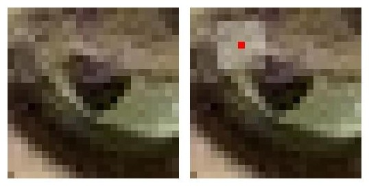
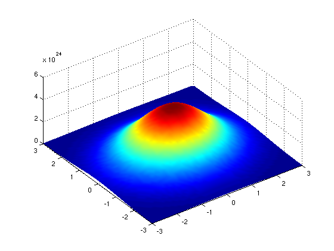
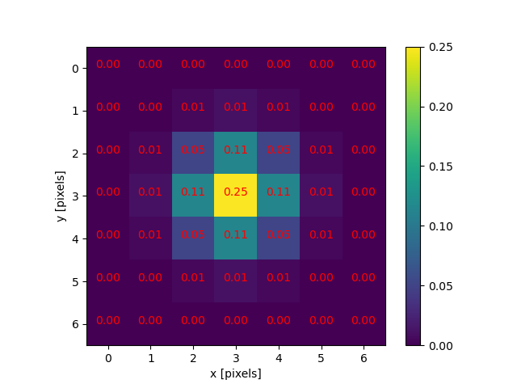
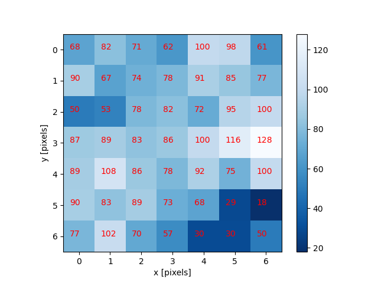
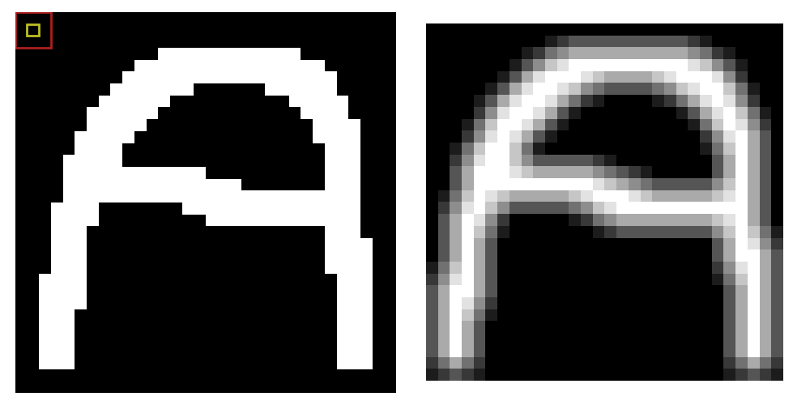
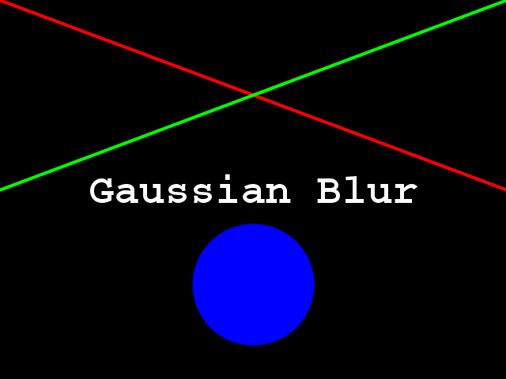

::::::::::::::::::::::::::::::::::::::: objectives

- Explain why applying a low-pass blurring filter to an image is beneficial.
- Apply a Gaussian blur filter to an image using scikit-image.

::::::::::::::::::::::::::::::::::::::::::::::::::

:::::::::::::::::::::::::::::::::::::::: questions

- How can we apply a low-pass blurring filter to an image?

::::::::::::::::::::::::::::::::::::::::::::::::::

In this episode, we will learn how to use scikit-image functions to blur images.

When processing an image, we are often interested in identifying objects
represented within it so that we can perform some further analysis of these
objects e.g. by counting them, measuring their sizes, etc.
An important concept associated with the identification of objects in an image
is that of *edges*: the lines that represent a transition from one group of
similar pixels in the image to another different group.
One example of an edge is the pixels that represent
the boundaries of an object in an image,
where the background of the image ends and the object begins.

When we blur an image,
we make the colour transition from one side of an edge in the image to another
smooth rather than sudden.
The effect is to average out rapid changes in pixel intensity.
A blur is a very common operation we need to perform before other tasks such as
[thresholding](07-thresholding.md).
There are several different blurring functions in the `skimage.filters` module,
so we will focus on just one here, the *Gaussian blur*.

:::::::::::::::::::::::::::::::::::::::::  callout

## Filters

In the day-to-day, macroscopic world,
we have physical filters which separate out objects by size.
A filter with small holes allows only small objects through,
leaving larger objects behind.
This is a good analogy for image filters.
A high-pass filter will retain the smaller details in an image,
filtering out the larger ones.
A low-pass filter retains the larger features,
analogous to what's left behind by a physical filter mesh.
*High-* and \*low-\*pass, here,
refer to high and low *spatial frequencies* in the image.
Details associated with high spatial frequencies are small,
a lot of these features would fit across an image.
Features associated with low spatial frequencies are large -
maybe a couple of big features per image.

::::::::::::::::::::::::::::::::::::::::::::::::::

:::::::::::::::::::::::::::::::::::::::::  callout

## Blurring

Blurring is to make something less clear or distinct.
This could be interpreted quite broadly in the context of image analysis -
anything that reduces or distorts the detail of an image might apply.
Applying a low pass filter, which removes detail occurring at high spatial frequencies,
is perceived as a blurring effect.
A Gaussian blur is a filter that makes use of a Gaussian kernel.

::::::::::::::::::::::::::::::::::::::::::::::::::

:::::::::::::::::::::::::::::::::::::::::  callout

## Kernels

A kernel can be used to implement a filter on an image.
A kernel, in this context,
is a small matrix which is combined with the image using
a mathematical technique: *convolution*.
Different sizes, shapes and contents of kernel produce different effects.
The kernel can be thought of as a little image in itself,
and will favour features of a similar size and shape in the main image.
On convolution with an image, a big, blobby kernel will retain
big, blobby, low spatial frequency features.

::::::::::::::::::::::::::::::::::::::::::::::::::

## Gaussian blur

Consider this image of a cat,
in particular the area of the image outlined by the white square.

{alt='Cat image'}

Now, zoom in on the area of the cat's eye, as shown in the left-hand image below.
When we apply a filter, we consider each pixel in the image, one at a time.
In this example, the pixel we are currently working on is highlighted in red,
as shown in the right-hand image.

{alt='Cat eye pixels'}

When we apply a filter, we consider rectangular groups of pixels surrounding
each pixel in the image, in turn.
The *kernel* is another group of pixels (a separate matrix / small image),
of the same dimensions as the rectangular group of pixels in the image,
that moves along with the pixel being worked on by the filter.
The width and height of the kernel must be an odd number,
so that the pixel being worked on is always in its centre.
In the example shown above, the kernel is square, with a dimension of seven pixels.

To apply the kernel to the current pixel,
an average of the the colour values of the pixels surrounding it is calculated,
weighted by the values in the kernel.
In a Gaussian blur, the pixels nearest the centre of the kernel are
given more weight than those far away from the centre.
The rate at which this weight diminishes is determined by a Gaussian function, hence the name
Gaussian blur.

A Gaussian function maps random variables into a normal distribution or "Bell Curve".
{alt='Gaussian function'}

| *[https://en.wikipedia.org/wiki/Gaussian\_function#/media/File:Normal\_Distribution\_PDF.svg](https://en.wikipedia.org/wiki/Gaussian_function#/media/File:Normal_Distribution_PDF.svg)* |

The shape of the function is described by a mean value μ, and a variance value σ². The mean determines the central point of the bell curve on the x axis, and the variance describes the spread of the curve.

In fact, when using Gaussian functions in Gaussian blurring, we use a 2D Gaussian function to account for X and Y dimensions, but the same rules apply. The mean μ is always 0, and represents the middle of the 2D kernel. Increasing values of σ² in either dimension increases the amount of blurring in that dimension.

{alt='2D Gaussian function'}

| *[https://commons.wikimedia.org/wiki/File:Gaussian\_2D.png](https://commons.wikimedia.org/wiki/File:Gaussian_2D.png)* |

The averaging is done on a channel-by-channel basis,
and the average channel values become the new value for the pixel in
the filtered image.
Larger kernels have more values factored into the average, and this implies
that a larger kernel will blur the image more than a smaller kernel.

To get an idea of how this works,
consider this plot of the two-dimensional Gaussian function:

{alt='2D Gaussian function'}

Imagine that plot laid over the kernel for the Gaussian blur filter.
The height of the plot corresponds to the weight given to the underlying pixel
in the kernel.
I.e., the pixels close to the centre become more important to
the filtered pixel colour than the pixels close to the outer limits of the kernel.
The shape of the Gaussian function is controlled via its standard deviation,
or sigma.
A large sigma value results in a flatter shape,
while a smaller sigma value results in a more pronounced peak.
The mathematics involved in the Gaussian blur filter are not quite that simple,
but this explanation gives you the basic idea.

To illustrate the blur process,
consider the blue channel colour values from the seven-by-seven region
of the cat image above:

{alt='Image corner pixels'}

The filter is going to determine the new blue channel value for the centre
pixel -- the one that currently has the value 86. The filter calculates a
weighted average of all the blue channel values in the kernel
giving higher weight to the pixels near the centre of the
kernel.

{alt='Image multiplication'}

This weighted average, the sum of the multiplications,
becomes the new value for the centre pixel (3, 3).
The same process would be used to determine the green and red channel values,
and then the kernel would be moved over to apply the filter to the
next pixel in the image.

:::::::::::::::::::::::::::::::::::::::: instructor

## Terminology about image boundaries

Take care to avoid mixing up the term "edge" to describe the edges of objects
*within* an image and the outer boundaries of the images themselves.
Lack of a clear distinction here may be confusing for learners.

:::::::::::::::::::::::::::::::::::::::::::::::::::

:::::::::::::::::::::::::::::::::::::::::  callout

## Image edges

Something different needs to happen for pixels near the outer limits of the image,
since the kernel for the filter may be partially off the image.
For example, what happens when the filter is applied to
the upper-left pixel of the image?
Here are the blue channel pixel values for the upper-left pixel of the cat image,
again assuming a seven-by-seven kernel:

```output
  x   x   x   x   x   x   x
  x   x   x   x   x   x   x
  x   x   x   x   x   x   x
  x   x   x   4   5   9   2
  x   x   x   5   3   6   7
  x   x   x   6   5   7   8
  x   x   x   5   4   5   3
```

The upper-left pixel is the one with value 4.
Since the pixel is at the upper-left corner,
there are no pixels underneath much of the kernel;
here, this is represented by x's.
So, what does the filter do in that situation?

The default mode is to fill in the *nearest* pixel value from the image.
For each of the missing x's the image value closest to the x is used.
If we fill in a few of the missing pixels, you will see how this works:

```output
  x   x   x   4   x   x   x
  x   x   x   4   x   x   x
  x   x   x   4   x   x   x
  4   4   4   4   5   9   2
  x   x   x   5   3   6   7
  x   x   x   6   5   7   8
  x   x   x   5   4   5   3
```

Another strategy to fill those missing values is
to *reflect* the pixels that are in the image to fill in for the pixels that
are missing from the kernel.

```output
  x   x   x   5   x   x   x
  x   x   x   6   x   x   x
  x   x   x   5   x   x   x
  2   9   5   4   5   9   2
  x   x   x   5   3   6   7
  x   x   x   6   5   7   8
  x   x   x   5   4   5   3
```

A similar process would be used to fill in all of the other missing pixels from
the kernel. Other *border modes* are available; you can learn more about them
in [the scikit-image documentation](https://scikit-image.org/docs/dev/user_guide).

::::::::::::::::::::::::::::::::::::::::::::::::::

This animation shows how the blur kernel moves along in the original image in
order to calculate the colour channel values for the blurred image.

{alt='Blur demo animation'}

scikit-image has built-in functions to perform blurring for us, so we do not have to
perform all of these mathematical operations ourselves. Let's work through
an example of blurring an image with the scikit-image Gaussian blur function.

First, import the packages needed for this episode

```python
import matplotlib.pyplot as plt
import ipympl
import imageio.v3 as iio
import skimage
import skimage.filters
%matplotlib widget
```

Then, we load the image, and display it:

```python
image = iio.imread(uri="data/gaussian-original.png")

# display the image
fig, ax = plt.subplots()
plt.imshow(image)
```

{alt='Original image'}

Next, we apply the gaussian blur:

```python
sigma = 3.0

# apply Gaussian blur, creating a new image
blurred = skimage.filters.gaussian(
    image, sigma=(sigma, sigma), truncate=3.5, channel_axis=-1)
```

The first two arguments to `skimage.filters.gaussian()` are the image to blur,
`image`, and a tuple defining the sigma to use in ry- and cx-direction,
`(sigma, sigma)`.
The third parameter `truncate` is meant to pass the radius of the kernel in
number of sigmas.
A Gaussian function is defined from -infinity to +infinity, but our kernel
(which must have a finite, smaller size) can only approximate the real function.
Therefore, we must choose a certain distance from the centre of the function
where we stop this approximation, and set the final size of our kernel.
In the above example, we set `truncate` to 3.5,
which means the kernel size will be 2 \* sigma \* 3.5.
For example, for a `sigma` of 1.0 the resulting kernel size would be 7,
while for a `sigma` of 2.0 the kernel size would be 14.
The default value for `truncate` in scikit-image is 4.0.

The last argument we passed to `skimage.filters.gaussian()` is used to
specify the dimension which contains the (colour) channels.
Here, it is the last dimension;
recall that, in Python, the `-1` index refers to the last position.
In this case, the last dimension is the third dimension (index `2`), since our
image has three dimensions:

```python
print(image.ndim)
```

```output
3
```

Finally, we display the blurred image:

```python
# display blurred image
fig, ax = plt.subplots()
plt.imshow(blurred)
```

{alt='Original image'}

:::::::::::::::::::::::::::::::::::::::  challenge

## Experimenting with sigma values (10 min)

The size and shape of the kernel used to blur an image can have a
significant effect on the result of the blurring and any downstream analysis
carried out on the blurred image.
The next two exercises ask you to experiment with the sigma values of the kernel,
which is a good way to develop your understanding of how the choice of kernel
can influence the result of blurring.

First, try running the code above with a range of smaller and larger sigma values.
Generally speaking, what effect does the sigma value have on the
blurred image?

:::::::::::::::  solution

## Solution

Generally speaking, the larger the sigma value, the more blurry the result.
A larger sigma will tend to get rid of more noise in the image, which will
help for other operations we will cover soon, such as thresholding.
However, a larger sigma also tends to eliminate some of the detail from
the image. So, we must strike a balance with the sigma value used for
blur filters.


:::::::::::::::::::::::::

::::::::::::::::::::::::::::::::::::::::::::::::::

:::::::::::::::::::::::::::::::::::::::  challenge

## Experimenting with kernel shape (10 min - optional, not included in timing)

Now, what is the effect of applying an asymmetric kernel to blurring an image?
Try running the code above with different sigmas in the ry and cx direction.
For example, a sigma of 1.0 in the ry direction, and 6.0 in the cx direction.

:::::::::::::::  solution

## Solution

```python
# apply Gaussian blur, with a sigma of 1.0 in the ry direction, and 6.0 in the cx direction
blurred = skimage.filters.gaussian(
    image, sigma=(1.0, 6.0), truncate=3.5, channel_axis=-1
)

# display blurred image
fig, ax = plt.subplots()
plt.imshow(blurred)
```

{alt='Rectangular kernel blurred image'}

These unequal sigma values produce a kernel that is rectangular instead of square.
The result is an image that is much more blurred in the x direction than the
y direction.
For most use cases, a uniform blurring effect is desirable and
this kind of asymmetric blurring should be avoided.
However, it can be helpful in specific circumstances e.g. when noise is present in
your image in a particular pattern or orientation, such as vertical lines,
or when you want to
[remove uniform noise without blurring edges present in the image in a particular orientation](https://www.researchgate.net/publication/228567435_An_edge_detection_algorithm_based_on_rectangular_Gaussian_kernels_for_machine_vision_applications).

:::::::::::::::::::::::::

::::::::::::::::::::::::::::::::::::::::::::::::::

## Other methods of blurring

The Gaussian blur is a way to apply a low-pass filter in scikit-image.
It is often used to remove Gaussian (i. e., random) noise from the image.
For other kinds of noise, e.g. "salt and pepper", a
median filter is typically used.
See [the `skimage.filters` documentation](https://scikit-image.org/docs/dev/api/skimage.filters.html#module-skimage.filters)
for a list of available filters.

:::::::::::::::::::::::::::::::::::::::: keypoints

- Applying a low-pass blurring filter smooths edges and removes noise from an image.
- Blurring is often used as a first step before we perform thresholding or edge detection.
- The Gaussian blur can be applied to an image with the `skimage.filters.gaussian()` function.
- Larger sigma values may remove more noise, but they will also remove detail from an image.

::::::::::::::::::::::::::::::::::::::::::::::::::
