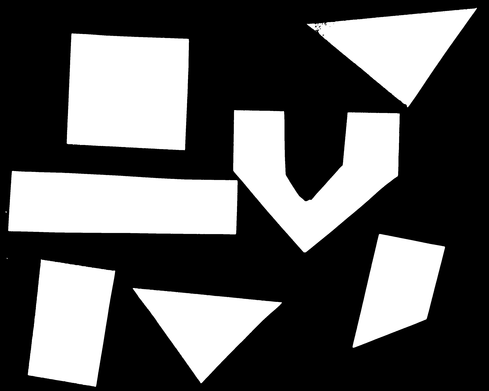
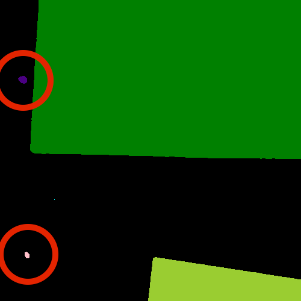
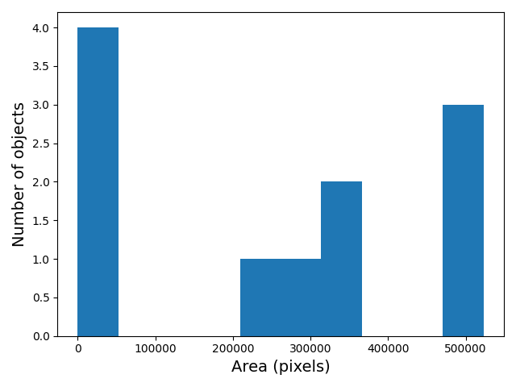

::::::::::::::::::::::::::::::::::::::: objectives

- Understand the term object in the context of images.
- Learn about pixel connectivity.
- Learn how Connected Component Analysis (CCA) works.
- Use CCA to produce an image that highlights every object in a different colour.
- Characterise each object with numbers that describe its appearance.

::::::::::::::::::::::::::::::::::::::::::::::::::

:::::::::::::::::::::::::::::::::::::::: questions

- How to extract separate objects from an image and describe these objects quantitatively.

::::::::::::::::::::::::::::::::::::::::::::::::::

## Objects

In [the *Thresholding* episode](07-thresholding.md)
we have covered dividing an image into foreground and background pixels.
In the shapes example image,
we considered the coloured shapes as foreground *objects* on a white background.

{alt='Original shapes image' .image-with-shadow}

In thresholding we went from the original image to this version:

{alt='Mask created by thresholding'}

Here, we created a mask that only highlights the parts of the image
that we find interesting, the *objects*.
All objects have pixel value of `True` while the background pixels are `False`.

By looking at the mask image,
one can count the objects that are present in the image (7).
But how did we actually do that,
how did we decide which lump of pixels constitutes a single object?

<!-- TODO: Group exercise: given sheep of paper with grids of 0's and
1's, how to identify which pixels belong to an object, find a rule for
each pixel to determine in which object it is -->

## Pixel Neighborhoods

In order to decide which pixels belong to the same object,
one can exploit their neighborhood:
pixels that are directly next to each other
and belong to the foreground class can be considered to belong to the same object.

Let's discuss the concept of pixel neighborhoods in more detail.
Consider the following mask "image" with 8 rows, and 8 columns.
For the purpose of illustration, the digit `0` is used to represent
background pixels, and the letter `X` is used to represent
object pixels foreground).

```output
0 0 0 0 0 0 0 0
0 X X 0 0 0 0 0
0 X X 0 0 0 0 0
0 0 0 X X X 0 0
0 0 0 X X X X 0
0 0 0 0 0 0 0 0
```

The pixels are organised in a rectangular grid.
In order to understand pixel neighborhoods
we will introduce the concept of "jumps" between pixels.
The jumps follow two rules:
First rule is that one jump is only allowed along the column, or the row.
Diagonal jumps are not allowed.
So, from a centre pixel, denoted with `o`,
only the pixels indicated with a `1` are reachable:

```output
- 1 -
1 o 1
- 1 -
```

The pixels on the diagonal (from `o`) are not reachable with a single jump,
which is denoted by the `-`.
The pixels reachable with a single jump form the **1-jump** neighborhood.

The second rule states that in a sequence of jumps,
one may only jump in row and column direction once -> they have to be *orthogonal*.
An example of a sequence of orthogonal jumps is shown below.
Starting from `o` the first jump goes along the row to the right.
The second jump then goes along the column direction up.
After this,
the sequence cannot be continued as a jump has already been made
in both row and column direction.

```output
- - 2
- o 1
- - -
```

All pixels reachable with one, or two jumps form the **2-jump** neighborhood.
The grid below illustrates the pixels reachable from
the centre pixel `o` with a single jump, highlighted with a `1`,
and the pixels reachable with 2 jumps with a `2`.

```output
2 1 2
1 o 1
2 1 2
```

We want to revisit our example image mask from above and apply
the two different neighborhood rules.
With a single jump connectivity for each pixel, we get two resulting objects,
highlighted in the image with `A`'s and `B`'s.

```output
0 0 0 0 0 0 0 0
0 A A 0 0 0 0 0
0 A A 0 0 0 0 0
0 0 0 B B B 0 0
0 0 0 B B B B 0
0 0 0 0 0 0 0 0
```

In the 1-jump version,
only pixels that have direct neighbors along rows or columns are considered connected.
Diagonal connections are not included in the 1-jump neighborhood.
With two jumps, however, we only get a single object `A` because pixels are also
considered connected along the diagonals.

```output
0 0 0 0 0 0 0 0
0 A A 0 0 0 0 0
0 A A 0 0 0 0 0
0 0 0 A A A 0 0
0 0 0 A A A A 0
0 0 0 0 0 0 0 0
```

:::::::::::::::::::::::::::::::::::::::  challenge

## Object counting (optional, not included in timing)

How many objects with 1 orthogonal jump, how many with 2 orthogonal jumps?

```output
0 0 0 0 0 0 0 0
0 X 0 0 0 X X 0
0 0 X 0 0 0 0 0
0 X 0 X X X 0 0
0 X 0 X X 0 0 0
0 0 0 0 0 0 0 0
```

1 jump

a) 1
b) 5
c) 2

:::::::::::::::  solution

## Solution

b) 5


:::::::::::::::::::::::::

2 jumps

a) 2
b) 3
c) 5

:::::::::::::::  solution

## Solution

a) 2


:::::::::::::::::::::::::

::::::::::::::::::::::::::::::::::::::::::::::::::

:::::::::::::::::::::::::::::::::::::::::  callout

## Jumps and neighborhoods

We have just introduced how you can reach different neighboring
pixels by performing one or more orthogonal jumps. We have used the
terms 1-jump and 2-jump neighborhood. There is also a different way
of referring to these neighborhoods: the 4- and 8-neighborhood.
With a single jump you can reach four pixels from a given starting
pixel. Hence, the 1-jump neighborhood corresponds to the
4-neighborhood. When two orthogonal jumps are allowed, eight pixels
can be reached, so the 2-jump neighborhood corresponds to the
8-neighborhood.


::::::::::::::::::::::::::::::::::::::::::::::::::

## Connected Component Analysis

In order to find the objects in an image, we want to employ an
operation that is called Connected Component Analysis (CCA).
This operation takes a binary image as an input.
Usually, the `False` value in this image is associated with background pixels,
and the `True` value indicates foreground, or object pixels.
Such an image can be produced, e.g., with thresholding.
Given a thresholded image,
the connected component analysis produces a new *labeled* image with integer pixel values.
Pixels with the same value, belong to the same object.
scikit-image provides connected component analysis in the function `skimage.measure.label()`.
Let us add this function to the already familiar steps of thresholding an image.

First, import the packages needed for this episode

```python
import numpy as np
import matplotlib.pyplot as plt
import ipympl
import imageio.v3 as iio
import skimage.color
import skimage.filters
import skimage.measure
%matplotlib widget
```

Note the new import of `skimage.measure` in order to use the
`skimage.measure.label` function that performs the CCA.

Next, we define a reusable Python function `connected_components`:

```python
def connected_components(filename, sigma=1.0, t=0.5, connectivity=2):
    # load the image
    image = iio.imread(filename)
    # convert the image to grayscale
    gray_image = skimage.color.rgb2gray(image)
    # denoise the image with a Gaussian filter
    blurred_image = skimage.filters.gaussian(gray_image, sigma=sigma)
    # mask the image according to threshold
    binary_mask = blurred_image < t
    # perform connected component analysis
    labeled_image, count = skimage.measure.label(binary_mask,
                                                 connectivity=connectivity, return_num=True)
    return labeled_image, count
```

The first four lines of code are familiar from
[the *Thresholding* episode](07-thresholding.md).

<!-- Note: shapes image: with sigma=2.0, threshold=0.9 -> 11 objects; with sigma=5 -> 8 objects -->

Then we call the `skimage.measure.label` function.
This function has one positional argument where we pass the `binary_mask`,
i.e., the binary image to work on.
With the optional argument `connectivity`,
we specify the neighborhood in units of orthogonal jumps.
For example,
by setting `connectivity=2` we will consider the 2-jump neighborhood introduced above.
The function returns a `labeled_image` where each pixel has
a unique value corresponding to the object it belongs to.
In addition, we pass the optional parameter `return_num=True` to return
the maximum label index as `count`.

:::::::::::::::::::::::::::::::::::::::::  callout

## Optional parameters and return values

The optional parameter `return_num` changes the data type that is
returned by the function `skimage.measure.label`.
The number of labels is only returned if `return_num` is *True*.
Otherwise, the function only returns the labeled image.
This means that we have to pay attention when assigning
the return value to a variable.
If we omit the optional parameter `return_num` or pass `return_num=False`,
we can call the function as

```python
labeled_image = skimage.measure.label(binary_mask)
```

If we pass `return_num=True`, the function returns a tuple and we
can assign it as

```python
labeled_image, count = skimage.measure.label(binary_mask, return_num=True)
```

If we used the same assignment as in the first case,
the variable `labeled_image` would become a tuple,
in which `labeled_image[0]` is the image
and `labeled_image[1]` is the number of labels.
This could cause confusion if we assume that `labeled_image`
only contains the image and pass it to other functions.
If you get an
`AttributeError: 'tuple' object has no attribute 'shape'`
or similar,  check if you have assigned the return values consistently
with the optional parameters.


::::::::::::::::::::::::::::::::::::::::::::::::::

We can call the above function `connected_components` and
display the labeled image like so:

```python
labeled_image, count = connected_components(filename="data/shapes-01.jpg", sigma=2.0, t=0.9, connectivity=2)

fig, ax = plt.subplots()
plt.imshow(labeled_image)
plt.axis("off");
```

:::::::::::::: {.empty-div style="margin-bottom: 50px"}
<!-- This div is intentionally empty to allow the solution to float alone -->
::::::::::::::

::::::::::::::  solution

## Color mappings

Here you might get a warning
`UserWarning: Low image data range; displaying image with stretched contrast.`
or just see an all black image
(Note: this behavior might change in future versions or
not occur with a different image viewer).

What went wrong?
When you hover over the black image,
the pixel values are shown as numbers in the lower corner of the viewer.
You can see that some pixels have values different from `0`,
so they are not actually pure black.
Let's find out more by examining `labeled_image`.
Properties that might be interesting in this context are `dtype`,
the minimum and maximum value.
We can print them with the following lines:

```python
print("dtype:", labeled_image.dtype)
print("min:", np.min(labeled_image))
print("max:", np.max(labeled_image))
```

Examining the output can give us a clue why the image appears black.

```output
dtype: int32
min: 0
max: 11
```

The `dtype` of `labeled_image` is `int64`.
This means that values in this image range from `-2 ** 63` to `2 ** 63 - 1`.
Those are really big numbers.
From this available space we only use the range from `0` to `11`.
When showing this image in the viewer,
it squeezes the complete range into 256 gray values.
Therefore, the range of our numbers does not produce any visible change.

Fortunately, the scikit-image library has tools to cope with this situation.


:::::::::::::::::::::::::

We can use the function `skimage.color.label2rgb()`
to convert the colours in the image
(recall that we already used the `skimage.color.rgb2gray()` function
to convert to grayscale).
With `skimage.color.label2rgb()`,
all objects are coloured according to a list of colours that can be customised.
We can use the following commands to convert and show the image:

```python
# convert the label image to color image
colored_label_image = skimage.color.label2rgb(labeled_image, bg_label=0)

fig, ax = plt.subplots()
plt.imshow(colored_label_image)
plt.axis("off");
```

{alt='Labeled objects'}

:::::::::::::::::::::::::::::::::::::::  challenge

## How many objects are in that image (15 min)

Now, it is your turn to practice.
Using the function `connected_components`,
find two ways of printing out the number of objects found in the image.

What number of objects would you expect to get?

How does changing the `sigma` and `threshold` values influence the result?

:::::::::::::::  solution

## Solution

As you might have guessed, the return value `count` already
contains the number of found images. So it can simply be printed
with

```python
print("Found", count, "objects in the image.")
```

But there is also a way to obtain the number of found objects from
the labeled image itself.
Recall that all pixels that belong to a single object
are assigned the same integer value.
The connected component algorithm produces consecutive numbers.
The background gets the value `0`,
the first object gets the value `1`,
the second object the value `2`, and so on.
This means that by finding the object with the maximum value,
we also know how many objects there are in the image.
We can thus use the `np.max` function from NumPy to
find the maximum value that equals the number of found objects:

```python
num_objects = np.max(labeled_image)
print("Found", num_objects, "objects in the image.")
```

Invoking the function with `sigma=2.0`, and `threshold=0.9`,
both methods will print

```output
Found 11 objects in the image.
```

Lowering the threshold will result in fewer objects.
The higher the threshold is set, the more objects are found.
More and more background noise gets picked up as objects.
Larger sigmas produce binary masks with less noise and hence
a smaller number of objects.
Setting sigma too high bears the danger of merging objects.


:::::::::::::::::::::::::

::::::::::::::::::::::::::::::::::::::::::::::::::

You might wonder why the connected component analysis with `sigma=2.0`,
and `threshold=0.9` finds 11 objects, whereas we would expect only 7 objects.
Where are the four additional objects?
With a bit of detective work, we can spot some small objects in the image,
for example, near the left border.

{alt='shapes-01.jpg mask detail'}

For us it is clear that these small spots are artifacts and
not objects we are interested in.
But how can we tell the computer?
One way to calibrate the algorithm is to adjust the parameters for
blurring (`sigma`) and thresholding (`t`),
but you may have noticed during the above exercise that
it is quite hard to find a combination that produces the right output number.
In some cases, background noise gets picked up as an object.
And with other parameters,
some of the foreground objects get broken up or disappear completely.
Therefore, we need other criteria to describe desired properties of the objects
that are found.

## Morphometrics - Describe object features with numbers

Morphometrics is concerned with the quantitative analysis of objects and
considers properties such as size and shape.
For the example of the images with the shapes,
our intuition tells us that the objects should be of a certain size or area.
So we could use a minimum area as a criterion for when an object should be detected.
To apply such a criterion,
we need a way to calculate the area of objects found by connected components.
Recall how we determined the root mass in
[the *Thresholding* episode](07-thresholding.md)
by counting the pixels in the binary mask.
But here we want to calculate the area of several objects in the labeled image.
The scikit-image library provides the function `skimage.measure.regionprops`
to measure the properties of labeled regions.
It returns a list of `RegionProperties` that describe each connected region in the images.
The properties can be accessed using the attributes of the `RegionProperties` data type.
Here we will use the properties `"area"` and `"label"`.
You can explore the scikit-image documentation to learn about other properties available.

We can get a list of areas of the labeled objects as follows:

```python
# compute object features and extract object areas
object_features = skimage.measure.regionprops(labeled_image)
object_areas = [objf["area"] for objf in object_features]
object_areas
```

This will produce the output

```output
[318542, 1, 523204, 496613, 517331, 143, 256215, 1, 68, 338784, 265755]
```

:::::::::::::::::::::::::::::::::::::::  challenge

## Plot a histogram of the object area distribution (10 min)

Similar to how we determined a "good" threshold in
[the *Thresholding* episode](07-thresholding.md),
it is often helpful to inspect the histogram of an object property.
For example, we want to look at the distribution of the object areas.

1. Create and examine a [histogram](05-creating-histograms.md)
  of the object areas obtained with `skimage.measure.regionprops`.
2. What does the histogram tell you about the objects?

:::::::::::::::  solution

## Solution

The histogram can be plotted with

```python
fig, ax = plt.subplots()
plt.hist(object_areas)
plt.xlabel("Area (pixels)")
plt.ylabel("Number of objects");
```

{alt='Histogram of object areas'}

The histogram shows the number of objects (vertical axis)
whose area is within a certain range (horizontal axis).
The height of the bars in the histogram indicates
the prevalence of objects with a certain area.
The whole histogram tells us about the distribution of object sizes in the image.
It is often possible to identify gaps between groups of bars
(or peaks if we draw the histogram as a continuous curve)
that tell us about certain groups in the image.

In this example, we can see that there are four small objects that
contain less than 50000 pixels.
Then there is a group of four (1+1+2) objects in
the range between 200000 and 400000,
and three objects with a size around 500000.
For our object count, we might want to disregard the small objects as artifacts,
i.e, we want to ignore the leftmost bar of the histogram.
We could use a threshold of 50000 as the minimum area to count.
In fact, the `object_areas` list already tells us that
there are fewer than 200 pixels in these objects.
Therefore, it is reasonable to require a minimum area of at least 200 pixels
for a detected object.
In practice, finding the "right" threshold can be tricky and
usually involves an educated guess based on domain knowledge.


:::::::::::::::::::::::::

::::::::::::::::::::::::::::::::::::::::::::::::::

:::::::::::::::::::::::::::::::::::::::  challenge

## Filter objects by area (10 min)

Now we would like to use a minimum area criterion to obtain a more
accurate count of the objects in the image.

1. Find a way to calculate the number of objects by only counting
  objects above a certain area.

:::::::::::::::  solution

## Solution

One way to count only objects above a certain area is to first
create a list of those objects, and then take the length of that
list as the object count. This can be done as follows:

```python
min_area = 200
large_objects = []
for objf in object_features:
    if objf["area"] > min_area:
        large_objects.append(objf["label"])
print("Found", len(large_objects), "objects!")
```

Another option is to use NumPy arrays to create the list of large objects.
We first create an array `object_areas` containing the object areas,
and an array `object_labels` containing the object labels.
The labels of the objects are also returned by `skimage.measure.regionprops`.
We have already seen that we can create boolean arrays using comparison operators.
Here we can use `object_areas > min_area`
to produce an array that has the same dimension as `object_labels`.
It can then used to select the labels of objects whose area is
greater than `min_area` by indexing:

```python
object_areas = np.array([objf["area"] for objf in object_features])
object_labels = np.array([objf["label"] for objf in object_features])
large_objects = object_labels[object_areas > min_area]
print("Found", len(large_objects), "objects!")
```

The advantage of using NumPy arrays is that
`for` loops and `if` statements in Python can be slow,
and in practice the first approach may not be feasible
if the image contains a large number of objects.
In that case, NumPy array functions turn out to be very useful because
they are much faster.

In this example, we can also use the `np.count_nonzero` function
that we have seen earlier together with the `>` operator to count
the objects whose area is above `min_area`.

```python
n = np.count_nonzero(object_areas > min_area)
print("Found", n, "objects!")
```

For all three alternatives, the output is the same and gives the
expected count of 7 objects.


:::::::::::::::::::::::::

::::::::::::::::::::::::::::::::::::::::::::::::::

:::::::::::::::::::::::::::::::::::::::::  callout

## Using functions from NumPy and other Python packages

Functions from Python packages such as NumPy are often more efficient and
require less code to write.
It is a good idea to browse the reference pages of `numpy` and `skimage` to
look for an availabe function that can solve a given task.


::::::::::::::::::::::::::::::::::::::::::::::::::

:::::::::::::::::::::::::::::::::::::::  challenge

## Remove small objects (20 min)

We might also want to exclude (mask) the small objects when plotting
the labeled image.

2. Enhance the `connected_components` function such that
  it automatically removes objects that are below a certain area that is
  passed to the function as an optional parameter.

:::::::::::::::  solution

## Solution

To remove the small objects from the labeled image,
we change the value of all pixels that belong to the small objects to
the background label 0.
One way to do this is to loop over all objects and
set the pixels that match the label of the object to 0.

```python
for object_id, objf in enumerate(object_features, start=1):
    if objf["area"] < min_area:
        labeled_image[labeled_image == objf["label"]] = 0
```

Here NumPy functions can also be used to eliminate
`for` loops and `if` statements.
Like above, we can create an array of the small object labels with
the comparison `object_areas < min_area`.
We can use another NumPy function, `np.isin`,
to set the pixels of all small objects to 0.
`np.isin` takes two arrays and returns a boolean array with values
`True` if the entry of the first array is found in the second array,
and `False` otherwise.
This array can then be used to index the `labeled_image` and
set the entries that belong to small objects to `0`.

```python
object_areas = np.array([objf["area"] for objf in object_features])
object_labels = np.array([objf["label"] for objf in object_features])
small_objects = object_labels[object_areas < min_area]
labeled_image[np.isin(labeled_image,small_objects)] = 0
```

An even more elegant way to remove small objects from the image is
to leverage the `skimage.morphology` module.
It provides a function `skimage.morphology.remove_small_objects` that
does exactly what we are looking for.
It can be applied to a binary image and
returns a mask in which all objects smaller than `min_area` are excluded,
i.e, their pixel values are set to `False`.
We can then apply `skimage.measure.label` to the masked image:

```python
object_mask = skimage.morphology.remove_small_objects(binary_mask,min_area)
labeled_image, n = skimage.measure.label(object_mask,
                                         connectivity=connectivity, return_num=True)
```

Using the scikit-image features, we can implement
the `enhanced_connected_component` as follows:

```python
def enhanced_connected_components(filename, sigma=1.0, t=0.5, connectivity=2, min_area=0):
    image = iio.imread(filename)
    gray_image = skimage.color.rgb2gray(image)
    blurred_image = skimage.filters.gaussian(gray_image, sigma=sigma)
    binary_mask = blurred_image < t
    object_mask = skimage.morphology.remove_small_objects(binary_mask,min_area)
    labeled_image, count = skimage.measure.label(object_mask,
                                                 connectivity=connectivity, return_num=True)
    return labeled_image, count
```

We can now call the function with a chosen `min_area` and
display the resulting labeled image:

```python
labeled_image, count = enhanced_connected_components(filename="data/shapes-01.jpg", sigma=2.0, t=0.9,
                                                     connectivity=2, min_area=min_area)
colored_label_image = skimage.color.label2rgb(labeled_image, bg_label=0)

fig, ax = plt.subplots()
plt.imshow(colored_label_image)
plt.axis("off");

print("Found", count, "objects in the image.")
```

{alt='Objects filtered by area'}

```output
Found 7 objects in the image.
```

Note that the small objects are "gone" and we obtain the correct
number of 7 objects in the image.


:::::::::::::::::::::::::

::::::::::::::::::::::::::::::::::::::::::::::::::

:::::::::::::::::::::::::::::::::::::::  challenge

## Colour objects by area (optional, not included in timing)

Finally, we would like to display the image with the objects coloured
according to the magnitude of their area.
In practice, this can be used with other properties to give
visual cues of the object properties.

:::::::::::::::  solution

## Solution

We already know how to get the areas of the objects from the `regionprops`.
We just need to insert a zero area value for the background
(to colour it like a zero size object).
The background is also labeled `0` in the `labeled_image`,
so we insert the zero area value in front of the first element of
`object_areas` with `np.insert`.
Then we can create a `colored_area_image` where we assign each pixel value
the area by indexing the `object_areas` with the label values in `labeled_image`.

```python
object_areas = np.array([objf["area"] for objf in skimage.measure.regionprops(labeled_image)])
object_areas = np.insert(0,1,object_areas)
colored_area_image = object_areas[labeled_image]

fig, ax = plt.subplots()
im = plt.imshow(colored_area_image)
cbar = fig.colorbar(im, ax=ax, shrink=0.85)
cbar.ax.set_title("Area")
plt.axis("off");
```

{alt='Objects colored by area'}

:::::::::::::::::::::::::::::::::::::::::  callout

You may have noticed that in the solution, we have used the
`labeled_image` to index the array `object_areas`. This is an
example of [advanced indexing in
NumPy](https://numpy.org/doc/stable/user/basics.indexing.html#advanced-indexing)
The result is an array of the same shape as the `labeled_image`
whose pixel values are selected from `object_areas` according to
the object label. Hence the objects will be colored by area when
the result is displayed. Note that advanced indexing with an
integer array works slightly different than the indexing with a
Boolean array that we have used for masking. While Boolean array
indexing returns only the entries corresponding to the `True`
values of the index, integer array indexing returns an array
with the same shape as the index. You can read more about advanced
indexing in the [NumPy
documentation](https://numpy.org/doc/stable/user/basics.indexing.html#advanced-indexing).


::::::::::::::::::::::::::::::::::::::::::::::::::

:::::::::::::::::::::::::

::::::::::::::::::::::::::::::::::::::::::::::::::

:::::::::::::::::::::::::::::::::::::::: keypoints

- We can use `skimage.measure.label` to find and label connected objects in an image.
- We can use `skimage.measure.regionprops` to measure properties of labeled objects.
- We can use `skimage.morphology.remove_small_objects` to mask small objects and remove artifacts from an image.
- We can display the labeled image to view the objects coloured by label.

::::::::::::::::::::::::::::::::::::::::::::::::::
