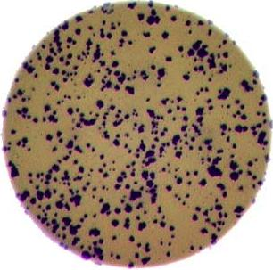
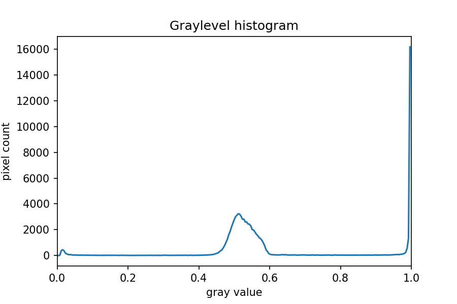

::::::::::::::::::::::::::::::::::::::: objectives

- Bring together everything you've learnt so far to count bacterial colonies in 3 images.

::::::::::::::::::::::::::::::::::::::::::::::::::

:::::::::::::::::::::::::::::::::::::::: questions

- How can we automatically count bacterial colonies with image analysis?

::::::::::::::::::::::::::::::::::::::::::::::::::

In this episode, we will provide a final challenge for you to attempt,
based on all the skills you have acquired so far.
This challenge will be related to the shape of objects in images (*morphometrics*).

## Morphometrics: Bacteria Colony Counting

As mentioned in [the workshop introduction](01-introduction.md),
your morphometric challenge is to determine how many bacteria colonies are in
each of these images:

{alt='Colony image 1'}

{alt='Colony image 2'}

{alt='Colony image 3'}

The image files can be found at
`data/colonies-01.tif`,
`data/colonies-02.tif`,
and `data/colonies-03.tif`.

:::::::::::::::::::::::::::::::::::::::  challenge

## Morphometrics for bacterial colonies

Write a Python program that uses scikit-image to
count the number of bacteria colonies in each image,
and for each, produce a new image that highlights the colonies.
The image should look similar to this one:

{alt='Sample morphometric output'}

Additionally, print out the number of colonies for each image.

Use what you have learnt about [histograms](05-creating-histograms.md),
[thresholding](07-thresholding.md) and
[connected component analysis](08-connected-components.md).
Try to put your code into a re-usable function,
so that it can be applied conveniently to any image file.

:::::::::::::::  solution

## Solution

First, let's work through the process for one image:

```python
import numpy as np
import imageio.v3 as iio
import skimage.color
import skimage.filters
import matplotlib.pyplot as plt
import ipympl
%matplotlib widget

bacteria_image = iio.imread(uri="data/colonies-01.tif")

# display the image
fig, ax = plt.subplots()
plt.imshow(bacteria_image)
```

{alt='Colony image 1'}

Next, we need to threshold the image to create a mask that covers only
the dark bacterial colonies.
This is easier using a grayscale image, so we convert it here:

```python
gray_bacteria = skimage.color.rgb2gray(bacteria_image)

# display the gray image
fig, ax = plt.subplots()
plt.imshow(gray_bacteria, cmap="gray")
```

{alt='Gray Colonies'}

Next, we blur the image and create a histogram:

```python
blurred_image = skimage.filters.gaussian(gray_bacteria, sigma=1.0)
histogram, bin_edges = np.histogram(blurred_image, bins=256, range=(0.0, 1.0))
fig, ax = plt.subplots()
plt.plot(bin_edges[0:-1], histogram)
plt.title("Graylevel histogram")
plt.xlabel("gray value")
plt.ylabel("pixel count")
plt.xlim(0, 1.0)
```

{alt='Histogram image'}

In this histogram, we see three peaks -
the left one (i.e. the darkest pixels) is our colonies,
the central peak is the yellow/brown culture medium in the dish,
and the right one (i.e. the brightest pixels) is the white image background.
Therefore, we choose a threshold that selects the small left peak:

```python
mask = blurred_image < 0.2
fig, ax = plt.subplots()
plt.imshow(mask, cmap="gray")
```

{alt='Colony mask image'}

This mask shows us where the colonies are in the image -
but how can we count how many there are?
This requires connected component analysis:

```python
labeled_image, count = skimage.measure.label(mask, return_num=True)
print(count)
```

Finally, we create the summary image of the coloured colonies on top of
the grayscale image:

```python
# color each of the colonies a different color
colored_label_image = skimage.color.label2rgb(labeled_image, bg_label=0)
# give our grayscale image rgb channels, so we can add the colored colonies
summary_image = skimage.color.gray2rgb(gray_bacteria)
summary_image[mask] = colored_label_image[mask]

# plot overlay
fig, ax = plt.subplots()
plt.imshow(summary_image)
```

{alt='Sample morphometric output'}

Now that we've completed the task for one image,
we need to repeat this for the remaining two images.
This is a good point to collect the lines above into a re-usable function:

```python
def count_colonies(image_filename):
    bacteria_image = iio.imread(image_filename)
    gray_bacteria = skimage.color.rgb2gray(bacteria_image)
    blurred_image = skimage.filters.gaussian(gray_bacteria, sigma=1.0)
    mask = blurred_image < 0.2
    labeled_image, count = skimage.measure.label(mask, return_num=True)
    print(f"There are {count} colonies in {image_filename}")

    colored_label_image = skimage.color.label2rgb(labeled_image, bg_label=0)
    summary_image = skimage.color.gray2rgb(gray_bacteria)
    summary_image[mask] = colored_label_image[mask]
    fig, ax = plt.subplots()
    plt.imshow(summary_image)
```

Now we can do this analysis on all the images via a for loop:

```python
for image_filename in ["data/colonies-01.tif", "data/colonies-02.tif", "data/colonies-03.tif"]:
    count_colonies(image_filename=image_filename)
```

{alt='Colony 1 output'}
{alt='Colony 2 output'}
{alt='Colony 3 output'}

You'll notice that for the images with more colonies, the results aren't perfect.
For example, some small colonies are missing,
and there are likely some small black spots being labelled incorrectly as colonies.
You could expand this solution to, for example,
use an automatically determined threshold for each image,
which may fit each better.
Also, you could filter out colonies below a certain size
(as we did in [the *Connected Component Analysis* episode](08-connected-components.md)).
You'll also see that some touching colonies are merged into one big colony.
This could be fixed with more complicated segmentation methods
(outside of the scope of this lesson) like
[watershed](https://scikit-image.org/docs/dev/auto_examples/segmentation/plot_watershed.html).


:::::::::::::::::::::::::

::::::::::::::::::::::::::::::::::::::::::::::::::

:::::::::::::::::::::::::::::::::::::::: keypoints

- Using thresholding, connected component analysis and other tools we can automatically segment images of bacterial colonies.
- These methods are useful for many scientific problems, especially those involving morphometrics.

::::::::::::::::::::::::::::::::::::::::::::::::::
