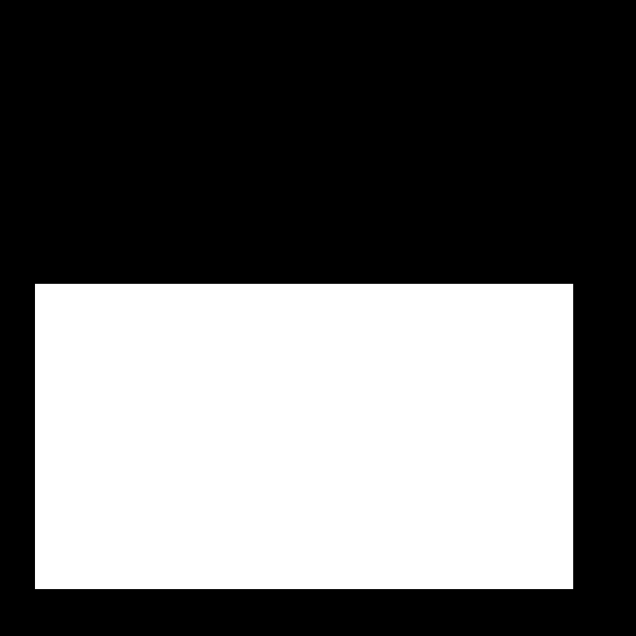
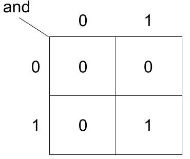
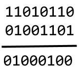

The next series of episodes covers a basic toolkit of OpenCV operators. With 
these tools, we will be able to create programs to perform simple analyses of 
images based on changes in color or shape. 

## Drawing on images

Often we wish to select only a portion of an image to analyze, and ignore the 
rest. Creating a rectangular sub-image with slicing, as we did in the 
[OpenCV Images]({{ page.root }}/02-opencv-images/) lesson is one option for
simple cases. Another option is to create another special image, of the same 
size as the original, with white pixels indicating the region to save and 
black pixels everywhere else. Such an image is called a *mask*. In preparing 
a mask, we sometimes need to be able to draw a shape -- a circle or a 
rectangle, say -- on a black image. OpenCV provides tools to do that. 

Consider this image of maize seedlings:

Now, suppose we want to analyze only the area of the image containing the roots
themselves; we do not care to look at the kernels themselves, or anything else 
about the roots. Further, we wish to exclude the frame of the container holding
the seedlings as well. Exploration with ImageJ could tell us that the 
upper-left coordinate of the sub-area we are interested in is *(44, 357)*,
while the lower-right coordinate is *(720, 740)*. Here is a Python program to 
create a mask to select only that area of the image:

~~~
'''
 * Python program to use OpenCV drawing tools to create a mask.
 *
'''
import cv2, numpy as np

# Load and display the original image
img = cv2.imread("maize-roots.tif")
cv2.namedWindow("Original", cv2.WINDOW_NORMAL)
cv2.imshow("Original", img)
cv2.waitKey(0)

# Create the basic black image 
mask = np.zeros(img.shape, dtype = "uint8")

# Draw a white, filled rectangle on the mask image
cv2.rectangle(mask, (44, 357), (720, 740), (255, 255, 255), -1)

# Display constructed mask
cv2.namedWindow("Mask", cv2.WINDOW_NORMAL)
cv2.imshow("Mask", mask)
cv2.waitKey(0)
~~~
{: .python}

As before, we first import `cv2`. We also import the NumPy library, and give it
an alias of `np`; this is necessary when we create the initial mask image. 
Then, we load and display the initial image in the same way we have done 
before.

If you recall our discussion of the RGB color model in the 
[Image Basics]({{ page.root }}/01-image-basics) lesson, you will remember that
the color black has RGB values of *(0, 0, 0)*. It follows, then, that an image
that is all black would be a three-dimensional NumPy array containing nothing
but zeros. Luckily, the NumPy library provides a function to create just such
and array. We create the array / all black image with the 

`mask = np.zeros(img.shape, dtype = "uint8")`

function call. The first parameter to the `zeros()` function is the shape of 
the original image, so that our mask will be exactly the same size as the 
original. The second parameter, `dtype = "uint8"`, indicates that the elements
in the array should be 8-bit, unsigned integers -- i.e., numbers with values
in the range *[0, 255]*. That is exactly what we need for storing RGB values 
in 24-bit color.

Next, we draw a filled, white rectangle on the all-black mask, with the 

`cv2.rectangle(mask, (44, 357), (720, 740), (255, 255, 255), -1)`

function call. The first parameter is the image to draw the rectangle on. The
next two parameters, `(44, 357)` and `(720, 740)`, are the coordinates of the 
upper-left and lower-right corners of the rectangle. 

Have you noticed anything troubling about the coordinates of the corners? Yes,
they are specified in *(x, y*) order rather than *(y, x)*. The rule of thumb is
that if we are manipulating the elements of the underlying NumPy array 
ourselves, as we did in the [OpenCV Images]({{ page.root }}/02-opencv-images)
lesson, we specify coordinates in *(y, x)* order, but when we use OpenCV
functions such as `rectangle()`, we specify coordinates in *(x, y)* order.

> ## Check the documentation!
> 
> When using an OpenCV function for the first time -- or the fifth time -- 
> it is wise to check how the function is used, via the online 
> [OpenCV documentation](http://docs.opencv.org/master/) or via other usage
> examples on programming-related sites such as 
> [Stack Overflow](https://stackoverflow.com/). Basic information about OpenCV
> functions can be found interactively in Python, via commands like 
> `help(cv2)` or `help(cv2.rectangle)`. Take notes in your lab 
> notebook. And, it is always wise to run some test code to verify that the 
> functions your program uses are behaving in the manner you intend.
{: .callout}

The next parameter to the `rectangle()` function is the color we want the 
rectangle to be drawn in. This color is specified in *(B, G, R)* order. Here
we are using white, so all the values are 255. The final parameter, `-1`, 
specifies the thickness of the rectangle's bordering line. A negative value 
here causes the rectangle to be filled with the specified color (white in this
case). 

Here's what our constructed mask looks like:

> ## Other drawing operations
> 
> There are other methods for drawing on images, in addition to the 
> `cv2rectangle()` method. We can draw circles, lines, text, and other shapes as
> well. These drawing methods may be useful later on, to help annotate images
> that our programs produce. Practice some of these methods here. Navigate to
> the **Desktop/workshops/image-processing/03-drawing-bitwise** directory, and
> edit the **DrawPractice.py** program. The program creates a black, 800x600 
> pixel image. Your task is to draw some other colored shapes and lines on the
> image, perhaps something like this:
> 
> 
> 
> Circles can be drawn with the `cv2.circle()` method, which takes five 
> parameters: the image to draw on, the (x, y) point of the center of the 
> circle, the radius of the circle, the color for the circle, and the thickness
> of the line used, or -1 to draw a filled circle. 
> 
> Lines can be drawn with the `cv2.line()` method, which takes four parameters:
> the image to draw on, the (x, y) coordinate of one end of the segment, the 
> (x, y) coordinate of the other end of the segment, and the color for the line.
> 
> Other drawing methods supported by OpenCV can be found in the 
> [OpenCV reference pages](http://docs.opencv.org/3.2.0/). 
> 
> > ## Solution
> > 
> > Here is an overly-complicated version of the drawing program, to draw 
> > shapes that are randomly placed on the image.
> > 
> > ~~~
> > '''
> >  * Program to practice with OpenCV drawing methods.
> > '''
> > import cv2, numpy as np, random
> > 
> > # create the black canvas
> > img = np.zeros((600, 800, 3), dtype = "uint8")
> > 
> > # WRITE YOUR CODE TO DRAW ON THE IMAGE HERE
> > for i in range(15):
> >     x = random.random()
> >     if x < 0.33:
> >         cv2.circle(img, (random.randrange(800), 
> >                          random.randrange(600)), 50, 
> >                         (0, 0, 255), -1)
> >     elif x < 0.66:
> >         cv2.line(img, (random.randrange(800), random.randrange(600)),
> >                  (random.randrange(800), random.randrange(600)),
> >                  (0, 255, 0))
> >     else:
> >         x1 = random.randrange(800)
> >         y1 = random.randrange(600)
> >         cv2.rectangle(img, (x1, y1),
> >                       (x1 + 50, y1 + 50),
> >                       (255, 0, 0), -1)
> > 
> > # display the results
> > cv2.namedWindow("image", cv2.WINDOW_NORMAL)
> > cv2.imshow("image", img)
> > cv2.waitKey(0)
> > ~~~
> > {: .python}
> {: .solution}
{: .challenge}

## Bitwise operations

All that remains in the task of using our mask is to apply some 
*bitwise operations* to merge the mask together with the original image,
in such a way that the areas with white pixels in the mask are shown, while
the areas with black pixels in the mask are not shown. A brief diversion
into the internal representation of numbers in a computer program is required
so we can understand how this process will work. 

Internally, numbers are represented in the *binary*, or base-two, number 
system. Humans deal with numbers in the *decimal*, or base-ten, number system.
In decimal, we have ten digits, {0, 1, 2, 3, 4, 5, 6, 7, 8, 9}, and each 
digit in a number is multiplied by some power of 10. For example, the number
435 is 

4 × 102 + 3 × 101 + 5 100, or 

4 × 100 + 3 × 10 + 5 × 1. 

In binary, we have only two values *{0, 1}*, and each *bit* in a number is 
multiplied by some power of two. The decimal number 37 is equivalent to the
binary number 100101, i.e., 

1 × 25 + 0 × 24 + 0 × 23 + 
1 × 22 + 0 × 21 + 1 × 20, or

1 × 32 + 0 × 16 + 0 × 8 + 1 × 4 + 0 × 2 + 1 × 1. 

If we are using 24-bit color, each RGB value is represented by eight bits. 
This is what gives us the decimal range [0, 255] for each value. The smallest
eight-bit value is all zeros (00000000), and the greatest is (11111111).
This maximum value is 

1 × 27 + 1 × 26 + 1 × 25 + 
1 × 24 + 1 × 23 + 1 × 22 + 
1 × 21 + 1 × 20,
or 

128 + 64 + 32 + 16 + 8 + 4 + 2 + 1 = 255. 

The reason this matters is that masks operate on these types of numbers, at a 
bit-by-bit level. The main binary operation we will need is *bitwise and*. In
this situation, we take two numbers in binary, such as 11010110 and 01001101.
From those two numbers, we produce a third number by examining each bit in
succession, performing a logical "and" on each pair to produce a bit for the
new number. The following *truth table* shows how bitwise and works:

According to the table, "0 and 0" produces 0, as does "0 and 1" and "1 and 0."
The only time bitwise and produces 1 is the "1 and 1" case. This "and" 
operation is applied to each bit in a number, hence the term bitwise and. 
The next image shows how bitwise and would be applied to 11010110 and 01001101.

> ## How does a mask work?
> 
> Now, consider the mask image we created above. The area of the mask that 
> corresponds to the portion of the image we are interested is all white,
> while the area of the mask that corresponds to the portion of the image we
> don't care about is all black. 
> 
> What would be the result if we use the bitwise and operation on our original
> image and the mask?
>
>> ## Solution
>> 
>> In binary, the numbers in the white area are all 1s, while the numbers in 
>> the black area are all 0s. So, when bitwise and is performed, only the 
>> pixels in the original image that correspond to the white areas of the mask
>> are retained. All the other pixels -- those corresponding to the black areas
>> of the mask, are set to black. Our mask indicates what to keep with the 
>> white areas, and what to ignore with the black areas.
> {: .solution}
{: .challenge}

Now we can write a Python program to use a mask to retain only the portions
of our maize roots image that actually contains the seedling roots. 

~~~
'''
 * Python program to apply a mask to an image.
 *
'''
import cv2, numpy as np

# Load the original image
img = cv2.imread("maize-roots.tif")

# Create the basic black image 
mask = np.zeros(img.shape, dtype = "uint8")

# Draw a white, filled rectangle on the mask image
cv2.rectangle(mask, (44, 357), (720, 740), (255, 255, 255), -1)

# Apply the mask and display the result
maskedImg = cv2.bitwise_and(img, mask)
cv2.namedWindow("Masked Image", cv2.WINDOW_NORMAL)
cv2.imshow("Masked Image", maskedImg)
cv2.waitKey(0)
~~~
{: .python}

We load the original image and create the mask in the same way as before. Then,
we use the `cv2.bitwise_and()` function to perform the bitwise and operation
between the image and the mask, producing a new image that we save in the
`maskedImg` variable. Then, we display the masked image, which looks like
this:

> ## Masking an image of your own
> 
> Now, it is your turn to practice. Using your mobile phone, tablet, webcam, or
> digital camera, take an image of an object with a simple overall geometric 
> shape (think rectangular or circular). Copy that image to the 
> **Desktop/workshops/image-processing/03-drawing-bitwise** directory. Copy the
> **MaskAnd.py** program to another file named **MyMask.py**. Then, edit the 
> **MyMask.py** program to use a mask to select only the primary object in your
> image. For example, here is an image of a remote control:
> 
> 
> 
> And, here is the end result of a program masking out everything but the 
> remote.
> 
> 
> 
> > ## Solution
> > 
> > Here is a Python program to produce the cropped remote control image shown 
> > above. Of course, your program should be tailored to your image.
> > 
> > ~~~
> > '''
> >  * Python program to apply a mask to an image.
> >  *
> > '''
> > import cv2, numpy as np
> > 
> > # Load the original image
> > img = cv2.imread("remote-control.jpg")
> > 
> > # Create the basic black image 
> > mask = np.zeros(img.shape, dtype = "uint8")
> > 
> > # Draw a white, filled rectangle on the mask image
> > cv2.rectangle(mask, (1107, 93), (1668, 1821), (255, 255, 255), -1)
> > 
> > # Apply the mask and display the result
> > maskedImg = cv2.bitwise_and(img, mask)
> > cv2.namedWindow("Masked Image", cv2.WINDOW_NORMAL)
> > cv2.imshow("Masked Image", maskedImg)
> > cv2.waitKey(0)
> > ~~~
> > {: .python}
> {: .solution}
{: .challenge}

