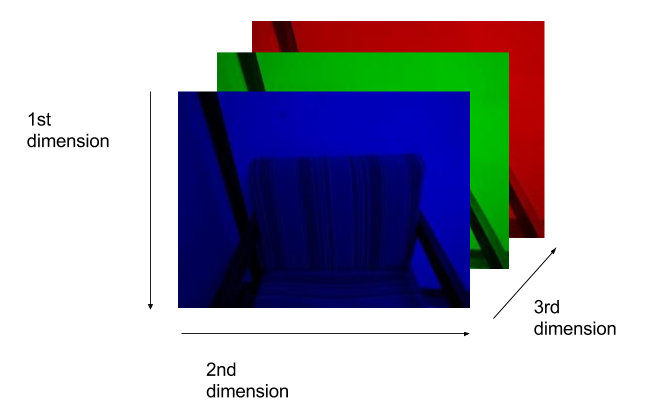
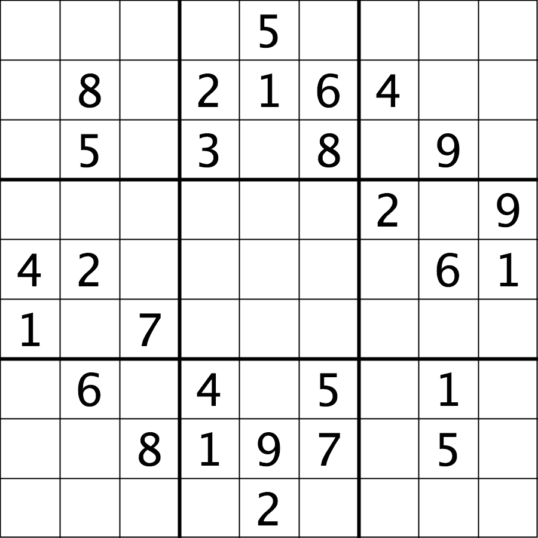

Now that we know a bit about computer images in general, let us turn to more
details about how images are represented in the skimage open-source computer vision library.

## Images are represented as NumPy arrays

In the [Image Basics]({{page.root}}/02-image-basics) episode, we learned that
images are represented as rectangular arrays of individually-colored square 
pixels, and that the color of each pixel can be represented as an RGB triplet 
of numbers. In skimage, images are stored in a manner very consistent with the 
representation from that episode. In particular, images are stored as 
three-dimensional NumPy arrays. 

The rectangular shape of the array corresponds to the shape of the image, 
although the order of the coordinates are reversed. The "depth" of the array
for an skimage image is three, with one layer for each of the three channels.
The differences in the order of coordinates and the order of the channel 
layers can cause some confusion, so we should spend a bit more time looking
at that.

When we think of a pixel in an image, we think of its (x, y) coordinates (in a
left-hand coordinate system) like (113, 45) and its color, specified as a RGB 
triple like (245, 134, 29). In an skimage image, the same pixel would be 
specified with *(y, x)* coordinates (45, 113) and *RGR* color (245, 134, 29). 

Let us take a look at this idea visually. Consider this image of a chair:

A visual representation of how this image is stored as a NumPy array is:

So, when we are working with skimage images, we specify the *y* coordinate 
first, then the *x* coordinate. And, the colors are stored as *RGB* 
values -- red in layer 0, green in layer 1, blue in layer 2.

> ## Coordinate and color channel order
> 
> CAUTION: it is vital to remember the order of the coordinates and color
> channels when dealing with images as NumPy arrays. *If* we are
> manipulating or accessing an image array directly, we specifiy the y
> coordinate first, then the x. Further, the first channel stored is the
> red channel, followed by the green, and then the blue. 
> 
{: .callout}

## Reading, displaying, and saving images

Skimage provides easy-to-use functions for reading, displaying, and saving 
images. All of the popular image formats, such as BMP, PNG, JPEG, and TIFF
are supported, along with several more esoteric formats. See the 
[skimage documentation](http://scikit-image.org/docs/stable/)
for more information.

Let us examine a simple Python program to load, display, and save an image to a 
different format. Here are the first few lines:

~~~
'''
 * Python program to open, display, and save an image.
 *
'''
import skimage.io

# read image 
image = skimage.io.imread(fname="chair.jpg")
~~~
{: .python}

First, we import the `io` module of skimage (`skimage.io`) so 
we can read and write images. Then, we use the `skimage.io.imread()` function to read
a JPEG image entitled **chair.jpg**. Skimage reads the image, converts it from
JPEG into a NumPy array, and returns the array; we save the array in a variable
named `image`.

Next, we will do something with the image:

~~~
import skimage.viewer

# display image
viewer = skimage.viewer.ImageViewer(image)
viewer.show()
~~~
{: .python}

Once we have the image in the program, we next import the `viewer` module of skimage
(`skimage.viewer`) and display it using `skimage.viewer.ImageViewer()`, which
returns a `ImageViewer` object we store in the `viewer` variable.
We then call `viewer.show()` in order to display the image.

Next, we will save the image in another format:

~~~
# save a new version in .tif format
skimage.io.imsave(fname="chair.tif", arr=image)
~~~
{: .python}

The final statement in the program, `skimage.io.imsave(fname="chair.tif", arr=image)`,
writes the image to a file named `chair.tif`. The `imsave()` function automatically
determines the type of the file, based on the file extension we provide. In 
this case, the `.tif` extension causes the image to be saved as a TIFF.

> ## Extensions do not always dictate file type
> 
> The skimage `imsave()` function automatically uses the file type we specify in
> the file name parameter's extension. Note that this is not always the case.
> For example, if we are editing a document in Microsoft Word, and we save the
> document as `paper.pdf` instead of `paper.docx`, the file *is not* saved as
> a PDF document. 
{: .callout}

> ## Named versus positional arguments
> 
> When we call functions in Python, there are two ways we can specify the 
> necessary arguments. We can specify the arguments *positionally*, i.e., in
> the order the parameters appear in the function definition, or we can 
> use *named arguments*. 
> 
> For example, the `skimage.io.imread()` function definition specifies two parameters,
> the file name to read and an optional flag value. So, we could load in the 
> chair image in the sample code above using positional parameters like this:
> 
> `image = skimage.io.imread('chair.jpg')`
> 
> Since the function expects the first argument to be the file name, there is
> no confusion about what `'char.jpg'` means.
> 
> The style we will use in this workshop is to name each parameters, like this:
> 
> `image = skimage.io.imsave(fname='chair.jpg')`
> 
> This style will make it easier for you to learn how to use the variety of 
> functions we will cover in this workshop. 
{: .callout}

> ## Resizing an image (20 min)
> 
> Using your mobile phone, tablet, web cam, or digital camera, take an image.
> Copy the image to the **Desktop/workshops/image-processing/03-skimage-images**
> directory. Write a Python program to read your image into a variable named
> `image`. Then, resize the image by a factor of 50 percent, using this line of
> code:
> 
> ~~~
> new_shape = (image.shape[0] // 2, image.shape[1] // 2, image.shape[2])
> small = skimage.transform.resize(image=image, output_shape=new_shape)
> ~~~
> {: .python}
> 
> As it is used here, the parameters to the `skimage.transform.resize()` function are the 
> image to transform, `image`, the dimensions we want the new image to have. 
> 
> Finally, write the resized image out to a new file named **resized.jpg**. 
> Once you have executed your program, examine the image properties of the 
> output image and verify it has been resized properly.
> 
> > ## Solution
> > 
> > Here is what your Python program might look like.
> > 
> > ~~~
> > '''
> >  * Python program to read an image, resize it, and save it
> >  * under a different name.
> > '''
> > import skimage.io
> > import skimage.transform
> > 
> > # read in image
> > image = skimage.io.imread(fname="chicago.jpg")
> > 
> > # resize the image
> > new_shape = (image.shape[0] // 2, image.shape[1] // 2, image.shape[2])
> > small = skimage.transform.resize(image=image, output_shape=new_shape)
> > 
> > # write out image
> > skimage.io.imsave(fname="resized.jpg", arr=small)
> > ~~~
> > {: .python}
> > 
> > From the command line, we would execute the program like this:
> > 
> > ~~~
> > python Resize.py
> > ~~~
> > {: .bash}
> > 
> > The program resizes the **chicago.jpg** image by 50% in both dimensions,
> > and saves the result in the **resized.jpg** file. 
> {: .solution}
{: .challenge}

## Manipulating pixels

If we desire or need to, we can individually manipulate the colors of pixels
by changing the numbers stored in the image's NumPy array. 

For example, suppose we are interested in this maize root cluster image. We 
want to be able to focus our program's attention on the roots themselves,
while ignoring the black background. 

Since the image is stored as an array of numbers, we can simply look through
the array for pixel color values that are less than some threshold value. This
process is called *thresholding*, and we will see more powerful methods to 
perform the thresholding task in the 
[Thresholding]({{ page.root }}/07-thresholding/) episode. Here, though, we
will look at a simple and elegant NumPy method for thresholding. Let us develop 
a program that keeps only the pixel color values in an image that have value 
greater than or equal to 128. This will keep the pixels that are brighter than
half of "full brightness;" i.e., pixels that do not belong to the black background.
We will start by reading the image and displaying it.

~~~
'''
* Python script to ignore low intensity pixels in an image.
*
* usage: python HighIntensity.py <filename>
'''
import sys
import skimage.io
import skimage.viewer

# read input image, based on filename parameter
image = skimage.io.imread(fname=sys.argv[1])
	
# display original image
viewer = skimage.viewer.ImageViewer(image)
viewer.show()
~~~
{: .python}

Our program imports `sys` in addition to `skimage`, so that we can use 
*command-line arguments* when we execute the program. In particular, in this 
program we use a command-line argument to specify the filename of the image to
process. If the name of the file we are interested in is **roots.jpg**, and 
the name of the program is **HighIntensity.py**, then we run our Python 
program form the command line like this:

~~~
python HighIntensity.py roots.jpg
~~~
{: .bash}

The place where this happens in the code is the 
`skimage.io.imread(fname=sys.argv[1])`
function call. When we invoke our program with command line arguments, 
they are passed in to the program as a list; `sys.argv[1]` is the first one
we are interested in; it contains the image filename we want to process. 
(`sys.argv[0]` is simply the name of our program, **HighIntensity.py** in 
this case). 

> ## Benefits of command-line arguments
> 
> Passing parameters such as filenames into our programs as parameters makes 
> our code more flexible. We can now run **HighIntensity.py** on *any* image 
> we wish, without having to go in and edit the code. 
{: .callout}

Now we can threshold the image and display the result.

~~~
# keep only high-intensity pixels
image[image < 128] = 0
		
# display modified image
viewer = skimage.viewer.ImageViewer(image)
viewer.show()
~~~
{: .python}

The NumPy command to ignore all low-intensity pixels is `img[img < 128] = 0`.
Every pixel color value in the whole 3-dimensional array with a value less
that 128 is set to zero. In this case, the result is an image in which the 
extraneous background detail has been removed. 

> ## Keeping only low intensity pixels (20 min)
> 
> In the previous example, we showed how we could use Python and skimage to turn
> on only the high intensity pixels from an image, while turning all the low 
> intensity pixels off. Now, you can practice doing the opposite -- keeping all
> the low intensity pixels while changing the high intensity ones. Consider 
> this image of a Su-Do-Ku puzzle, named **sudoku.png**:
> 
> 
> 
> Navigate to the **Desktop/workshops/image-processing/03-skimage-images** 
> directory, and copy the **HighIntensity.py** program to another file named
> **LowIntensity.py**. Then, edit the **LowIntensity.py** program so that it 
> turns all of the white pixels in the image to a light gray color, say with 
> all three color channel values for each formerly white pixel set to 64. Your
> results should look like this: 
> 
> 
> 
> > ## Solution
> > 
> > After modification, your program should look like this:
> > 
> > ~~~
> > '''
> > * Python script to modify high intensity pixels in an image.
> > *
> > * usage: python LowIntensity.py <filename>
> > '''
> > import sys
> > import skimage.io
> > import skimage.viewer
> > 
> > # read input image, based on filename parameter
> > img = skimage.io.imread(fname=sys.argv[1])
> > 
> > # display original image
> > viewer = skimage.viewer.ImageViewer(img)
> > viewer.view()
> > 
> > # change high intensity pixels to gray
> > img[img > 200] = 64
> > 
> > # display modified image
> > viewer = skimage.viewer.ImageViewer(img)
> > viewer.view()
> > ~~~
> > {: .python}
> {: .solution}
{: .challenge}

## Access via slicing

Since skimage images are stored as NumPy arrays, we can use array slicing to 
select rectangular areas of an image. Then, we could save the selection as a 
new image, change the pixels in the image, and so on. It is important to 
remember that coordinates are specified in *(y, x)* order and that color values
are specified in *(r, g, b)* order when doing these manipulations.

Consider this image of a whiteboard, and suppose that we want to create a 
sub-image with just the portion that says "odd + even = odd," along with the
red box that is drawn around the words. 

We can use a tool such as ImageJ to determine the coordinates of the corners
of the area we wish to extract. If we do that, we might settle on a rectangular
area with an upper-left coordinate of *(135, 60)* and a lower-right coordinate
of *(480, 150)*, as shown in this version of the whiteboard picture:

Note that the coordinates in the preceding image are specified in *(x, y)*
order. Now if our entire whiteboard image is stored as an skimage image named 
`image`, we can create a new image of the selected region with a statement like
this:

`clip = image[60:151, 135:481, :]`

Our array slicing specifies the range of y-coordinates first, `60:151`, and
then the range of x-coordinates, `135:481`. Note we go one beyond the maximum
value in each dimension, so that the entire desired area is selected. 
The third part of the slice, `:`, indicates that we want all three color 
channels in our new image. 

A program to create the subimage would start by loading the image:

~~~
'''
 * Python script demonstrating image modification and creation via 
 * NumPy array slicing.
'''
import skimage.io
import skimage.viewer

# load and display original image
image = skimage.io.imread(fname="board.jpg")
viewer = skimage.viewer.ImageViewer(image)
viewer.show()
~~~
{: .python}

Then we use array slicing to
create a new image with our selected area and then display the new image. 

~~~
# extract, display, and save sub-image
clip = image[60:151, 135:481, :]
viewer = skimage.viewer.ImageViewer(clip)
viewer.show()
skimage.io.imsave(fname="clip.tif", arr=clip)
~~~
{: .python}

We can also change the values in an image, as shown next. 

~~~
# replace clipped area with sampled color
color = image[330, 90]
image[60:151, 135:481] = color
viewer = skimage.viewer.ImageViewer(image)
viewer.show()
~~~
{: .python}

First, we sample the color at a particular location of the 
image, saving it in a NumPy array named `color`, a 1 × 1 × 3 array with the blue, 
green, and red color values for the pixel located at *(x = 90, y = 330)*. Then, 
with the `img[60:151, 135:481] = color` command, we modify the image in the 
specified area. In this case, the command "erases" that area of the whiteboard, 
replacing the words with a white color, as shown in the final image produced by 
the program:

> ## Practicing with slices (10 min)
> 
> Navigate to the **Desktop/workshops/image-processing/03-skimage-images** 
> directory, and edit the **RootSlice.py** program. It contains a skeleton
> program that loads and displays the maize root image shown above. Modify
> the program to create, display, and save a sub-image containing only the
> plant and its roots. Use ImageJ to determine the bounds of the area you will
> extract using slicing.
> 
> > ## Solution
> > 
> > Here is the completed Python program to select only the plant and roots 
> > in the image.
> > 
> > ~~~
> > '''
> >  * Python script to extract a sub-image containing only the plant and
> >  * roots in an existing image.
> > '''
> > import skimage.io
> > import skimage.viewer
> > 
> > # load and display original image
> > image = skimage.io.imread(fname="roots.jpg")
> > viewer = skimage.viewer.ImageViewer(image)
> > viewer.show()
> > 
> > # extract, display, and save sub-image
> > # WRITE YOUR CODE TO SELECT THE SUBIMAGE NAME clip HERE:
> > clip = image[0:1999, 1410:2765, :]
> > viewer = skimage.viewer.ImageViewer(clip)
> > viewer.show()
> > 
> > 
> > # WRITE YOUR CODE TO SAVE clip HERE
> > skimage.io.imsave(fname="clip.jpg", arr=clip)
> > ~~~
> > {: .python}
> {: .solution}
{: .challenge}

> ## Metadata, continued (10 min)
> Let us return to the concept of image metadata, introduced briefly in the
> [Image Basics]({{ page.root }}/02-image-basics/) episode. Specifically, what
> happens to the metadata of an image when it is read into, and written from,
> a Python program using skiamge?
> 
> To answer this question, write a very short (three lines) Python script to 
> read in a file and save it under a different name. Navigate to the 
> **Desktop/workshops/image-processing/03-skimage-images** directory, and write
> your script there. You can use the **flowers-before.jpg** as input, and save
> the output as **flowers-after.jpg**. Then, examine the metadata from both
> images using commands like **identify -verbose flowers-after.jpg**. Is the metadata 
> the same? If not, what are some key differences?
> 
> > ## Solution
> > 
> > Here is a short Python script to open the image and save it in a different
> > filename:
> > 
> > ~~~
> > import skimage.io
> > 
> > img = skimage.io.imread(fname="flowers-before.jpg")
> > skimage.io.imsave(fname="flowers-after.jpg", arr=img)
> > ~~~
> > {: .python}
> > 
> > The newly-saved file is missing most of the original metadata. Comparing 
> > this to the original, as shown in the 
> > [Image Basics]({{ page.root }}/02-image-basics/) episode, it is easy to see
> > that virtually all of the useful metadata has been lost! 
> > 
> > The moral of this challenge is to remember that image metadata *will not* 
> > be preserved in images that your programs write via the `skimage.io.imsave()` 
> > function. If metadata is important to you, take precautions to always 
> > preserve the original files. 
> {: .solution}
{: .challenge}

> ## Slicing and the colorimetric challenge (10 min)
> 
> In the [introductory]({{page.root}}/01-introduction/) episode, we were 
> introduced to a colorimetric challenge, namely, graphing the color values of
> a solution in a titration, to see when the color change takes place. Let's 
> start thinking about how to solve that problem. 
> 
> One part of our ultimate solution will be sampling the color channel values 
> from an image of the solution. To make our graph more reliable, we will want 
> to calculate a mean channel value over several pixels, rather than simply 
> focusing on one pixel from the image. 
> 
> Navigate to the **Desktop/workshops/image-processing/10-challenges/colorimetrics**
> directory, and open the **titration.tiff** image in ImageJ. 
> 
> 
> 
> Find the *(x, y)* coordinates of an area of the image you think would be good 
> to sample in order to find the average channel values. Then, write a small
> Python program that computes the mean channel values for a 10 × 10 pixel 
> *kernel* centered around the coordinates you chose. Print the results to the 
> screen, in a format like this:
> 
> ~~~
> Avg. red value: 193.7778
> Avg. green value: 189.1481
> Avg. blue value: 178.6049
> ~~~
> {: .output}
{: .challenge}
