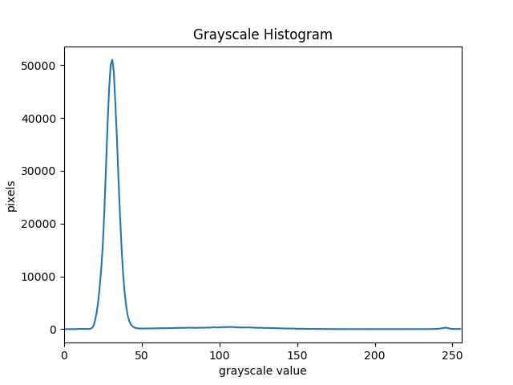
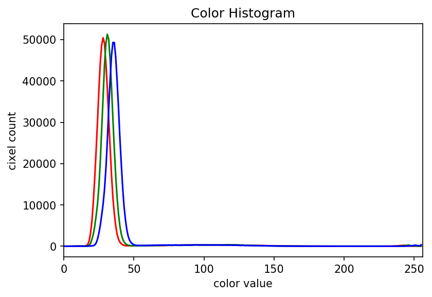

In this episode, we will learn how to use OpenCV functions to create and 
display histograms for images.

## Introduction to Histograms

As it pertains to images, a *histogram* is a graphical representation showing
how frequently various color values occur in the image. We saw in the 
[Image Basics]({{ page.root }}/01-image-basics) episode that we could use a
histogram to visualize the differences in uncompressed and compressed image 
formats. If your project involves detecting color changes between images, 
histograms will prove to be very useful.

## Grayscale Histograms

We will start with grayscale images and histograms first, and then move on to 
color images. Here is a Python script to load an image in grayscale instead 
of full color, and then create and display the corresponding histogram. 

~~~
'''
 * Generate a grayscale histogram for an image. 
'''
import cv2, sys
from matplotlib import pyplot as plt

# read image, based on command line filename argument;
# read the image as grayscale from the outset
img = cv2.imread(sys.argv[1], cv2.IMREAD_GRAYSCALE)

# display the image
cv2.namedWindow("Grayscale Image", cv2.WINDOW_NORMAL)
cv2.imshow("Grayscale Image", img)
cv2.waitKey(0)

# create the histogram
histogram = cv2.calcHist([img], [0], None, [256], [0, 256])

# configure and draw the histogram figure
plt.figure()
plt.title("Grayscale Histogram")
plt.xlabel("grayscale value")
plt.ylabel("pixels")
plt.xlim([0, 256])

plt.plot(histogram)
plt.show()
~~~
{: .python}

In the program, we have a new import from `matplotlib`, to gain access to the
tools we will use to draw the histogram. The statement

`from matplotlib import pyplot as plt`

loads up the `pyplot` library, and gives it a shorter name, `plt`. 

Next, we use the `cv2.imread()` function to load our image. We use the first 
command line parameter as the filename of the image, as we did in the 
[OpenCV Images]({{ page.root }}/02-opencv-images) lesson. The second parameter
to `cv2.imread()` instructs the function to transform the image into 
grayscale as it is loaded in to the program. Note that this does not change
the original image. There are OpenCV functions to convert a color image to 
grayscale, but in cases where the program does not need the color image, we can
save ourselves some typing by loading the image as grayscale from the outset.

The next salient piece of code is where we ask OpenCV to create the histogram,
with the 

`histogram = cv2.calcHist([img], [0], None, [256], [0, 256])`

function call. The `cv2.calcHist()` function can operate on more than one image
if we so desire, and so the first parameter to the function is the list of 
images to process. In our case, we are only using one image, so we add it to
a list by enclosing it in square brackets: `[img]`.

The next parameter is a list specifying the channels to examine for the 
histogram. Since this is a grayscale image, there is only one channel, and so
we pass in `[0]`. 

The third parameter is the mask to use to select the portion of the image to
examine for the histogram. Here we are looking at the whole image, so we pass
in `None` for the mask.

The next parameter is the histogram size, or the number of "bins" to use for
the histogram. We pass in `[256]` because we want to see the pixel count for
each of the 256 possible values in the grayscale image.

The final parameter is the range of values each of the pixels in the image can
have. Assuming 24-bit color, each channel has values in the range `[0, 256]`,
which is what we pass in. 

The output of the `cv2.calcHist()` function is a one-dimensional NumPy array,
with 256 rows and one column, representing the number of pixels with the color
value corresponding to the index. I.e., the first number in the array is the
number of pixels found with color value 00000000, and the final number in the
array is the number of pixels found with color value 11111111. 

Next, we turn our attention to displaying the histogram, by taking advantage
of the plotting facilities of the `matplotlib` library. We create the plot with
`plt.figure()`, then label the figure and the coordinate axes with 
`plt.title()`, `plt.xlabel()`, and `plt.ylabel()` functions. The last step in
the preparation of the figure is to set the limits on the values on the 
x-axis with the `plt.xlim([0, 256])` function call. 

Finally, we create the histogram plot itself with `plt.plot(histogram)`, and 
then make it appear with `plt.show()`. When we run the program on this image
of a plant seedling,

the program produces this histogram:

> ## Using a mask for a histogram
> 
> Looking at the histogram above, you will notice that there is a large number
> of very dark pixels, as indicated in the chart by the spike around the 
> grayscale value 30. That is not so surprising, since the original image is 
> mostly black background. What if we want to focus more closely on the leaf of
> the seedling? That is where a mask enters the picture!
> 
> Navigate to the **Desktop/workshops/image-processing/04-creating-histograms**
> directory, and edit the **GrayscaleMaskHistogram.py** program. The skeleton
> program is a copy of the mask program above, with comments showing where to
> make changes. 
> 
> First, use ImageJ to determine the *(x, y)* coordinates of a bounding box 
> around the leaf of the seedling. Then, using techniques from the
> [Drawing and Bitwise Operations]({{ page.root }}/03-drawing-bitwise/)
> episode, create a mask with a white rectangle covering that bounding box. 
> 
> > ## Solution
> > ~~~
> > '''
> >  * Generate a grayscale histogram for an image. 
> > '''
> > import cv2, sys, numpy as np
> > from matplotlib import pyplot as plt
> > 
> > # read image, based on command line filename argument;
> > # read the image as grayscale from the outset
> > img = cv2.imread(sys.argv[1], cv2.IMREAD_GRAYSCALE)
> > 
> > # display the image
> > cv2.namedWindow("Grayscale Image", cv2.WINDOW_NORMAL)
> > cv2.imshow("Grayscale Image", img)
> > cv2.waitKey(0)
> > 
> > # create mask here, using np.zeros() and cv2.rectangle()
> > mask = np.zeros(img.shape, dtype="uint8")
> > cv2.rectangle(mask, (410, 199), (485, 384), (255, 255, 255), -1)
> > 
> > # create the histogram, using mask instead of None in the
> > # cv2.calcHist() function call
> > histogram = cv2.calcHist([img], [0], mask, [256], [0, 256])
> > 
> > # configure and draw the histogram figure
> > plt.figure()
> > plt.title("Grayscale Histogram")
> > plt.xlabel("grayscale value")
> > plt.ylabel("pixels")
> > plt.xlim([0, 256])
> > 
> > plt.plot(histogram)
> > plt.show()
> > ~~~
> > 
> > Your histogram of the masked area should look something like this:
> > 
> > 
> {: .solution}
> 
{: .challenge}

## Color Histograms

We can also create histograms for full color images, in addition to grayscale 
histograms. We have seen color histograms before, in the 
[Image Basics]({{ page.root }}/01-image-basics) episode. Here is a Python 
program to produce a color histogram:

~~~
'''
 * Python program to create a color histogram.
'''
import cv2, sys, numpy as np
from matplotlib import pyplot as plt

# read original image, in full color, based on command
# line argument
img = cv2.imread(sys.argv[1])

# display the image 
cv2.namedWindow("Original Image", cv2.WINDOW_NORMAL)
cv2.imshow("Original Image", img)
cv2.waitKey(0)

# split into channels
channels = cv2.split(img)

# list to select colors of each channel line
colors = ("b", "g", "r") 

# create the histogram plot, with three lines, one for
# each color
plt.xlim([0, 256])
for(channel, c) in zip(channels, colors):
	histogram = cv2.calcHist([channel], [0], None, [256], [0, 256])
	plt.plot(histogram, color = c)

plt.xlabel("Color value")
plt.ylabel("Pixels")

plt.show()
~~~
{: .python}

We begin the program in a familiar way: import the needed libraries, then read 
the image based on the command-line parameter (in color this time), and then
display the image. 

Next, we split the image into three component channels, by "peeling" each layer
of the image into a separate array. We could do that with three slicing 
commands, such as `bChan = img[:,:,0]`. However, OpenCV provides a function
that will separate all three channels for us, in one function call. We do this
with the `cv2.split()` function. 

The `cv2.split()` function returns a list of three elements. Each element in 
the list is a two-dimensional NumPy array, with the color channel values for 
the blue, green, and red channels, respectively. 

Next, we make the histogram, by calling the `cv2.calcHist()` function three 
times, once for each of the channels. We will draw the histogram line for 
each channel in a different color, and so we create a list of the colors to 
use for the three lines with the 

`colors = ("b", "g", "r")`

line of code. Then, we limit the range of the x-axis with the `plt.xlim()` 
function call. 

Next, we use the `for` control structure to iterate through the three
channels, plotting an appropriately-colored histogram line for each. This may
be new Python syntax for you, so we will take a moment to discuss what is 
happening in the `for` statement. 

The Python built-in `zip()` function takes a series of one or more lists and 
returns an *iterator* of *tuples*, where the first tuple contains the first
element of each of the lists, the second contains the second element of each
of the lists, and so on. 

> ## Iterators, tuples, and `zip()`
> 
> In Python, an *iterator*, or an *iterable object*, is, basically, something 
> that can be iterated over with the `for` control structure. A *tuple* is
> a sequence of objects, just like a list. However, a tuple cannot be changed,
> and a tuple is indicated by parentheses instead of square brackets. The 
> `zip()` function takes one or more iterable objects, and returns an iterator
> of tuples consisting of the corresponding ordinal objects from each 
> parameter.
> 
> For example, consider this small Python program:
> 
> ~~~
> list1 = (1, 2, 3, 4, 5)
> list2 = ('a', 'b', 'c', 'd', 'e')
> 
> for x in zip(list1, list2):
> 	print(x)
> ~~~
> {: .python}
> 
> Executing this program would produce the following output:
> > (1, 'a')
> > 
> > (2, 'b')
> > 
> > (3, 'c')
> > 
> > (4, 'd')
> > 
> > (5, 'e')
> {: .output}
{: .discussion}

In our color histogram program, we are using a tuple, `(channel, c)`, as the 
`for` variable. The first time through the loop, the `channel` variable from
the tuple contains the blue channel NumPy array produced by the `cv2.split()`
function, and the `c` variable contains the string `"b"`. The second time 
through the loop the values are the green channel and `"g"`, and the third 
time they are the red channel and `"r"`. 

Inside the `for` loop, our code looks much like it did for the grayscale 
example. We calculate the histogram for the current channel with the 

`histogram = cv2.calcHist([channel], [0], None, [256], [0, 256])`

function call, and then add a histogram line of the correct color to the 
plot with the 

`plt.plot(histogram, color = c)`

function call. Note the use of our loop variables, `channel` and `c`. 

Finally we label our axes and display the histogram, shown here:

