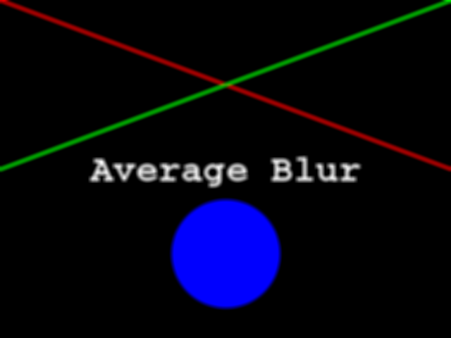

In this episode, we will learn how to use OpenCV functions to blur images.
When we blur an image, we make the color transition from one side of an 
edge in the image to another smooth rather than sudden. The effect is to 
average out rapid changes in pixel intensity. The blur, or smoothing,
of an image removes "outlier" pixels that may be noise in the image. Blurring
is an example of applying a *low-pass filter* to an image. A blur
is a very common operation we need to perform before other tasks such as 
edge detection. There are several different blurring functions in OpenCV, so 
we will focus on just two here, the averaging blur and the Gaussian
blur. 

## Averaging blur

We will start with the averaging blur. Consider this image of a cat, in
particular the area of the image outlined by the white square. 

Now, zoom in on the area of the cat's eye, as shown in the left-hand image 
below. When we apply a averaging blur filter, we consider each pixel in the 
image, one at a time. In this example, the pixel we are applying the filter to 
is highlighted in red, as shown in the right-hand image. 

In an averaging blur, we consider a rectangular group of pixels surrounding
the pixel to filter. This group of pixels, called the *kernel*, moves along
with the pixel that is being filtered. So that the filter pixel is always
in the center of the kernel, the width and height of the kernel must be odd. 
In the example shown above, the kernel is square, with a dimension of seven pixels. 

To apply this filter to the current pixel, the color values of the pixels in 
the kernel are averaged, on a channel-by-channel basis, and the average channel
values become the new value for the filtered pixel. Larger kernels have more
values factored into the average, and this implies that a larger kernel will blur the image more than a smaller kernel. 

To illustrate this process, consider the blue channel color values from the
seven-by-seven kernel illustrated above: 

~~~
 76  83  81  90 109  82  85 
 96  84  99 120 114 113  97 
 84  84 105  79 103 128 141 
 87  79  67  34  18  36  78 
 82  64  37  28  48  47  52 
 78  87  56  47  36  39  38 
 69 108  69  35  39  53  68 
~~~
{: .output}

The filter is going to determine the new blue channel value for the center
pixel -- the one that currently has the value 34. The filter sums up all the
blue channel values in the kernel: (76 + 83 + 81 + ... + 39 + 53 + 68) = 3632.
Then, since this is an averaging filter, the new blue channel value is computed
by dividing by the number of pixels in the kernel, and truncating: 3632 / 49
= 74. Thus, the center pixel of the kernel would have a new blue channel value
of 74. The same process would be used to determine the green and red channel
values, and then the kernel would be moved over to apply the filter to the next
pixel in the image. 

Something different needs to happen for pixels near the edge of the image, 
since the kernel for the filter may be partially off the image. For example, 
what happens when the filter is applied to the upper-left pixel of the image? 
Here are the blue channel pixel values for the upper-left pixel of the cat 
image, again assuming a seven-by-seven kernel:

~~~
  x   x   x   x   x   x   x
  x   x   x   x   x   x   x
  x   x   x   x   x   x   x
  x   x   x   4   5   9   2 
  x   x   x   5   3   6   7 
  x   x   x   6   5   7   8 
  x   x   x   5   4   5   3 
~~~
{: .output}

The upper-left pixel is the one with value 4. Since the pixel is at the 
upper-left corner. there are no pixels underneath half much of the kernel;
this is represented by x's. So, what does the filter do in that situation?

The default behavior is to *reflect* the pixels that are in the image to fill
in for the pixels that are missing from the kernel. If we fill in a few of the
missing pixels, you will see how this works:

~~~
  x   x   x   5   x   x   x
  x   x   x   6   x   x   x
  x   x   x   5   x   x   x
  2   9   5   4   5   9   2 
  x   x   x   5   3   6   7 
  x   x   x   6   5   7   8 
  x   x   x   5   4   5   3 
~~~
{: .output}

A similar process would be used to fill in all of the other missing pixels from
the kernel. Other *border options* are available; you can learn more about them
in the [OpenCV documentation](http://docs.opencv.org/). 

OpenCV has built-in methods to perform blurring for us, so we do not have to 
perform all of these mathematical operations ourselves. 
The following Python program shows how to use the OpenCV average blur 
function. In this case, the program takes two command-line parameters. The 
first is the filename of the image to filter, and the second is the kernel
size, which as we learned above, must be odd. The program uses a square kernel
for the filter. 

~~~
'''
 * Python script to demonstrate average blur.
'''
import cv2, sys

# get filename and kernel size from command line
filename = sys.argv[1]
k = int(sys.argv[2])

# read and display original image
img = cv2.imread(filename)
cv2.namedWindow("original", cv2.WINDOW_NORMAL)
cv2.imshow("original", img)
cv2.waitKey(0)

# apply average blur, creating a new image
blurred = cv2.blur(img, (k, k))

# display blurred image
cv2.namedWindow("blurred", cv2.WINDOW_NORMAL)
cv2.imshow("blurred", blurred)
cv2.waitKey(0)
~~~
{: .python}

In the program, we first import the `cv2` and `sys` libraries, as we
have done before. Then, we read the two command-line arguments. The first, the 
filename, should be familiar code by now. For the kernel size argument, we have
to convert the second argument from a string, which is how all arguments are 
read into the program, into an integer, which is what we will use for our 
kernel size. This is done with the 

`k = int(sys.argv[2])` 

line of code. The `int()` method takes a string as its parameter, and returns 
the integer equivalent. 

Next, the program reads and displays the original, unblurred image. This should
also be very familiar to you at this point. 

Now we apply the average blur, with the 

`blurred = cv2.blur(img, (k, k))`

line. In this usage, the `cv2.blur()` method takes two parameters. The first
is the image to blur, `img`. Second, we pass in a tuple describing the shape
of the kernel to use in the blurring operation, `(k, k)`. The two parts of the
tuple describe the width and height of the kernel to use, in pixels. The width
and height do not need to be the same, but both values do need to be odd, so 
that there is a clearly defined center pixel. If we wish to change the behavior
of the filter for the pixels around the borders of the image, we can specify
a third parameter, as a constant like `cv2.BORDER_REPLICATE` or 
`cv2.BORDER_WRAP`. Again, consult the
[OpenCV documentation](http://docs.opencv.org/) to learn more about the various
options for this optional third parameter. The `cv2.blur()` method returns a 
new image after the filter has been applied.

After the blur filter has been executed, the program wraps things up by 
displaying the blurred image in a new window. 

Here is a constructed image to use as the input for the preceding program.

When the program runs, it displays the original image, applies the filter, 
and then shows the blurred result. The following image is the result after
applying a filter with a kernel size of seven. 

> ## Experimenting with kernel size
> 
> Navigate to the **Desktop/workshops/image-processing/05-blurring** directory
> and execute the **AverageBlur.py** script, which contains the program shown
> above. Execute it with two command-line parameters, like this:
> 
> ~~~
> python AverageBlur.py AverageTarget.png 7
> ~~~
> {: .bash}
> 
> Remember that the first command-line argument is the name of the file to 
> filter, and the second is the kernel size. Now, experiment with the kernel 
> size, running the program with smaller and larger values (keeping them all 
> odd, of course). Generally speaking, what effect does kernel size have on the
> blurred image?
> 
> > ## Solution
> > 
> > Generally speaking, the larger the kernel size, the more blurry the result.
> > A larger kernel will tend to get rid of more noise in the image, which will
> > help for other operations we will cover soon, such as edge detection. 
> > However, a larger kernel also tends to eliminate some of the detail from
> > the image. So, we must strike a balance with the kernel size used for
> > blur filters. 
> {: .solution}
{: .challenge}

> ## Experimenting with kernel shape
> 
> Now, modify the **AverageBlur.py** program so that it takes *three*
> command-line parameters instead of two. The first parameter should still be
> the name of the file to filter. The second and third parameters should be the
> width and height of the kernel to use, so that the kernel is rectangular 
> instead of square. The new version of the program should be invoked like 
> this:
> 
> ~~~
> python AverageBlur.py AverageTarget.png 5 7
> ~~~
> {: .bash}
> 
> Using the program like this utilizes a kernel that is five pixels wide by 
> seven pixels tall for the blurring. 
> 
> > ## Solution
> > 
> > ~~~
> > '''
> >  * Python script to demonstrate average blur.
> > '''
> > import cv2, sys
> > 
> > # get filename and kernel size from command line
> > filename = sys.argv[1]
> > w = int(sys.argv[2])
> > h = int(sys.argv[3])
> > 
> > # read and display original image
> > img = cv2.imread(filename)
> > cv2.namedWindow("original", cv2.WINDOW_NORMAL)
> > cv2.imshow("original", img)
> > cv2.waitKey(0)
> > 
> > # apply average blur, creating a new image
> > blurred = cv2.blur(img, (w, h))
> > 
> > # display blurred image
> > cv2.namedWindow("blurred", cv2.WINDOW_NORMAL)
> > cv2.imshow("blurred", blurred)
> > cv2.waitKey(0)
> > ~~~
> > {: .python}
> {: .solution}
{: .challenge}

## Gaussian blur

Another kind of low-pass filter we can use to smooth an image is the 
*Gaussian blur* operation. The Gaussian blur works in a similar manner to the
averaging blur we just discussed. We still use a kernel for the Gaussian blur,
and again the dimensions of the sides of the kernel must be odd. 

The difference between the averaging blur and the Gaussian blur lies in the way
that the pixels in the kernel are weighted when the new pixel value is 
computed. In the averaging blur, every pixel in the kernel is given the same 
weight; all the values are simply added together and then divided by the 
number of pixels in the kernel. In a Gaussian blur, however, the pixels in the
kernel closer to the center pixel carry more weight than the pixels near the
edge of the kernel. 

To get an idea of how this works, consider this plot of the two-dimensional 
Gaussian function: 

Imagine that plot overlaid over the kernel for the Gaussian blur filter. The
height of the plot corresponds to the weight given to the underlying pixel in
the kernel. I.e., the pixels close to the center become more important to the 
filtered pixel color than the pixels close to the edge of the kernel. The 
mathematics involved in the Gaussian blur filter are not quite that simple, but
this explanation gives you the basic idea. 

The following Python program shows how to use the OpenCV Gaussian blur 
function. 

~~~
'''
 * Python script to demonstrate Gaussian blur.
'''
import cv2, sys

# get filename and kernel size from command line
filename = sys.argv[1]
k = int(sys.argv[2])

# read and display original image
img = cv2.imread(filename)
cv2.namedWindow("original", cv2.WINDOW_NORMAL)
cv2.imshow("original", img)
cv2.waitKey(0)

# apply Gaussian blur, creating a new image
blurred = cv2.GaussianBlur(img, (k, k), 0)

# display blurred image
cv2.namedWindow("blurred", cv2.WINDOW_NORMAL)
cv2.imshow("blurred", blurred)
cv2.waitKey(0)
~~~
{: .python}

The first two parts of the program, importing libraries and opening and
displaying the original image, are just the same as for the preceding example.
Then, the Gaussian blur is applied with the 

`blurred = cv2.GaussianBlur(img, (k, k), 0)`

method call. The first two parameters to `cv2.GaussianBlur()` are the same as 
for the `cv2.blur()` method: the image to blur, `img`, and a tuple describing
the shape of the kernel, `(k, k)`. The third parameter is the standard 
deviation for the two-dimensional Gaussian distribution in the x dimension. 
If we pass in `0`, as we have done here, OpenCV automatically determines 
default standard deviations for both the x and y dimensions, based on the 
kernel size. This is how we will normally invoke the `cv2.GaussianBlur()` 
method. 

Here is a constructed image to use as the input to the preceding program. 

When the program runs, it reads in the original image, applies the Gaussian
blur operation, and then displays the result. The blurred image, with a kernel
size of seven, is shown below. 

