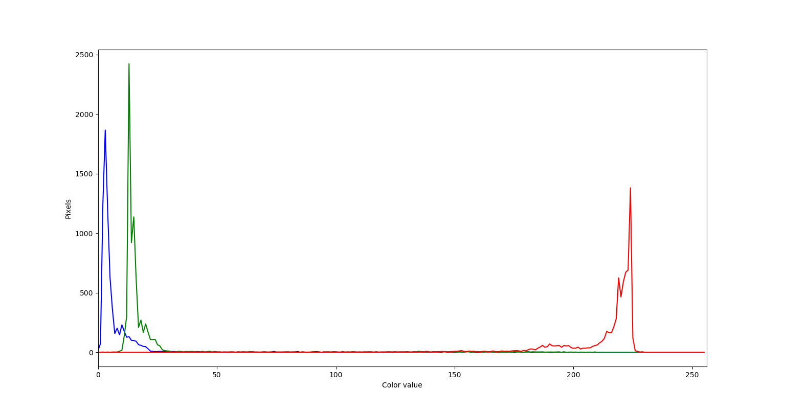

In this episode, we will learn how to use skimage functions to create and
display histograms for images.

## Introduction to Histograms

As it pertains to images, a *histogram* is a graphical representation showing
how frequently various color values occur in the image. We saw in the
[Image Basics]({{ page.root }}/02-image-basics) episode that we could use a
histogram to visualize the differences in uncompressed and compressed image
formats. If your project involves detecting color changes between images,
histograms will prove to be very useful, and histograms are also quite handy
as a preparatory step before performing
[Thresholding]({{ page.root }}/07-thresholding).

## Grayscale Histograms

We will start with grayscale images and histograms first, and then move on to
color images. We will use this image of a plant seedling as an example:

Here we load the image in grayscale instead
of full color, and display it:

~~~
import numpy as np
import skimage.color
import skimage.io
import matplotlib.pyplot as plt
%matplotlib widget

# read the image of a plant seedling as grayscale from the outset
image = skimage.io.imread(fname='04-plant-seedling.jpg', as_gray=True)

# display the image
fig, ax = plt.subplots()
plt.imshow(image, cmap='gray')
plt.show()
~~~
{: .language-python}

In the program, we have a new import from `matplotlib`, to gain access to the
tools we will use to draw the histogram. The statement

`from matplotlib import pyplot as plt`

loads up the `pyplot` library, and gives it a shorter name, `plt`.

Next, we use the `skimage.io.imread()` function to load our image. The first parameter 
to `skimage.io.imread()` is the filename of the image. The second parameter 
`as_gray` instructs the function to transform the image into
grayscale with a value range from 0 to 1 while loading the image.
We will keep working with images in the value range 0 to 1 in this lesson.
Remember that we can transform an image back to the range 0 to 255 with
the function `skimage.util.img_as_ubyte`.

Skimage does not provide a special function to compute histograms, but we can use
the function `np.histogram` instead:

~~~
# create the histogram
histogram, bin_edges = np.histogram(image, bins=256, range=(0, 1))
~~~
{: .language-python}

The parameter `bins` determines the number of "bins" to use for
the histogram. We pass in `256` because we want to see the pixel count for
each of the 256 possible values in the grayscale image.

The parameter `range` is the range of values each of the pixels in the image can
have. Here, we pass 0 and 1, which is the value range of our input image after transforming it
to grayscale.

The first output of the `np.histogram` function is a one-dimensional NumPy array,
with 256 rows and one column, representing the number of pixels with the intensity
value corresponding to the index. I.e., the first number in the array is the
number of pixels found with intensity value 0, and the final
number in the array is the number of pixels found with intensity value 255.
The second output of `np.histogram` is an array with the bin edges and one column and 257 rows (one more than the histogram itself).
There are no gaps between the bins, which means that the end of the first bin, is the start of the second and so on.
For the last bin, the array also has to contain the stop, so it has one more element, than the histogram.

Next, we turn our attention to displaying the histogram, by taking advantage
of the plotting facilities of the `matplotlib` library.

~~~
# configure and draw the histogram figure
plt.figure()
plt.title("Grayscale Histogram")
plt.xlabel("grayscale value")
plt.ylabel("pixel count")
plt.xlim([0.0, 1.0])  # <- named arguments do not work here

plt.plot(bin_edges[0:-1], histogram)  # <- or here
plt.show()
~~~
{: .language-python}

We create the plot with
`plt.figure()`, then label the figure and the coordinate axes with
`plt.title()`, `plt.xlabel()`, and `plt.ylabel()` functions. The last step in
the preparation of the figure is to set the limits on the values on the
x-axis with the `plt.xlim([0.0, 1.0])` function call.

> ## Variable-length argument lists
>
> Note that we cannot used named parameters for the `plt.xlim()` or
> `plt.plot()` functions. This is because these functions are defined
> to take an arbitrary number of *unnamed* arguments. The designers wrote
> the functions this way because they are very versatile, and creating named
> parameters for all of the possible ways to use them would be complicated.
{: .callout}

Finally, we create the histogram plot itself with `plt.plot(bin_edges[0:-1], histogram)`.
We use the **left** bin edges as x-positions for the histogram values by indexing the `bin_edges` array to ignore the last value (the **right** edge of the last bin).
Then we make it appear with `plt.show()`. When we run the program on this image of a plant seedling,
it produces this histogram:

> ## Histograms in matplotlib
>
> Matplotlib provides a dedicated function to compute and display histograms:
> `plt.hist()`. We will not use it in this lesson in order to understand how to calculate
> histograms in more detail. In practice, it is a good idea to use this function, because it
> visualizes histograms more appropriately than `plt.plot()`.
> Here, you could use it by calling `plt.hist(image.flatten(), bins=256, range=(0, 1))` instead of
> `np.histogram()` and `plt.plot()` (`*.flatten()` is a numpy function that converts our two-dimensional
> image into a one-dimensional array).
>
>
{: .callout}

> ## Using a mask for a histogram (15 min)
>
> Looking at the histogram above, you will notice that there is a large number
> of very dark pixels, as indicated in the chart by the spike around the
> grayscale value 0.12. That is not so surprising, since the original image is
> mostly black background. What if we want to focus more closely on the leaf of
> the seedling? That is where a mask enters the picture!
>
> First, hover over the plant seedling image with your mouse to determine the 
> *(x, y)* coordinates of a bounding box around the leaf of the seedling. 
> Then, using techniques from the
> [Drawing and Bitwise Operations]({{ page.root }}/04-drawing/)
> episode, create a mask with a white rectangle covering that bounding box.
>
> After you have created the mask, apply it to the input image before passing
> it to the `np.histogram` function.
>
> > ## Solution
> > ~~~
> > import skimage.draw
> > 
> > # read the image as grayscale from the outset
> > image = skimage.io.imread('04-plant-seedling.jpg', as_gray=True)
> >
> > # display the image
> > fig, ax = plt.subplots()
> > plt.imshow(image, cmap='gray')
> > plt.show()
> >
> > # create mask here, using np.zeros() and skimage.draw.rectangle()
> > mask = np.zeros(shape=image.shape, dtype="bool")
> > rr, cc = skimage.draw.rectangle(start=(199, 410), end=(384, 485))
> > mask[rr, cc] = True
> >
> > # display the mask
> > fig, ax = plt.subplots()
> > plt.imshow(mask, cmap='gray')
> > plt.show()
> >
> > # mask the image and create the new histogram
> > histogram, bin_edges = np.histogram(image[mask], bins=256, range=(0.0, 1.0))
> >
> > # configure and draw the histogram figure
> > plt.figure()
> >
> > plt.title("Grayscale Histogram")
> > plt.xlabel("grayscale value")
> > plt.ylabel("pixel count")
> > plt.xlim([0.0, 1.0])
> > plt.plot(bin_edges[0:-1], histogram)
> >
> > plt.show()
> > ~~~
> > {: .language-python}
> >
> > Your histogram of the masked area should look something like this:
> >
> > 
> {: .solution}
>
{: .challenge}

## Color Histograms

We can also create histograms for full color images, in addition to grayscale
histograms. We have seen color histograms before, in the
[Image Basics]({{ page.root }}/02-image-basics) episode. A program to create
color histograms starts in a familiar way:

~~~
# read original image, in full color
image = skimage.io.imread('04-plant-seedling.jpg')

# display the image
fig, ax = plt.subplots()
plt.imshow(image)
plt.show()
~~~
{: .language-python}

We read the original image, now in full color, and display it.

Next, we create the histogram, by calling the `np.histogram` function three
times, once for each of the channels. We obtain the individual channels, by
slicing the image along the last axis. For example, we can obtain the red color channel
by calling `r_chan = image[:, :, 0]`.

~~~
# tuple to select colors of each channel line
colors = ("red", "green", "blue")
channel_ids = (0, 1, 2)

# create the histogram plot, with three lines, one for
# each color
plt.figure()
plt.xlim([0, 256])
for channel_id, c in zip(channel_ids, colors):
    histogram, bin_edges = np.histogram(
        image[:, :, channel_id], bins=256, range=(0, 256)
    )
    plt.plot(bin_edges[0:-1], histogram, color=c)

plt.title("Color Histogram")
plt.xlabel("Color value")
plt.ylabel("Pixel count")

plt.show()
~~~
{: .language-python}

We will draw the histogram line for
each channel in a different color, and so we create a tuple of the colors to
use for the three lines with the

`colors = ("red", "green", "blue")`

line of code. Then, we limit the range of the x-axis with the `plt.xlim()`
function call.

Next, we use the `for` control structure to iterate through the three
channels, plotting an appropriately-colored histogram line for each. This may
be new Python syntax for you, so we will take a moment to discuss what is
happening in the `for` statement.

The Python built-in `zip()` function takes a series of one or more lists and
returns an *iterator* of *tuples*, where the first tuple contains the first
element of each of the lists, the second contains the second element of each
of the lists, and so on.

> ## Iterators, tuples, and `zip()`
>
> In Python, an *iterator*, or an *iterable object*, is, basically, something
> that can be iterated over with the `for` control structure. A *tuple* is
> a sequence of objects, just like a list. However, a tuple cannot be changed,
> and a tuple is indicated by parentheses instead of square brackets. The
> `zip()` function takes one or more iterable objects, and returns an iterator
> of tuples consisting of the corresponding ordinal objects from each
> parameter.
>
> For example, consider this small Python program:
>
> ~~~
> list1 = (1, 2, 3, 4, 5)
> list2 = ("a", "b", "c", "d", "e")
>
> for x in zip(list1, list2):
>     print(x)
> ~~~
> {: .language-python}
>
> Executing this program would produce the following output:
>
> > (1, 'a')
> >
> > (2, 'b')
> >
> > (3, 'c')
> >
> > (4, 'd')
> >
> > (5, 'e')
> {: .output}
{: .callout}

In our color histogram program, we are using a tuple, `(channel_id, c)`, as the
`for` variable. The first time through the loop, the `channel_id` variable takes the
value `0`, referring to the position of the red color channel,
and the `c` variable contains the string `"red"`. The second time
through the loop the values are the green channels position and `"green"`, and the third
time they are the blue channel position and `"blue"`.

Inside the `for` loop, our code looks much like it did for the grayscale
example. We calculate the histogram for the current channel with the

`histogram, bin_edges = np.histogram(image[:, :, channel_id], bins=256, range=(0, 256))`

function call, and then add a histogram line of the correct color to the
plot with the

`plt.plot(bin_edges[0:-1], histogram, color=c)`

function call. Note the use of our loop variables, `channel_id` and `c`.

Finally we label our axes and display the histogram, shown here:

> ## Color histogram with a mask (25 min)
>
> We can also apply a mask to the images we apply the color histogram process
> to, in the same way we did for grayscale histograms. Consider this image of a
> well plate, where various chemical sensors have been applied to water and
> various concentrations of hydrochloric acid and sodium hydroxide:
>
> ~~~
> # read the image
> image = skimage.io.imread('09-well-plate.jpg')
>
> # display the image
> fig, ax = plt.subplots()
> plt.imshow(image)
> plt.show()
> ~~~
> {: .language-python}
> 
>
> Suppose we are interested in the color histogram of one of the sensors in the
> well plate image, specifically, the seventh well from the left in the topmost
> row, which shows Erythrosin B reacting with water.
>
> Hover over the image with your mouse to find the center of that well 
> and the radius (in pixels) of the well.  Then create a
> circular mask to select only the desired well. Then, use that mask to apply
> the color histogram operation to that well. 
>
> Your masked image should look like this:
>
> 
>
> And, the program should produce a color histogram that looks like this:
>
> 
>
> > ## Solution
> > ~~~
> > # create a circular mask to select the 7th well in the first row
> > mask = np.zeros(shape=image.shape[0:2], dtype="bool")
> > circle = skimage.draw.disk((240, 1053), radius=49, shape=image.shape[0:2])
> > mask[circle] = 1
> >
> > # just for display:
> > # make a copy of the image, call it masked_image, and
> > # use np.logical_not() and indexing to apply the mask to it
> > masked_img = image[:]
> > masked_img[np.logical_not(mask)] = 0
> >
> > # create a new figure and display masked_img, to verify the
> > # validity of your mask
> > fig, ax = plt.subplots()
> > plt.imshow(masked_img)
> > plt.show()
> >
> > # list to select colors of each channel line
> > colors = ("red", "green", "blue")
> > channel_ids = (0, 1, 2)
> >
> > # create the histogram plot, with three lines, one for
> > # each color
> > plt.figure()
> > plt.xlim([0, 256])
> > for (channel_id, c) in zip(channel_ids, colors):
> >     # use your circular mask to apply the histogram
> >     # operation to the 7th well of the first row
> >     histogram, bin_edges = np.histogram(
> >         image[:, :, channel_id][mask], bins=256, range=(0, 256)
> >     )
> >
> >     plt.plot(histogram, color=c)
> >
> > plt.xlabel("color value")
> > plt.ylabel("pixel count")
> >
> > plt.show()
> > ~~~
> > {: .language-python}
> {: .solution}
{: .challenge}

> ## Histograms for the morphometrics challenge (10 min - optional, not included in timing)
>
> Using the grayscale and color histogram programs we developed in this episode,
> create histograms for the bacteria colonies in the following images: `00-colonies01.jpg`,
> `00-colonies02.jpg` and `00-colonies03.jpg`. 
> Save the histograms for later use.
{: .challenge}
