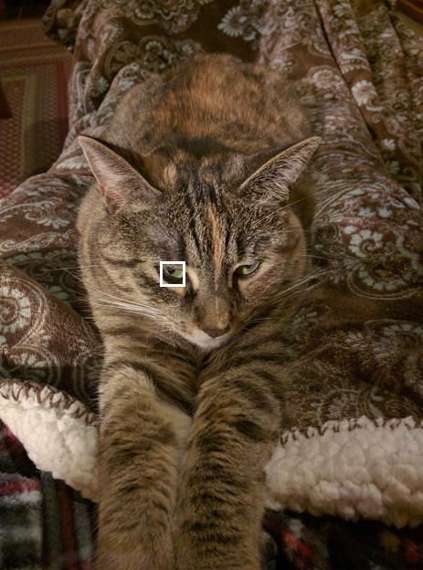
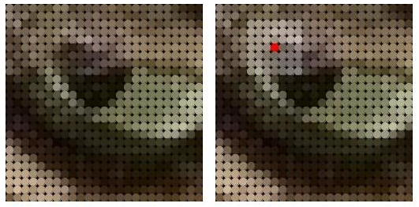
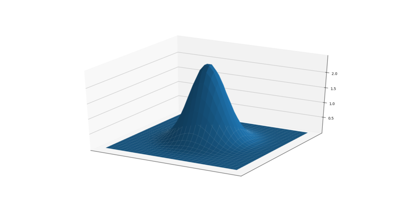
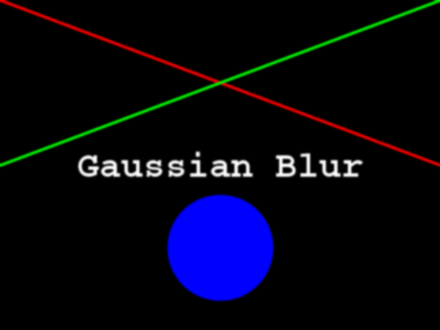

In this episode, we will learn how to use skimage functions to blur images.
When we blur an image, we make the color transition from one side of an 
edge in the image to another smooth rather than sudden. The effect is to 
average out rapid changes in pixel intensity. The blur, or smoothing,
of an image removes "outlier" pixels that may be noise in the image. Blurring
is an example of applying a *low-pass filter* to an image. In computer vision,
the term "low-pass filter" applies to removing noise from an image while 
leaving the majority of the image intact. A blur is a very common operation 
we need to perform before other tasks such as edge detection. There are 
several different blurring functions in the `skimage.filters` module, so we
will focus on just one here, the Gaussian blur.

## Gaussian blur

Consider this image of a cat, in particular the area of the image outlined by 
the white square. 

Now, zoom in on the area of the cat's eye, as shown in the left-hand image 
below. When we apply a blur filter, we consider each pixel in the 
image, one at a time. In this example, the pixel we are applying the filter to 
is highlighted in red, as shown in the right-hand image. 

In a blur, we consider a rectangular group of pixels surrounding
the pixel to filter. This group of pixels, called the *kernel*, moves along
with the pixel that is being filtered. So that the filter pixel is always
in the center of the kernel, the width and height of the kernel must be odd. 
In the example shown above, the kernel is square, with a dimension of seven 
pixels. 

To apply this filter to the current pixel, a weighted average of the the 
color values of the pixels in the kernel is calculated. In a Gaussian blur,
the pixels nearest the center of the kernel are given more weight than those
far away from the center. This averaging is done on a channel-by-channel basis, 
and the average channel values become the new value for the filtered pixel. 
Larger kernels have more values factored into the average, and this implies 
that a larger kernel will blur the image more than a smaller kernel. 

To get an idea of how this works, consider this plot of the two-dimensional 
Gaussian function: 

Imagine that plot overlaid over the kernel for the Gaussian blur filter. The
height of the plot corresponds to the weight given to the underlying pixel in
the kernel. I.e., the pixels close to the center become more important to the 
filtered pixel color than the pixels close to the edge of the kernel.
The shape of the Gaussian function is controlled via its standard deviation, or
sigma. A large sigma value results in a flatter shape, while a smaller sigma
value results in a more pronounced peak. The mathematics involved in the
Gaussian blur filter are not quite that simple, but this explanation gives you
the basic idea.

To illustrate the blur process, consider the blue channel color values from the
seven-by-seven kernel illustrated above: 

~~~
68  82 71 62 100  98  61 
90  67 74 78  91  85  77 
50  53 78 82  72  95 100 
87  89 83 86 100 116 128 
89 108 86 78  92  75 100 
90  83 89 73  68  29  18 
77 102 70 57  30  30  50
~~~
{: .output}

The filter is going to determine the new blue channel value for the center
pixel -- the one that currently has the value 86. The filter calculates a 
weighted average of all the blue channel values in the kernel, {76, 83, 81,
..., 39, 53, 68}, giving higher weight to the pixels near the center of the 
kernel. This weighted average would be the new value for the center pixel. 
The same process would be used to determine the green and red channel
values, and then the kernel would be moved over to apply the filter to the next
pixel in the image. 

Something different needs to happen for pixels near the edge of the image, 
since the kernel for the filter may be partially off the image. For example, 
what happens when the filter is applied to the upper-left pixel of the image? 
Here are the blue channel pixel values for the upper-left pixel of the cat 
image, again assuming a seven-by-seven kernel:

~~~
  x   x   x   x   x   x   x
  x   x   x   x   x   x   x
  x   x   x   x   x   x   x
  x   x   x   4   5   9   2 
  x   x   x   5   3   6   7 
  x   x   x   6   5   7   8 
  x   x   x   5   4   5   3 
~~~
{: .output}

The upper-left pixel is the one with value 4. Since the pixel is at the 
upper-left corner. there are no pixels underneath much of the kernel;
here, this is represented by x's. So, what does the filter do in that 
situation?

The default mode is to fill in the *nearest* pixel value from the image. For
each of the missing x's the image value closest to the x is used:

~~~
  x   x   x   4   x   x   x
  x   x   x   4   x   x   x
  x   x   x   4   x   x   x
  4   4   4   4   5   9   2
  x   x   x   5   3   6   7
  x   x   x   6   5   7   8
  x   x   x   5   4   5   3
~~~
{: .output}

Another strategy to fill those missing values is to *reflect* the pixels that
are in the image to fill in for the pixels that are missing from the kernel. If
we fill in a few of the missing pixels, you will see how this works:

~~~
  x   x   x   5   x   x   x
  x   x   x   6   x   x   x
  x   x   x   5   x   x   x
  2   9   5   4   5   9   2 
  x   x   x   5   3   6   7 
  x   x   x   6   5   7   8 
  x   x   x   5   4   5   3 
~~~
{: .output}

A similar process would be used to fill in all of the other missing pixels from
the kernel. Other *border modes* are available; you can learn more about them
in the [skimage documentation](https://scikit-image.org/docs/dev/user_guide). 

This animation shows how the blur kernel moves along in the original image in 
order to calculate the color channel values for the blurred image.

skimage has built-in functions to perform blurring for us, so we do not have to 
perform all of these mathematical operations ourselves. The following Python 
program shows how to use the skimage Gaussian blur function. 

~~~
"""
 * Python script to demonstrate Gaussian blur.
 *
 * usage: python GaussBlur.py <filename> <sigma>
"""
import skimage
from skimage.viewer import ImageViewer
import sys

# get filename and kernel size from command line
filename = sys.argv[1]
sigma = float(sys.argv[2])
~~~
{: .python}

In this case, the 
program takes two command-line parameters. The first is the filename of the 
image to filter, and the second is the sigma of the Gaussian.

In the program, we first import the required libraries, as we
have done before. Then, we read the two command-line arguments. The first, the 
filename, should be familiar code by now. For the sigma argument, we have
to convert the second argument from a string, which is how all arguments are 
read into the program, into a float, which is what we will use for our
sigma. This is done with the

`sigma = float(sys.argv[2])`

line of code. The `float()` function takes a string as its parameter, and returns
the floating point number equivalent.

> ## What happens if the `float()` parameter does not look like a number? (10 min)
> 
> In the program fragment, we are using the `float()` function to *parse* the
> second command-line argument, which comes in to the program as a string, 
> and convert it into an integer. What happens if the second command-line
> argument does not look like an integer? Let us perform an experiment to find
> out. 
> 
> Write a simple Python program to read one command-line argument, convert the
> argument to an integer, and then print out the result. Then, run your program
> with an integer argument, and then again with some non-integer arguments. For
> example, if your program is named **float_arg.py**, you might perform these
> runs:
> 
> ~~~
> python float_arg.py 3.14159
> python float_arg.py puppy
> python float_arg.py 13
> ~~~
> {: .bash}
> 
> What does `float()` do if it receives a string that cannot be parsed into an
> integer?
> 
> > ## Solution
> > 
> > Here is a simple program to read in one command-line argument, parse it as
> > and integer, and print out the result:
> > 
> > ~~~
> > """
> >  * Read a command-line argument, parse it as an integer, and
> >  * print out the result.
> >  *
> >  * usage: python float_arg.py <argument>
> > """
> > import sys
> >
> > value = float(sys.argv[1])
> > print("Your command-line argument is:", value)
> > ~~~
> > {: .python}
> > 
> > Executing this program with the three command-line arguments suggested 
> > above produces this output:
> > 
> > ~~~
> > Your command-line argument is: 3.14159
> > 
> > Traceback (most recent call last):
> >   File "float_arg.py", line 9, in <module>
> >     value = float(sys.argv[1])
> > ValueError: could not convert string to float: 'puppy'
> > 
> > Your command-line argument is: 13.0
> > ~~~
> > {: .output}
> > 
> > You can see that if we pass in an invalid value to the `float()` function,
> > the Python interpreter halts the program and prints out an error message,
> > describing what the problem was. 
> {: .solution}
{: .challenge}

Next, the program reads and displays the original, unblurred image. This should
also be very familiar to you at this point. 

~~~
# read and display original image
image = skimage.io.imread(fname=filename)
viewer = ImageViewer(image)
viewer.show()
~~~
{: .python}

Now we apply the average blur:

~~~
# apply Gaussian blur, creating a new image
blurred = skimage.filters.gaussian(
    image, sigma=(sigma, sigma), truncate=3.5, multichannel=True)
~~~
{: .python}

The first two parameters to `skimage.filters.gaussian()` are the image to blur,
`image`, and a tuple defining the sigma to use in y- and x-direction,
`(sigma, sigma)`. The third parameter `truncate` gives the radius of the kernel
in terms of sigmas. A Gaussian is defined from -infinity to +infinity. A
discrete Gaussian can only approximate the real function. The `truncate`
parameter steers at what distance to the center of the function it is not
approximated any more. In the above example we set `truncate` to 3.5. With a
`sigma` of 1.0 the resulting kernel size would be 7.
The last parameter is to tell skimage how to interpret our image, that has three
dimensions, as a multichannel color image.
After the blur filter has been executed, the program wraps things up by 
displaying the blurred image in a new window. 

~~~
# display blurred image
viewer = ImageViewer(blurred)
viewer.show()
~~~
{: .python}

Here is a constructed image to use as the input for the preceding program.

When the program runs, it displays the original image, applies the filter, 
and then shows the blurred result. The following image is the result after
applying a filter with a sigma of 1.0.

> ## Experimenting with sigma values (5 min)
> 
> Navigate to the **Desktop/workshops/image-processing/06-blurring** directory
> and execute the **GaussBlur.py** script, which contains the program shown
> above. Execute it with two command-line parameters, like this:
> 
> ~~~
> python GaussBlur.py GaussianTarget.png 1.0
> ~~~
> {: .bash}
> 
> Remember that the first command-line argument is the name of the file to 
> filter, and the second is the sigma value. Now, experiment with the sigma
> value, running the program with smaller and larger values.
> Generally speaking, what effect does the sigma value have on the
> blurred image?
> 
> > ## Solution
> > 
> > Generally speaking, the larger the sigma value, the more blurry the result.
> > A larger sigma will tend to get rid of more noise in the image, which will
> > help for other operations we will cover soon, such as edge detection. 
> > However, a larger sigma also tends to eliminate some of the detail from
> > the image. So, we must strike a balance with the sigma value used for
> > blur filters. 
> {: .solution}
{: .challenge}

> ## Experimenting with kernel shape (10 min)
> 
> Now, modify the **GaussBlur.py** program so that it takes *three*
> command-line parameters instead of two. The first parameter should still be
> the name of the file to filter. The second and third parameters should be the
> sigma values in y- and x-direction for the Gaussian to use, so that the
> resulting kernel is rectangular instead of square. The new version of the
> program should be invoked like this:
> 
> ~~~
> python GaussBlur.py GaussianTarget.png 1.0 2.0
> ~~~
> {: .bash}
> 
> Using the program like this utilizes a Gaussian with a sigma of 1.0 in y-
> direction and 2.0 in x-direction for blurring
> 
> > ## Solution
> > 
> > ~~~
> > """
> >  * Python script to demonstrate Gaussian blur.
> >  *
> >  * usage: python GaussBlur.py <filename> <sigma_y> <sigma_x>
> > """
> > import skimage
> > from skimage.viewer import ImageViewer
> > import sys
> >
> > # get filename and kernel size from command line
> > filename = sys.argv[1]
> > sigma_y = float(sys.argv[2])
> > sigma_x = float(sys.argv[3])
> >
> > # read and display original image
> > image = skimage.io.imread(fname=filename)
> > viewer = ImageViewer(image)
> > viewer.show()
> >
> > # apply Gaussian blur, creating a new image
> > blurred = skimage.filters.gaussian(
> >     image, sigma=(sigma_y, sigma_x), truncate=3.5, multichannel=True
> > )
> >
> > # display blurred image
> > viewer = ImageViewer(blurred)
> > viewer.show()
> > ~~~
> > {: .python}
> {: .solution}
{: .challenge}

## Other methods of blurring

The Gaussian blur is a way to apply a low-pass filter in skimage. It is often
used to remove Gaussian (i. e., random) noise from the image.
For other kinds of noise, e.g. "salt and pepper" or "static" noise, a
median filter is typically used.
See the [`skimage.filter` documentation](https://scikit-image.org/docs/dev/api/skimage.filters.html#module-skimage.filters)
for a list of available filters.

> ## Blurring the bacteria colony images (15 min)
> 
> As we move further into the workshop, we will see that in order to complete
> the colony-counting morphometric challenge at the end, we will need to read
> the bacteria colony images as grayscale, and blur them, before moving on to
> the tasks of actually counting the colonies. Create a Python program to read
> one of the colony images (with the filename provided as a command-line 
> parameter) as grayscale, and then apply a Gaussian blur to the image. You
> should also provide the sigma for the blur as a second command-line
> parameter. Do not alter the original image. As a reminder, the images are 
> located in the **Desktop/workshops/image-processing/10-challenges/morphometrics**
> directory. 
{: .challenge}
