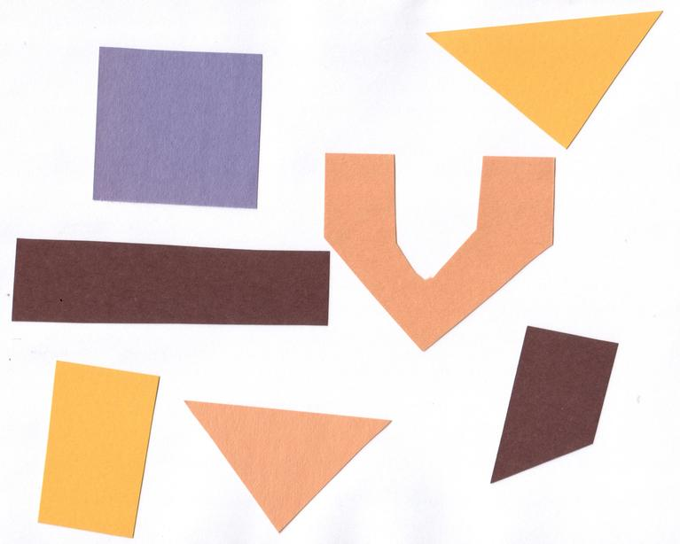

## Objects

In the [thresholding episode]({{ page.root }}/07-thresholding) we have covered dividing an image in foreground and background pixels.
In the junk example image, we considered the colored shapes as foreground _objects_ on a white background.

In thresholding we went from the original image to this version:

Here, we created a mask that only highlights the parts of the image that we find interesting, the _objects_.
All objects have pixel value of `True` while the background pixels are `False`.

By looking at the mask image, one can count the objects that are present in the image (7).
But how did we actually do that, how did we decide which lump of pixels constitutes a single object?

<!-- TODO: Group exercise: given sheep of paper with grids of 0's and 1's, how to identify which pixels belong to an object, find a rule for each pixel to determine in which object it is  -->

## Pixel Neighborhoods

In order to decide which pixels belong to the same object, one can exploit their neighbourhood:
pixels that are directly next to each other and belong to the foreground class can be considered to belong to the same object.

Let's consider the following mask "image" with 8 rows, and 8 columns.
Note that for brevity, `0` is used to represent `False` (background) and `1` to represent `True` (foreground).

~~~
0 0 0 0 0 0 0 0
0 1 1 0 0 0 0 0
0 1 1 0 0 0 0 0
0 0 0 1 1 1 0 0
0 0 0 1 1 1 1 0
0 0 0 0 0 0 0 0
~~~
{: .output}

The pixels are organized in a rectangular grid.
In order to understand pixel neighborhoods we will introduce the concept of "jumps" between pixels.
The jumps follow two rules:
First rule is that one jump is only allowed along the column, or the row.
Diagonal jumps are not allowed.
So, from a center pixel, denoted with `o`, only the pixels indicated with an `x` are reachable:

~~~
- x -
x o x
- x -
~~~
{: .output}

The pixels on the diagonal (from `o`) are not reachable with a single jump, which is denoted by the `-`.
The pixels reachable with a single jump form the __1-jump__ neighborhood.

The second rule states that in a sequence of jumps, one may only jump in row and column direction once -> they have to be _orthogonal_.
An example of a sequence of orthogonal jumps is shown below.
Starting from `o` the first jump goes along the row to the right.
The second jump then goes along the column direction up.
After this the sequence cannot be continued as a jump has been made in row and column direction.

~~~
- - 2
- o 1
- - -
~~~
{: .output}

All pixels reachable with one, or two jumps form the __2-jump__ neighborhood.
The grid below illustrates the pixels reachable from the center pixel `o` with a single jump, highlighted with a `1`, and the pixels reachable with 2 jumps with a `2`.

~~~
2 1 2
1 o 1
2 1 2
~~~
{: .output}

We want to revisiting our example image mask from above and apply the two different neighborhood rules.
With a single jump connectivity for each pixel, we get two resulting objects, highlighted in the image with `1`'s and `2`'s.

~~~
0 0 0 0 0 0 0 0
0 1 1 0 0 0 0 0
0 1 1 0 0 0 0 0
0 0 0 2 2 2 0 0
0 0 0 2 2 2 2 0
0 0 0 0 0 0 0 0
~~~
{: .output}

In the 1-jump version, only pixels that neighbors in rows or columns, are considered connected.
With two jumps, however, we only get a single objects, as pixels are also considered connected along the diagonals.

~~~
0 0 0 0 0 0 0 0
0 1 1 0 0 0 0 0
0 1 1 0 0 0 0 0
0 0 0 1 1 1 0 0
0 0 0 1 1 1 1 0
0 0 0 0 0 0 0 0
~~~
{: .output}

> ## Object counting (optional, not included in timing)
>
> How many objects with 1 orthogonal jump, how many with 2 orthogonal jumps?
>
> ~~~
> 0 0 0 0 0 0 0 0
> 0 1 0 0 0 1 1 0
> 0 0 1 0 0 0 0 0
> 0 1 0 1 1 1 0 0
> 0 1 0 1 1 0 0 0
> 0 0 0 0 0 0 0 0
> ~~~
> {: .output}
>
> 1 jump
>
> a) 1
> b) 5
> c) 2
>
> > ## Solution
> > b) 5
> {: .solution}
> 2 jumps
>
> a) 2
> b) 3
> c) 5
>
> > ## Solution
> > a) 2
> {: .solution}
{: .challenge}

> ## Jumps and neighborhoods
>
> We have just introduced how you can reach different neighboring pixels by performing one or more orthogonal jumps.
> There is also a different way of referring to these pixels: the 4- and 8-neighborhood.
> With a single jump you can reach four pixels from a given starting pixel.
> Hence, the one jump neighborhood corresponds to the 4-neighborhood.
> When two orthogonal jumps are allowed, eight pixels can be reached, so this corresponds to the 8-neighborhood.
{: .callout}

## Connected Component Analysis

In order to find the objects in an image, we want to employ an operation that is called Connected Component Analysis (CCA).
This operation takes a binary image as an input.
Usually, the `False` value in this image is associated with background pixels, and the `True` value indicates foreground, or object pixels.
Such an image can be e.g. produced with thresholding.
Given a thresholded image, CCA produces a new _labeled_ image with integer pixel values.
Pixels with the same value, belong to the same object.

We use the thresholding script as a starting point to write a program, that prints the number of objects in an image.

~~~
"""
 * Python script count objects in an image
 *
 * usage: python CCA.py <filename> <sigma> <threshold>
"""
import sys
import numpy as np
import skimage.color
import skimage.filters
import skimage.io
import skimage.viewer
import skimage.measure
import skimage.color

# get filename, sigma, and threshold value from command line
filename = sys.argv[1]
sigma = float(sys.argv[2])
t = float(sys.argv[3])

# read and display the original image
image = skimage.io.imread(fname=filename, as_gray=True)
viewer = skimage.viewer.ImageViewer(image)
viewer.show()

# blur and grayscale before thresholding
blur = skimage.filters.gaussian(image, sigma=sigma)

# perform inverse binary thresholding
mask = blur < t

# display the result
viewer = skimage.viewer.ImageViewer(mask)
viewer.show()

# Perform CCA on the mask
labeled_image = skimage.measure.label(mask, connectivity=2, return_num=True)

viewer = skimage.viewer.ImageViewer(labeled_image)
viewer.show()
~~~
{: .python}

<!-- Note: junk image: with sigma=2.0, threshold=0.9 -> 11 objects; with sigma=5 -> 8 objects -->

Let's examine the changes to the original thresholding script.
There is an additional import: `skimage.measure`.
We import `skimage.measure` in order to use the `skimage.measure.color` function that performs CCA.

After the imports, the parameters for sigma and the threshold are read from the command line.
The original image is displayed first, then blurring and thresholding is performed.
The resulting binary image is also displayed in an interactive viewer.
The new code follows the comment `Perform CCA on the mask`.
The skimage function to perform CCA is `skimage.measure.label`.
It has one positional argument, where we supply `mask`, the binary image to work on.
With an optional argument we, specify the `connectivity` in units of orthogonal jumps.
By setting `connectivity=2` we will consider a particular pixel connected to a second one, if the second one is reachable with two orthogonal jumps from the first pixel.
The function returns an image in which each object is represented with a unique pixel value.
We assign this image to the variable `labeled_image`.

Calling the script with the `junk.jpg` image and `sigma=2.0` and `threshold=0.9` yields an all black image.
Note: this behavior might change in future versions, or not occur with a different image viewer.

What went wrong?

When we hover with the mouse over this black image, the underlying pixel values are shown as numbers in the lower left corner.
We can see that in some positions they are not `0`, but still this image is black.

Let's find out more by examining `label_image`.
Properties that might be interesting in this context are `dtype`, the minimum and maximum value.
We can do so by adding the following lines:

~~~
print("dtype:", label_image.dtype)
print("min:", numpy.min(label_image))
print("max:", numpy.max(label_image))
~~~
{: .python}

Examining the output can give us a clue:

~~~
dtype: int64
min: 0
max: 11
~~~
{: .output}

The `dtype` of `label_image` is `int64`.
This means that values in this image range from `-2 ** 63` to `2 ** 63 - 1`.
Those are really big numbers.
From this available space we only use the range from `0` to `11`.
When showing this image in the viewer, it squeezes the complete range into 256 gray values.
The range of our numbers does not produce any visible change.
The `skimage` library has tools to cope with this a situation.
In the `skimage.color` module has a function `label2rgb()` that will convert do the conversion.
We have already used the `skimage.color` module to convert color images to gray scale images.
`skimage.color.label2rgb()` will create a new color image.
All objects are objects are colored according to a list of colors that can be customized.
In order to see our objects, we can add the following code to our program:

~~~
# convert the label image to color image
colored_label_image = skimage.color.label2rgb(labeled_image, bg_label=0)

# show the created image in the viewer
viewer = skimage.viewer.Viewer(colored_label_image)
viewer.show()
~~~
{: .python}

> ## How many objects are in that image (15 min)
>
> Now, it is your turn to practice. Using the original `junk.png` image, copy the `CCA.py` script to a new file `CCA-count.py`.
> Modify this script to print out the number of found objects in the end.
>
> 
>
> What number of objects would you expect to get?
> How does changing the `sigma` and `threshold` values influence the result?
>
> > ## Solution
> >
> > All pixels that belong to a single object are assigned the same integer value.
> > The algorithm produces consecutive numbers.
> > That means the first object gets the value `1`, the second object the value `2` and so on.
> > This means that, by finding the object with the maximum value, we know how many objects there are in the image.
> > Using the `numpy.max` function will give us the maximum value in the image
> >
> > Adding the following code at the end of the `CCA-count.py` program will print out the number of objects
> >
> > ~~~
> > num_objects = numpy.max(labeled_image)
> > print("Found", num_objects, "objects in the image.")
> > ~~~
> > {: .python}
> >
> > Invoking the program with `sigma=2.0`, and `threshold=0.9` will print
> > ~~~
> > Found 11 objects in the image.
> > ~~~
> > {: .output}
> >
> > Lowering the threshold will result in fewer objects.
> > The higher the threshold is set, the more objects are found.
> > More and more background noise gets picked up as objects.
> >
> > Larger sigmas produce binary masks with less noise and hence a smaller number of objects.
> > Setting sigma too high bears the danger of merging objects.
> {: .solution}
{: .challenge}

## Morphometrics - Describe object features with numbers

<!-- TODO: Morphometrics content -->

> ## Plot a histogram of the object area distribution (15 min)
>
> In the previous exercise we wrote the `CCA-count.py` program and explored how the object count changed with the parameters.
> We had a hard time making the script print out the right number of objects.
> In order to get closer to a solution to this problem, we want to look at the distribution of the object areas.
> Calculate the object properties using `skimage.measure.regionprops` and [generate a histogram]({{ page.root }}/05-creating-histograms).
>
> Make a copy of the `CCA.py` script and modify it to also produce a plot of the histogram of the object area.
>
> What does the histogram tell you about the objects?
>
> Hint: Try to generate a list of object areas first.
>
> > ## Solution
> >
> > ~~~
> > # add the import for pyplot
> > from matplotlib import pyplot as plt
> >
> > # compute object features and extrac object areas
> > object_features = skimage.measure.regionprops(labeled_image)
> > object_areas = [objf["area"] for objf in object_features]
> > plt.hist(object_areas)
> > plt.show()
> > ~~~
> > {: .python}
> {: .solution}
{: .challenge}

> ## Filter objects by area (15 min)
>
> Our `CCA-count.py` program has an apparent problem:
> it is hard to find a combination that produces the right output number.
> In some cases the problem arose that some background noise got picked up as an object.
> With other parameter settings some of the foreground objects got broken up or disappeared completely.
>
> 
>
> Modify the program in order to only count large objects.
>
>
> > ## Solution
> >
> {: .solution}
>
> Now make this change visual:
> Modify the label image such that objects below a certain area are set to the background label (0).
>
> > # Solution
> >
> > ~~~
> > # iterate over object_ids and modify the `labeled_image` in-place
> > for object_id, objf in enumerate(object_features, start=1):
> >     if objf["area"] < 10000:
> >         labeled_image[labeled_image == object_id] = 0
> > ~~~
> > {: .python}
> {: .solution}
>
> Lastly print out the count for the large objects
>
> > # Solution
> >
> > ~~~
> > # generate a list of objects above a certain area
> > filtered_list = []
> > for objf in object_features:
> >     if objf["area"] > 10000:
> >         filtered_list.append(objf["area"])
> >
> > print("Found", len(filtered_list), "objects!")
> > ~~~
> > {: .python}
> >
> > The script, if working properly, will produce the following output:
> >
> > ~~~
> > Fount 7 objects!
> > ~~~
> > {: .output}
> {: .solution}
{: .challenge}

<!-- TODO: color-by-feature -->
