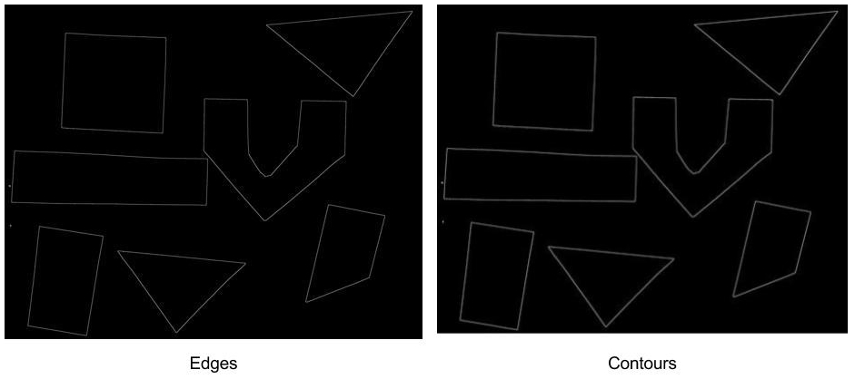
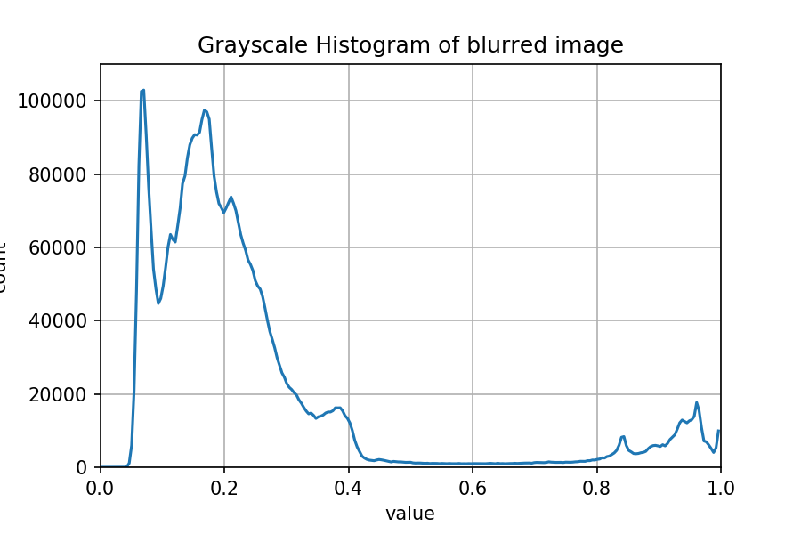
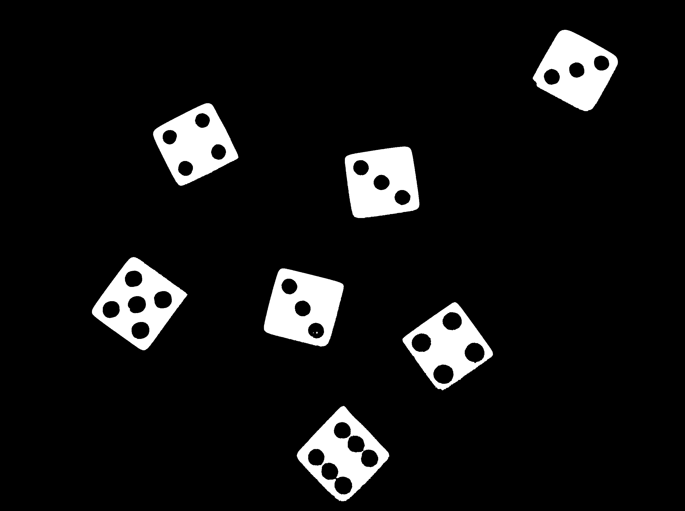
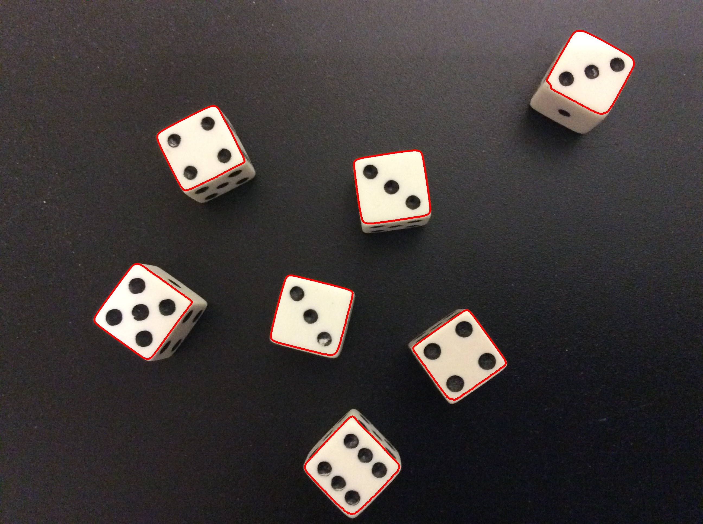
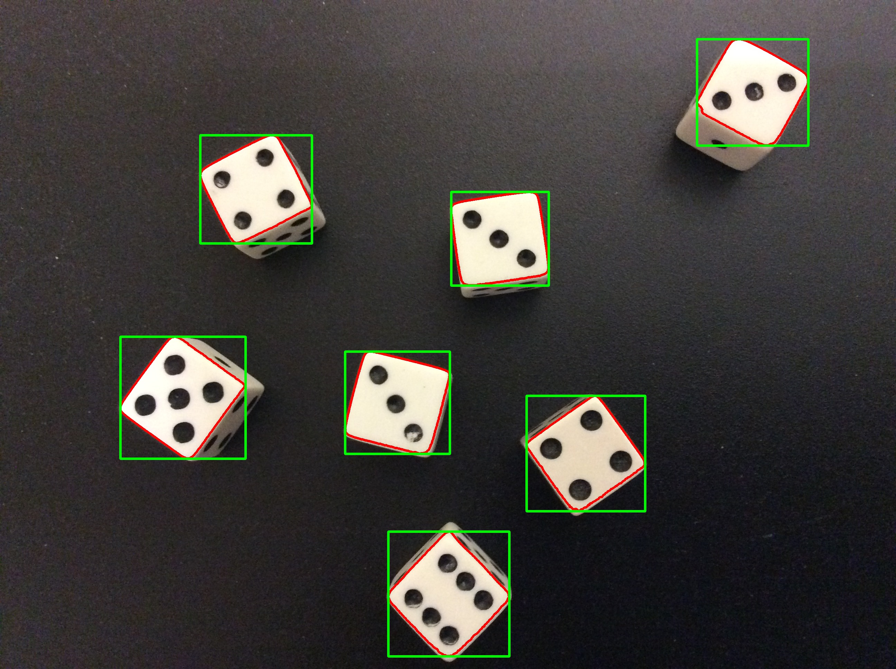
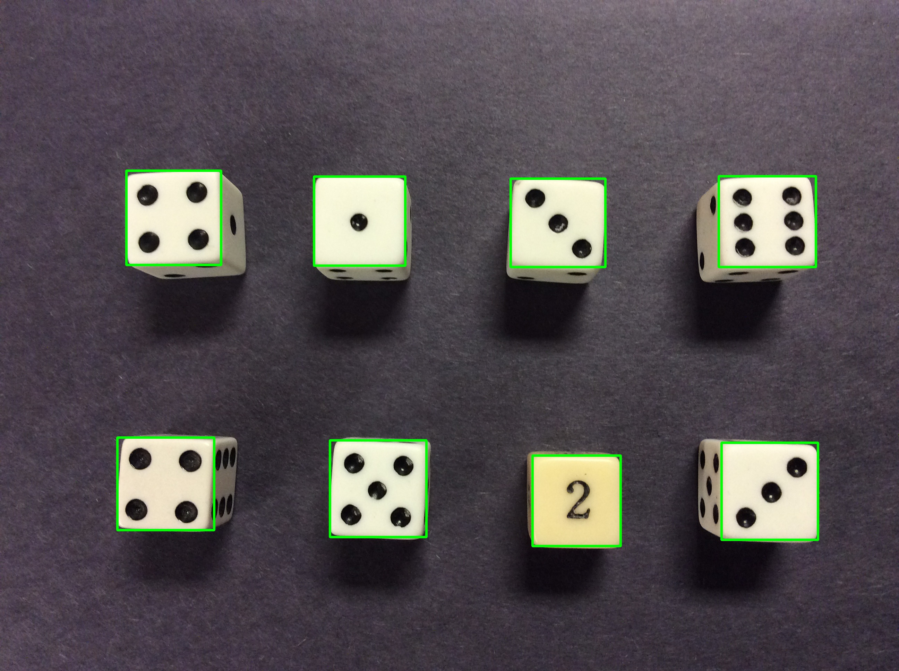
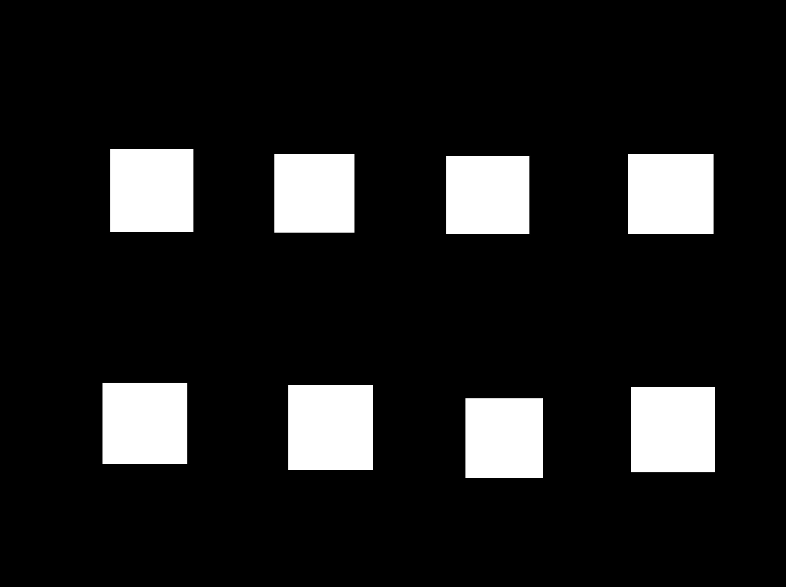
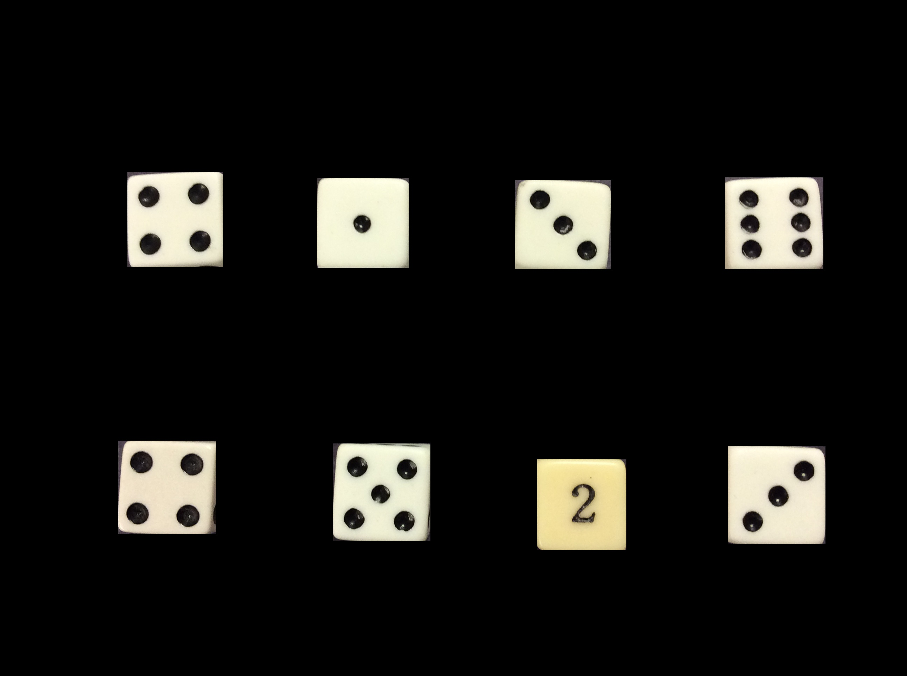
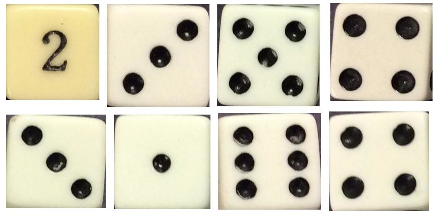

In this episode, we will learn how to use OpenCV functions to find the 
*contours* of the objects in an image. A contour is a closed curve of points
or line segments, representing the boundaries of an object in an image. In 
other words, contours represent the shapes of objects found in an image. If 
internal detail is visible in an image, the object may produce several 
associated contours, which are returned in a hierarchical data structure. Once 
we find the contours of the objects in an image, we can do things like 
determine the number of objects in an image, classify the shapes of the 
objects, or measure the size of the objects. The input to the contour-finding 
process is a binary image, which we will produce by first applying thresholding 
and / or edge detection. In the binary image, the objects we wish to detect 
should be white, while the background of the image should be black.

## Edges versus contours

Based on the introduction above, it is not immediately apparent what the 
difference is between finding the edges in an image and finding the 
contours in an image. A superficial examination of the output of the two 
processes does not help matters. Consider the colored shapes image from the
[Thresholding]({{ page.root }}./06-thresholding.md) episode:

Now, consider the output of edge detection and contour detection for that 
image: 

There certainly does not seem to be much difference between the two resulting
images! But, underneath the surface, the difference between edges and contours 
is significant. When we perform edge detection, we find the points where the 
intensity of colors changes significantly, and turn those pixels on, while
turning the rest of the pixels off. The edge pixels are in an image, and there
is no particular requirement that the pixels representing an edge are all
contiguous.

Contours, on the other hand, are not necessarily part of an image, unless we 
choose to draw them (as we did for the contour image above). Rather, contours
are *abstract collections of points and / or line segments* corresponding to 
the shapes of the objects in the image. Thus, they can be manipulated by our 
programs; we can count the number of contours, use them to categorize the 
shapes in the object, use them to crop objects from an image, and more. So, 
let us see how to find contours in an image, and use the contours to determine 
the number of objects in the image.

## Using contours to count objects

Consider this image of several six-sided dice on a black background. 

Suppose we want to automatically count the number of dice in the image. We can
use contours to do that. We find contours with the `cv2.findContours()` method,
and then easily examine the results to count the number of objects. Our 
strategy will be this:

1. Read the input image, convert it to grayscale, and blur it slightly.

2. Use simple fixed-level thresholding to convert the grayscale image to a 
binary image.

3. Use the `cv2.findContours()` method to find contours corresponding to the 
outlines of the dice.

4. Print information on how many contours -- and thus how many objects -- were
found in the image.

5. For illustrative purposes, draw the contours in the original image so we can
visualize the results. 

Before we examine a Python program to implement this strategy, let us first 
look at the grayscale histogram for the dice image, so we can find a threshold
value that will effectively convert the image to binary. 

Since finding contours works on white objects set against a black background, 
in our thresholding we want to turn off the pixels in the background, while 
turning on the pixels associated with the face of the dice. Based on the 
histogram, a threshold value of 200 seems likely to do that. 

Here is a Python program to count the number of dice in the preceding image
via contours. 

~~~
'''
 * Python program to use contours to count the objects in an image.
 *
 * usage: python Contours.py <filename> <threshold>
'''
import cv2, sys

# read command-line arguments
filename = sys.argv[1]
t = int(sys.argv[2])

# read original image
img = cv2.imread(filename)

# create binary image
gray = cv2.cvtColor(img, cv2.COLOR_BGR2GRAY)
blur = cv2.GaussianBlur(gray, (5, 5), 0)
(t, binary) = cv2.threshold(blur, t, 255, cv2.THRESH_BINARY)

# find contours
(_, contours, _) = cv2.findContours(binary, cv2.RETR_EXTERNAL, 
    cv2.CHAIN_APPROX_SIMPLE)

# print table of contours and sizes
print("Found %d objects." % len(contours))
for (i, c) in enumerate(contours):
    print("\tSize of contour %d: %d" % (i, len(c)))

# draw contours over original image
cv2.drawContours(img, contours, -1, (0, 0, 255), 5)

# display original image with contours
cv2.namedWindow("output", cv2.WINDOW_NORMAL)
cv2.imshow("output", img)
cv2.waitKey(0)
~~~
{: .python}

We start with familiar steps: we save the command-line arguments for the 
filename and threshold value, read the original image, convert it to 
grayscale, blur it, and convert to a binary image via `cv2.threshsold()`, with
the resulting image save in the `binary` variable. We do not display the binary
image in the program, but if we did, it would look like this, assuming a 
threshold value of 200:

Now, we find the contours, based on the binary image of the dice. The way we 
are using `cv2.findContours()` method takes three parameters, and it returns 
three values:

~~~
(_, contours, _) = cv2.findContours(binary, cv2.RETR_EXTERNAL, 
    cv2.CHAIN_APPROX_SIMPLE)
~~~
{: .python}

The first parameter to the method is the image to find contours in. 
Remember, this image should be binary, with the objects you wish to find 
contours for in white, against a black background. Second, we pass in a 
constant indicating what kind of contours we are interested in. Since we are
interesting in counting the objects in this image, we only care about the 
contours around the outermost edges of the objects, and so we pass in the 
`cv2.RETR_EXTERNAL` parameter. If we wished to have more information -- say, 
contours associated with the pips on the faces of the dice -- then we could use
another parameter, such as `cv2.RETR_TREE` or `cv2.RETR_CCOMP`. See the OpenCV 
documentation [here](http://docs.opencv.org/trunk/d3/dc0/group__imgproc__shape.html#ga819779b9857cc2f8601e6526a3a5bc71)
for more information. The last parameter tells the method if it 
should simplify the contours or not. We pass in `cv2.CHAIN_APPROX_SIMPLE`, 
which tells the method to simplify by using line segments when it can, rather
that including all the points on what would be a straight edge. Using this
parameter saves memory and computation time in our program. 

The `cv2.findContours()` method returns three values, as a tuple; in this case,
we are choosing to ignore the first and third return value. The first parameter
is an intermediate image that is produced during the contour-finding process. 
We are not interested in that image in this application, so we effectively
discard that image by placing the underscore (`_`) in the place of the first 
return value. The second return value is a list of NumPy arrays. Each array 
holds the points for one contour in the image. So, if we have executed our 
strategy correctly, the number of contours -- the length of the `contours` list
-- will be the number of objects in the image. The final return value is a 
NumPy array that contains hierarchy information about the contours. This is not
useful to us in our object-counting program, so we also choose to discard that
return value with the `_`. 

After finding the contours of the image, we print information about them out to
the terminal, so that we can see the number of objects detected in the image. 
The code that does the printing looks like this:

~~~
print("Found %d objects." % len(contours))
for (i, c) in enumerate(contours):
    print("\tSize of contour %d: %d" % (i, len(c)))
~~~
{: .python}

First, we print the number of objects found, which is the length of the 
`contours` list. This usage of the `print()` function uses a 
*format specifier*, `%d`. A format specifier is a placeholder in a string, in
this case standing in for an integer. After the string, we place the value(s) 
to substitute for the placeholder(s), after the `%` character. You can find
more information regarding formatting strings 
[here](https://docs.python.org/3.4/library/string.html).

Then, we iterate through the contours list to show how many points are in each
contour. The `enumerate(contours)` function call goes through the list, as we 
normally do in a `for` loop, but we also associate an integer, `i`, with each
element of the list. This lets us print out the number of the contour, starting
with zero, and then the size of each contour with the for loop. The output of 
this loop, assuming we used the dice image above and a threshold value of 200, 
is:

~~~
Found 7 objects.
	Size of contour 0: 423
	Size of contour 1: 476
	Size of contour 2: 497
	Size of contour 3: 456
	Size of contour 4: 327
	Size of contour 5: 622
	Size of contour 6: 570
~~~
{: .output}

Finally, we draw the contour points on the original image, with the 

~~~
cv2.drawContours(img, contours, -1, (0, 0, 255), 5)
~~~
{: .python}

method call. The first parameter is the image we are going to draw the contours
on. Then, we pass in the list of contours to draw. The third parameter tells us
where to start when we draw the contours; -1 means to draw them all. If we 
specified 2 here, only the third contour would be drawn. The fourth parameter
is the color to use when drawing the contours. Finally, we specify the 
thickness of the contour points to draw. Here we are drawing the contours in 
red, with a thickness of 5, so they will be very visible on the image. 

After the contours are drawn on the image, we display the image in a window. 
Here are the seven contours detected by the program. 

## Understanding contour hierarchies

Now let us turn our attention to one of the two return values from 
`cv2.findContours()` that we ignored in the previous section, namely, the 
*hierarchies*. Suppose we change the `cv2.RETR_EXTERNAL` parameter in our 
contours method call to `cv2.RETR_TREE` instead, so that we will receive all of
the contours in the image, instead of just the outermost contours for each 
image. If we draw the resulting contours and color things appropriately, we
will see something like this:

When we use the `cv2.RETR_TREE` parameter, the contours are arranged in a 
hierarchy, with the outermost contours for each object at the top. Moving down
the hierarchy, each new level of contours represents the next innermost contour
for each object. In the image above, the contours in the image are colored to 
represent the hierarchical structure of the returned contours data. The 
outermost contours are red, and they are at the top of the hierarchy. The next 
innermost contours -- the dice pips, in this case -- are green. The innermost 
contours, representing some lost paint in one of the pips in the central die, 
are blue. 

We can get that information about the contour hierarchies via the third return
value from the `cv2.findContours()` method call. Suppose we call the method 
like this:

~~~
(_, contours, hierarchy) = cv2.findContours(binary, cv2.RETR_TREE, 
    cv2.CHAIN_APPROX_SIMPLE)
~~~
{: .python}

The third return value, saved in the `hierarchy` variable in this code, is a 
three-dimensional NumPy array, with one row, 36 columns, and a "depth" of 4.
The 36 columns correspond to the contours found by the method; note that there
are 36 contours now, rather than seven. This is because the `cv2.RETR_TREE`
parameter causes the method to find the internal contours as well as the 
outermost contours for each object. Column zero corresponds to the first 
contour, column one the second, and so on.

Each of the columns has a four-element array of integers, representing indices 
of other contours, according to this scheme:

[*next*, *previous*, *first child*, *parent*]

The *next* index refers to the next contour in this contour's hierarchy level,
while the *previous* index refers to the previous contour in this contour's 
hierarchy level. The *first child* index refers to the first contour that is 
contained inside this contour. The *parent* index refers to the contour 
containing this contour. In all cases, an value of -1 indicates that there is 
no *next*, *previous*, *first child*, or *parent* contour, as appropriate. 
For a more concrete example, here are the `hierarchy` values for the dice 
image. The values are in square brackets, and the indices of the contours 
precede each entry. 

~~~
0:	[ 6 -1  1 -1]	18:	[19 -1 -1 17]
1:	[ 2 -1 -1  0]	19:	[20 18 -1 17]
2:	[ 3  1 -1  0]	20:	[21 19 -1 17]
3:	[ 4  2 -1  0]	21:	[22 20 -1 17]
4:	[ 5  3 -1  0]	22:	[-1 21 -1 17]
5:	[-1  4 -1  0]	23:	[27 17 24 -1]
6:	[11  0  7 -1]	24:	[25 -1 -1 23]
7:	[ 8 -1 -1  6]	25:	[26 24 -1 23]
8:	[ 9  7 -1  6]	26:	[-1 25 -1 23]
9:	[10  8 -1  6]	27:	[32 23 28 -1]
10:	[-1  9 -1  6]	28:	[29 -1 -1 27]
11:	[17  6 12 -1]	29:	[30 28 -1 27]
12:	[15 -1 13 11]	30:	[31 29 -1 27]
13:	[14 -1 -1 12]	31:	[-1 30 -1 27]
14:	[-1 13 -1 12]	32:	[-1 27 33 -1]
15:	[16 12 -1 11]	33:	[34 -1 -1 32]
16:	[-1 15 -1 11]	34:	[35 33 -1 32]
17:	[23 11 18 -1]	35:	[-1 34 -1 32]
~~~
{: .output}

The entry for the first contour is [6, -1, 1, -1]. This represents the first of
the outermost contours; note that there is no particular order for the 
contours, e.g., they are not stored left to right by default. The entry tells 
us that the next dice outline is the contour with index six, that there is no
previous contour in the list, that the first contour inside this one has index
one, and that there is no parent for this contour (no contour containing this
one). We can visualize the information in the `hierarchy` array as seven trees,
one for each of the dice in the images.

The seven outermost contours all those that have no parent, i.e., those with
an value of -1 in the fourth field of their `hierarchy` entry. 

## Bounding boxes and cropping

Aside from counting the number of objects in an image, one of the things we can
do with contours is find their *bounding boxes*. A bounding box is the smallest
rectangle that completely contains a given contour. For example, for the dice 
image we used in the previous section, here are the bounding boxes:

As before the contours for the objects are drawn in red, while the bounding 
boxes for the contours are drawn in green. These rectangles were found with the
`cv2.boundingRect()` method call, which takes a contour as its parameter. You 
can see that the rectangles are oriented so that the rectangle sides are 
perfectly vertical or horizontal. So, if the objects in the image are rotated
significantly from that perfect orientation, the bounding boxes will not have 
the best possible fit. It is possible to find bounding boxes (or circles, or 
ellipses) with a better fit by using other OpenCV methods. 

One application for bounding boxes is to use them to crop objects from an 
image. So that we can use the simple `cv2.boundingRect()` method to find our
bounding boxes, let us use another dice image; this one will have dice that are
more carefully aligned. 

Before we turn to seeing how to find the bounding boxes, and how to use them 
for cropping, here is what the bounding boxes look like for the new set of 
dice. The contours are not drawn on this image.

Our goal here is to use the bounding boxes to select only the dice faces from
the image. So, we want to do something akin to thresholding, but instead of 
producing a binary image, we wish to have full-color versions of the dice 
faces at the end of the process. Our strategy will be similar to the one we 
used to find the contours:

1. Read the input image, convert it to grayscale, and blur it slightly.

2. Use simple binary thresholding to convert the grayscale image to a binary
image.

3. Use `cv2.findContours()` to find the contours corresponding to the outlines
of the faces of the dice.

4. Create a blank, black mask image the same size as the original.

5. For each contour found, do the following:

    - Use `cv2.boundingRect()` to find the bounding box of the contour

    - Draw a filled, white rectangle corresponding to the bounding box on the 
mask image

6. Use a bitwise and operation on the original image and the mask, producing 
the final image. 

Here is a Python program that implements this strategy. 

~~~
'''
 * Python program to use contours to crop the objects in an image.
 *
 * usage: python ContourCrop.py <filename> <threshold>
'''
import cv2, sys, numpy as np

# read command-line arguments
filename = sys.argv[1]
t = int(sys.argv[2])

# read original image
img = cv2.imread(filename)

# create binary image
gray = cv2.cvtColor(img, cv2.COLOR_BGR2GRAY)
blur = cv2.GaussianBlur(gray, (5, 5), 0)
(t, binary) = cv2.threshold(blur, t, 255, cv2.THRESH_BINARY)

# find contours
(_, contours, _) = cv2.findContours(binary, cv2.RETR_EXTERNAL, 
    cv2.CHAIN_APPROX_SIMPLE)

# create all-black mask image
mask = np.zeros(img.shape, dtype="uint8")

# draw white rectangles for each object's bounding box
for c in contours:
    (x, y, w, h) = cv2.boundingRect(c)
    cv2.rectangle(mask, (x, y), (x + w, y + h), (255, 255, 255), -1)

# apply mask to the original image
img = cv2.bitwise_and(img, mask)

# display masked image
cv2.namedWindow("output", cv2.WINDOW_NORMAL)
cv2.imshow("output", img)
cv2.waitKey(0)
~~~
{: .python}

Everything up through finding the contours is the same as the previous program,
so we will not go through that part of the code again. Once we have found the 
contours, we create a mask using the `np.zeros()` method, as we did in the 
[Drawing and Bitwise Operations]({{ page.root }}./03-drawing-bitwise.md)
episode. Then, we use a `for` loop to iterate through the list of contours,
finding the bounding box and drawing the box on the mask image:

~~~
for c in contours:
    (x, y, w, h) = cv2.boundingRect(c)
    cv2.rectangle(mask, (x, y), (x + w, y + h), (255, 255, 255), -1)
~~~
{: .python}

Remember that contours are stored in a list, so when we use the `for` loop to
iterate through the list, each time through the loop works with an individual 
contour, stored in the variable `c`. 

Inside the loop, we pass the current contour `c` to the `cv2.boundingRect()` 
method, and we receive a tuple of four values as in return: the x and y 
coordinates of the upper-left corner of the bounding box, and the width and 
height of the box. We store these in the `(x, y, w, h)` tuple. 

Then, we draw a solid white rectangle on the mask image, corresponding to the 
bounding box, with the `cv2.rectangle()` method call. It has been a while
since we have used this method, so let us review the parameters we pass in.
First, `mask` is the image we will draw the rectangles on. Next is a tuple with
the coordinates of the upper-left corner of the rectangle, `(x, y)`. Next, we
provide a tuple with the coordinates of the lower-right corner of the 
rectangle, `(x + w, y + h)`; note how we add the width and height of the 
rectangle to the previous coordinates. Next, we pass in the color for the 
rectangle, white in this case. Finally, we pass in `-1`, which tells the method
to draw a filled rectangle. 

The program does not display the finished mask image, but if we were to examine
it, it would look like this (assuming the second dice image and a threshold 
value of 200):

After the `for` loop, we use the `cv2.bitwise_and()` method to apply our mask 
to the original image. The effect is to select only the dice faces, while 
making everything else in the image black:

> ## Extracting subimages
> 
> Now, what if we wished to extract the eight dice faces from the preceding 
> image into eight separate images? That is your challenge here. Navigate to the
> **Desktop/workshops/image-processing/08-contours** directory, and edit the 
> **ExtractSubimages.py** program. The program is much like the one we just 
> used. There are two places where you should write code in the `for` loop to 
> create eight different subimages, each containing one of the dice faces from
> the **dice-grid.jpg** image. Once you have made your edits, run the program
> like this:
> 
> ~~~
> python ExtractSubimages.py dice-grid.jpg 200
> ~~~
> {: .bash}
> 
> > ## Solution
> > 
> > Here is the completed version of the program.
> > 
> > ~~~
> > '''
> >  * Python program to use contours to extract the objects in an image.
> > '''
> > import cv2, sys
> > 
> > # read command-line arguments
> > filename = sys.argv[1]
> > t = int(sys.argv[2])
> > 
> > # read original image
> > img = cv2.imread(filename)
> > 
> > # create binary image
> > gray = cv2.cvtColor(img, cv2.COLOR_BGR2GRAY)
> > blur = cv2.GaussianBlur(gray, (5, 5), 0)
> > (t, binary) = cv2.threshold(blur, t, 255, cv2.THRESH_BINARY)
> > 
> > # find contours
> > (_, contours, _) = cv2.findContours(binary, cv2.RETR_EXTERNAL, 
> >     cv2.CHAIN_APPROX_SIMPLE)
> > 
> > # use the contours to extract each image, into a new sub-image
> > for (i, c) in enumerate(contours):
> >     (x, y, w, h) = cv2.boundingRect(c)
> >     # WRITE YOUR CODE HERE!
> >     # use slicing and the (x, y, w, h) values of the bounding
> >     # box to create a subimage based on this contour
> >     subImg = img[y : y + h, x : x + w, :]
> > 
> >     # WRITE YOUR CODE HERE!
> >     # save the subimage as sub-x.jpg, where x is the number
> >     # of this contour. HINT: try "sub-{0}".format(i) to 
> >     # create the filename
> >     cv2.imwrite("sub-{}.jpg".format(i), subImg)
> > ~~~
> > {: .python}
> > 
> > The program produces eight subimages, shown here. Note that there is no
> > particular order to the contours found by the `cv2.findContours()` method!
> > 
> > 
> > 
> {: .solution}
{: .challenge}
