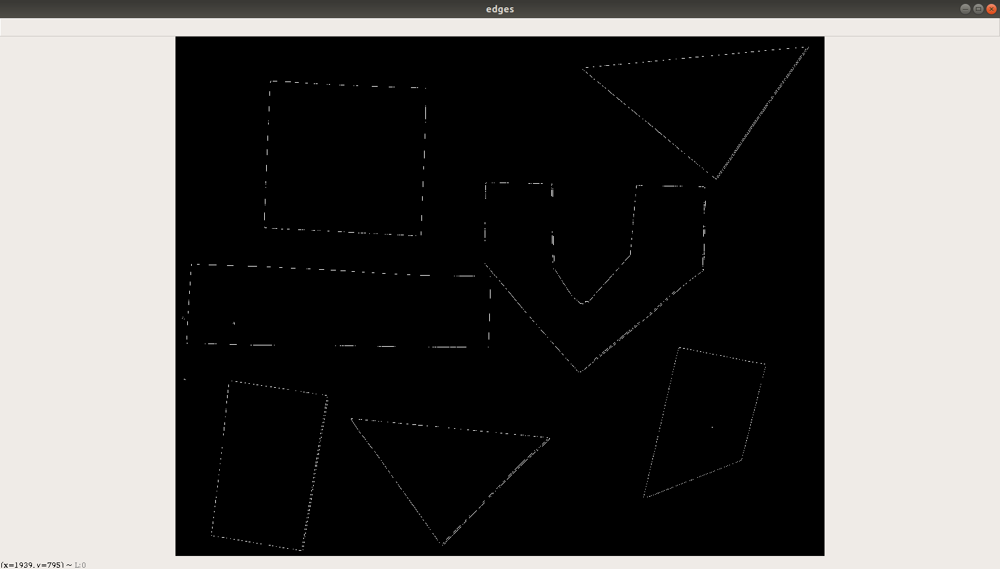
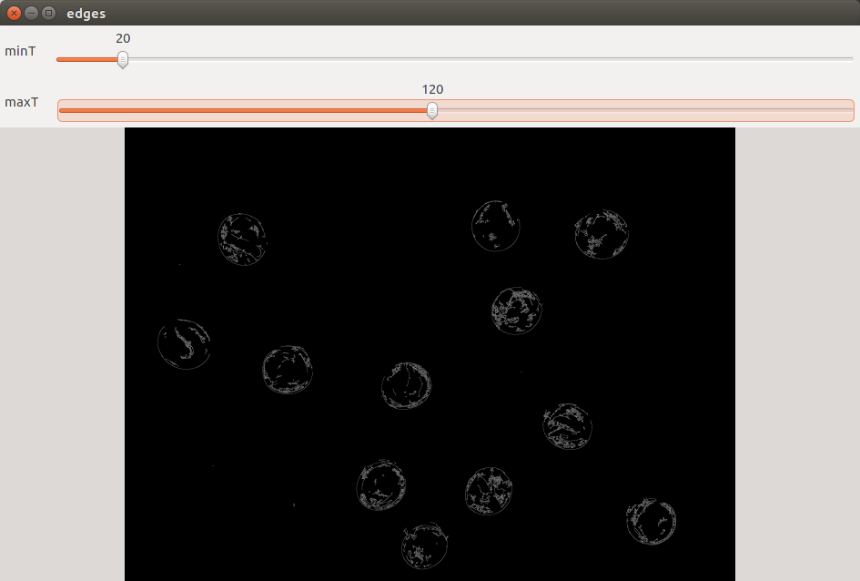
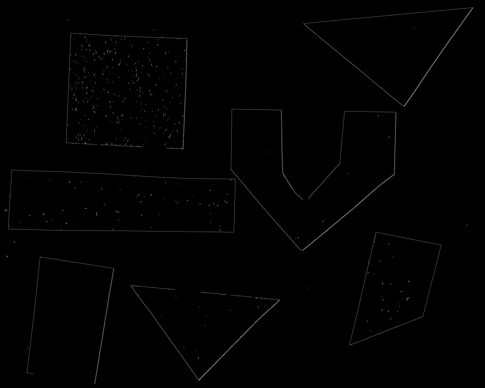
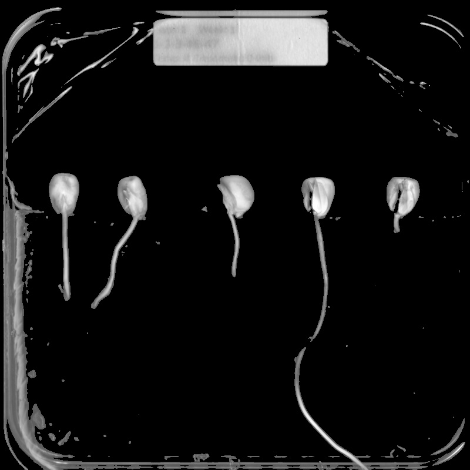

In this episode, we will learn how to use skimage functions to apply *edge
detection* to an image. In edge detection, we find the boundaries or edges of
objects in an image, by determining where the brightness of the image changes
dramatically. Edge detection can be used to extract the structure of objects in 
an image. If we are interested in the number, size, shape, or relative location
of objects in an image, edge detection allows us to focus on the parts of the 
image most helpful, while ignoring parts of the image that will not help us. 

For example, once we have found the edges of the objects in the image (or once
we have converted the image to binary using thresholding), we can 
use that information to find the image *contours*, which we will learn about in
the following [Contours]({{ page.root }}/09-contours) episode. With the 
contours, we can do things like counting the number of objects in the image,
measure the size of the objects, classify the shapes of the objects, and so on.

As was the case for blurring and thresholding, there are several different 
methods in skimage that can be used for edge detection, so we will examine only
one in detail. 

## Introduction to edge detection

To begin our introduction to edge detection, let us look at an image with a
very simple edge -- this grayscale image of two overlapped pieces of paper, one
black and and one white:

The obvious edge in the image is the vertical line between the black paper and
the white paper. To our eyes, there is a quite sudden change between the black
pixels and the white pixels. But, at a pixel-by-pixel level, is the transition
really that sudden? 

If we zoom in on the edge more closely, as in this image, we can see that the 
edge between the black and white areas of the image is not a clear-cut line.

We can learn more about the edge by examining the color values of some of the 
pixels. Imagine a short line segment, halfway down the image and straddling the 
edge between the black and white paper. This plot shows the pixel values 
(between 0 and 255, since this is a grayscale image) for forty pixels spanning 
the transition from black to white.

It is obvious that the "edge" here is not so sudden! So, any skimage method to
detect edges in an image must be able to decide where the edge is, and place 
appropriately-colored pixels in that location.

## Canny edge detection

Our edge detection method in this workshop is *Canny edge detection*, created 
by John Canny in 1986. This method uses a series of steps, some incorporating 
other types of edge detection. The skimage `skimage.feature.canny()` function performs
the following steps:

1. A Gaussian blur (that is characterized by the `sigma` parameter, see [introduction]({{ page.root }}/06-blurring/)) is applied to remove noise
from the image. (So if we are doing edge detection via this function, we should
not perform our own blurring step.)
2. Sobel edge detection is performed on both the x and y dimensions, to find
the intensity gradients of the edges in the image. Sobel edge detection 
computes the derivative of a curve fitting the gradient between light and 
dark areas in an image, and then finds the peak of the derivative, which is 
interpreted as the location of an edge pixel.
3. Pixels that would be highlighted, but seem too far from any edge, are 
removed. This is called *non-maximum suppression*, and the result is edge lines
that are thinner than those produced by other methods.
4. A double threshold is applied to determine potential edges. Here extraneous 
pixels caused by noise or milder color variation than desired are eliminated.
If a pixel's gradient value -- based on the Sobel differential -- is above the
high threshold value, it is considered a strong candidate for an edge. If the 
gradient is below the low threshold value, it is turned off. If the gradient is
in between, the pixel is considered a weak candidate for an edge pixel. 
5. Final detection of edges is performed using *hysteresis*. Here, weak 
candidate pixels are examined, and if they are connected to strong candidate 
pixels, they are considered to be edge pixels; the remaining, non-connected 
weak candidates are turned off.

For a user of the `skimage.feature.canny()` edge detection function, there are three important
parameters to pass in: `sigma` for the Gaussian filter in step one and the low and high threshold values used in step four
of the process. These values generally are determined empirically, based on the
contents of the image(s) to be processed.

The following program illustrates how the `skimage.feature.canny()` method can be used to
detect the edges in an image.
We will execute the program on this image, which we used before in the [Thresholding]({{ page.root }}/07-thresholding/) episode:

We are interested in finding the edges of the shapes in the image, and so the
colors are not important. Our strategy will be to read the image as grayscale,
and then apply Canny edge detection.
Note that when reading the image with `skimage.io.imread(..., as_gray=True)` the image is converted to a float64 grayscale with the original dtype range being mapped to values ranging from 0.0 to 1.0.

This program takes three command-line arguments: the filename of the image to
process, and then two arguments related to the double thresholding in step four
of the Canny edge detection process. These are the low and high threshold 
values for that step. After the required libraries are imported, the 
program reads the command-line arguments and saves them in their respective
variables. 

~~~
'''
 * Python script to demonstrate Canny edge detection.
 *
 * usage: python CannyEdge.py <filename> <sigma> <low_threshold> <high_threshold>
'''
import skimage
import skimage.feature
import skimage.viewer
import sys

# read command-line arguments
filename = sys.argv[1]
sigma = sys.argv[2]
low_threshold = int(sys.argv[3])
high_threshold = int(sys.argv[4])
~~~
{: .python}

Next, the original images is read, in grayscale, and displayed. 

~~~
# load and display original image as grayscale
image = skimage.io.imread(fname=filename, as_gray=True)
viewer = skimage.viewer(image=image)
viewer.show()
~~~
{: .python}

Then, we apply Canny edge detection with this function call:

~~~
edges = skimage.feature.canny(
    image=image,
    sigma=sigma,
    low_threshold=low_threshold,
    high_threshold=high_threshold)
~~~
{: .python}

As we are using it here, the `skimage.feature.canny()` function takes four parameters.
The first parameter is the input image. The `sigma` parameter determines the
amount of Gaussian smoothing that is applied to the image. The next two
parameters are the low and high threshold values for the fourth step of the
process.

The result of this call is a binary image. In the image, the edges detected by 
the process are white, while everything else is black. 

Finally, the program displays the `edges` image, showing the edges that were 
found in the original. 

~~~
# display edges
viewer = skimage.viewer.ImageViewer(edges)
viewer.show()
~~~
{: .python}

Here is the result, for the colored shape image above,
with sigma value 2.0, low threshold value 0.1 and high threshold value 0.3:

Note that the edge output shown in an skimage window may look significantly
worse than the image would look if it were saved to a file. The image above
is the edges of the junk image, saved in a PNG file. Here is how the same
image looks when displayed in an skimage output window:

## Trackbars for parameter choosing

As we have seen, for a user of the `cv2.Canny()` edge detection function, the 
two important parameters to pass in are the low and high threshold values used 
in step four of the process. These values generally are determined empirically,
based on the contents of the image(s) to be processed. 

Here is an image of some glass beads that we can use as input into a Canny edge
detection program:

We could use the **CannyEdge.py** program above to find edges in this image. To 
find acceptable values for the thresholds, we would have to run the program 
over and over again, trying different threshold values and examining the 
resulting image, until we find a combination of parameters that works best for 
the image.

*Or*, we can write a Python program that uses skimage *trackbars*, that allow us
to vary the low and high threshold parameters while the program is running. In 
other words, we can write a program that presents us with a window like this:

Then, when we run the program, we can use the trackbar sliders to vary the 
values of the threshold parameters until we are satisfied with the results. 
After we have determined suitable values for the threshold parameters, we can 
use the simpler program to utilize the parameters without bothering with the 
user interface and trackbars. 

Here is a Python program that shows how to apply Canny edge detection, and how
to add trackbars to the user interface. There are four parts to this program, 
making it a bit (but only a *bit*) more complicated that the programs we have 
looked at so far. The added complexity comes from three *functions* we have 
written. From top to bottom, the parts are:

* The `cannyEdge()` function, 
* The `adjustMin()` function, 
* the `adjustMax()` function, and
* The main program, i.e., the code that is executed when the program runs.

We will look at the main program part first, and then return to the three 
functions. The first several lines of the main program are easily recognizable
at this point: saving the command-line argument, reading the image in 
grayscale, and creating a window. 

~~~
'''
 * Main program begins here. 
'''
# read command-line filename argument
filename = sys.argv[1]

# load original image as grayscale
image = cv2.imread(filename = filename, flags = cv2.IMREAD_GRAYSCALE)

# set up display window with trackbars for minimum and maximum threshold
# values
cv2.namedWindow(winname = "edges", flags = cv2.WINDOW_NORMAL)
~~~
{: .python}

Then, the program creates two variables to
hold first guesses for the low and high threshold values, `minT` and `maxT`. 

~~~
minT = 30
maxT = 150
~~~
{: .python}

Next comes the code where we attach two trackbars to the display window named
"edges".

~~~
cv2.createTrackbar("minT", "edges", minT, 255, adjustMinT)
cv2.createTrackbar("maxT", "edges", maxT, 255, adjustMaxT)
~~~
{: .python}

The `cv2.createTrackbar()` function takes five parameters. Unfortunately, the
function does not support named parameters. First is a string 
containing the label that will be used for the trackbar when it is displayed. 
Next is a string containing the name of the window the trackbar should be 
attached to. Third is the initial value for the trackbar. Fourth is the maximum
value for the trackbar; the minimum is always 0. Finally, we pass in the name 
of a function that will be called whenever the value of the trackbar is changed
by the user. Here we pass in `adjustMinT` for the minimum threshold trackbar 
and `adjustMaxT` for the maximum threshold trackbar. 

The last two lines of our main program perform the initial Canny edge detection,
by calling the `cannyEdge()` function, and then instruct skimage to keep the
"edges" window open until a key is pressed. 

~~~
# perform Canny edge detection and display result
cannyEdge()
cv2.waitKey(delay = 0)
~~~
{: .python}

Now we can cover the details of the three functions in this program. First, 
consider the `cannyEdge()` function:

~~~
def cannyEdge():
    global image, minT, maxT
    edge = cv2.Canny(image = image, 
        threshold1 = minT, 
        threshold2 = maxT)

    cv2.imshow(winname = "edges", mat = edge)
 ~~~
{: .python}

This function actually performs the edge detection, via a call to the 
`cv2.Canny()` function. First, however, the `global` line indicates that the 
`image`, `minT`, and `maxT` variables are *global*, that is, that they were 
created in the main program, rather than inside this function. Including this
line in functions that refer to variables that were created elsewhere makes 
sure that the variables' values are available inside the function. 

The next line calls the `cv2.Canny()` function to do edge detection. As before, 
the three parameters to the function are the variable holding the input image, 
the minimum threshold value, and the maximum threshold value. The function 
returns the output image, which we store in a variable named `edge`. 

After the edge detection process is complete, the edge image is displayed in 
the window named "edges." Recall that this window was already created in the 
main program. 

Now, let us examine one of the trackbar callback functions, `adjustMinT()`, in
detail.

~~~
def adjustMinT(v):
	global minT
	minT = v
	cannyEdge()
~~~
{: .python} 

This function has a single *parameter*, which we have named `v`. The parameter
is used to communicate the value of the minimum threshold trackbar when the 
function is called. For example, for the image of the user interface above, the
last time the minimum threshold trackbar was adjusted, the `adjustMinT()` 
function was called and the parameter `v` had the value 20. 

The first line in the function is a `global` statement, telling the function 
that the variable `minT` is global. Then, we change the value of `minT` to the
value contained in `v`, so that the minimum threshold variable `minT` contains 
the new value set by the trackbar. Finally, the `cannyEdge()` function is 
called again, to re-do the edge detection process and display the results in 
the "edges" window. 

The `adjustMaxT()` function is very similar. It changes the value of the `maxT`
variable based on the value of the maximum threshold trackbar. 

~~~
'''
 * Callback function for maximum threshold trackbar.
'''
def adjustMaxT(v):
    global maxT
    maxT = v
    cannyEdge()
~~~
{: .python}

Here is the result of running the preceding program on the beads image, with
minimum threshold value 20 and maximum threshold value 120. The image 
shows the edges in an output file.

> ## Applying Canny edge detection to another image (5 min)
> 
> Now, navigate to the **Desktop/workshops/image-processing/08-edge-detection**
> directory, and run the **CannyTrack.py** program on the image of colored 
> shapes, **junk.jpg**. Adjust the minimum and maximum threshold trackbars
> to produce an edge image that looks like this:
> 
> 
> 
> What values for the minimum and maximum threshold values did you use to 
> produce an image similar to the one above? 
> 
> > ## Solution
> > 
> > The colored shape edge image above was produced with a minimum threshold
> > value of 90 and a maximum threshold value of 190. You may be able to 
> > achieve similar results with other threshold values.
> {: .solution}
{: .challenge}

> ## Using trackbars for thresholding (40 min)
> 
> Now, let us apply what we know about creating trackbars to another, similar
> situation. Consider this image of a collection of maize seedlings, and 
> suppose we wish to use simple fixed-level thresholding to mask out everything 
> that is not part of one of the plants. 
> 
> 
> 
> To perform the thresholding, we could first create a histogram, then examine
> it, and select an appropriate threshold value. Here, however, let us create 
> an application with a trackbar to set the threshold value. Create a program 
> that reads in the image, displays it in a window with a trackbar, and allows
> the trackbar value to vary the threshold value used. You will find the image
> in the **Desktop/workshops/image-processing/08-edge-detection** directory, 
> under the name **maize-roots.jpg**.
> 
> > ## Solution
> > 
> > Here is a program that uses a trackbar to vary the threshold value used in 
> > a simple, fixed-level thresholding process. 
> > 
> > ~~~
> > '''
> >  * Python program to use a trackbar to control fixed-level 
> >  * thresholding value.
> >  *
> >  * usage: python TBarT.py <filename> <kernel-size>
> > '''
> > import cv2
> > import sys
> > 
> > '''
> >  * function to apply simple, fixed-level thresholding to the image
> > '''
> > def fixedThresh():
> >     global img, blur, thresh
> >     (t, mask) = cv2.threshold(src = blur, 
> >         thresh = thresh, 
> >         maxval = 255, 
> >         type = cv2.THRESH_BINARY)
> > 
> >     sel = cv2.bitwise_and(src1 = img, src2 = mask)
> >     cv2.imshow(winname = "image", mat = sel)
> >    
> > '''
> >  * callback function to get the value from the threshold trackbar,
> >  * and then call the fixedThresh() function
> > '''
> > def adjustThresh(v):
> >     global thresh
> >     thresh = v
> >     fixedThresh()
> >     
> > '''
> >  * Main program begins here.
> > '''
> > # read and save command-line parameters
> > filename = sys.argv[1]
> > k = int(sys.argv[2])
> > 
> > # read image as grayscale, and blur it
> > img = cv2.imread(filename = filename, flags = cv2.IMREAD_GRAYSCALE)
> > blur = cv2.GaussianBlur(src = img, 
> >     ksize = (k, k), 
> >     sigmaX = 0)
> > 
> > # create the display window and the trackbar
> > cv2.namedWindow(winname = "image", flags = cv2.WINDOW_NORMAL)
> > thresh = 128
> > cv2.createTrackbar("thresh", "image", thresh, 255, adjustThresh)
> > 
> > # perform first thresholding
> > fixedThresh()
> > cv2.waitKey(delay = 0)
> > ~~~
> > {: .python}
> > 
> > Here is the output of the program, with a blur kernel of size 7 and a 
> > threshold value of 90:
> > 
> > 
> {: .solution}
{: .challenge}

Keep this trackbar technique in your image processing "toolbox." You can use 
trackbars to vary other kinds of parameters, such as blur kernel sizes, binary
thresholding values, and so on. A few minutes developing a program to tweak 
parameters like this can save you the hassle of repeatedly running a program
from the command line with different parameter values. 

## Other edge detection functions

As with blurring, there are other options for finding edges in skimage. These
include `cv2.Sobel()`, which you will recognize as part of the Canny
method. Another choice is `cv2.Laplacian()`. 
