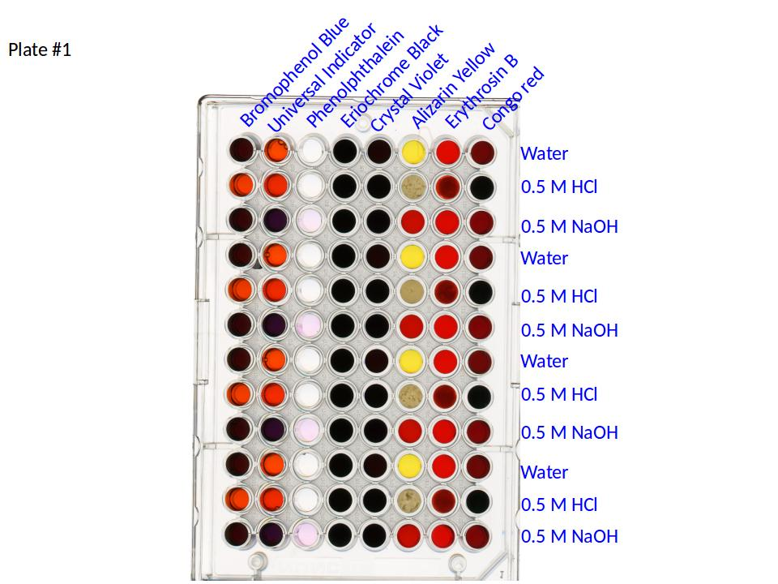

In this episode, we will provide two different challenges for you to attempt,
based on the skills you have acquired so far. One of the challenges will be
related to the shape of objects in images (*morphometrics*), while the other 
will be related to colors of objects in images (*colorimetrics*). We will not
provide solution code for either of the challenges, but your instructors should
be able to give you some gentle hints if you need them.

## Morphometrics: SEM nanoparticle connectedness

How connected are the nanoparticoles in the image?

## Colorimetrics: well plate 

Comparing plates 1 and 2, which sensor appears to be the most useful to 
distinguish 0.5 M HCl and 1 M HCl?   Measure the RGB values for each of the 4 
replicates of this sensor for each of the acid concentrations. 

