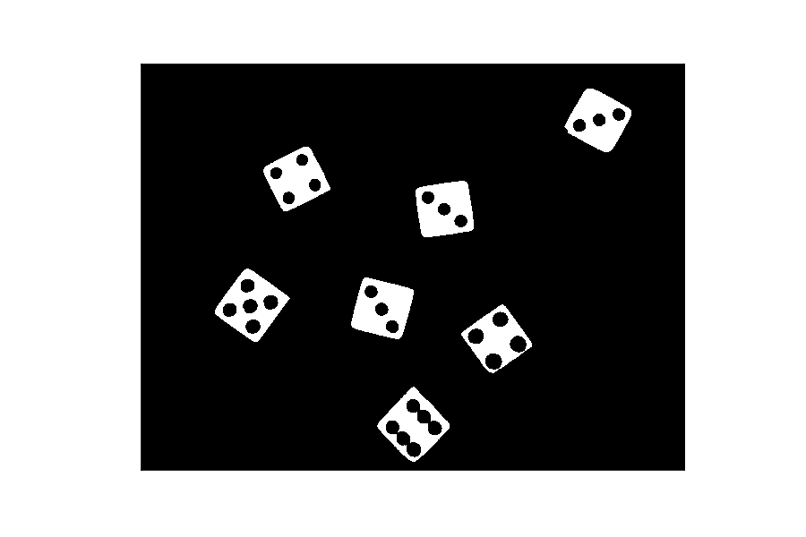
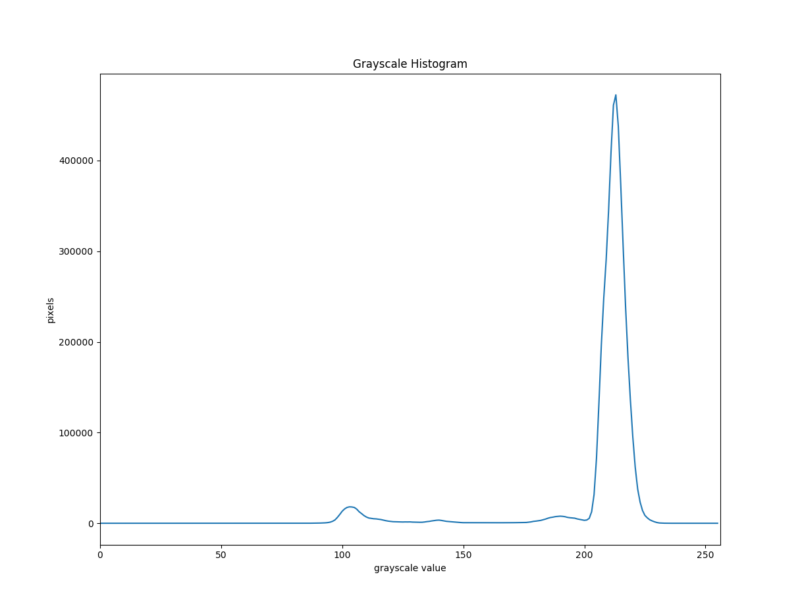
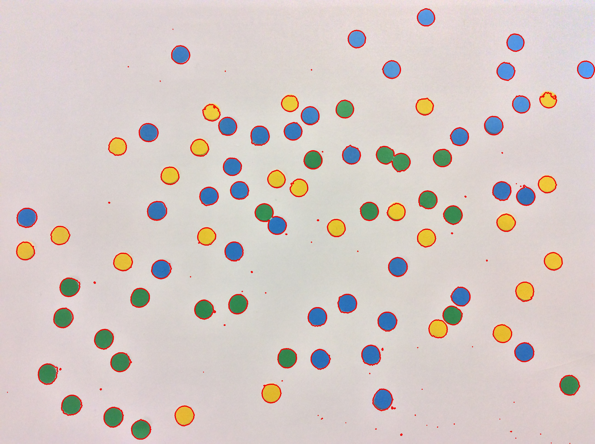
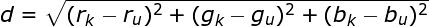

In this episode, we will learn how to use skimage functions to find the
*contours* of the objects in an image. A contour is a closed curve of points
or line segments, representing the boundaries of an object in an image. In 
other words, contours represent the shapes of objects found in an image. If 
internal detail is visible in an image, the object may produce several 
contours. Once
we find the contours of the objects in an image, we can do things like 
determine the number of objects in an image, classify the shapes of the 
objects, or measure the size of the objects. The input to the contour-finding 
process is a binary image, which we will produce by first applying thresholding 
and / or edge detection. In the binary image, the objects we wish to detect 
should be white, while the background of the image should be black.

## Edges versus contours

Based on the introduction above, it is not immediately apparent what the 
difference is between finding the edges in an image and finding the 
contours in an image. A superficial examination of the output of the two 
processes does not help matters. Consider the colored shapes image from the
[Thresholding]({{ page.root }}/07-thresholding) episode:

Now, consider the output of edge detection and contour detection for that 
image: 

There certainly does not seem to be much difference between the two resulting
images! But, underneath the surface, the difference between edges and contours 
is significant. When we perform edge detection, we find the points where the 
intensity of colors changes significantly, and turn those pixels on, while
turning the rest of the pixels off. The edge pixels are in an image, and there
is no particular requirement that the pixels representing an edge are all
contiguous.

Contours, on the other hand, are not necessarily part of an image, unless we 
choose to draw them (as we did for the contour image above). Rather, contours
are *abstract* collections of points and / or line segments corresponding to 
the shapes of the objects in the image. Thus, they can be manipulated by our 
programs; we can count the number of contours, use them to categorize the 
shapes in the object, use them to crop objects from an image, and more. So, 
let us see how to find contours in an image, and use the contours to determine 
the number of objects in the image.

## Using contours to count objects

Consider this image of several six-sided dice on a black background. 

Suppose we want to automatically count the number of dice in the image. We can
use contours to do that. We find contours with the `skimage.measure.find_contours` function,
and then easily examine the results to count the number of objects. Our 
strategy will be this:

1. Read the input image as grayscale, and blur it slightly.

2. Use simple fixed-level thresholding to convert the grayscale image to a 
binary image.

3. Use the `skimage.measure.find_contours` function to find contours corresponding to the 
outlines of the dice.

4. Print information on how many contours -- and thus how many objects -- were
found in the image.

5. For illustrative purposes, draw the contours in the original image so we can
visualize the results. 

Before we examine a Python program to implement this strategy, let us first 
look at the grayscale histogram for the dice image, so we can find a threshold
value that will effectively convert the image to binary. 

Since finding contours works on white objects set against a black background, 
in our thresholding we want to turn off the pixels in the background, while 
turning on the pixels associated with the face of the dice. Based on the 
histogram, a threshold value of 0.8 seems likely to do that.
As an alternative to plotting the historgram, you could of course use the
interactive thresholding tool you coded in the
[edge detection]({{ page.root }}/07-edge-detection) episode.

Here is a Python program to count the number of dice in the preceding image
via contours. We start with familiar steps: we save the command-line arguments for the
filename and threshold value, read the original image as grayscale,
blur it, and convert to a binary image with a comparison operator, with
the resulting image saved in the `binary` variable.

~~~
'''
 * Python program to use contours to count the objects in an image.
 *
 * usage: python Contours.py <filename> <threshold>
'''
import skimage
import skimage.filters
import skimage.measure
import sys

import matplotlib.pyplot as plt

# read command-line arguments
filename = sys.argv[1]
t = float(sys.argv[2])

# read original image
image = skimage.io.imread(fname=filename, as_gray=True)

# filter and threshold the image
blurred = skimage.filters.gaussian(image, sigma=2.5)
binary = blurred > t
~~~
{: .python}

 We do not display the binary
image in the program, but if we did, it would look like this, assuming a 
threshold value of 0.8:

Now, we find the contours, based on the binary image of the dice. The way we 
are using `skimage.measure.find_contours` function takes two parameters, and it returns
a list of contours:

~~~
# find contours
contours = skimage.measure.find_contours(
    binary, level=.5)
~~~
{: .python}

The first parameter to the function is the image to find contours in. 
Remember, this image should be binary, with the objects you wish to find 
contours for in white, against a black background.
As a second parameter, `level` we pass 0.5.
The `skimage.measure.find_contours` function interpolates pixel values linearly
in order to place contours more accurately.
Consider this simple example of a binary image:
<!-- TODO: do something in inkscape (grid, pixel coordinates and values) -->
~~~
0 0 0 0
0 1 1 0
0 0 0 0
~~~
{: .output}

Where would you draw the contour around ...

The `skimage.measure.find_contours` function returns a list of NumPy arrays.
Each array holds the points for one contour in the image. So, if we have executed our
strategy correctly, the number of contours -- the length of the `contours` list
-- will be the number of objects we have detected after thresholding the image.

After finding the contours of the image, we print information about them out to
the terminal, so that we can see the number of objects detected in the image. 
The code that does the printing looks like this:

~~~
print(f"Found {len(contours)} objects.")
for i, contour in enumerate(contours):
    print(f"\tSize of contour {i}: {len(c)}")
~~~
{: .python}

First, we print the number of objects found, which is the length of the 
`contours` list. This usage of the `print()` function uses a formatted string literals, or "f-string" in short.
In f-strings (notice that the string in the print function starts with `f"..."`) you can write variables and function calls between curly braces.
When the string is printed, expressions between curly braces will be evaluated.
You can read up more on formatted string literals [here](https://docs.python.org/3/reference/lexical_analysis.html#formatted-string-literals).

Then, we iterate through the contours list to show how many points are in each
contour. The `enumerate(contours)` function call goes through the list, as we 
normally do in a `for` loop, but we also associate an integer index , `i`, with each
element of the list. This lets us print out the number of the contour, starting
with zero, and then the size of each contour with the for loop. The output of 
this loop, assuming we used the dice image above and a threshold value of 0.8, is:

~~~
found 31 contours
    Size of contour  0: 1253
    Size of contour  1: 237
    Size of contour  2: 241
    Size of contour  3: 249
    Size of contour  4: 1259
    Size of contour  5: 231
    Size of contour  6: 227
    Size of contour  7: 237
    Size of contour  8: 1097
    Size of contour  9: 243
    Size of contour 10: 237
    Size of contour 11: 245
    Size of contour 12: 245
    Size of contour 13: 1417
    Size of contour 14: 1187
    Size of contour 15: 263
    Size of contour 16: 251
    Size of contour 17: 279
    Size of contour 18: 275
    Size of contour 19: 251
    Size of contour 20: 267
    Size of contour 21: 1341
    Size of contour 22: 297
    Size of contour 23: 275
    Size of contour 24: 249
    Size of contour 25: 303
    Size of contour 26: 319
    Size of contour 27: 317
    Size of contour 28: 1409
    Size of contour 29: 721
    Size of contour 30: 737
~~~
{: .output}

Finally, we draw the contour points on the original image, with the following code:

~~~
# draw contours over original image
fig, ax = plt.subplots()
ax.imshow(image, cmap=plt.cm.gray)

for n, contour in enumerate(contours):
    ax.plot(contour[:, 1], contour[:, 0], linewidth=2)

ax.axis('image')
ax.set_xticks([])
ax.set_yticks([])
plt.show()

~~~
{: .python}

The first line instantiates a `Figure` object (`fig`) and an `Axes` (`ax`) object, which is the subplot.
We add the image to the subplot with `ax.imshow(image, cmap=plt.cm.gray)` and use the `plt.cm.gray` colormap to translate from numerical values to gray values.
We then loop over the contours in the image like we have done it to print the length of the contours.
Instead of printing the length, we plot each contour individually with `ax.plot`.

Then, we pass in the list of contours to draw. The third parameter tells us
where to start when we draw the contours; -1 means to draw them all. If we 
specified 2 here, only the third contour would be drawn. The fourth parameter
is the color to use when drawing the contours. Finally, we specify the 
thickness of the contour points to draw. Here we are drawing the contours in 
red, with a thickness of 5, so they will be very visible on the image. 

After the contours are drawn on the image, we display the image in a window. 
Here are the seven contours detected by the program. 

> ## Show only dice contours (20 minutes)
>
> Look at the image that we have generated - it shows contours not only for the dice, but also for all dice pips.
> Modify the **Contours.py** program so that it only draws contours for the dice.
>
> *Hint: Look at the output the script generates on the terminal.*
>
> > ## Solution
> >
> > Here is the relevant portion of **Contours.py** that draws only dice contours:
> >
> > ~~~
> > for n, contour in enumerate(contours):
> >     if len(contour) > 1000:
> >         ax.plot(contour[:, 1], contour[:, 0], linewidth=2)
> > ~~~
> > {: .python}
> >
> > When looking at the output the original script produces, we can notice that contours differ in size.
> > One can even roughly divide contours into two groups by their size:
> > There are contours with about 200-350 points, and a second group with roughly 1100-1500 points.
> > The contours of pips are clearly smaller than the ones of dice.
> > With an if-clause we can choose to only print contours above a minimal length.
> > You should now get an image with only seven contours, like this:
> >
> > 
> >
> {: .solution}
{: .challenge}

<!-- TODO: could probably combine these two ex -->
> ## Counting dice and dice pips (20 minutes)
> 
> Now let us see how we can count the total number of pips showing on the faces of the dice in the preceding image.
> Modify the **Contours.py** script to print out the number of dice and pips.
> 
> *Hint: First, create a list of the indices of the outermost contours. Then,
> make a list of contour indices that have parents in the first list. The 
> length of the second list should be the pip count.*
> 
> > ## Solution
> > 
> > Here is a the relevant code fragment that lets you count dice and dice pips.
> > It should be added after calling `skimage.measure.find_contours()`.
> > 
> > ~~~
> > dice = []   # list of dice contours
> > pips = []   # list of pip contours
> > 
> > # find dice and dice pip contours
> > for i, contour in enumerate(contours):
> >     if len(contour) > 1000:
> >         dice.append(i)
> >     else:
> >         pips.append(i)
> >
> > print("Total number of dice:", len(dice))
> > print("Total die roll:", len(pips))
> > ~~~
> > {: .python}
> > 
> > When executed on the **dice.jpg** image, with a threshold value of 200, the
> > program produces this output:
> > 
> > ~~~
> > Total number of dice: 7
> > Total die roll: 24
> > ~~~
> > {: .output}
> > 
> > But wait! The total should be 28, should it not? What went wrong? The 
> > answer lies in the pip contours for the die showing 6.
> > The contours for both rows of pips are merged and only represented by a single contour each.
> > 
> > 
> > 
> > So six of our pips are only represented by two contours
> > That explains why our pip count is off by four. We might have been able to
> > prevent that problem when taking the image, when blurring the image, or
> > when making the binary image with thresholding. Care must be taken when 
> > working with image processing, especially in scientific applications, to
> > make sure that the results reported by the program are reliable.
> > Adapt the code above to use a sigma of 2.0, and invoke the script with a threshold of 0.8 to get accurate counts.
> {: .solution}
{: .challenge}

## Bounding boxes and cropping

Aside from counting the number of objects in an image, one of the things we can
do with contours is find their *bounding boxes*. A bounding box is the smallest
rectangle that completely contains a given contour. For example, for the dice 
image we used in the previous section, here are the bounding boxes:

As before the contours for the objects are drawn in red, while the bounding 
boxes for the contours are drawn in green. These rectangles were found with the
`cv2.boundingRect()` function call, which takes a contour as its parameter. You 
can see that the rectangles are oriented so that the rectangle sides are 
perfectly vertical or horizontal. So, if the objects in the image are rotated
significantly from that perfect orientation, the bounding boxes will not have 
the best possible fit. It is possible to find bounding boxes (or circles, or 
ellipses) with a better fit by using other skimage methods.

One application for bounding boxes is to use them to crop objects from an 
image. So that we can use the simple `cv2.boundingRect()` function to find our
bounding boxes, let us use another dice image; this one will have dice that are
more carefully aligned. 

Before we turn to seeing how to find the bounding boxes, and how to use them 
for cropping, here is what the bounding boxes look like for the new set of 
dice. The contours are not drawn on this image.

Our goal here is to use the bounding boxes to select only the dice faces from
the image. So, we want to do something akin to thresholding, but instead of 
producing a binary image, we wish to have full-color versions of the dice 
faces at the end of the process. Our strategy will be similar to the one we 
used to find the contours:

1. Read the input image, convert it to grayscale, and blur it slightly.
2. Use simple binary thresholding to convert the grayscale image to a binary
image.
3. Use `skimage.measure.find_contours` to find the contours corresponding to the outlines
of the faces of the dice.
4. Create a blank, black mask image the same size as the original.
5. For each contour found, do the following:
    - Use `cv2.boundingRect()` to find the bounding box of the contour
    - Draw a filled, white rectangle corresponding to the bounding box on the 
mask image
6. Use a bitwise and operation on the original image and the mask, producing 
the final image. 

Here is a Python program that implements this strategy. Everything up through 
finding the contours is the same as the previous program,
so we will not go through that part of the code again.

~~~
'''
 * Python program to use contours to crop the objects in an image.
 *
 * usage: python ContourCrop.py <filename> <threshold>
'''
import cv2, sys, numpy as np

# read command-line arguments
filename = sys.argv[1]
t = int(sys.argv[2])

# read original image
image = cv2.imread(filename = filename)

# create binary image
gray = cv2.cvtColor(src = image, code = cv2.COLOR_BGR2GRAY)

blur = cv2.GaussianBlur(src = gray, 
    ksize = (5, 5), 
    sigmaX = 0)

(t, binary) = cv2.threshold(src = blur, 
    thresh = t, 
    maxval = 255, 
    type = cv2.THRESH_BINARY)

# find contours
(_, contours, _) = cv2.findContours(image = binary, 
    mode = cv2.RETR_EXTERNAL, 
    method = cv2.CHAIN_APPROX_SIMPLE)
~~~
{: .python}

Once we have found the 
contours, we create a mask using the `np.zeros()` function, as we did in the 
[Drawing and Bitwise Operations]({{ page.root }}/04-drawing-bitwise/)
episode. 

~~~
# create all-black mask image
mask = np.zeros(shape = image.shape, dtype = "uint8")
~~~
{: .python}

Then, we use a `for` loop to iterate through the list of contours,
finding the bounding box and drawing the box on the mask image:

~~~
for c in contours:
    (x, y, w, h) = cv2.boundingRect(c)

    cv2.rectangle(img = mask, 
        pt1 = (x, y), 
        pt2 = (x + w, y + h), 
        color = (255, 255, 255), 
        thickness = -1)
~~~
{: .python}

Remember that contours are stored in a list, so when we use the `for` loop to
iterate through the list, each time through the loop works with an individual 
contour, stored in the variable `c`. 

Inside the loop, we pass the current contour `c` to the `cv2.boundingRect()` 
function, and we receive a tuple of four values as in return: the x and y 
coordinates of the upper-left corner of the bounding box, and the width and 
height of the box. We store these in the `(x, y, w, h)` tuple. 

Then, we draw a solid white rectangle on the mask image, corresponding to the 
bounding box, with the `cv2.rectangle()` function call. It has been a while
since we have used this function, so let us review the parameters we pass in.
First, `mask` is the image we will draw the rectangles on. Next is a tuple with
the coordinates of the upper-left corner of the rectangle, `(x, y)`. Next, we
provide a tuple with the coordinates of the lower-right corner of the 
rectangle, `(x + w, y + h)`; note how we add the width and height of the 
rectangle to the previous coordinates. Then, we pass in the color for the 
rectangle, white in this case. Finally, we pass in `-1`, which tells the function
to draw a filled rectangle. 

The program does not display the finished mask image, but if we were to examine
it, it would look like this (assuming the second dice image and a threshold 
value of 200):

After the `for` loop, we use the `cv2.bitwise_and()` function to apply our mask 
to the original image. 

~~~
# apply mask to the original image
image = cv2.bitwise_and(src1 = image, src2 = mask)
~~~
{: .python}

The effect is to select only the dice faces, while 
making everything else in the image black:

> ## Extracting subimages (25 minutes)
> 
> Now, what if we wished to extract the eight dice faces from the preceding 
> image into eight separate images? That is your challenge here. Navigate to the
> **Desktop/workshops/image-processing/09-contours** directory, and edit the 
> **ExtractSubimages.py** program. The program is much like the one we just 
> used. There are two places where you should write code in the `for` loop to 
> create eight different subimages, each containing one of the dice faces from
> the **dice-grid.jpg** image. Once you have made your edits, run the program
> like this:
> 
> ~~~
> python ExtractSubimages.py dice-grid.jpg 200
> ~~~
> {: .bash}
> 
> > ## Solution
> > 
> > Here is the completed version of the program.
> > 
> > ~~~
> > '''
> >  * Python program to use contours to extract the objects in an image.
> > '''
> > import cv2, sys
> > 
> > # read command-line arguments
> > filename = sys.argv[1]
> > t = int(sys.argv[2])
> > 
> > # read original image
> > image = cv2.imread(filename = filename)
> > 
> > # create binary image
> > gray = cv2.cvtColor(src = image, code = cv2.COLOR_BGR2GRAY)
> > 
> > blur = cv2.GaussianBlur(src = gray, 
> >     ksize = (5, 5), 
> >     sigmaX = 0)
> > 
> > (t, binary) = cv2.threshold(src = blur, 
> >     thresh = t, 
> >     maxval = 255, 
> >     type = cv2.THRESH_BINARY)
> > 
> > # find contours
> > (_, contours, _) = cv2.findContours(image = binary, 
> >     mode = cv2.RETR_EXTERNAL, 
> >     method = cv2.CHAIN_APPROX_SIMPLE)
> > 
> > # use the contours to extract each image, into a new sub-image
> > for (i, c) in enumerate(contours):
> >     (x, y, w, h) = cv2.boundingRect(c)
> >     # WRITE YOUR CODE HERE!
> >     # use slicing and the (x, y, w, h) values of the bounding
> >     # box to create a subimage based on this contour
> >     subImg = image[y : y + h, x : x + w, :]
> >     
> >     # WRITE YOUR CODE HERE!
> >     # save the subimage as sub-x.jpg, where x is the number
> >     # of this contour. HINT: try "sub-{0}".format(i) to 
> >     # create the filename
> >     cv2.imwrite(filename = "sub-{}.jpg".format(i), img = subImg)
> > ~~~
> > {: .python}
> > 
> > The program produces eight subimages, shown here. Note that there is no
> > particular order to the contours found by the `skimage.measure.find_contours` function!
> > 
> > 
> > 
> {: .solution}
{: .challenge}

## Getting more information from contours: moments

We can get more information from contours, beyond shape, hierarchy, and 
bounding boxes. Once we have the contours, we can use them to get the *moments*
for the corresponding objects in the image. The moments of an object are 
weighted averages of pixel intensities, or functions upon those averages, and
the precise details of the mathematics involved is fairly complicated. Luckily,
we can easily use moments to determine things like the center of an object, the
area inside a contour, and more, without worrying about the mathematics behind
the scenes.

Consider this image of colored paper-punch circles on a white background, and 
suppose we want to write a program to count the number of yellow dots in the 
image. 

The grayscale histogram for this image shows that there is a large spike, 
representing the white background, just above 200.

Our strategy for counting the number of yellow dots is as follows:

1. Read the image, make a grayscale version, blur it, and apply thresholding
to create a binary image.
2. Use the binary image to find the contours in the image. 
3. Determine the average size of the contours. This will be used to ignore
small contours that represent noise rather than dots.
4. Iterate through the contours, and for all contours that are big enough:
    * Using the moments of the contour, find the contour centroid.
    * Determine the average color around the contour centroid.
    * Find the Euclidean distance between the average color and three reference
colors: yellow, blue, and green. 
    * If the average color is closest the the yellow reference color, add one 
to the count of yellow dots
5. Output the number of yellow dots.

Our need for step three in the strategy is easy to see, if we simply look at 
all the contours found by the `skimage.measure.find_contours` function. The contours are
drawn in red in this image.

Notice that quite a few contours have been found that do not correspond to any
of the dots in the image. These are associated either with imperfections in the
white background or with noise in the image, and they are much smaller than the
contours associated with the dots. So, we need to ignore these "noisy" contours
when we try to count colored dots. If we determine the average size of the 
contours, and pay attention only to those that are larger than, say, one-half
of the average, we will skip the contours we are not interested in. 

Here is a Python program implementing our strategy to count the yellow dots in
the image. At the top of the program we import the libraries we will need. This is the
first time we have included the `math` library, which we will require for the
`sqrt()` function.

~~~
'''
 * Python program to count the number of yellow dots in an image.
 *
 * usage: python CountYellow.py <filename> <kernel-size> <threshold>
'''
import cv2, sys, math, numpy as np
~~~
{: .python}

After the imports, we define a function to compute the Euclidean distance 
between two RGB colors. 

~~~
'''
 * Compute distance between two colors, as a 3D Euclidean distance.
'''
def colorDistance(kCol, uCol):
    # compute sum of square of differences between each channel 
    d = (kCol[0] - uCol[0])**2 + (kCol[1] - uCol[1])**2 + \
        (kCol[2] - uCol[2])**2
        
    # square root of sum is the Euclidean distance between the
    # two colors
    return math.sqrt(d)
~~~
{: .python}

We will use this function to tell whether the average
color for a dot is closest to yellow, blue, or green. The function simply 
computes the geometric distance between two three-dimensional points. `kCol`
is the known color parameter and `uCol` is the unknown color parameter, so the
distance between these two colors is given by:

We choose to write this code as a function because we will need to do the 
difference calculation three times for every contour. So, rather than copy and
paste the code three times, we encapsulate it in a function. That is a good 
rule of thumb to follow: If you need top copy and paste code to use it more 
than once, put the code in a function.

In the main program, we save the command-line arguments, read the image, and 
then create a binary version through the now-familiar 
grayscale-blur-threshold procedure. 

~~~
'''
 * Main program starts here.
'''

# read and save command-line arguments
filename = sys.argv[1]
k = int(sys.argv[2])
t = int(sys.argv[3])

# read image, convert to grayscale, blur, and threshold to
# make binary image
image = cv2.imread(filename = filename)

gray = cv2.cvtColor(src = image, code = cv2.COLOR_BGR2GRAY)

blur = cv2.GaussianBlur(src = gray, 
    ksize = (k, k), 
    sigmaX = 0)

(t, binary) = cv2.threshold(src = blur, 
    thresh = t, 
    maxval = 255, 
    type = cv2.THRESH_BINARY_INV)
~~~~
{: .python}

Then, we find the contours in the image.
Note that we are not saving the hierarchy information here, as we will not 
require it to count the yellow dots. 

~~~
# find contours
(_, contours, _) = cv2.findContours(image = binary, 
    mode = cv2.RETR_EXTERNAL, 
    method = cv2.CHAIN_APPROX_SIMPLE)
~~~
{: .python}

Our next block of code uses a `for` loop to determine the average size of the
contours in the image. Since we are interested in the mean *size* of the 
contours, not the mean of the *values* in `contours`, we cannot simply use the
NumPy `mean()` function. 

~~~
# determine average length of contours
avg = 0
for c in contours:
    avg += len(c)
    
avg /= len(contours)
~~~
{: .python}

The code creates an *accumulator variable* named `avg`, with an initial value 
of zero. Then, in the `for` loop, we add the length of each contour to the 
`avg` accumulator. Finally, we divide the sum of the lengths by the number of
contours, yielding the average contour length. 

Next, for convenience, we create tuples for each of our reference colors, 
`YELLOW`, `GREEN`, and `BLUE`. These will be passed in as the first parameter 
to the `colorDistance()` function when we are trying to classify the color for
a contour. We use all caps to indicate that these are intended to be constants,
i.e., that we should not change the values held in these variables.

~~~
# create reference colors
YELLOW = (0, 255, 255)
GREEN = (0, 255, 0)
BLUE = (255, 0, 0)
~~~
{: .python}

Before the next `for` loop that does the counting, we define another 
accumulator, `yellowCount`, to hold the running total of yellow dots. 

~~~
# number of yellow dots
yellowCount = 0
~~~
{: .python}

The main `for` loop again iterates through the contours, and we only do the 
counting calculations for contours that are big enough to be associated with 
colored dots. We do this with the `if len(c) > avg / 2:` control structure. 

~~~
# for each contour...
for c in contours:
    
    # ... only work with contours associated with actual dots
    if len(c) > avg / 2:
~~~
{: .python}

Inside the `if`, the first step is to use the moments of the current contour to
find its centroid, which is accomplished by this code:

~~~
        # find centroid of shape
        M = cv2.moments(array = c)
        cx = int(M['m10'] / M['m00'])
        cy = int(M['m01'] / M['m00'])
~~~
{: .python}

The `cv2.moments()` function call computes the moments for a contour. The return
value of the function call is a Python dictionary that contains the various 
moments for the contour. The *centroid*, or center point, for a contour can be
found by dividing specific moments, as shown in the code. We truncate the 
results of the divisions to integers, and save the coordinates of the center 
point in the `cx` and `cy` variables. 

Now, we use array slicing to get the blue, green, and red color channels in a 
nine pixel kernel centered around the centroid of the image, with this code:

~~~
        # find average color for 9 pixel kernel around centroid
        b = img[cy - 4 : cy + 5, cx - 4 : cx + 5, 0]
        g = img[cy - 4 : cy + 5, cx - 4 : cx + 5, 1]
        r = img[cy - 4 : cy + 5, cx - 4 : cx + 5, 2]
~~~
{: .python}

Remember that the first dimension in a NumPy array holding an skimage image
represents the y axis, the second dimension represents the x axis, and the 
third dimension represents the color channel, in BGR order. We get a nine pixel
kernel around the centroid by starting each slice at `cy - 4` or `cx - 4`, and
providing the index one beyond the ending coordinate with `cy + 5` or `cx + 5`.
We save the blue, green, and red color layers in the variables `b`, `g`, and 
`r`, respectively. 

After that, we determine the average blue, green, and red 
color values using the `np.mean()` function, saving the results in `bAvg`, 
`gAvg`, and `rAvg`. 

~~~
        bAvg = np.mean(b)
        gAvg = np.mean(g)
        rAvg = np.mean(r)
~~~
{: .python}

Now, we find the difference between the average color and the three reference
colors, and save the three results in a list, with this code:

~~~
        # find distances to known reference colors
        dist = []
        dist.append(colorDistance(YELLOW, (bAvg, gAvg, rAvg)))
        dist.append(colorDistance(BLUE, (bAvg, gAvg, rAvg)))
        dist.append(colorDistance(GREEN, (bAvg, gAvg, rAvg)))
~~~
{: .python}

After this block is complete, the `dist` list contains the distance between the
average color and the yellow, blue, and green reference colors, in that order. 
So, if the smallest distance in the list is in position zero of the list, we 
will classify this dot as being yellow. That is what is happening in the final
piece of code in the `if` statement within the `for` loop:

~~~
        # which one is closest?
        minDist = min(dist)
        # if it was yellow, count the shape
        if dist.index(minDist) == 0:
            yellowCount += 1
~~~
{: .python}

After the main loop is complete, the program reports the number of yellow dots
it counted. 

~~~
print("Yellow dots:", yellowCount)
~~~
{: .python}

If executed on the **dots.jpg** image, with blur kernel size three
and threshold value 200, the program reports the correct number of yellow dots
in the image:

~~~
Yellow dots: 24
~~~
{: .output}

## Measuring size based on a reference object

We can also use contours to automatically determine the size of objects in the
image, based on a *reference object* we intentionally place into the image. 
For example, consider this image of a leaf:

This image was created with a flatbed scanner. The background was a plain white
sheet of paper with a one inch black square situated in the upper left. The 
leaf was placed in front of the paper, the whole collection was placed on the 
scanner, and the image was captured. Since we know the size of the reference 
square, we can write a program to find the leaf and automatically determine
its size. Our plan will be:

1. Load the image as grayscale, blur it, threshold it, and find the contours
2. Find the contour corresponding to the reference square, and measure the 
number of pixels in the width and height of the square's sides
3. Find the largest contour (which should be the leaf), and measure the 
number of pixels in its bounding rectangle sizes
4. Calculate the width and height of the leaf

Here is a Python program to perform these tasks. Everything up through finding 
the contours should be familiar by now.

~~~
'''
 * Python script to measure the size of an object, based on
 * the size of a reference object in the image.
 *
 * usage: python LeafSize.py <filename> <threshold>
'''
import cv2, sys

# read command-line arguments
filename = sys.argv[1]
t = int(sys.argv[2])

# read image as grayscale
image = cv2.imread(filename = filename, flags = cv2.IMREAD_GRAYSCALE)

# blur and threshold
blur = cv2.GaussianBlur(src = image,
    ksize = (5, 5),
    sigmaX = 0)

(t, binary) = cv2.threshold(src = blur,
    thresh = t,
    maxval = 255,
    type = cv2.THRESH_BINARY_INV)

# find contours
(_, contours, _) = cv2.findContours(image = binary, 
    mode = cv2.RETR_EXTERNAL,
    method = cv2.CHAIN_APPROX_SIMPLE)
~~~
{: .python}

In our iteration through the contours, we will ignore very small contours, which would
likely correspond to noise or irregularities in the paper background. To prepare for
that, we next calculate the average contour size. We also create variables to keep
track of the location of the largest contour, so we can measure the leaf at the end
of the program.

~~~
# determine average length of contours
avg = 0
for c in contours:
    avg += len(c)
    
avg /= len(contours)

# save index of largest contour
largestIdx = -1
largestSize = -1
~~~
{: .python}

Now we iterate through the contours. In our loop we do two things: find
the largest contour, and find the contour associated with the reference
square. The first `if` keeps track of the largest contour seen to date;
this will be the largest of all once the loop is finished.

~~~
# find size of the reference square
for i, c in enumerate(contours):
    # keep track of largest one
    if len(c) > largestSize:
        largestSize = len(c)
        largestIdx = i
~~~
{: .python}

The next if statement makes sure we only look at contours that are large enough.
Here, we process contours only if they are at least one tenth the size of the
average.

~~~
    # now only look at the larger contours
    if len(c) > avg / 10:
~~~
{: .python}

For the contours that are big enough, we compute a *polygon approximation* of
each contour. This simplifies contours into other shapes that are close to the
contour. Our goal is to find these polygon approximations, and look for the one
that has four vertices, for that will correspond to the reference square. This 
is done with the following code:

~~~
        # get approximating polygon
        epsilon = 0.1 * cv2.arcLength(curve = c, closed = True)

        approx = cv2.approxPolyDP(curve = c,
            epsilon = epsilon,
            closed = True)
~~~
{: .python}

The `cv2.approxPolyDP()` function finds an approximating polygon for the 
contour passed in as the first parameter. The `epsilon` parameter controls 
how accurate the fit must be; it is the maximum distance allowed between the 
contour and the approximation. The third parameter indicates that we want a 
closed polygon as our approximation.

We arrive at our value of epsilon by calling the `cv2.arcLength()` function,
which computes the perimeter of a contour. We use 10% of the contour's 
perimeter as our epsilon value here. 

Next, the program looks at the number of vertices in the approximating polygon.

~~~
        # the one with four vertices should be the reference
        if len(approx) == 4:
            # save bounding rectangle info
            x, y, w, h = cv2.boundingRect(c)
~~~
{: .python}

If it is four, we can be confident that the contour is the square, instead of 
the length. Once we have the contour corresponding to the square, we save the
information pertinent to its bounding rectangle. 

After the loop concludes, we use the bounding rectangle information to 
calculate scale variables, that represent the centimeters per pixel ratio in 
both the horizontal and vertical dimensions. 

~~~
# calculate cm per pixels scale
scaleX = 2.54 / w
scaleY = 2.54 / h
~~~
{: .python}

Lastly, we get the bounding rectangle for the leaf, which is assumed to be the 
largest contour in the image. 

~~~
# get bounding box for the largest contour
x, y, w, h = cv2.boundingRect(contours[largestIdx])
~~~
{: .python}

Then, we are able to calculate the width and
height of the leaf. 

~~~

# calculate height and width of the leaf
height = h * scaleY
width = w * scaleX

# print results
print('%0.2f cm wide x %0.2f cm tall' % (width, height))
~~~
{: .python}

When we run the program on the leaf image, with a threshold value of 200, we
receive this output:

~~~
3.63 cm wide x 7.49 cm tall
~~~
{: .output}
