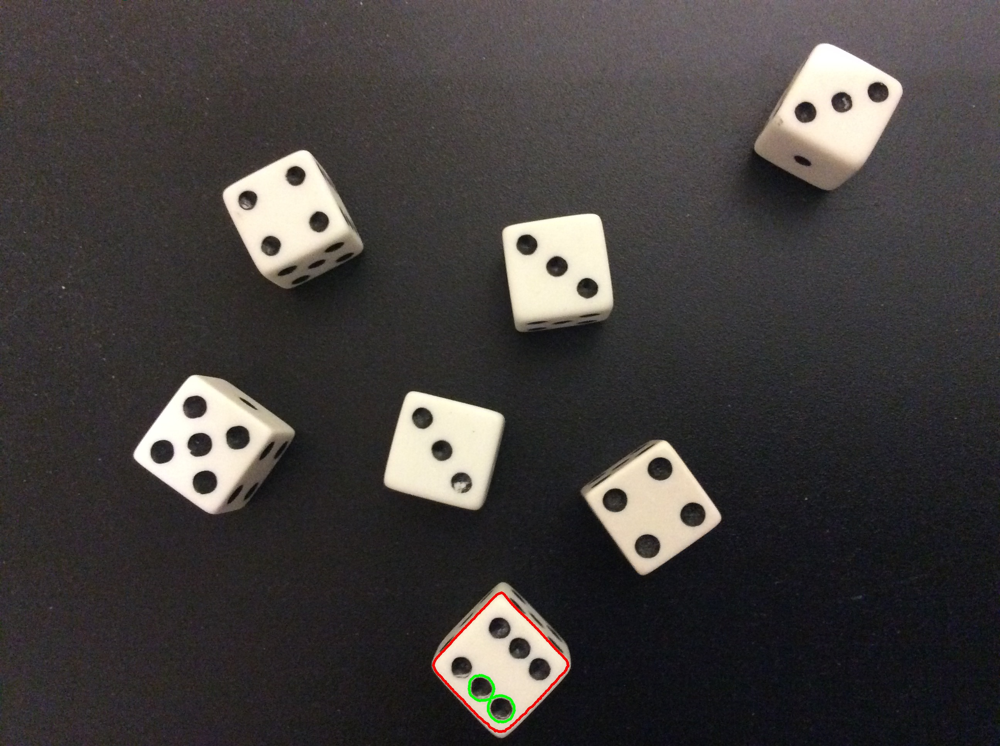

In this episode, we will learn how to use OpenCV functions to find the 
*contours* of the objects in an image. A contour is a closed curve of points
or line segments, representing the boundaries of an object in an image. In 
other words, contours represent the shapes of objects found in an image. If 
internal detail is visible in an image, the object may produce several 
associated contours, which are returned in a hierarchical data structure. Once 
we find the contours of the objects in an image, we can do things like 
determine the number of objects in an image, classify the shapes of the 
objects, or measure the size of the objects. The input to the contour-finding 
process is a binary image, which we will produce by first applying thresholding 
and / or edge detection. In the binary image, the objects we wish to detect 
should be white, while the background of the image should be black.

## Edges versus contours

Based on the introduction above, it is not immediately apparent what the 
difference is between finding the edges in an image and finding the 
contours in an image. A superficial examination of the output of the two 
processes does not help matters. Consider the colored shapes image from the
[Thresholding]({{ page.root }}/07-thresholding) episode:

Now, consider the output of edge detection and contour detection for that 
image: 

There certainly does not seem to be much difference between the two resulting
images! But, underneath the surface, the difference between edges and contours 
is significant. When we perform edge detection, we find the points where the 
intensity of colors changes significantly, and turn those pixels on, while
turning the rest of the pixels off. The edge pixels are in an image, and there
is no particular requirement that the pixels representing an edge are all
contiguous.

Contours, on the other hand, are not necessarily part of an image, unless we 
choose to draw them (as we did for the contour image above). Rather, contours
are *abstract* collections of points and / or line segments corresponding to 
the shapes of the objects in the image. Thus, they can be manipulated by our 
programs; we can count the number of contours, use them to categorize the 
shapes in the object, use them to crop objects from an image, and more. So, 
let us see how to find contours in an image, and use the contours to determine 
the number of objects in the image.

## Using contours to count objects

Consider this image of several six-sided dice on a black background. 

Suppose we want to automatically count the number of dice in the image. We can
use contours to do that. We find contours with the `cv2.findContours()` function,
and then easily examine the results to count the number of objects. Our 
strategy will be this:

1. Read the input image, convert it to grayscale, and blur it slightly.

2. Use simple fixed-level thresholding to convert the grayscale image to a 
binary image.

3. Use the `cv2.findContours()` function to find contours corresponding to the 
outlines of the dice.

4. Print information on how many contours -- and thus how many objects -- were
found in the image.

5. For illustrative purposes, draw the contours in the original image so we can
visualize the results. 

Before we examine a Python program to implement this strategy, let us first 
look at the grayscale histogram for the dice image, so we can find a threshold
value that will effectively convert the image to binary. 

Since finding contours works on white objects set against a black background, 
in our thresholding we want to turn off the pixels in the background, while 
turning on the pixels associated with the face of the dice. Based on the 
histogram, a threshold value of 200 seems likely to do that. 

Here is a Python program to count the number of dice in the preceding image
via contours. 

~~~
'''
 * Python program to use contours to count the objects in an image.
 *
 * usage: python Contours.py <filename> <threshold>
'''
import cv2, sys

# read command-line arguments
filename = sys.argv[1]
t = int(sys.argv[2])

# read original image
image = cv2.imread(filename = filename)

# create binary image
gray = cv2.cvtColor(src = image, code = cv2.COLOR_BGR2GRAY)
blur = cv2.GaussianBlur(src = gray, 
    ksize = (5, 5), 
    sigmaX = 0)
(t, binary) = cv2.threshold(src = blur,
    thresh = t, 
    maxval = 255, 
    type = cv2.THRESH_BINARY)

# find contours
(_, contours, _) = cv2.findContours(image = binary, 
    mode = cv2.RETR_EXTERNAL,
    method = cv2.CHAIN_APPROX_SIMPLE)

# print table of contours and sizes
print("Found %d objects." % len(contours))
for (i, c) in enumerate(contours):
    print("\tSize of contour %d: %d" % (i, len(c)))

# draw contours over original image
cv2.drawContours(image = image, 
    contours = contours, 
    contourIdx = -1, 
    color = (0, 0, 255), 
    thickness = 5)

# display original image with contours
cv2.namedWindow(winname = "output", flags = cv2.WINDOW_NORMAL)
cv2.imshow(winname = "output", mat = image)
cv2.waitKey(delay = 0)
~~~
{: .python}

We start with familiar steps: we save the command-line arguments for the 
filename and threshold value, read the original image, convert it to 
grayscale, blur it, and convert to a binary image via `cv2.threshsold()`, with
the resulting image save in the `binary` variable. We do not display the binary
image in the program, but if we did, it would look like this, assuming a 
threshold value of 200:

Now, we find the contours, based on the binary image of the dice. The way we 
are using `cv2.findContours()` function takes three parameters, and it returns 
three values:

~~~
(_, contours, _) = cv2.findContours(image = binary, 
    mode = cv2.RETR_EXTERNAL,
    method = cv2.CHAIN_APPROX_SIMPLE)
~~~
{: .python}

The first parameter to the function is the image to find contours in. 
Remember, this image should be binary, with the objects you wish to find 
contours for in white, against a black background. Second, we pass in a 
constant indicating what kind of contours we are interested in. Since we are
interested in counting the objects in this image, we only care about the 
contours around the outermost edges of the objects, and so we pass in the 
`cv2.RETR_EXTERNAL` parameter. If we wished to have more information -- say, 
contours associated with the pips on the faces of the dice -- then we could use
another parameter, such as `cv2.RETR_TREE` or `cv2.RETR_CCOMP`. See the OpenCV 
documentation [here](http://docs.opencv.org/trunk/d3/dc0/group__imgproc__shape.html#ga819779b9857cc2f8601e6526a3a5bc71)
for more information. The last parameter tells the function if it 
should simplify the contours or not. We pass in `cv2.CHAIN_APPROX_SIMPLE`, 
which tells the function to simplify by using line segments when it can, rather
that including all the points on what would be a straight edge. Using this
parameter saves memory and computation time in our program. 

The `cv2.findContours()` function returns three values, as a tuple; in this case,
we are choosing to ignore the first and third return value. The first value
is an intermediate image that is produced during the contour-finding process. 
We are not interested in that image in this application, so we effectively
discard that image by placing the underscore (`_`) in the place of the first 
return value. The second return value is a list of NumPy arrays. Each array 
holds the points for one contour in the image. So, if we have executed our 
strategy correctly, the number of contours -- the length of the `contours` list
-- will be the number of objects in the image. The final return value is a 
NumPy array that contains hierarchy information about the contours. This is not
useful to us in our object-counting program, so we also choose to discard that
return value with the `_`. 

After finding the contours of the image, we print information about them out to
the terminal, so that we can see the number of objects detected in the image. 
The code that does the printing looks like this:

~~~
print("Found %d objects." % len(contours))
for (i, c) in enumerate(contours):
    print("\tSize of contour %d: %d" % (i, len(c)))
~~~
{: .python}

First, we print the number of objects found, which is the length of the 
`contours` list. This usage of the `print()` function uses a 
*format specifier*, `%d`. A format specifier is a placeholder in a string, in
this case standing in for an integer. After the string, we place the value(s) 
to substitute for the placeholder(s), after the `%` character. You can find
more information regarding formatting strings 
[here](https://docs.python.org/3.4/library/string.html).

Then, we iterate through the contours list to show how many points are in each
contour. The `enumerate(contours)` function call goes through the list, as we 
normally do in a `for` loop, but we also associate an integer, `i`, with each
element of the list. This lets us print out the number of the contour, starting
with zero, and then the size of each contour with the for loop. The output of 
this loop, assuming we used the dice image above and a threshold value of 200, 
is:

~~~
Found 7 objects.
	Size of contour 0: 423
	Size of contour 1: 476
	Size of contour 2: 497
	Size of contour 3: 456
	Size of contour 4: 327
	Size of contour 5: 622
	Size of contour 6: 570
~~~
{: .output}

Finally, we draw the contour points on the original image, with the 

~~~
cv2.drawContours(image = image, 
    contours = contours, 
    contourIdx = -1, 
    color = (0, 0, 255), 
    thickness = 5)
~~~
{: .python}

function call. The first parameter is the image we are going to draw the contours
on. Then, we pass in the list of contours to draw. The third parameter tells us
where to start when we draw the contours; -1 means to draw them all. If we 
specified 2 here, only the third contour would be drawn. The fourth parameter
is the color to use when drawing the contours. Finally, we specify the 
thickness of the contour points to draw. Here we are drawing the contours in 
red, with a thickness of 5, so they will be very visible on the image. 

After the contours are drawn on the image, we display the image in a window. 
Here are the seven contours detected by the program. 

## Understanding contour hierarchies

Now let us turn our attention to one of the two return values from 
`cv2.findContours()` that we ignored in the previous section, namely, the 
*hierarchies*. Suppose we change the `cv2.RETR_EXTERNAL` parameter in our 
contours function call to `cv2.RETR_TREE` instead, so that we will receive all of
the contours in the image, instead of just the outermost contours for each 
image. If we draw the resulting contours and color things appropriately, we
will see something like this:

When we use the `cv2.RETR_TREE` parameter, the contours are arranged in a 
hierarchy, with the outermost contours for each object at the top. Moving down
the hierarchy, each new level of contours represents the next innermost contour
for each object. In the image above, the contours in the image are colored to 
represent the hierarchical structure of the returned contours data. The 
outermost contours are red, and they are at the top of the hierarchy. The next 
innermost contours -- the dice pips, in this case -- are green. The innermost 
contours, representing some lost paint in one of the pips in the central die, 
are blue. 

We can get that information about the contour hierarchies via the third return
value from the `cv2.findContours()` function call. Suppose we call the function 
like this:

~~~
(_, contours, hierarchy) = cv2.findContours(image = binary, 
    mode = cv2.RETR_TREE,
    method = cv2.CHAIN_APPROX_SIMPLE)
~~~
{: .python}

The third return value, saved in the `hierarchy` variable in this code, is a 
three-dimensional NumPy array, with one row, 36 columns, and a "depth" of 4.
The 36 columns correspond to the contours found by the function; note that there
are 36 contours now, rather than seven. This is because the `cv2.RETR_TREE`
parameter causes the function to find the internal contours as well as the 
outermost contours for each object. Column zero corresponds to the first 
contour, column one the second, and so on.

Each of the columns has a four-element array of integers, representing indices 
of other contours, according to this scheme:

[*next*, *previous*, *first child*, *parent*]

The *next* index refers to the next contour in this contour's hierarchy level,
while the *previous* index refers to the previous contour in this contour's 
hierarchy level. The *first child* index refers to the first contour that is 
contained inside this contour. The *parent* index refers to the contour 
containing this contour. In all cases, an value of -1 indicates that there is 
no *next*, *previous*, *first child*, or *parent* contour, as appropriate. 
For a more concrete example, here are the `hierarchy` values for the dice 
image. The values are in square brackets, and the indices of the contours 
precede each entry. 

~~~
0:	[ 6 -1  1 -1]	18:	[19 -1 -1 17]
1:	[ 2 -1 -1  0]	19:	[20 18 -1 17]
2:	[ 3  1 -1  0]	20:	[21 19 -1 17]
3:	[ 4  2 -1  0]	21:	[22 20 -1 17]
4:	[ 5  3 -1  0]	22:	[-1 21 -1 17]
5:	[-1  4 -1  0]	23:	[27 17 24 -1]
6:	[11  0  7 -1]	24:	[25 -1 -1 23]
7:	[ 8 -1 -1  6]	25:	[26 24 -1 23]
8:	[ 9  7 -1  6]	26:	[-1 25 -1 23]
9:	[10  8 -1  6]	27:	[32 23 28 -1]
10:	[-1  9 -1  6]	28:	[29 -1 -1 27]
11:	[17  6 12 -1]	29:	[30 28 -1 27]
12:	[15 -1 13 11]	30:	[31 29 -1 27]
13:	[14 -1 -1 12]	31:	[-1 30 -1 27]
14:	[-1 13 -1 12]	32:	[-1 27 33 -1]
15:	[16 12 -1 11]	33:	[34 -1 -1 32]
16:	[-1 15 -1 11]	34:	[35 33 -1 32]
17:	[23 11 18 -1]	35:	[-1 34 -1 32]
~~~
{: .output}

The entry for the first contour is [6, -1, 1, -1]. This represents the first of
the outermost contours; note that there is no particular order for the 
contours, e.g., they are not stored left to right by default. The entry tells 
us that the next dice outline is the contour with index six, that there is no
previous contour in the list, that the first contour inside this one has index
one, and that there is no parent for this contour (no contour containing this
one). We can visualize the information in the `hierarchy` array as seven trees,
one for each of the dice in the images.

The seven outermost contours all those that have no parent, i.e., those with
an value of -1 in the fourth field of their `hierarchy` entry. Each of the 
child nodes beneath one of the "roots" represents a contour inside the 
outermost contour. Note how contours 13 and 14 are beneath contour 12 in the
diagram. Those two contours represent the blue spots in the contour hierarchy
image above.

Once we understand how contours are arranged into a hierarchy, we can perform
more sophisticated tasks, such as counting the number of contours within a 
shape in addition to the number of objects in an image.

> ## Counting dice pips
> 
> Now let us see how we can count the total number of pips showing on the faces
> of the dice in the preceding image. Navigate to the 
> **Desktop/workshops/image-processing/09-contours** directory, and edit the 
> **Gladys.py** program. You will see that the program is very much like the 
> one we used to count the number of dice, except that it finds contours with
> the `cv2.RETR_TREE` parameter instead of `cv2.RETR_EXTERNAL`. Edit the 
> program, following the comments in the code, to print out the total dice
> roll in the **dice.jpg** image. 
> 
> *Hint: First, create a list of the indices of the outermost contours. Then,
> make a list of contour indices that have parents in the first list. The 
> length of the second list should be the pip count.*
> 
> > ## Solution
> > 
> > Here is a the finished version of **Gladys.py**.
> > 
> > ~~~
> > '''
> >  * Python program to use contours to count the pips on the dice faces.
> >  *
> >  * usage: python Gladys.py <filename> <threshold>
> > '''
> > import cv2, sys
> > 
> > # read command-line arguments
> > filename = sys.argv[1]
> > t = int(sys.argv[2])
> > 
> > # read original image
> > image = cv2.imread(filename = filename)
> > 
> > # create binary image
> > gray = cv2.cvtColor(src = image, code = cv2.COLOR_BGR2GRAY)
> > 
> > blur = cv2.GaussianBlur(src = gray, 
> >     ksize = (5, 5), 
> >     sigmaX = 0)
> > 
> > (t, binary) = cv2.threshold(src = blur, 
> >     thresh = t, 
> >     maxval = 255, 
> >     type = cv2.THRESH_BINARY)
> > 
> > # find contours
> > (_, contours, hierarchy) = cv2.findContours(image = binary, 
> >     mode = cv2.RETR_TREE, 
> >     method = cv2.CHAIN_APPROX_SIMPLE)
> > 
> > # Count the number of pips on the dice faces.
> > # Iterate through hierarchy[0], first to find the indices of dice
> > # contours, then again to find pip contours.
> > # WRITE YOUR CODE HERE> > 
> > dice = []   # list of dice contours
> > pips = []   # list of pip contours
> > 
> > # find dice contours
> > for (i, c) in enumerate(hierarchy[0]):
> >     if c[3] == -1:
> >         dice.append(i)
> >     
> > # find pip contours
> > for (i, c) in enumerate(hierarchy[0]):
> >     if c[3] in dice:
> >         pips.append(i)
> >         
> > print("Total die roll:", len(pips))
> > ~~~
> > {: .python}
> > 
> > When executed on the **dice.jpg** image, with a threshold value of 200, the
> > program produces this output:
> > 
> > ~~~
> > Total die roll: 27
> > ~~~
> > {: .output}
> > 
> > But wait! The total should be 28, should it not? What went wrong? The 
> > answer lies in the pip contours for the die showing 6. That die happens to
> > be associated with the contour with index zero, which only has five 
> > children in the hierarchy tree diagram above. If we draw only the first 
> > contour in the first die, we see this:
> > 
> > 
> > 
> > The single contour -- the one with index one -- actually covers two pips!
> > That explains why our pip count is off by one. We might have been able to
> > prevent that problem when taking the image, when blurring the image, or
> > when making the binary image with thresholding. Care must be taken when 
> > working with image processing, especially in scientific applications, to
> > make sure that the results reported by the program are reliable. 
> {: .solution}
{: .challenge}

## Bounding boxes and cropping

Aside from counting the number of objects in an image, one of the things we can
do with contours is find their *bounding boxes*. A bounding box is the smallest
rectangle that completely contains a given contour. For example, for the dice 
image we used in the previous section, here are the bounding boxes:

As before the contours for the objects are drawn in red, while the bounding 
boxes for the contours are drawn in green. These rectangles were found with the
`cv2.boundingRect()` function call, which takes a contour as its parameter. You 
can see that the rectangles are oriented so that the rectangle sides are 
perfectly vertical or horizontal. So, if the objects in the image are rotated
significantly from that perfect orientation, the bounding boxes will not have 
the best possible fit. It is possible to find bounding boxes (or circles, or 
ellipses) with a better fit by using other OpenCV methods. 

One application for bounding boxes is to use them to crop objects from an 
image. So that we can use the simple `cv2.boundingRect()` function to find our
bounding boxes, let us use another dice image; this one will have dice that are
more carefully aligned. 

Before we turn to seeing how to find the bounding boxes, and how to use them 
for cropping, here is what the bounding boxes look like for the new set of 
dice. The contours are not drawn on this image.

Our goal here is to use the bounding boxes to select only the dice faces from
the image. So, we want to do something akin to thresholding, but instead of 
producing a binary image, we wish to have full-color versions of the dice 
faces at the end of the process. Our strategy will be similar to the one we 
used to find the contours:

1. Read the input image, convert it to grayscale, and blur it slightly.
2. Use simple binary thresholding to convert the grayscale image to a binary
image.
3. Use `cv2.findContours()` to find the contours corresponding to the outlines
of the faces of the dice.
4. Create a blank, black mask image the same size as the original.
5. For each contour found, do the following:
    - Use `cv2.boundingRect()` to find the bounding box of the contour
    - Draw a filled, white rectangle corresponding to the bounding box on the 
mask image
6. Use a bitwise and operation on the original image and the mask, producing 
the final image. 

Here is a Python program that implements this strategy. 

~~~
'''
 * Python program to use contours to crop the objects in an image.
 *
 * usage: python ContourCrop.py <filename> <threshold>
'''
import cv2, sys, numpy as np

# read command-line arguments
filename = sys.argv[1]
t = int(sys.argv[2])

# read original image
image = cv2.imread(filename = filename)

# create binary image
gray = cv2.cvtColor(src = image, code = cv2.COLOR_BGR2GRAY)

blur = cv2.GaussianBlur(src = gray, 
    ksize = (5, 5), 
    sigmaX = 0)

(t, binary) = cv2.threshold(src = blur, 
    thresh = t, 
    maxval = 255, 
    type = cv2.THRESH_BINARY)

# find contours
(_, contours, _) = cv2.findContours(image = binary, 
    mode = cv2.RETR_EXTERNAL, 
    method = cv2.CHAIN_APPROX_SIMPLE)

# create all-black mask image
mask = np.zeros(shape = image.shape, dtype = "uint8")

# draw white rectangles for each object's bounding box
for c in contours:
    (x, y, w, h) = cv2.boundingRect(c)

    cv2.rectangle(img = mask, 
        pt1 = (x, y), 
        pt2 = (x + w, y + h), 
        color = (255, 255, 255), 
        thickness = -1)
        
# apply mask to the original image
image = cv2.bitwise_and(src1 = image, src2 = mask)

# display masked image
cv2.namedWindow(winname = "output", flags = cv2.WINDOW_NORMAL)
cv2.imshow(winname = "output", mat = image)
cv2.waitKey(delay = 0)
~~~
{: .python}

Everything up through finding the contours is the same as the previous program,
so we will not go through that part of the code again. Once we have found the 
contours, we create a mask using the `np.zeros()` function, as we did in the 
[Drawing and Bitwise Operations]({{ page.root }}/04-drawing-bitwise/)
episode. Then, we use a `for` loop to iterate through the list of contours,
finding the bounding box and drawing the box on the mask image:

~~~
for c in contours:
    (x, y, w, h) = cv2.boundingRect(c)

    cv2.rectangle(img = mask, 
        pt1 = (x, y), 
        pt2 = (x + w, y + h), 
        color = (255, 255, 255), 
        thickness = -1)
~~~
{: .python}

Remember that contours are stored in a list, so when we use the `for` loop to
iterate through the list, each time through the loop works with an individual 
contour, stored in the variable `c`. 

Inside the loop, we pass the current contour `c` to the `cv2.boundingRect()` 
function, and we receive a tuple of four values as in return: the x and y 
coordinates of the upper-left corner of the bounding box, and the width and 
height of the box. We store these in the `(x, y, w, h)` tuple. 

Then, we draw a solid white rectangle on the mask image, corresponding to the 
bounding box, with the `cv2.rectangle()` function call. It has been a while
since we have used this function, so let us review the parameters we pass in.
First, `mask` is the image we will draw the rectangles on. Next is a tuple with
the coordinates of the upper-left corner of the rectangle, `(x, y)`. Next, we
provide a tuple with the coordinates of the lower-right corner of the 
rectangle, `(x + w, y + h)`; note how we add the width and height of the 
rectangle to the previous coordinates. Then, we pass in the color for the 
rectangle, white in this case. Finally, we pass in `-1`, which tells the function
to draw a filled rectangle. 

The program does not display the finished mask image, but if we were to examine
it, it would look like this (assuming the second dice image and a threshold 
value of 200):

After the `for` loop, we use the `cv2.bitwise_and()` function to apply our mask 
to the original image. The effect is to select only the dice faces, while 
making everything else in the image black:

> ## Extracting subimages
> 
> Now, what if we wished to extract the eight dice faces from the preceding 
> image into eight separate images? That is your challenge here. Navigate to the
> **Desktop/workshops/image-processing/09-contours** directory, and edit the 
> **ExtractSubimages.py** program. The program is much like the one we just 
> used. There are two places where you should write code in the `for` loop to 
> create eight different subimages, each containing one of the dice faces from
> the **dice-grid.jpg** image. Once you have made your edits, run the program
> like this:
> 
> ~~~
> python ExtractSubimages.py dice-grid.jpg 200
> ~~~
> {: .bash}
> 
> > ## Solution
> > 
> > Here is the completed version of the program.
> > 
> > ~~~
> > '''
> >  * Python program to use contours to extract the objects in an image.
> > '''
> > import cv2, sys
> > 
> > # read command-line arguments
> > filename = sys.argv[1]
> > t = int(sys.argv[2])
> > 
> > # read original image
> > image = cv2.imread(filename = filename)
> > 
> > # create binary image
> > gray = cv2.cvtColor(src = image, code = cv2.COLOR_BGR2GRAY)
> > 
> > blur = cv2.GaussianBlur(srck = gray, 
> >     ksize = (5, 5), 
> >     sigmaX = 0)
> > 
> > (t, binary) = cv2.threshold(src = blur, 
> >     thresh = t, 
> >     maxval = 255, 
> >     type = cv2.THRESH_BINARY)
> > 
> > # find contours
> > (_, contours, _) = cv2.findContours(image = binary, 
> >     mode = cv2.RETR_EXTERNAL, 
> >     method = cv2.CHAIN_APPROX_SIMPLE)
> > 
> > # use the contours to extract each image, into a new sub-image
> > for (i, c) in enumerate(contours):
> >     (x, y, w, h) = cv2.boundingRect(c)
> >     # WRITE YOUR CODE HERE!
> >     # use slicing and the (x, y, w, h) values of the bounding
> >     # box to create a subimage based on this contour
> >     subImg = img[y : y + h, x : x + w, :]
> >     
> >     # WRITE YOUR CODE HERE!
> >     # save the subimage as sub-x.jpg, where x is the number
> >     # of this contour. HINT: try "sub-{0}".format(i) to 
> >     # create the filename
> >     cv2.imwrite(filename = "sub-{}.jpg".format(i), img = subImg)
> > ~~~
> > {: .python}
> > 
> > The program produces eight subimages, shown here. Note that there is no
> > particular order to the contours found by the `cv2.findContours()` function!
> > 
> > 
> > 
> {: .solution}
{: .challenge}

## Getting more information from contours: moments

We can get more information from contours, beyond shape, hierarchy, and 
bounding boxes. Once we have the contours, we can use them to get the *moments*
for the corresponding objects in the image. The moments of an object are 
weighted averages of pixel intensities, or functions upon those averages, and
the precise details of the mathematics involved is fairly complicated. Luckily,
we can easily use moments to determine things like the center of an object, the
area inside a contour, and more, without worrying about the mathematics behind
the scenes.

Consider this image of colored paper-punch circles on a white background, and 
suppose we want to write a program to count the number of yellow dots in the 
image. 

The grayscale histogram for this image shows that there is a large spike, 
representing the white background, just above 200.

Our strategy for counting the number of yellow dots is as follows:

1. Read the image, make a grayscale version, blur it, and apply thresholding
to create a binary image.
2. Use the binary image to find the contours in the image. 
3. Determine the average size of the contours. This will be used to ignore
small contours that represent noise rather than dots.
4. Iterate through the contours, and for all contours that are big enough:
    * Using the moments of the contour, find the contour centroid.
    * Determine the average color around the contour centroid.
    * Find the Euclidean distance between the average color and three reference
colors: yellow, blue, and green. 
    * If the average color is closest the the yellow reference color, add one 
to the count of yellow dots
5. Output the number of yellow dots.

Our need for step three in the strategy is easy to see, if we simply look at 
all the contours found by the `cv2.findContours()` function. The contours are
drawn in red in this image.

Notice that quite a few contours have been found that do not correspond to any
of the dots in the image. These are associated either with imperfections in the
white background or with noise in the image, and they are much smaller than the
contours associated with the dots. So, we need to ignore these "noisy" contours
when we try to count colored dots. If we determine the average size of the 
contours, and pay attention only to those that are larger than, say, one-half
of the average, we will skip the contours we are not interested in. 

Here is a Python program implementing our strategy to count the yellow dots in
the image. 

~~~
'''
 * Python program to count the number of yellow dots in an image.
 *
 * usage: python CountYellow.py <filename> <kernel-size> <threshold>
'''
import cv2, sys, math, numpy as np

'''
 * Compute distance between two colors, as a 3D Euclidean distance.
'''
def colorDistance(kCol, uCol):
    # compute sum of square of differences between each channel 
    d = (kCol[0] - uCol[0])**2 + (kCol[1] - uCol[1])**2 + \
        (kCol[2] - uCol[2])**2
        
    # square root of sum is the Euclidean distance between the
    # two colors
    return math.sqrt(d)

'''
 * Main program starts here.
'''

# read and save command-line arguments
filename = sys.argv[1]
k = int(sys.argv[2])
t = int(sys.argv[3])

# read image, convert to grayscale, blur, and threshold to
# make binary image
image = cv2.imread(filename = filename)

gray = cv2.cvtColor(src = image, code = cv2.COLOR_BGR2GRAY)

blur = cv2.GaussianBlur(src = gray, 
    ksize = (k, k), 
    sigmaX = 0)

(t, binary) = cv2.threshold(src = blur, 
    thresh = t, 
    maxval = 255, 
    type = cv2.THRESH_BINARY_INV)

# find contours
(_, contours, _) = cv2.findContours(image = binary, 
    mode = cv2.RETR_EXTERNAL, 
    method = cv2.CHAIN_APPROX_SIMPLE)

# determine average length of contours
avg = 0
for c in contours:
    avg += len(c)
    
avg /= len(contours)

# create reference colors
YELLOW = (0, 255, 255)
GREEN = (0, 255, 0)
BLUE = (255, 0, 0)

# number of yellow dots
yellowCount = 0

# for each contour...
for c in contours:
    
    # ... only work with contours associated with actual dots
    if len(c) > avg / 2:
        
        # find centroid of shape
        M = cv2.moments(array = c)
        cx = int(M['m10'] / M['m00'])
        cy = int(M['m01'] / M['m00'])
        
        # find average color for 9 pixel kernel around centroid
        b = image[cy - 4 : cy + 5, cx - 4 : cx + 5, 0]
        g = image[cy - 4 : cy + 5, cx - 4 : cx + 5, 1]
        r = image[cy - 4 : cy + 5, cx - 4 : cx + 5, 2]
        
        bAvg = np.mean(b)
        gAvg = np.mean(g)
        rAvg = np.mean(r)
        
        # find distances to known reference colors
        dist = []
        dist.append(colorDistance(YELLOW, (bAvg, gAvg, rAvg)))
        dist.append(colorDistance(BLUE, (bAvg, gAvg, rAvg)))
        dist.append(colorDistance(GREEN, (bAvg, gAvg, rAvg)))
        
        # which one is closest?
        minDist = min(dist)
        # if it was yellow, count the shape
        if dist.index(minDist) == 0:
            yellowCount += 1

print("Yellow dots:", yellowCount)
~~~
{: .python}

At the top of the program we import the libraries we will need. This is the
first time we have included the `math` library, which we will require for the
`sqrt()` function.

After the imports, we define a function to compute the Euclidean distance 
between two RGB colors. We will use this function to tell whether the average
color for a dot is closest to yellow, blue, or green. The function simply 
computes the geometric distance between two three-dimensional points. `kCol`
is the known color parameter and `uCol` is the unknown color parameter, so the
distance between these two colors is given by:

We choose to write this code as a function because we will need to do the 
difference calculation three times for every contour. So, rather than copy and
paste the code three times, we encapsulate it in a function. That is a good 
rule of thumb to follow: If you need top copy and paste code to use it more 
than once, put the code in a function.

In the main program, we save the command-line arguments, read the image, and 
then create a binary version through the now-familiar 
grayscale-blur-threshold procedure. Then, we find the contours in the image.
Note that we are not saving the hierarchy information here, as we will not 
require it to count the yellow dots. 

Our next block of code uses a `for` loop to determine the average size of the
contours in the image. Since we are interested in the mean *size* of the 
contours, not the mean of the *values* in `contours`, we cannot simply use the
NumPy `mean()` function. 

~~~
avg = 0
for c in contours:
    avg += len(c)
    
avg /= len(contours)
~~~
{: .python}

The code creates an *accumulator variable* named `avg`, with an initial value 
of zero. Then, in the `for` loop, we add the length of each contour to the 
`avg` accumulator. Finally, we divide the sum of the lengths by the number of
contours, yielding the average contour length. 

Next, for convenience, we create tuples for each of our reference colors, 
`YELLOW`, `GREEN`, and `BLUE`. These will be passed in as the first parameter 
to the `colorDistance()` function when we are trying to classify the color for
a contour. We use all caps to indicate that these are intended to be constants,
i.e., that we should not change the values held in these variables. 

Before the next `for` loop that does the counting, we define another 
accumulator, `yellowCount`, to hold the running total of yellow dots. 

The main `for` loop again iterates through the contours, and we only do the 
counting calculations for contours that are big enough to be associated with 
colored dots. We do this with the `if len(c) > avg / 2:` control structure. 

Inside the `if`, the first step is to use the moments of the current contour to
find its centroid, which is accomplished by this code:

~~~
# find centroid of shape
M = cv2.moments(array = c)
cx = int(M['m10'] / M['m00'])
cy = int(M['m01'] / M['m00'])
~~~
{: .python}

The `cv2.moments()` function call computes the moments for a contour. The return
value of the function call is a Python dictionary that contains the various 
moments for the contour. The *centroid*, or center point, for a contour can be
found by dividing specific moments, as shown in the code. We truncate the 
results of the divisions to integers, and save the coordinates of the center 
point in the `cx` and `cy` variables. 

Now, we use array slicing to get the blue, green, and red color channels in a 
nine pixel kernel centered around the centroid of the image, with this code:

~~~
# find average color for 9 pixel kernel around centroid
b = img[cy - 4 : cy + 5, cx - 4 : cx + 5, 0]
g = img[cy - 4 : cy + 5, cx - 4 : cx + 5, 1]
r = img[cy - 4 : cy + 5, cx - 4 : cx + 5, 2]
~~~
{: .python}

Remember that the first dimension in a NumPy array holding an OpenCV image 
represents the y axis, the second dimension represents the x axis, and the 
third dimension represents the color channel, in BGR order. We get a nine pixel
kernel around the centroid by starting each slice at `cy - 4` or `cx - 4`, and
providing the index one beyond the ending coordinate with `cy + 5` or `cx + 5`.
We save the blue, green, and red color layers in the variables `b`, `g`, and 
`r`, respectively. After that, we determine the average blue, green, and red 
color values using the `np.mean()` function, saving the results in `bAvg`, 
`gAvg`, and `rAvg`. 

Now, we find the difference between the average color and the three reference
colors, and save the three results in a list, with this code:

~~~
# find distances to known reference colors
dist = []
dist.append(colorDistance(YELLOW, (bAvg, gAvg, rAvg)))
dist.append(colorDistance(BLUE, (bAvg, gAvg, rAvg)))
dist.append(colorDistance(GREEN, (bAvg, gAvg, rAvg)))
~~~
{: .python}

After this block is complete, the `dist` list contains the distance between the
average color and the yellow, blue, and green reference colors, in that order. 
So, if the smallest distance in the list is in position zero of the list, we 
will classify this dot as being yellow. That is what is happening in the final
piece of code in the `for` loop:

~~~
# which one is closest?
minDist = min(dist)
# if it was yellow, count the shape
if dist.index(minDist) == 0:
    yellowCount += 1
~~~
{: .python}

After the main loop is complete, the program reports the number of yellow dots
it counted. If executed on the **dots.jpg** image, with blur kernel size three
and threshold value 200, the program reports the correct number of yellow dots
in the image:

~~~
Yellow dots: 24
~~~
{: .output}

## Measuring size based on a reference object

We can also use contours to automatically determine the size of objects in the
image, based on a *reference object* we intentionally place into the image. 
For example, consider this image of a leaf:

This image was created with a flatbed scanner. The background was a plain white
sheet of paper with a one inch black square situated in the upper left. The 
leaf was placed in front of the paper, the whole collection was placed on the 
scanner, and the image was captured. Since we know the size of the reference 
square, we can write a program to find the leaf and automatically determine
its size. Our plan will be:

1. Load the image as grayscale, blur it, threshold it, and find the contours
2. Find the contour corresponding to the reference square, and measure the 
number of pixels in the width and height of the square's sides
3. Find the largest contour (which should be the leaf), and measure the 
number of pixels in its bounding rectangle sizes
4. Calculate the width and height of the leaf

Here is a Python program to perform these tasks:

~~~
'''
 * Python script to measure the size of an object, based on
 * the size of a reference object in the image.
 *
 * usage: python LeafSize.py <filename> <threshold>
'''
import cv2, sys

# read command-line arguments
filename = sys.argv[1]
t = int(sys.argv[2])

# read image as grayscale
image = cv2.imread(filename = filename, flags = cv2.IMREAD_GRAYSCALE)

# blur and threshold
blur = cv2.GaussianBlur(src = image,
    ksize = (5, 5),
    sigmaX = 0)

(t, binary) = cv2.threshold(src = blur,
    thresh = t,
    maxval = 255,
    type = cv2.THRESH_BINARY_INV)

# find contours
(_, contours, _) = cv2.findContours(image = binary, 
    mode = cv2.RETR_EXTERNAL,
    method = cv2.CHAIN_APPROX_SIMPLE)

# determine average length of contours
avg = 0
for c in contours:
    avg += len(c)
    
avg /= len(contours)

# save index of largest contour
largestIdx = -1
largestSize = -1

# find size of the reference square
for i, c in enumerate(contours):
    # keep track of largest one
    if len(c) > largestSize:
        largestSize = len(c)
        largestIdx = i

    # now only look at the larger contours
    if len(c) > avg / 10:
        # get approximating polygon
        epsilon = 0.1 * cv2.arcLength(curve = c, closed = True)

        approx = cv2.approxPolyDP(curve = c,
            epsilon = epsilon,
            closed = True)

        # the one with four vertices should be the reference
        if len(approx) == 4:
            # save bounding rectangle info
            x, y, w, h = cv2.boundingRect(c)

# calculate cm per pixels scale
scaleX = 2.54 / w
scaleY = 2.54 / h

# get bounding box for the largest contour
x, y, w, h = cv2.boundingRect(contours[largestIdx])

# calculate height and width of the leaf
height = h * scaleY
width = w * scaleX

# print results
print('%0.2f cm wide x %0.2f cm tall' % (width, height))
~~~
{: .python}

Everything up through finding the contours should be familiar by now. In our
iteration through the contours, we will ignore very small contours, which would
likely correspond to noise or irregularities in the paper background. 

For the contours that are big enough, we compute a *polygon approximation* of
each contour. This simplifies contours into other shapes that are close to the
contour. Our goal is to find these polygon approximations, and look for the one
that has four vertices, for that will correspond to the reference square. This 
is done with the following code:

~~~
        # get approximating polygon
        epsilon = 0.1 * cv2.arcLength(curve = c, closed = True)

        approx = cv2.approxPolyDP(curve = c,
            epsilon = epsilon,
            closed = True)
~~~
{: .python}

The `cv2.approxPolyDP()` function finds an approximating polygon for the 
contour passed in as the first parameter. The `epsilon` parameter controls 
how accurate the fit must be; it is the maximum distance allowed between the 
contour and the approximation. The third parameter indicates that we want a 
closed polygon as our approximation.

We arrive at our value of epsilon by calling the `cv2.arcLength()` function,
which computes the perimeter of a contour. We use 10% of the contour's 
perimeter as our epsilon value here. 

Next, the program looks at the number of vertices in the approximating polygon.
If it is four, we can be confident that the contour is the square, instead of 
the length. Once we have the contour corresponding to the square, we save the
information pertinent to its bounding rectangle. 

After the loop concludes, we use the bounding rectangle information to 
calculate scale variables, that represent the centimeters per pixel ratio in 
both the horizontal and vertical dimensions. 

Lastly, we get the bounding rectangle for the leaf, which is assumed to be the 
largest contour in the image. Then, we are able to calculate the width and
height of the leaf. 

When we run the program on the leaf image, with a threshold value of 200, we
receive this output:

~~~
3.63 cm wide x 7.49 cm tall
~~~
{: .output}
