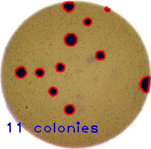

We can use relatively simple image processing and computer vision techniques in
Python, using the [OpenCV](https://docs.opencv.org/) library. With careful 
experimental design, a digital camera or a flatbed scanner, in conjunction with
some Python code, can be a powerful instrument in answering many different 
kinds of problems. Consider the following two types of problems that might be 
of interest to a scientist.

1. Morphometrics. Morphometrics involves counting the number of objects in an 
	image, analyzing the size of the objects, or analyzing the shape of the
	objects. For example, we might be interested automatically counting the
	number of bacterial colonies growing in a Petri dish, as shown in this
	image:

	

	We could use image processing to find the colonies, count them, and 
	then highlight their locations on the original image, resulting in an
	image like this:

	

2. Colorimetrics. Colorimetrics involves analyzing the color of objects in an 
	image. For example, consider this video of a titrant being added to an 
	analyte (click on the image to see the video):

	

	We could use image processing to look at the color of the solution, and 
	determine when the titration is complete. This graph shows how the three
	component colors (red, green, and blue) of the solution change over time;
	the change in the solution's color is obvious.

	

> ## Why write a program to do that?
> 
> Note that you can easily manually count the number of bacteria colonies shown
> in the morphometric example above. Why should we learn how to write a Python
> program to do a task we could easily perform with our own eyes? There are at
> least two reasons to learn how to perform tasks like these with Python and
> OpenCV:
> 
> 1. What if there are many more bacteria colonies in the Petri dish? For 
> 	example, suppose the image looked like this:
> 
> 	
> 
> 	Manually counting the colonies in that image would present more of a 
> 	challenge. A Python program using OpenCV could count the number of 
> 	colonies more accurately, and much more quickly, than a human could. 
> 
> 2. What if you have hundreds, or thousands, of images to consider? Imagine
> 	having to manually count colonies on several thousand images like 
> 	those above. A Python program using OpenCV could move through all of
> 	the images in seconds; how long would a graduate student require to do
> 	the task? Which process would be more accurate and repeatable? 
> 
> As you can see, the simple image processing / computer vision techniques you 
> will learn during this workshop can be very valuable tools for scientific 
> research. 
{: .callout}

As we move through this workshop, we will return to these sample problems 
several times, and you will solve each of these problems during the 
end-of-workshop [challenges]({{page.root}}/10-challenges/). 

Let's get started, by learning some basics about how images are represented and
stored digitally.
