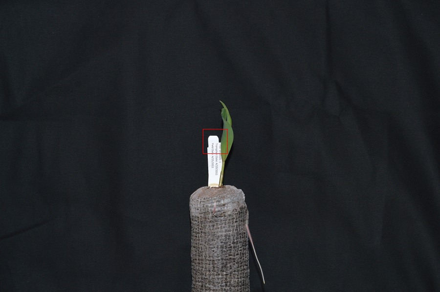
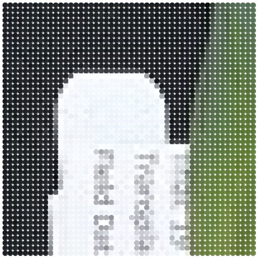
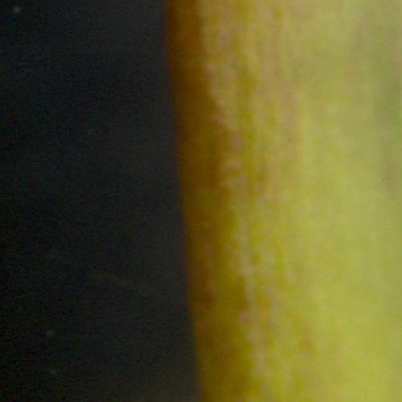
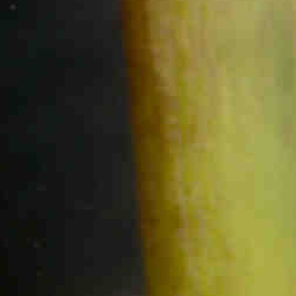
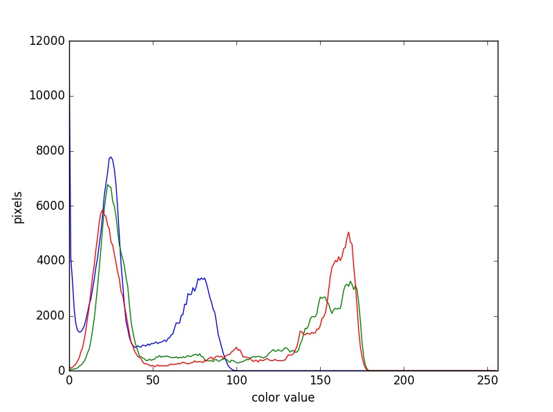
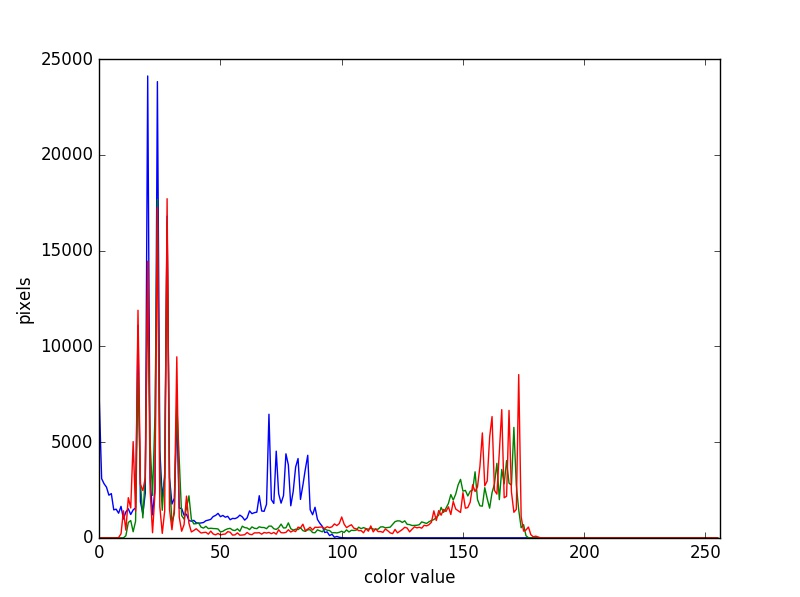

The images we see on hard copy, view with our electronic devices, or process 
with our programs are represented and stored in the computer as numeric 
abstractions, approximations of what we see with our eyes in the real world. 
Before we begin to learn how to process images with Python programs, we need 
to spend some time understanding how these abstractions work. 

## Bits and bytes

Before we talk specifically about images, we first need to understand how 
numbers are stored in a modern digital computer. When we think of a number, we
do so using a *decimal*, or *base-10* place-value number system. For example, a 
number like 659 is 6 × 102 + 5 × 101 + 9 × 
100. Each digit in the number is multiplied by a power of 10, based
on where it occurs, and there are 10 digits that can occur in each position 
(0, 1, 2, 3, 4, 5, 6, 7, 8, 9).

In principle, computers could be constructed to represent numbers in exactly
the same way. But, as it turns out, the electronic circuits inside a computer
are much easier to construct if we restrict the numeric base to only two, 
versus 10. (It is easier for circuitry to tell the difference between two 
voltage levels than it is to differentiate between 10 levels.) So, values in a
computer are stored using a *binary*, or *base-2* place-value number system. 

In this system, each symbol in a number is called a *bit* instead of a digit,
and there are only two values for each bit (0 and 1). We might imagine a 
four-bit binary number, 1101. Using the same kind of place-value expansion as 
we did above for 659, we see that 1101 = 1 × 23 + 1 × 
22 + 0 × 21 + 1 × 20, which if we do the math
is 8 + 4 + 0 + 1, or 13 in decimal. 

Internally, computers have a minimum number of bits that they work with at a 
given time: eight. A group of eight bits is called a *byte*. The amount of 
memory (RAM) and drive space our computers have is quantified by terms like
Megabytes (MB), Gigabytes (GB), and Terabytes (TB). The following table 
provides more formal definitions for these terms. 

| Unit     | Abbreviation | Size       |
| :------- | ------------ | :--------- |
| Kilobyte | KB           | 1024 bytes |
| Megabyte | MB           | 1024 KB    |
| Gigabyte | GB           | 1024 MB    |
| Terabyte | TB           | 1024 GB    |

## Pixels

It is important to realize that images are stored as rectangular arrays 
of hundreds, thousands, or millions of discrete "picture elements," otherwise 
known as *pixels*. Each pixel can be thought of as a single square point of 
colored light.

For example, consider this image of a maize seedling, with a square area 
designated by a red box:

Now, if we zoomed in close enough to see the pixels in the red box, we would 
see something like this:

Note that each square in the enlarged image area -- each pixel -- is all one 
color, but that each pixel can have a different color from its neighbors. 
Viewed from a distance, these pixels seem to blend together to form the image 
we see. 

## Coordinate system

When we process images, we can access, examine, and / or change the color of 
any pixel we wish. To do this, we need some convention on how to access pixels 
individually; a way to give each one a name, or an address of a sort. 

The most common manner to do this, and the one we will use in our programs, 
is to assign a modified Cartesian coordinate system to the image. The 
coordinate system we usually see in mathematics has a horizontal x-axis and 
a vertical y-axis, like this:

The modified coordinate system used for our images will have only positive 
coordinates, the origin will be in the upper left corner instead of the 
center, and y coordinate values will get larger as they go down instead of 
up, like this:

This is called a *left-hand coordinate system*. If you hold your left hand 
in front of your face and point your thumb at the floor, your extended index 
finger will correspond to the x-axis while your thumb represents the y-axis.

Until you have worked with images for a while, the most common mistake that 
you will make with coordinates is to forget that y coordinates get larger 
as they go down instead of up as in a normal Cartesian coordinate system. 

## Color model

Digital images use some color model to create a broad range of colors from 
a small set of primary colors. Although there are several different color 
models that are used for images, the most commonly occurring one is the 
*RGB (Red, Green, Blue)* model. 

The RGB model is an *additive* color model, which means that the primary 
colors are mixed together to form other colors. In the RGB model, the 
primary colors are red, green, and blue -- thus the name of the model. 
Each primary color is often called a *channel*. 

Most frequently, the amount of the primary color added is represented as 
an integer in the closed range [0, 255]. Therefore, there are 256 discrete 
amounts of each primary color that can be added to produce another color. 
The number of discrete amounts of each color, 256, corresponds to the number of 
bits used to hold the color channel value, which is eight (28=256). 
Since we have three channels, this is called 24-bit color depth. 

Any particular color in the RGB model can be expressed by a triplet of 
integers in [0, 255], representing the red, green, and blue channels, 
respectively. A larger number in a channel means that more of that primary 
color is present. 

> ## Thinking about RGB colors (3 min)
> 
> Suppose that we represent colors as triples (r, g, b), where each of r, g, 
> and b is an integer in [0, 255]. What colors are represented by each of these
> triples? (Try to answer these questions without reading further.)
> 
> 1. (255, 0, 0)
> 2. (0, 255, 0)
> 3. (0, 0, 255)
> 4. (255, 255, 255)
> 5. (0, 0, 0)
> 6. (128, 128, 128)
> 
> > ## Solution
> > 
> > 1. (255, 0, 0) represents red, because the red channel is maximized, while
> > 	the other two channels have the minimum values.
> > 2. (0, 255, 0) represents green.
> > 3. (0, 0, 255) represents blue.
> > 4. (255, 255, 255) is a little harder. When we mix the maximum value of all
> > 	three color channels, we see the color white.
> > 5. (0, 0, 0) represents the absence of all color, or black. 
> > 6. (128, 128, 128) represents a medium shade of gray. Note that the 24-bit
> > 	RGB color model provides at least 254 shades of gray, rather than only
> >	fifty. 
> > 
> > Note that the RGB color model may run contrary to your experience, especially
> > if you have mixed primary colors of paint to create new colors. In the RGB
> > model, the *lack of* any color is black, while the *maximum amount* of each
> > of the primary colors is white. With physical paint, we might start with a
> > white base, and then add differing amounts of other paints to produce a 
> > darker shade. 
> > 
> {: .solution}
{: .challenge}

After completing the previous challenge, we can look at some further examples 
of 24-bit RGB colors, in a visual way. The image in the next challenge shows 
some color names, their 24-bit RGB triplet values, and the color itself.

> ## RGB color table (4 min)
> 
> 
> 
> We cannot really provide a complete table. To see why, answer this question: 
> How many possible colors can be represented with the 24-bit RGB model?
> 
> > ## Solution
> > 
> > There are 24 total bits in an RGB color of this type, and each bit can be 
> > on or off, and so there are 224 = 16,777,216 possible colors 
> > with our additive, 24-bit RGB color model. 
> > 
> {: .solution}
{: .challenge}

Although 24-bit color depth is common, there are other options. We might have 
8-bit color (3 bits for red and green, but only 2 for blue, providing 8 × 8 × 
4 = 256 colors) or 16-bit color (4 bits for red, green, and blue, plus 4 more 
for transparency, providing 16 × 16 × 16 = 4096 colors), for example. There 
are color depths with more than eight bits per channel, but as the human eye 
can only discern approximately 10 million different colors, these are not 
often used. 

If you are using an older or inexpensive laptop screen or LCD monitor to view 
images, it may only support 18-bit color, capable of displaying 64 × 64 × 64 
= 262,144 colors. 24-bit color images will be converted in some manner to 
18-bit, and thus the color quality you see will not match what is actually in 
the image. 

We can combine our coordinate system with the 24-bit RGB color model to gain a 
conceptual understanding of the images we will be working with. An image is a 
rectangular array of pixels, each with its own coordinate. Each pixel in the 
image is a square point of colored light, where the color is specified by a 
24-bit RGB triplet. Such an image is an example of *raster graphics*. 

## Image formats

Although the images we will manipulate in our programs are conceptualized as 
rectangular arrays of RGB triplets, they are not necessarily created, stored, 
or transmitted in that format. There are several image formats we might 
encounter, and we should know the basics of at least of few of them. Some 
formats we might encounter, and their file extensions, are shown in this table:

| Format                                  | Extension     |
| :-------------------------------------- | :------------ |
| Device-Independent Bitmap (BMP)         | .bmp          |
| Joint Photographic Experts Group (JPEG) | .jpg or .jpeg |
| Tagged Image File Format (TIFF)         | .tif or .tiff |

## BMP

The file format that comes closest to our preceding conceptualization of images 
is the Device-Independent Bitmap, or BMP, file format. BMP files store raster 
graphics images as long sequences of binary-encoded numbers that specify the 
color of each pixel in the image. Since computer files are one-dimensional 
structures, the pixel colors are stored one row at a time. That is, the first 
row of pixels (those with y-coordinate 0) are stored first, followed by the 
second row (those with y-coordinate 1), and so on. Depending on how it was 
created, a BMP image might have 8-bit, 16-bit, or 24-bit color depth. 

24-bit BMP images have a relatively simple file format, can be viewed and 
loaded across a wide variety of operating systems, and have high quality. 
However, BMP images are not *compressed*, resulting in very large file sizes 
for any useful image resolutions. 

The idea of image compression is important to us for two reasons: first, 
compressed images have smaller file sizes, and are therefore easier to store 
and transmit; and second, compressed images may not have as much detail as 
their uncompressed counterparts, and so our programs may not be able to detect 
some important aspect if we are working with compressed images. Since 
compression is important to us, we should take a brief detour and discuss 
the concept. 

## Image compression

Let's begin our discussion of compression with a simple challenge. 

> ## BMP image size (8 min)
> 
> Imagine that we have a fairly large, but very boring image: a 5,000 × 5,000 
> pixel image composed of nothing but white pixels. If we used an uncompressed 
> image format such as BMP, with the 24-bit RGB color model, how much storage 
> would be required for the file? 
> 
> > ## Solution
> > In such an image, there are 5,000 × 5,000 = 25,000,000 pixels, and 24 bits 
> > for each pixel, leading to 25,000,000 × 24 = 600,000,000 bits, or 
> > 75,000,000 bytes (71.5MB). That is quite a lot of space for a very 
> > uninteresting image! 
> > 
> {: .solution}
{: .challenge}

Since image files can be very large, various *compression* schemes exist for 
saving (approximately) the same information while using less space. 
These compression techniques can be categorized as *lossless* or *lossy*. 

## Lossless compression 

In lossless image compression, we apply some algorithm (i.e., a computerized
procedure) to the image, resulting in a file that is significantly smaller than 
the uncompressed BMP file equivalent would be. Then, when we wish to load and 
view or process the image, our program reads the compressed file, and reverses 
the compression process, resulting in an image that is *identical* to the 
original. Nothing is lost in the process -- hence the term "lossless."

The general idea of lossless compression is to somehow detect long patterns 
of bytes in a file that are repeated over and over, and then assign a smaller 
bit pattern to represent the longer sample. Then, the compressed file is made 
up of the smaller patterns, rather than the larger ones, thus reducing the 
number of bytes required to save the file. The compressed file also contains 
a table of the substituted patterns and the originals, so when the file is 
decompressed it can be made identical to the original before compression. 

To provide you with a concrete example, consider the 71.5 MB white BMP image 
discussed above. When put through the zip compression utility on Microsoft 
Windows, the resulting .zip file is only 72 KB in size! That is, the .zip 
version of the image is three orders of magnitude smaller than the original, 
and it can be decompressed into a file that is byte-for-byte the same as the 
original. Since the original is so repetitious -- simply the same color 
triplet repeated 25,000,000 times -- the compression algorithm can 
dramatically reduce the size of the file. 

If you work with .zip or .gz archives, you are dealing with lossless 
compression. 

## Lossy compression

Lossy compression takes the original image and discards some of the detail 
in it, resulting in a smaller file format. The goal is to only throw away 
detail that someone viewing the image would not notice. Many lossy 
compression schemes have adjustable levels of compression, so that the image 
creator can choose the amount of detail that is lost. The more detail that 
is sacrificed, the smaller the image files will be -- but of course, the 
detail and richness of the image will be lower as well. 

This is probably fine for images that are shown on Web pages or printed off 
on 4 × 6 photo paper, but may or may not be fine for scientific work. You 
will have to decide whether the loss of image quality and detail are important 
to your work, versus the space savings afforded by a lossy compression format. 

It is important to understand that once an image is saved in a lossy 
compression format, the lost detail is just that -- lost. I.e., unlike 
lossless formats, given an image saved in a lossy format, there is no way 
to reconstruct the original image in a byte-by-byte manner. 

## JPEG

JPEG images are perhaps the most commonly encountered digital images today. 
JPEG uses lossy compression, and the degree of compression can be tuned to 
your liking. It supports 24-bit color depth, and since the format is so 
widely used, JPEG images can be viewed and manipulated easily on all 
computing platforms.

> ## Examining actual image sizes
> 
> Let us see the effects of image compression on image size with actual images.
> Open a terminal and navigate to the **Desktop/workshops/image-processing/02-image-basics**
> directory. This directory contains a simple program, **ws.py** that creates a
> square white image of a specified size, and then saves it as a BMP and as a 
> JPEG image. 
> 
> To create a 5,000 x 5,000 white square, execute the program by typing 
> **python ws.py 5000** and then hitting enter. Then, examine the file sizes of
> the two output files, **ws.bmp** and **ws.jpg**. Does the BMP image size
> match our previous prediction? How about the JPEG? 
> 
> > ## Solution
> > 
> > The BMP file, **ws.bmp**, is 75,000,054 bytes, which matches our prediction
> > very nicely. The JPEG file, **ws.jpeg**, is 392,503 bytes, two orders of magnitude
> > smaller than the bitmap version.
> > 
> {: .solution}
{: .challenge}

Here is an example showing how JPEG compression might impact image quality. 
Consider this image of several maize seedlings (scaled down here from 11,339 
× 11,336 pixels in order to fit the display).

Now, let us zoom in and look at a small section of the original, first in the 
uncompressed format:

Here is the same area of the image, but in JPEG format. We used a fairly 
aggressive compression parameter to make the JPEG, in order to illustrate 
the problems you might encounter with the format.

The JPEG image is of clearly inferior quality. It has less color variation 
and noticeable pixelation. Quality differences become even more marked when 
one examines the color histograms for each image. A histogram shows how 
often each color value appears in an image. First, here is the histogram for 
the uncompressed image:

Now, look at the histogram for the compressed image sample:

We we learn how to make histograms such as these later on in the workshop.

The differences in the color histograms are even more apparent than in the
images themselves; clearly the colors in the JPEG image are different from the
uncompressed version.

If the quality settings for your JPEG images are high (and the compression 
rate therefore relatively low), the images may be of sufficient quality for 
your work. It all depends on how much quality you need, and what restrictions 
you have on image storage space.

## TIFF

TIFF images are popular with publishers, graphics designers, and photographers. 
TIFF images can be uncompressed, or compressed using either lossless or lossy 
compression schemes, depending on the settings used, and so TIFF images seem 
to have the benefits of both the BMP and JPEG formats. The main disadvantage 
of TIFF images (other than the size of images in the uncompressed version of 
the format) is that they are not universally readable by image viewing and 
manipulation software. 

## Metadata

JPEG and TIFF images support the inclusion of *metadata* in images. Metadata 
is textual information that is contained within an image file. Metadata holds 
information about the image itself, such as when the image was captured, where
it was captured, what type of camera was used and with what settings, etc. We
normally don't see this metadata when we view an image, but we can access it if
we wish. For example, consider this image of a tree flowering in spring:

What metadata do you suppose this image contains? One way we can find out is by
using [ImageJ](https://imagej.nih.gov/ij/index.html), a public domain, 
Java-based image processing program developed at the National Institutes of 
Health. If we were to view the tree image with ImageJ, and then access the 
**Image/View info...** menu item, we would see this information, plus another 
100 lines or so:

~~~
[Jpeg] Compression Type:	Baseline
[Jpeg] Data Precision:	8 bits
[Jpeg] Image Height:	463 pixels
[Jpeg] Image Width:	624 pixels
[Jpeg] Number of Components:	3
[Jpeg] Component 1:	Y component: Quantization table 0, Sampling factors 2 horiz/2 vert
[Jpeg] Component 2:	Cb component: Quantization table 1, Sampling factors 1 horiz/1 vert
[Jpeg] Component 3:	Cr component: Quantization table 1, Sampling factors 1 horiz/1 vert
[Jfif] Version:	1.1
[Jfif] Resolution Units:	inch
[Jfif] X Resolution:	72 dots
[Jfif] Y Resolution:	72 dots
[Exif SubIFD] Exposure Time:	657/1000000 sec
[Exif SubIFD] F-Number:	F2
[Exif SubIFD] Exposure Program:	Program normal
[Exif SubIFD] ISO Speed Ratings:	40
[Exif SubIFD] Exif Version:	2.20
[Exif SubIFD] Date/Time Original:	2017:04:10 12:04:06
[Exif SubIFD] Date/Time Digitized:	2017:04:10 12:04:06
[Exif SubIFD] Components Configuration:	YCbCr
[Exif SubIFD] Shutter Speed Value:	1/1520 sec
[Exif SubIFD] Aperture Value:	F2
[Exif SubIFD] Brightness Value:	8.89
[Exif SubIFD] Exposure Bias Value:	0 EV
[Exif SubIFD] Max Aperture Value:	F2
[Exif SubIFD] Subject Distance:	0.0 metres
[Exif SubIFD] Metering Mode:	Center weighted average
[Exif SubIFD] Flash:	Flash did not fire, auto
[Exif SubIFD] Focal Length:	3.82 mm
[Exif SubIFD] Sub-Sec Time:	025669
[Exif SubIFD] Sub-Sec Time Original:	025669
[Exif SubIFD] Sub-Sec Time Digitized:	025669
[Exif SubIFD] FlashPix Version:	1.00
[Exif SubIFD] Color Space:	sRGB
[Exif SubIFD] Exif Image Width:	4160 pixels
[Exif SubIFD] Exif Image Height:	3088 pixels
[Exif SubIFD] Sensing Method:	One-chip color area sensor
[Exif SubIFD] Scene Type:	Directly photographed image
[Exif SubIFD] Custom Rendered:	Custom process
[Exif SubIFD] Exposure Mode:	Auto exposure
[Exif SubIFD] White Balance Mode:	Auto white balance
[Exif SubIFD] Scene Capture Type:	Standard
[Exif SubIFD] Contrast:	None
[Exif SubIFD] Saturation:	None
[Exif SubIFD] Sharpness:	None
[Exif SubIFD] Subject Distance Range:	Unknown
[Exif SubIFD] Unknown tag (0xea1c):	[2060 bytes]
[Exif SubIFD] Unknown tag (0xea1d):	4264
[Exif IFD0] Unknown tag (0x0100):	4160
[Exif IFD0] Unknown tag (0x0101):	3088
[Exif IFD0] Image Description:	Flowering tree
[Exif IFD0] Make:	motorola
[Exif IFD0] Model:	Nexus 6
[Exif IFD0] Orientation:	Top, left side (Horizontal / normal)
[Exif IFD0] X Resolution:	72 dots per inch
[Exif IFD0] Y Resolution:	72 dots per inch
[Exif IFD0] Resolution Unit:	Inch
[Exif IFD0] Software:	HDR+ 1.0.126161355r
[Exif IFD0] Date/Time:	2017:04:10 12:04:06
[Exif IFD0] Artist:	Mark M. Meysenburg
[Exif IFD0] YCbCr Positioning:	Center of pixel array
[Exif IFD0] Unknown tag (0x4746):	5
[Exif IFD0] Unknown tag (0x4749):	99
[Exif IFD0] Windows XP Title:	Flowering tree
[Exif IFD0] Windows XP Author:	Mark M. Meysenburg
[Exif IFD0] Windows XP Subject:	Nature
[Exif IFD0] Unknown tag (0xea1c):	[2060 bytes]
[Interoperability] Interoperability Version:	1.00
[GPS] GPS Version ID:	2.200
[GPS] GPS Latitude Ref:	N
[GPS] GPS Latitude:	40.0° 37.0' 19.33999999999571"
[GPS] GPS Longitude Ref:	W
[GPS] GPS Longitude:	-96.0° 56.0' 46.74000000003048"
[GPS] GPS Altitude Ref:	Sea level
[GPS] GPS Altitude:	405 metres
[GPS] GPS Time-Stamp:	17:4:3 UTC
~~~
{: .output}

Reviewing the metadata, you can see things like the location where the image
was taken, the make and model of the Android smartphone used to capture the 
image, the date and time when it was captured, and more. Two tags, containing
the image description and the "artist," were added manually. Depending on how 
you intend to use images, the metadata contained within the images may be 
important or useful to you. However, care must be taken when using our computer
vision library, OpenCV, to write images. We will examine metadata a little 
more closely in the [OpenCV Images]({{ page.root }}/03-opencv-images) episode.

## Summary of image formats

The following table summarizes the characteristics of the BMP, JPEG, and TIFF
image formats:

| Format   | Compression   | Metadata   | Advantages            | Disadvantages      | 
| :------- | :------------ | :--------- | :-------------------- | :----------------- |
| BMP      | None          | None       | Universally viewable, | Large file sizes   |
|          |               |            | high quality          |                    |
| JPEG     | Lossy         | Yes        | Universally viewable, | Detail may be lost |
|          |               |            | smaller file size     |                    |
| TIFF     | None, lossy,  | Yes        | High quality or       | Not universally    |
|          | or lossless   |            | smaller file size     | viewable           |
