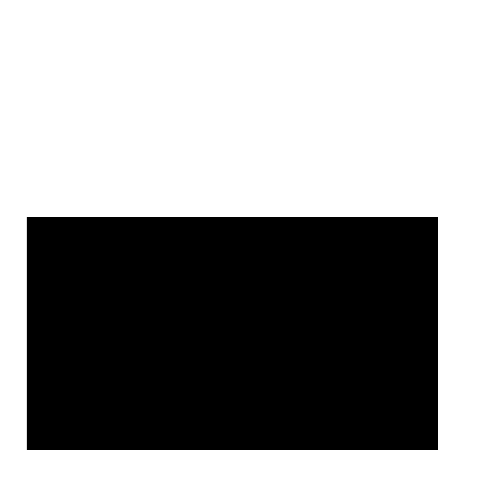

::::::::::::::::::::::::::::::::::::::: objectives

- Create a blank, black scikit-image image.
- Draw rectangles and other shapes on scikit-image images.
- Explain how a white shape on a black background can be used as a mask to select specific parts of an image.
- Use bitwise operations to apply a mask to an image.

::::::::::::::::::::::::::::::::::::::::::::::::::

:::::::::::::::::::::::::::::::::::::::: questions

- How can we draw on scikit-image images and use bitwise operations and masks to select certain parts of an image?

::::::::::::::::::::::::::::::::::::::::::::::::::

The next series of episodes covers a basic toolkit of scikit-image operators.
With these tools,
we will be able to create programs to perform simple analyses of images
based on changes in colour or shape.

## First, import the packages needed for this episode

```python
import numpy as np
import matplotlib.pyplot as plt
import ipympl
import imageio.v3 as iio
import skimage
import skimage.draw
%matplotlib widget
```

Here, we import the `draw` submodule of `skimage` as well as packages familiar
from earlier in the lesson.

## Drawing on images

Often we wish to select only a portion of an image to analyze,
and ignore the rest.
Creating a rectangular sub-image with slicing,
as we did in [the *Working with scikit-image* episode](03-skimage-images.md)
is one option for simple cases.
Another option is to create another special image,
of the same size as the original,
with white pixels indicating the region to save and black pixels everywhere else.
Such an image is called a *mask*.
In preparing a mask, we sometimes need to be able to draw a shape -
a circle or a rectangle, say -
on a black image.
scikit-image provides tools to do that.

Consider this image of maize seedlings:

{alt='Maize seedlings'}

Now, suppose we want to analyze only the area of the image containing the roots
themselves;
we do not care to look at the kernels,
or anything else about the plants.
Further, we wish to exclude the frame of the container holding the seedlings as well.
Hovering over the image with our mouse, could tell us that
the upper-left coordinate of the sub-area we are interested in is *(44, 357)*,
while the lower-right coordinate is *(720, 740)*.
These coordinates are shown in *(x, y)* order.

A Python program to create a mask to select only that area of the image would
start with a now-familiar section of code to open and display the original
image:

```python
# Load and display the original image
maize_seedlings = iio.imread(uri="data/maize-seedlings.tif")

fig, ax = plt.subplots()
plt.imshow(maize_seedlings)
```

We load and display the initial image in the same way we have done before.

NumPy allows indexing of images/arrays with "boolean" arrays of the same size.
Indexing with a boolean array is also called mask indexing.
The "pixels" in such a mask array can only take two values: `True` or `False`.
When indexing an image with such a mask,
only pixel values at positions where the mask is `True` are accessed.
But first, we need to generate a mask array of the same size as the image.
Luckily, the NumPy library provides a function to create just such an array.
The next section of code shows how:

```python
# Create the basic mask
mask = np.ones(shape=maize_seedlings.shape[0:2], dtype="bool")
```

The first argument to the `ones()` function is the shape of the original image,
so that our mask will be exactly the same size as the original.
Notice, that we have only used the first two indices of our shape.
We omitted the channel dimension.
Indexing with such a mask will change all channel values simultaneously.
The second argument, `dtype = "bool"`,
indicates that the elements in the array should be booleans -
i.e., values are either `True` or `False`.
Thus, even though we use `np.ones()` to create the mask,
its pixel values are in fact not `1` but `True`.
You could check this, e.g., by `print(mask[0, 0])`.

Next, we draw a filled, rectangle on the mask:

```python
# Draw filled rectangle on the mask image
rr, cc = skimage.draw.rectangle(start=(357, 44), end=(740, 720))
mask[rr, cc] = False

# Display mask image
fig, ax = plt.subplots()
plt.imshow(mask, cmap="gray")
```

Here is what our constructed mask looks like:
{alt='Maize image mask' .image-with-shadow}

The parameters of the `rectangle()` function `(357, 44)` and `(740, 720)`,
are the coordinates of the upper-left (`start`) and lower-right (`end`) corners
of a rectangle in *(ry, cx)* order.
The function returns the rectangle as row (`rr`) and column (`cc`) coordinate arrays.

:::::::::::::::::::::::::::::::::::::::::  callout

## Check the documentation!

When using an scikit-image function for the first time - or the fifth time -
it is wise to check how the function is used, via
[the scikit-image documentation](https://scikit-image.org/docs/dev/user_guide)
or other usage examples on programming-related sites such as
[Stack Overflow](https://stackoverflow.com/).
Basic information about scikit-image functions can be found interactively in Python,
via commands like `help(skimage)` or `help(skimage.draw.rectangle)`.
Take notes in your lab notebook.
And, it is always wise to run some test code to verify
that the functions your program uses are behaving in the manner you intend.


::::::::::::::::::::::::::::::::::::::::::::::::::

:::::::::::::::::::::::::::::::::::::::::  callout

## Variable naming conventions!

You may have wondered why we called the return values of the rectangle function
`rr` and `cc`?!
You may have guessed that `r` is short for `row` and `c` is short for `column`.
However, the rectangle function returns mutiple rows and columns;
thus we used a convention of doubling the letter `r` to `rr` (and `c` to `cc`)
to indicate that those are multiple values.
In fact it may have even been clearer to name those variables `rows` and `columns`;
however this would have been also much longer.
Whatever you decide to do, try to stick to some already existing conventions,
such that it is easier for other people to understand your code.


::::::::::::::::::::::::::::::::::::::::::::::::::

:::::::::::::::::::::::::::::::::::::::  challenge

## Other drawing operations (15 min)

There are other functions for drawing on images,
in addition to the `skimage.draw.rectangle()` function.
We can draw circles, lines, text, and other shapes as well.
These drawing functions may be useful later on, to help annotate images
that our programs produce.
Practice some of these functions here.

Circles can be drawn with the `skimage.draw.disk()` function,
which takes two parameters:
the (ry, cx) point of the centre of the circle,
and the radius of the circle.
There is an optional `shape` parameter that can be supplied to this function.
It will limit the output coordinates for cases where the circle
dimensions exceed the ones of the image.

Lines can be drawn with the `skimage.draw.line()` function,
which takes four parameters:
the (ry, cx) coordinate of one end of the line,
and the (ry, cx) coordinate of the other end of the line.

Other drawing functions supported by scikit-image can be found in
[the scikit-image reference pages](https://scikit-image.org/docs/dev/api/skimage.draw.html?highlight=draw#module-skimage.draw).

First let's make an empty, black image with a size of 800x600 pixels.
Recall that a colour image has three channels for the colours red, green, and blue
(RGB, cf. [Image Basics](03-skimage-images.md)).
Hence we need to create a 3D array of shape `(600, 800, 3)` where the last dimension represents the RGB colour channels.

```python
# create the black canvas
canvas = np.zeros(shape=(600, 800, 3), dtype="uint8")
```

Now your task is to draw some other coloured shapes and lines on the image,
perhaps something like this:

{alt='Sample shapes'}

:::::::::::::::  solution

## Solution

Drawing a circle:

```python
# Draw a blue circle with centre (200, 300) in (ry, cx) coordinates, and radius 100
rr, cc = skimage.draw.disk(center=(200, 300), radius=100, shape=canvas.shape[0:2])
canvas[rr, cc] = (0, 0, 255)
```

Drawing a line:

```python
# Draw a green line from (400, 200) to (500, 700) in (ry, cx) coordinates
rr, cc = skimage.draw.line(r0=400, c0=200, r1=500, c1=700)
canvas[rr, cc] = (0, 255, 0)
```

```python
# Display the image
fig, ax = plt.subplots()
plt.imshow(canvas)
```

We could expand this solution, if we wanted,
to draw rectangles, circles and lines at random positions within our black canvas.
To do this, we could use the `random` python module,
and the function `random.randrange`,
which can produce random numbers within a certain range.

Let's draw 15 randomly placed circles:

```python
import random

# create the black canvas
canvas = np.zeros(shape=(600, 800, 3), dtype="uint8")

# draw a blue circle at a random location 15 times
for i in range(15):
    rr, cc = skimage.draw.disk(center=(
         random.randrange(600),
         random.randrange(800)),
         radius=50,
         shape=canvas.shape[0:2],
        )
    canvas[rr, cc] = (0, 0, 255)

# display the results
fig, ax = plt.subplots()
plt.imshow(canvas)
```

We could expand this even further to also
randomly choose whether to plot a rectangle, a circle, or a square.
Again, we do this with the `random` module,
now using the function `random.random`
that returns a random number between 0.0 and 1.0.

```python
import random

# Draw 15 random shapes (rectangle, circle or line) at random positions
for i in range(15):
    # generate a random number between 0.0 and 1.0 and use this to decide if we
    # want a circle, a line or a sphere
    x = random.random()
    if x < 0.33:
        # draw a blue circle at a random location
        rr, cc = skimage.draw.disk(center=(
            random.randrange(600),
            random.randrange(800)),
            radius=50,
            shape=canvas.shape[0:2],
        )
        color = (0, 0, 255)
    elif x < 0.66:
        # draw a green line at a random location
        rr, cc = skimage.draw.line(
            r0=random.randrange(600),
            c0=random.randrange(800),
            r1=random.randrange(600),
            c1=random.randrange(800),
        )
        color = (0, 255, 0)
    else:
        # draw a red rectangle at a random location
        rr, cc = skimage.draw.rectangle(
            start=(random.randrange(600), random.randrange(800)),
            extent=(50, 50),
            shape=canvas.shape[0:2],
        )
        color = (255, 0, 0)

    canvas[rr, cc] = color

# display the results
fig, ax = plt.subplots()
plt.imshow(canvas)
```

:::::::::::::::::::::::::

::::::::::::::::::::::::::::::::::::::::::::::::::

## Image modification

All that remains is the task of modifying the image using our mask in such a
way that the areas with `True` pixels in the mask are not shown in the image
any more.

:::::::::::::::::::::::::::::::::::::::  challenge

## How does a mask work? (optional, not included in timing)

Now, consider the mask image we created above.
The values of the mask that corresponds to the portion of the image
we are interested in are all `False`,
while the values of the mask that corresponds to the portion of the image we
want to remove are all `True`.

How do we change the original image using the mask?

:::::::::::::::  solution

## Solution

When indexing the image using the mask, we access only those pixels at
positions where the mask is `True`.
So, when indexing with the mask,
one can set those values to 0, and effectively remove them from the image.


:::::::::::::::::::::::::

::::::::::::::::::::::::::::::::::::::::::::::::::

Now we can write a Python program to use a mask to retain only the portions
of our maize roots image that actually contains the seedling roots.
We load the original image and create the mask in the same way as before:

```python
# Load the original image
maize_seedlings = iio.imread(uri="data/maize-seedlings.tif")

# Create the basic mask
mask = np.ones(shape=maize_seedlings.shape[0:2], dtype="bool")

# Draw a filled rectangle on the mask image
rr, cc = skimage.draw.rectangle(start=(357, 44), end=(740, 720))
mask[rr, cc] = False
```

Then, we use NumPy indexing to remove the portions of the image,
where the mask is `True`:

```python
# Apply the mask
maize_seedlings[mask] = 0
```

Then, we display the masked image.

```python
fig, ax = plt.subplots()
plt.imshow(maize_seedlings)
```

The resulting masked image should look like this:

{alt='Applied mask'}

:::::::::::::::::::::::::::::::::::::::  challenge

## Masking an image of your own (optional, not included in timing)

Now, it is your turn to practice.
Using your mobile phone, tablet, webcam, or digital camera,
take an image of an object with a simple overall geometric shape
(think rectangular or circular).
Copy that image to your computer, write some code to make a mask,
and apply it to select the part of the image containing your object.
For example, here is an image of a remote control:

{alt='Remote control image'}

And, here is the end result of a program masking out everything but the remote:

{alt='Remote control masked'}

:::::::::::::::  solution

## Solution

Here is a Python program to produce the cropped remote control image shown above.
Of course, your program should be tailored to your image.

```python
# Load the image
remote = iio.imread(uri="data/remote-control.jpg")
remote = np.array(remote)

# Create the basic mask
mask = np.ones(shape=remote.shape[0:2], dtype="bool")

# Draw a filled rectangle on the mask image
rr, cc = skimage.draw.rectangle(start=(93, 1107), end=(1821, 1668))
mask[rr, cc] = False

# Apply the mask
remote[mask] = 0

# Display the result
fig, ax = plt.subplots()
plt.imshow(remote)
```

:::::::::::::::::::::::::

::::::::::::::::::::::::::::::::::::::::::::::::::

:::::::::::::::::::::::::::::::::::::::  challenge

## Masking a 96-well plate image (30 min)

Consider this image of a 96-well plate that has been scanned on a flatbed scanner.

```python
# Load the image
wellplate = iio.imread(uri="data/wellplate-01.jpg")
wellplate = np.array(wellplate)

# Display the image
fig, ax = plt.subplots()
plt.imshow(wellplate)
```

{alt='96-well plate'}

Suppose that we are interested in the colours of the solutions in each of the wells.
We *do not* care about the colour of the rest of the image,
i.e., the plastic that makes up the well plate itself.

Your task is to write some code that will produce a mask that will
mask out everything except for the wells.
To help with this, you should use the text file `data/centers.txt` that contains
the (cx, ry) coordinates of the centre of each of the 96 wells in this image.
You may assume that each of the wells has a radius of 16 pixels.

Your program should produce output that looks like this:

{alt='Masked 96-well plate'}

:::::::::::::::  solution

## Solution

```python
# read in original image
wellplate = iio.imread(uri="data/wellplate-01.jpg")
wellplate = np.array(wellplate)

# create the mask image
mask = np.ones(shape=wellplate.shape[0:2], dtype="bool")

# open and iterate through the centers file...
with open("data/centers.txt", "r") as center_file:
    for line in center_file:
        # ... getting the coordinates of each well...
        coordinates = line.split()
        cx = int(coordinates[0])
        ry = int(coordinates[1])

        # ... and drawing a circle on the mask
        rr, cc = skimage.draw.disk(center=(ry, cx), radius=16, shape=wellplate.shape[0:2])
        mask[rr, cc] = False

# apply the mask
wellplate[mask] = 0

# display the result
fig, ax = plt.subplots()
plt.imshow(wellplate)
```

:::::::::::::::::::::::::

::::::::::::::::::::::::::::::::::::::::::::::::::

:::::::::::::::::::::::::::::::::::::::  challenge

## Masking a 96-well plate image, take two (optional, not included in timing)

If you spent some time looking at the contents of
the `data/centers.txt` file from the previous challenge,
you may have noticed that the centres of each well in the image are very regular.
*Assuming* that the images are scanned in such a way that
the wells are always in the same place,
and that the image is perfectly oriented
(i.e., it does not slant one way or another),
we could produce our well plate mask without having to
read in the coordinates of the centres of each well.
Assume that the centre of the upper left well in the image is at
location cx = 91 and ry = 108, and that there are
70 pixels between each centre in the cx dimension and
72 pixels between each centre in the ry dimension.
Each well still has a radius of 16 pixels.
Write a Python program that produces the same output image as in the previous challenge,
but *without* having to read in the `centers.txt` file.
*Hint: use nested for loops.*

:::::::::::::::  solution

## Solution

Here is a Python program that is able to create the masked image without
having to read in the `centers.txt` file.

```python
# read in original image
wellplate = iio.imread(uri="data/wellplate-01.jpg")
wellplate = np.array(wellplate)

# create the mask image
mask = np.ones(shape=wellplate.shape[0:2], dtype="bool")

# upper left well coordinates
cx0 = 91
ry0 = 108

# spaces between wells
deltaCX = 70
deltaRY = 72

cx = cx0
ry = ry0

# iterate each row and column
for row in range(12):
    # reset cx to leftmost well in the row
    cx = cx0
    for col in range(8):

        # ... and drawing a circle on the mask
        rr, cc = skimage.draw.disk(center=(ry, cx), radius=16, shape=wellplate.shape[0:2])
        mask[rr, cc] = False
        cx += deltaCX
    # after one complete row, move to next row
    ry += deltaRY

# apply the mask
wellplate[mask] = 0

# display the result
fig, ax = plt.subplots()
plt.imshow(wellplate)
```

:::::::::::::::::::::::::

::::::::::::::::::::::::::::::::::::::::::::::::::

:::::::::::::::::::::::::::::::::::::::: keypoints

- We can use the NumPy `zeros()` function to create a blank, black image.
- We can draw on scikit-image images with functions such as `skimage.draw.rectangle()`, `skimage.draw.disk()`, `skimage.draw.line()`, and more.
- The drawing functions return indices to pixels that can be set directly.

::::::::::::::::::::::::::::::::::::::::::::::::::
