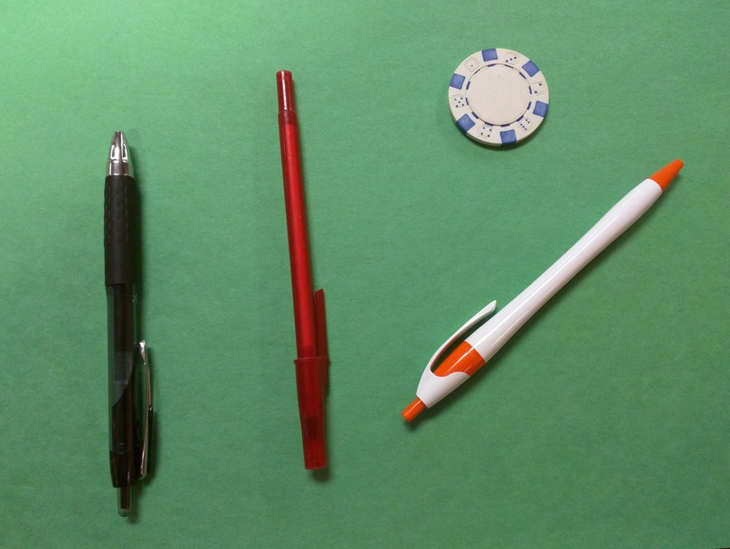

In this episode, we will learn how to use OpenCV functions to apply 
thresholding to an image. Most frequently, we use thresholding as a way to 
select areas of interest of an image, while ignoring the parts we are not 
concerned with. We have already done some simple thresholding, in the 
"Manipulating pixels" section of the 
[OpenCV Images]({{ page.root }}/02-opencv-images) episode. In that case, we
used a simple NumPy array manipulation to separate the pixels belonging to the
root system of a plant from the black background. In this lesson, we will 
learn more sophisticated thresholding techniques to create masks, which can 
then be used to separate the interesting parts of an image from the background.

## Simple thresholding

~~~
'''
 * Python script to demonstrate simple thresholding.
'''
import cv2, sys

# get filename, kernel size, and threshold value from command line
filename = sys.argv[1]
k = int(sys.argv[2])
t = int(sys.argv[3])

# read and display the original image
img = cv2.imread(filename)
cv2.namedWindow("original", cv2.WINDOW_NORMAL)
cv2.imshow("original", img)
cv2.waitKey(0)

# blur image before thresholding
blur = cv2.cvtColor(img, cv2.COLOR_BGR2GRAY)
blur = cv2.GaussianBlur(blur, (k, k), 0)

# perform binary thresholding 
(t, maskLayer) = cv2.threshold(blur, t, 255, cv2.THRESH_BINARY_INV)

# make a mask suitable for color images
mask = cv2.merge([maskLayer, maskLayer, maskLayer])

# use the mask to select the "interesting" part of the image
sel = cv2.bitwise_and(img, mask)

# display the result
cv2.namedWindow("selected", cv2.WINDOW_NORMAL)
cv2.imshow("selected", sel)
cv2.waitKey(0)
~~~
{: .python}

