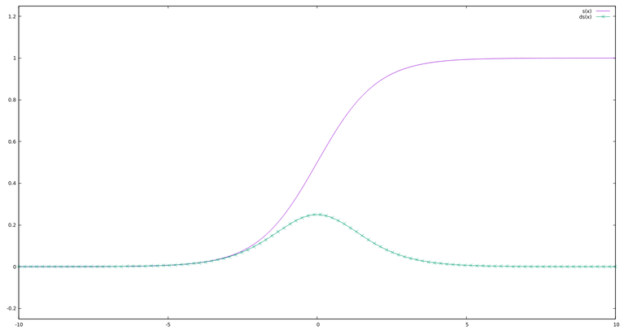
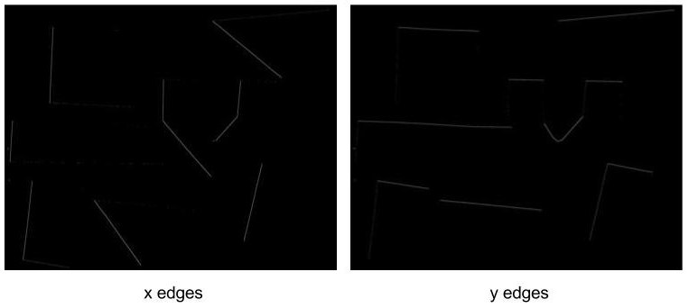
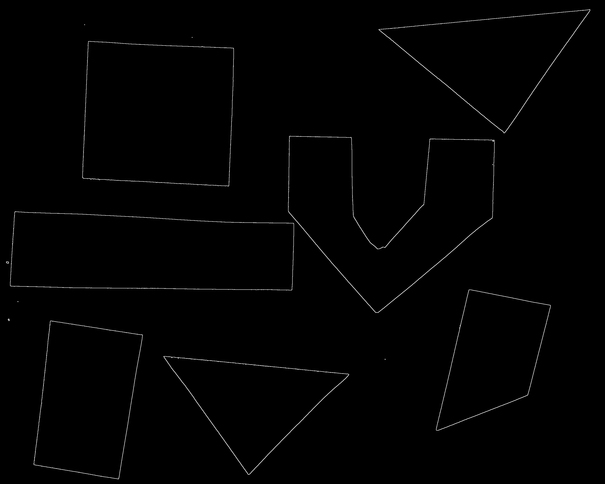
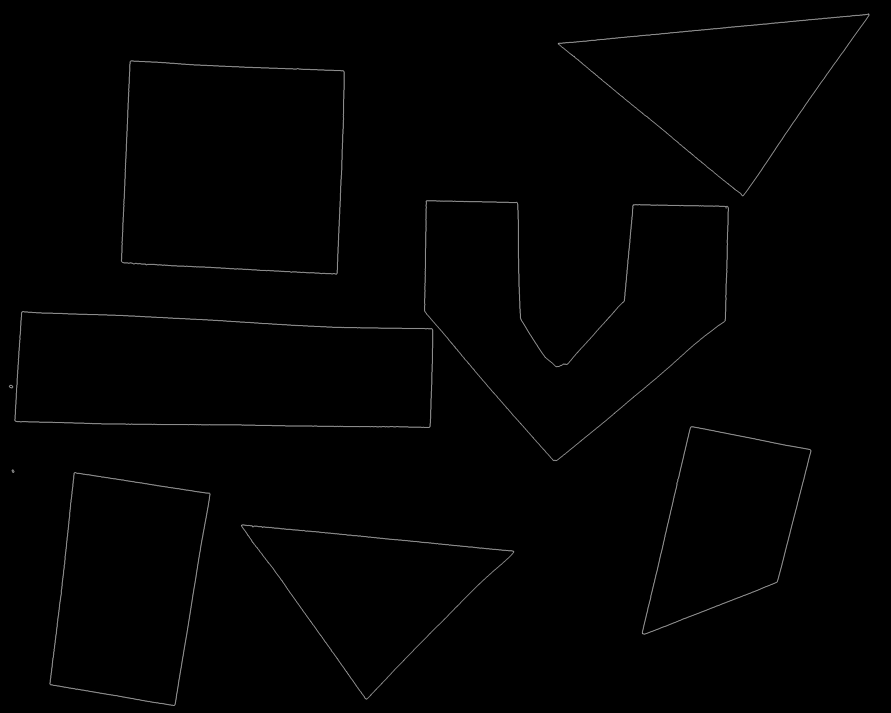
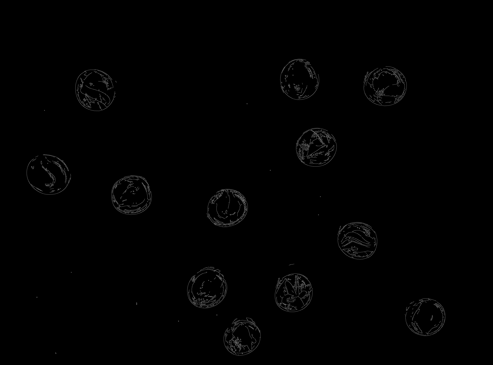

In this episode, we will learn how to use OpenCV functions to apply *edge 
detection* to an image. In edge detection, we find the boundaries or edges of
objects in an image, by determining where the brightness of the image changes
dramtically. Edge detection can be used to extract the structure of objects in 
an image. If we are interested in the number, size, shape, or relative location
of objects in an image, edge detection allows us to focus on the parts of the 
image most helpful, while ignoring parts of the image that will not help up. 

For example, once we have found the edges of the objects in the image, we can 
use that information to find the image *contours*, which we will learn about in
the following [Contours]({{ page.root }}./08-contours.md) episode. With the 
contours, we can do things like counting the number of objects in the image,
measure the size of the objects, and so on. 

As was the case for blurring and thresholding, there are several different 
methods in OpenCV that can be used for edge detection, so we will examine only
a few. 

## Introduction to edge detection

To begin our introduction to edge detection, let us look at an image with a
very simple edge -- this grayscale image of two overlapped pieces of paper, one
black and and one white:

The obvious edge in the image is the vertical line between the black paper and
the white paper. To our eyes, there is a quite sudden change between the black
pixels and the white pixels. But, at a pixel-by-pixel level, is the transition
really that sudden? 

We can tell by examining some of the pixels; imagine a short line segment, 
halfway down the image and straddling the edge between the black and white
paper. This plot shows the pixel values (between 0 and 255, since this is a 
grayscale image) for forty pixels spanning the transition from black to white.

It is obvious that the "edge" here is not so sudden! So, any OpenCV method to
detect edges in an image must be able to decide where the edge is, and place 
appropriately-colored pixels in that location. 

## Sobel edge detection

*Sobel edge detection* uses numerical approximations of derivatives to detect
edges in an image. Here is an example of how the process might work. If we look
at the gradient plot above, we shall see that its shape reoughly corresponds to
the sigmoid function, as shown by the purple line in this plot:

Now, look at the first derivative of the sigmoid function, shown by the hatched
green line. The peak of the first derivative curve corresponds to half way 
along the gradient line, and so the peak value can be used to determine where
the edge should be.

This is how the Sobel edge detection algorithm works. It computes the 
derivative of a curve fitting the gradient between light and dark areas in an
image, and then finds the peak of the derivative, which is interpreted as the
location of an edge pixel. The technique is implemented via the `cv2.Sobel()`
method.

The following program illustrates how the `cv2.Sobel()` method can be used to 
detect the edges in an image. We will execute the program on this image, which
we used before in the [Thresholding]({{ page.root }}./06-thresholding.md) 
episode:

We are interested in finding the edges of the shapes in the image, and so the
colors are not important. Our strategy will be to read the image as grayscale,
convert it to a binary image using the techniques from the 
[Thresholding]({{ page.root }}./06-thresholding.md) episode, and then apply 
Sobel edge detection. We will actually have to do the edge detection twice, 
once to examine gradient differentials in the x dimension, and then again to 
look at the differentials in the y dimension. After that, we will combine the
two results into one image, which will show the edges detected. 

~~~
'''
 * Python script to demonstrate Sobel edge detection.
'''
import cv2, sys, numpy as np

# read command-line arguments
filename = sys.argv[1]
k = int(sys.argv[2])
t = int(sys.argv[3])

# load and display original image
img = cv2.imread(filename, cv2.IMREAD_GRAYSCALE)
cv2.namedWindow("original", cv2.WINDOW_NORMAL)
cv2.imshow("original", img)
cv2.waitKey(0)

# blur image and use simple inverse binary thresholding to create
# a binary image
blur = cv2.GaussianBlur(img, (k, k), 0)
(t, mask) = cv2.threshold(blur, t, 255, cv2.THRESH_BINARY_INV)

# perform Sobel edge detection in x and y dimensions
edgeX = cv2.Sobel(mask, cv2.CV_64F, 1, 0)
edgeY = cv2.Sobel(mask, cv2.CV_64F, 0, 1)

# convert back to 8-bit, unsigned numbers and combine edge images
edgeX = np.uint8(np.absolute(edgeX))
edgeY = np.uint8(np.absolute(edgeY))
edge = cv2.bitwise_or(edgeX, edgeY)

# display edges
cv2.namedWindow("edges", cv2.WINDOW_NORMAL)
cv2.imshow("edges", edge)
cv2.waitKey(0)
~~~
{: .python}

This program takes three command-line arguments: the filename of the image to
process, and two arguments related to thresholding, the blur kernel size, k, 
and the threshold value, t. After the required libraries are imported, the 
program reads the command-line arguments and saves them in their respective
variables. 

Next, the original images is read, in grayscale, and displayed. Then, the
image is blurred and thresholded, using simple inverse binary thresholding.

Now we apply edge detection, with these two lines of code:

~~~
edgeX = cv2.Sobel(mask, cv2.CV_64F, 1, 0)
edgeY = cv2.Sobel(mask, cv2.CV_64F, 0, 1)
~~~
{: .python}

As we are using it here, the `cv2.Sobel()` method takes four parameters. The 
first parameter is the input image. In this case, we are passing in the binary
image we made from the original, `mask`. 

The second parameter is the data type to be used for the color values of each
pixel in the image produced by the `cv2.Sobel()` method. Due to the way the 
method works, we must use a *signed* data type here, i.e., one that allows for
positive and negative numbers. The data type we have been using for images with
24-bit color has been `uint8`, *unsigned*, eight-bit integers, allowing for 
values in the range [0, 255]. We were first introduced to this data type in the
[Drawing and Bitwise Operations]({{ page.root }}./03-drawing-bitwise.md) 
episode. If we use an unsigned type for the output data type, the `cv2.Sobel()`
method will fail to detect half of the edges in the input image. So, we specify
a signed data type, 64-bit floating-point numbers, with the `cv2.CV_64F`
parameter. Another option, that would take less memory to store the output 
image, would be `cv2.CV_16S`, which would require only 16 bits per pixel, 
rather than 64 bits. 

The third and fourth parameters are where we indicate the axes to perform edge
detection on. The `cv2.Sobel()` method is usually called as we have done here.
The third parameter is the derivative to use for edge detection in the x 
dimension, so the `1` in the first `cv2.Sobel()` method call tells the method 
to use the first derivative in the x dimension. The fourth parameter in the 
first call is `0`, telling the method to skip finding edges in the y dimension
for this call. In the second `cv2.Sobel()` method call, we reverse the order of
the parameters, turning off the x dimension detection and using the first 
derivative in the y dimension. 

The result of these two calls is two images, held in `edgeX` and `edgeY`, each
with some of the edges in the overall image. Both of these edge images use 64
bit floating point numbers for each pixel intensity value, so we will want to 
convert them back to the more usual `uint8` data type before continuing. Here 
are the two edge images produced by the preceding program on the colored shapes
image above. 

Now we convert the data type of the two edge images back to 8 bits per channel,
and merge them together, with these three lines of code:

~~~
edgeX = np.uint8(np.absolute(edgeX))
edgeY = np.uint8(np.absolute(edgeY))
edge = cv2.bitwise_or(edgeX, edgeY)
~~~
{: .python}

This code first takes the absolute value of each value in each of the edge 
images, with the NumPy `absolute()` method, and then truncates the values to
fit within unsigned, 8 bit integers with the NumPy `uint8()` method. we store
the resulting images back in the same variables that held the original edge 
images, `edgeX` and `edgeY`. After that, we combine the two images together 
using the `cv2.bitwise_or()` method. This means that any pixel that was turned
on in either image will be turned on in the new `edge` image; while pixels that
are black in the new image were black in both subimages. 

Finally the program displays the `edge` image, showing the edges that were 
found in the original. Here is the result, for the colored shape image above,
with blur kernel k = 3 and binary threshold value t = 210:

> ## Laplacian edge detection
> 
> Another simple edge detection method in OpenCV is Laplacian edge detection.
> An advantage of the Laplacian method over Sobel edge detection is that it 
> does not require two calls to detect edges in the x and y dimensions. 
> 
> Navigate to the **Desktop/workshops/image-processing/07-edge-detection**
> directory, and modify the **LaplacianEdge.py** program to perform edge 
> detection using the `cv2.Laplacian()` method. Comments inside the program
> indicate where you should make your modifications. 
> 
> > ## Solution
> > 
> > Here is the modified **LaplacianEdge.py** program that uses Laplacian 
> > edge detection.
> > 
> > ~~~
> > '''
> >  * Python script to demonstrate Laplacian edge detection.
> > '''
> > import cv2, sys, numpy as np
> > 
> > # read command-line arguments
> > filename = sys.argv[1]
> > k = int(sys.argv[2])
> > t = int(sys.argv[3])
> > 
> > # load and display original image
> > img = cv2.imread(filename, cv2.IMREAD_GRAYSCALE)
> > cv2.namedWindow("original", cv2.WINDOW_NORMAL)
> > cv2.imshow("original", img)
> > cv2.waitKey(0)
> > 
> > # blur image and use simple inverse binary thresholding to create
> > # a binary image
> > blur = cv2.GaussianBlur(img, (k, k), 0)
> > (t, mask) = cv2.threshold(blur, t, 255, cv2.THRESH_BINARY_INV)
> > 
> > # WRITE YOUR CODE HERE
> > # perform Laplacian edge detection
> > # cv2.Laplacian() takes two parameters, the input image, and the data
> > # type used for the output image. Use the cv2.Laplacian() method to 
> > # detect the edges in the mask, storing the result in an image named
> > # edge.
> > edge = cv2.Laplacian(mask, cv2.CV_64F)
> > 
> > # WRITE YOUR CODE HERE
> > # Convert the edge image back to 8 bit unsigned integer data type.
> > edge = np.uint8(np.absolute(edge))
> > 
> > # display edges
> > cv2.namedWindow("edges", cv2.WINDOW_NORMAL)
> > cv2.imshow("edges", edge)
> > cv2.waitKey(0)
> > ~~~
> > {: .python}
> > 
> > Here is the edge image produced by this program for the colored shapes 
> > image, using blur kernel size k = 5 and binary threshold value t = 210.
> > 
> > 
> {: .solution}
{: .challenge}

## Canny edge detection and trackbars

We will introduce one more type of edge detection suppored by OpenCV in this 
section, *Canny edge detection*, created by John Canny in 1986. This method 
uses a series of steps, many of which we have already discussed. The OpenCV
`cv2.Canny()` method uses the following steps:

1. A Gaussian blur, with a blur kernel of k = 5, is applied to remove noise
from the image.

2. Sobel edge detection is performed on both the x and y dimensions, to find
the intensity gradients of the edges in the image.

3. Pixels that would be highlighted, but seem too far from any edge, are 
removed. This is called *non-maximum supression*, and the result is edge lines
that are thinner.

4. Apply a double threshold to determine potential edges.

5. Perform final detection of edges using *hysteresis*. 

~~~
'''
 * Python script to demonstrate Canny edge detection.
'''
import cv2, sys

'''
 * Function to perform Canny edge detection and display the
 * result. 
'''
def cannyEdge():
	edge = cv2.Canny(img, minT, maxT)
	cv2.imshow("edges", edge)

'''
 * Callback function for minimum threshold trackbar.
''' 
def adjustMinT(v):
	global minT
	minT = v
	cannyEdge()

'''
 * Callback function for maximum threshold trackbar.
'''
def adjustMaxT(v):
	global maxT
	maxT = v
	cannyEdge()
	

'''
 * Main program begins here. 
'''
# read command-line filename argument
filename = sys.argv[1]

# load original image as grayscale
img = cv2.imread(filename, cv2.IMREAD_GRAYSCALE)

# set up display window with trackbars for minimum and maximum threshold
# values
cv2.namedWindow("edges", cv2.WINDOW_NORMAL)
minT = 30
maxT = 150
cv2.createTrackbar("minT", "edges", minT, 255, adjustMinT)
cv2.createTrackbar("maxT", "edges", maxT, 255, adjustMaxT)

# perform Canny edge detection and display result
cannyEdge()
cv2.waitKey(0)
~~~
{: .python}

Here is what the user interface created by the program looks like.

Here is the result of running the preceding program on the beads image, with
minimum threshold value 20 and maximum threshold value 50. 

