In this episode, we will learn how to use OpenCV functions to apply 
thresholding to an image. Thresholding is a type of *image segmentation*,
where we somehow change the pixels of an image to make the image easier to 
analyze. In thresholding, we convert an image from color or grayscale into a 
*binary image*, i.e., one that is simply black and white. Most frequently, we 
use thresholding as a way to select areas of interest of an image, while 
ignoring the parts we are not concerned with. We have already done some simple 
thresholding, in the "Manipulating pixels" section of the 
[OpenCV Images]({{ page.root }}/03-opencv-images/) episode. In that case, we
used a simple NumPy array manipulation to separate the pixels belonging to the
root system of a plant from the black background. In this episode, we will 
learn how to use OpenCV methods to perform thresholding. Then, we will use the
masks returned by these methods to select the parts of an image we are 
interested in. 

## Simple thresholding

Consider this image, with a series of crudely cut shapes set against a white 
background. The black outline around the image is not part of the image.

Now suppose we want to select only the shapes from the image. In other words,
we want to leave the pixels belonging to the shapes "on," while turning the 
rest of the pixels "off," by setting their color channel values to zeros. The
OpenCV library has several different methods of thresholding. We will start 
with the simplest version, which involves an important instance of human 
input. Specifically, in this simple, *fixed-level thresholding*, we have to 
provide a threshold value, T. 

The process works like this. First, we will load the original image, convert
it to grayscale, and blur it with one of the methods from the 
[Blurring]({{ page.root }}/06-blurring/) episode. Then, we will use the 
`cv2.threshold()` method; T, an integer in the closed range [0, 255],  will be
one of the parameters passed to the method. Pixels with color values on one 
side of T will be turned "on," while pixels with color values on the other side
will be turned "off." In order to use this method, we have to determine a good 
value for T. How might we do that? Well, one way is to look at a grayscale 
histogram of the image. Here is the histogram produced by the 
**GrayscaleHistogram.py** program from the 
[Creating Histograms]({{ page.root }}/05-creating-histograms/) episode, if we
run it on the colored shapes image shown above.

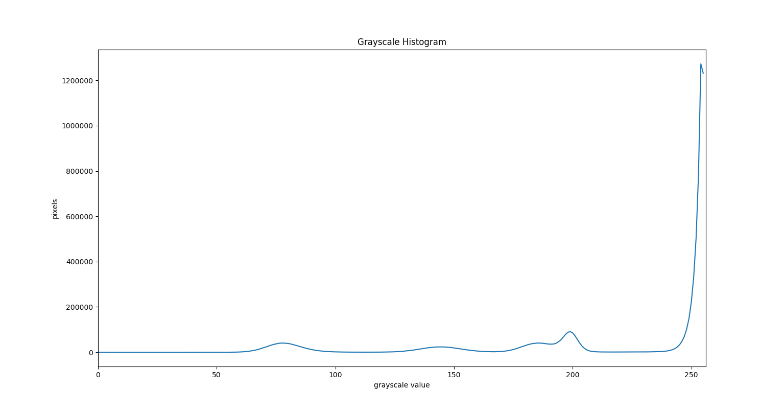

Since the image has a white background, most of the pixels in the image are 
white. This corresponds nicely to what we see in the histogram: there is a 
spike just past the value 250. If we want to select the shapes and not the 
background, we want to turn off the white background pixels, while leaving the
pixels for the shapes turned on. So, we should choose a value of T somewhere 
between 200 and 255, and instruct the `cv2.threshold()` method to turn pixels
below the T value on and turn the pixels above the T value off. 

Here is a Python program to apply simple thresholding to the image, to 
accomplish this task. 

~~~
'''
 * Python script to demonstrate simple thresholding.
 *
 * usage: python Threshold.py <filename> <kernel-size>  <threshold>
'''
import cv2
import sys

# get filename, kernel size, and threshold value from command line
filename = sys.argv[1]
k = int(sys.argv[2])
t = int(sys.argv[3])

# read and display the original image
img = cv2.imread(filename)
cv2.namedWindow("original", cv2.WINDOW_NORMAL)
cv2.imshow("original", img)
cv2.waitKey(0)

# blur and grayscale before thresholding
blur = cv2.cvtColor(img, cv2.COLOR_BGR2GRAY)
blur = cv2.GaussianBlur(blur, (k, k), 0)

# perform inverse binary thresholding 
(t, maskLayer) = cv2.threshold(blur, t, 255, cv2.THRESH_BINARY_INV)

# make a mask suitable for color images
mask = cv2.merge([maskLayer, maskLayer, maskLayer])

# display the mask image
cv2.namedWindow("mask", cv2.WINDOW_NORMAL)
cv2.imshow("mask", mask)
cv2.waitKey(0)

# use the mask to select the "interesting" part of the image
sel = cv2.bitwise_and(img, mask)

# display the result
cv2.namedWindow("selected", cv2.WINDOW_NORMAL)
cv2.imshow("selected", sel)
cv2.waitKey(0)
~~~
{: .python}

This program takes three command-line arguments: the filename of the image to 
manipulate, the kernel size used during the blurring step (which, if you recall
from the [Blurring]({{ page.root }}/06-blurring/) episode. must be odd), 
and finally, the threshold value T, which should be an integer in the closed
range [0, 255]. The program takes the command-line values and stores them in 
variables named `filename`, `k`, and `t`, respectively. 

Next, the program reads the original image based on the `filename` value, and
displays it. 

Now is where the main work of the program takes place. First, we convert the 
image to grayscale and then blur it, using the `cv2.GaussianBlur()` method we
learned about in the [Blurring]({{ page.root }}/06-blurring/) episode. The
image passed into the thresholding method must be grayscale. 

The fixed-level thresholding is performed with the `cv2.threshold()` method 
call. We pass in four parameters. The first, `blur`, is our blurred grayscale
version of the image. Next is our threshold value `t`. The third parameter is
the value to be used for pixels that are turned on during the thresholding, 255. 
Finally, we pass in a constant telling the method what kind of 
thresholding to apply, `cv2.THRESH_BINARY_INV`. This instructs the method to 
turn on pixels with color values below the threshold value T and turn off
pixels with color values above T. 

The method returns a tuple of two items: the value used for `t` and a new, 
two-dimensional NumPy array representing the binary image created by the 
thresholding operation. You may be wondering why the method returns `t`, since 
we passed the value in. There are other ways of using the `cv2.threshold()` 
method in which the threshold value is calculated automatically. For now, just 
focus on the binary image created by the method, `maskLayer`.

Since `maskLayer` is a binary image, it has only one color channel, and each 
value in the corresponding NumPy array is either 0 or 255. Here is a 
visualization of the binary image created by the thresholding operation.
The program used parameters of k = 7 and T = 210 to produce this image. You can
see that the areas where the shapes were in the original area are now white, 
while the rest of the mask image is black. 

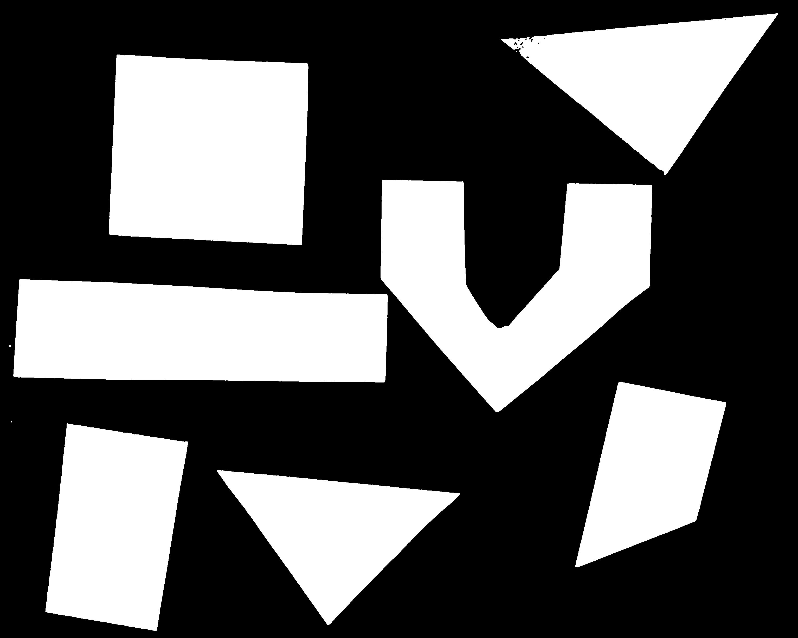

We intend to use this binary image as a mask, but we cannot do that yet, since
our original image was in color, with a three-dimensional array of values, 
while the binary image requires only a two-dimensional array. Thus, the next
step in the program converts the binary mask layer returned by 
`cv2.threshold()` into a color image, by merging the same layer together as 
the blue, green, and red layers of the new image. This is accomplished with the
`cv2.merge()` method; we pass in a list of the three color channel layers -- 
all the same in this case -- and the method returns a single image with those
color channels. 

Finally, we can use the `cv2.bitwise_and()` method we were introduced to in the
[Drawing and Bitwise Operations]({{ page.root}}/04-drawing-bitwise/) episode to
apply the mask to the original colored image. What we are left with is only the
colored shapes from the original, as shown in this image:

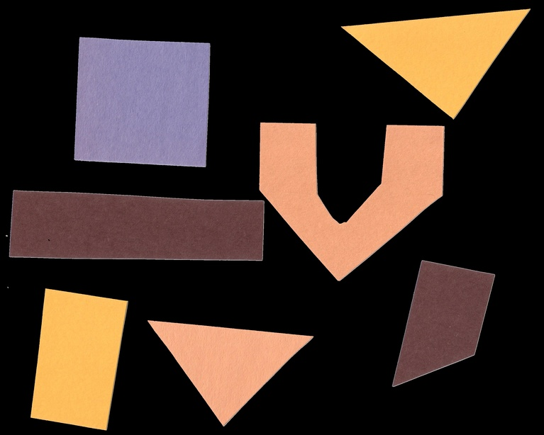

> ## More practice with simple thresholding
> 
> Now, it is your turn to practice. Suppose we want to use simple thresholding
> to select only the colored shapes from this image: 
> 
> 
> 
> First, use the **GrayscaleHistogram.py** program in the 
> **Desktop/workshops/image-processing/05-creating-histograms** directory to 
> examine the grayscale 
> histogram of the **more-junk.jpg** image, which you will find in the 
> **Desktop/workshops/image-processing/07-thresholding** directory. Via the 
> histogram, what do you 
> think would be a good value for the threshold value, T? 
> 
> > ## Solution
> > 
> > Here is the histogram for the **more-junk.jpg** image. 
> > 
> > 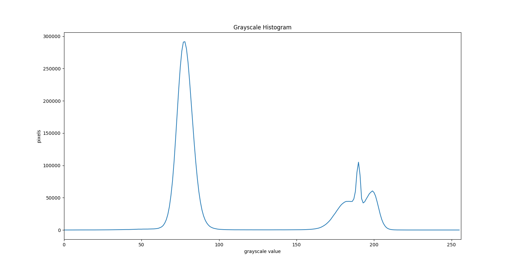
> > 
> > We can see a large spike around 75, and a smaller spike around 175. The 
> > spike near 75 represents the darker background, so it seems like a T value
> > close to 150 would be a good choice. 
> {: .solution}
> 
> Now, modify the **ThresholdPractice.py** program in the 
> **Desktop/workshops/image-processing/07-thresholding** directory to turn the 
> pixels above the 
> T value on and turn the pixels below the T value off. To do this, change the
> `cv2.THRESH_BINARY_INV` parameter to `cv2.THRESH_BINARY`. Then execute the 
> program on the **more-junk.jpg** image, using a reasonable value for k and 
> the T value you obtained from the histogram. If everything works as it 
> should, your output should show only the colored shapes on a pure black 
> background. 
> 
> > ## Solution 
> > 
> > Here is the modified **ThresholdPractice.py** program.
> > 
> > ~~~
> > '''
> >  * Python script to practice simple thresholding.
> >  *
> >  * usage: python ThresholdPractice <filename> <kernel-size> <threshold>
> > '''
> > import cv2
> > import sys
> > 
> > # get filename, kernel size, and threshold value from command line
> > filename = sys.argv[1]
> > k = int(sys.argv[2])
> > t = int(sys.argv[3])
> > 
> > # read and display the original image
> > img = cv2.imread(filename)
> > cv2.namedWindow("original", cv2.WINDOW_NORMAL)
> > cv2.imshow("original", img)
> > cv2.waitKey(0)
> > 
> > # blur and grayscale before thresholding
> > blur = cv2.cvtColor(img, cv2.COLOR_BGR2GRAY)
> > blur = cv2.GaussianBlur(blur, (k, k), 0)
> > 
> > # perform inverse binary thresholding 
> > # MODIFY CODE HERE!
> > (t, maskLayer) = cv2.threshold(blur, t, 255, cv2.THRESH_BINARY)
> > 
> > # make a mask suitable for color images
> > mask = cv2.merge([maskLayer, maskLayer, maskLayer])
> > 
> > # display the mask image
> > cv2.namedWindow("mask", cv2.WINDOW_NORMAL)
> > cv2.imshow("mask", mask)
> > cv2.waitKey(0)
> > 
> > # use the mask to select the "interesting" part of the image
> > sel = cv2.bitwise_and(img, mask)
> > 
> > # display the result
> > cv2.namedWindow("selected", cv2.WINDOW_NORMAL)
> > cv2.imshow("selected", sel)
> > cv2.waitKey(0)
> > ~~~
> > 
> > Using a blur kernel value k = 7 and threshold T = 150, we obtain this mask:
> > 
> > 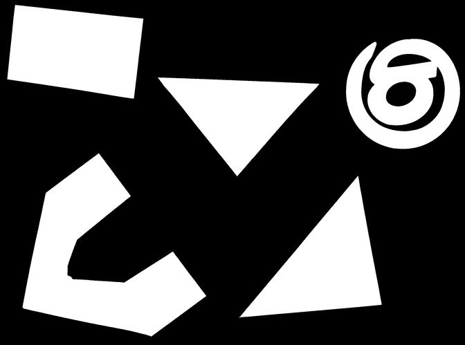
> > 
> > And applying the mask results in this selection of shapes:
> > 
> > 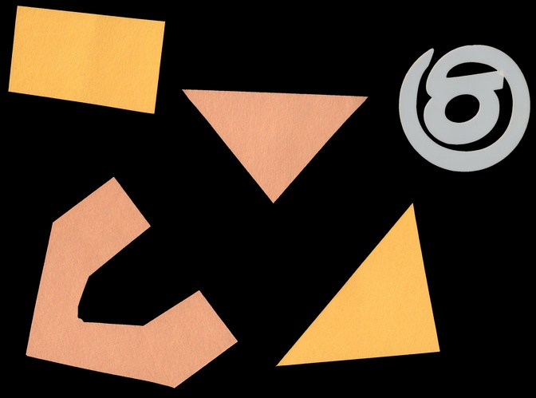
> > 
> {: .solution}
{: .challenge}

## Adaptive thresholding

There are also OpenCV methods to perform *adaptive thresholding*. The chief 
advantage of adaptive thresholding is that the value of the threshold, T, is
determined automatically for us. One such method, *Otsu's method*, is 
particularly useful for situations where the grayscale histogram of an image
has two peaks. Consider this maize root system image, which we have seen 
before in the [OpenCV Images]({{ page.root }}/03-opencv-images/) episode. 

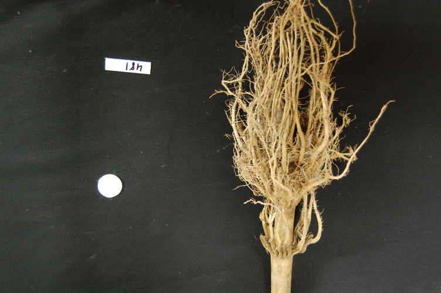

Now, look at the grayscale histogram of this image, as produced by our 
**GrayscaleHistogram.py** program from the 
[Creating Histograms]({{ page.root }}/05-creating-histograms/) episode. 

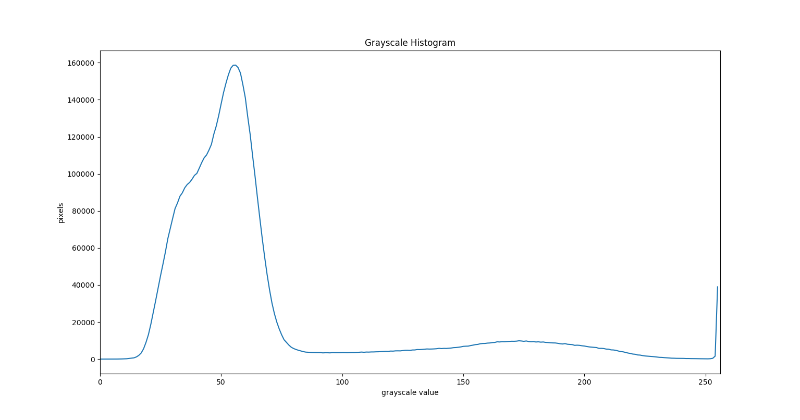

The histogram has a significant peak around 60, and a second, albeit smaller
peak very near 255. Thus, this image is a good candidate for thresholding with
Otsu's method. The mathematical details of how this work are complicated (see 
the [OpenCV documentation](http://docs.opencv.org/trunk/d7/d4d/tutorial_py_thresholding.html)
if you are interested), but the outcome is that Otsu's method finds a threshold
value between the two peaks of a grayscale histogram. 

The `cv2.threshold()` method can also be used to apply thresholding via Otsu's
method, if we pass the correct parameters. You should be aware, however, that 
the current implementation of Otsu's method in the `cv2.threshold()` method 
only works with 8 bit grayscale images. 

Here is a Python program illustrating how to perform thresholding with Otsu's
method using the `cv2.threshold()` method. 

~~~
'''
 * Python script to demonstrate adaptive thresholding using Otsu's method.
 *
 * usage: python AdaptiveThreshold.py <filename> <kernel-size>
'''
import cv2
import sys

# get filename and kernel size values from command line
filename = sys.argv[1]
k = int(sys.argv[2])

# read and display the original image
img = cv2.imread(filename)
cv2.namedWindow("original", cv2.WINDOW_NORMAL)
cv2.imshow("original", img)
cv2.waitKey(0)

# blur and grayscale before thresholding
blur = cv2.cvtColor(img, cv2.COLOR_BGR2GRAY)
blur = cv2.GaussianBlur(blur, (k, k), 0)

# perform adaptive thresholding 
(t, maskLayer) = cv2.threshold(blur, 0, 255, cv2.THRESH_BINARY + 
	cv2.THRESH_OTSU)

# make a mask suitable for color images
mask = cv2.merge([maskLayer, maskLayer, maskLayer])

cv2.namedWindow("mask", cv2.WINDOW_NORMAL)
cv2.imshow("mask", mask)
cv2.waitKey(0)

# use the mask to select the "interesting" part of the image
sel = cv2.bitwise_and(img, mask)

# display the result
cv2.namedWindow("selected", cv2.WINDOW_NORMAL)
cv2.imshow("selected", sel)
cv2.waitKey(0)
~~~
{: .python}

The program begins with the now-familiar imports and command line parameters. 
Here we only have to get the filename and the blur kernel size from the command
line, since Otsu's method will automatically determine the thresholding value 
T. Then, the original image is read and displayed, and a blurred grayscale 
image is created.

We perform the thresholding with another call to the `cv2.threshold()` method,

~~~
(t, maskLayer) = cv2.threshold(blur, 0, 255, cv2.THRESH_BINARY + 
	cv2.THRESH_OTSU)
~~~
{: .python}

The parameters mostly are similar to the simple thresholding we did in the 
previous section: `blur` is the blurred grayscale image, `0` stands in for the 
threshold value T, and `255` is the value that will be used for pixels that are
turned on. 

The difference lies in the next parameter, 
`cv2.THRESH_BINARY + cv2.THRESH_OTSU`. We are adding together two `cv2` 
constants, which in this case tells the `cv2.threshold()` method to do binary
thresholding -- pixels above the threshold value will be turned on, those below
the threshold will be turned off -- *and* to use Otsu's method to automatically
determine the threshold value. 

The method returns the computed threshold value, `t`, and the binary mask 
layer in the `maskLayer` variable. For this root image, and a blur kernel of 
size 7, the computed threshold value is 110, and the resulting mask is:

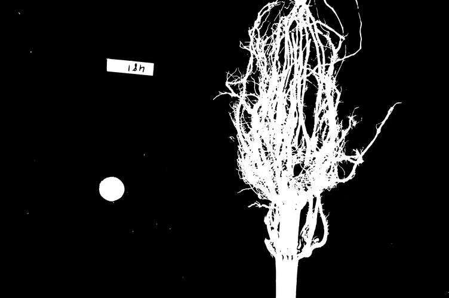

Once we have the binary mask, we turn it in to a color image and apply the 
mask to the original root image, just as we did in the previous section. Here 
is the result:

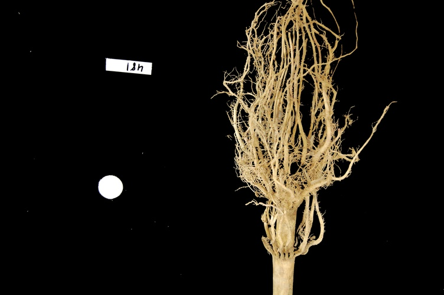

## Application: measuring root mass

Let us now turn to an application where we can apply thresholding and other
techniques we have learned to this point. Consider these four maize root 
system images.

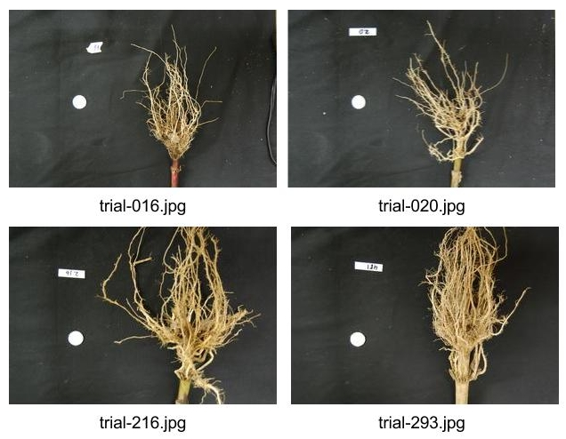

Now suppose we are interested in the amount of plant material in each image, 
and in particular how that amount changes from image to image. Perhaps the 
images represent the growth of the plant over time, or perhaps the images show
four different maize varieties at the same phase of their growth. In any case,
the question we would like to answer is, "how much root mass is in each image?"
We will construct a Python program to measure this value for a single image, 
and then create a Bash script to execute the program on each trial image in 
turn. 

Our strategy will be this:

1. Read the image, converting it to grayscale as it is read. For this 
application we do not need the color image.

2. Blur the image.

3. Use Otsu's method of thresholding to create a binary image, where the pixels
that were part of the maize plant are white, and everything else is black.

4. Save the binary image so it can be examined later.

5. Count the white pixels in the binary image, and divide by the number of 
pixels in the image. This ratio will be a measure of the root mass of the 
plant in the image.

6. Output the name of the image processed and the root mass ratio. 

Here is a Python program to implement this root-mass-measuring strategy. Almost
all of the code should be familiar, and in fact, it may seem simpler than the
code we have worked on thus far, because we are not displaying any of the 
images with this program. Our program here is intended to run and produce its 
numeric result -- a measure of the root mass in the image -- without human 
intervention.

~~~
'''
 * Python program to determine root mass, as a ratio of pixels in the
 * root system to the number of pixels in the entire image.
 *
 * usage: python RootMass.py <filename> <kernel-size>
'''
import cv2
import sys

# get filename and kernel size values from command line
filename = sys.argv[1]
k = int(sys.argv[2])

# read the original image, converting to grayscale
img = cv2.imread(filename, cv2.IMREAD_GRAYSCALE)

# blur before thresholding
blur = cv2.GaussianBlur(img, (k, k), 0)

# perform adaptive thresholding to produce a binary image
(t, binary) = cv2.threshold(blur, 0, 255, cv2.THRESH_BINARY + 
	cv2.THRESH_OTSU)

# save binary image; first find beginning of file extension
dot = filename.index(".")
binaryFileName = filename[:dot] + "-binary" + filename[dot:]
cv2.imwrite(binaryFileName, binary)

# determine root mass ratio
rootPixels = cv2.countNonZero(binary)
w = binary.shape[1]
h = binary.shape[0]
density = rootPixels / (w * h)

# output in format suitable for .csv
print(filename, density, sep=",")
~~~
{: .python}

The program begins with the usual imports and reading of command-line 
parameters. Then, we read the original image, based on the filename parameter,
in grayscale. Next the grayscale image is blurred based on the blur kernel 
parameter. Following that, we create a binary image with Otsu's method for 
thresholding, just as we did in the previous section. Since the program is 
intended to produce numeric output, without a person shepherding it, it does
not display any of the images.

We do, however, want to save the binary images, in case we wish to examine them
at a later time. That is what this block of code does:

~~~
# save binary image; first find beginning of file extension
dot = filename.index(".")
binaryFileName = filename[:dot] + "-binary" + filename[dot:]
cv2.imwrite(binaryFileName, binary)
~~~
{: .python}

This code does a little bit of string manipulation to determine the filename 
to use when the binary image is saved. For example, if the input filename being
processed is **trial-020.jpg**, we want to save the corresponding binary image
as **trial-020-binary.jpg**. To do that, we first determine the index of the 
dot between the filename and extension -- and note that we assume that there is
only one dot in the filename! Once we have the location of the dot, we can use
slicing to pull apart the filename string, inserting "-binary" in between the
end of the original name and the extension. Then, the binary image is saved via
a call to the `cv2.imwrite()` method. 

Finally, we can examine the code that is the reason this program exists! This
block of code determines the root mass ratio in the image:

~~~
# determine root mass ratio
rootPixels = cv2.countNonZero(binary)
w = binary.shape[1]
h = binary.shape[0]
density = rootPixels / (w * h)
~~~
{: .python}

Recall that we are working with a binary image at this point; every pixel in 
the image is either zero (black) or 255 (white). We want to count the number
of white pixels, which is easily accomplished with a call to the 
`cv2.countNonZero()` method. Then we determine the width and height of the 
image, via the first and second elements of the image's `shape`. Then the
density ratio is calculated by dividing the number of white pixels by the 
total number of pixels in the image. Then, the program prints out the 
name of the file processed and the corresponding root density. 

If we run the program on the **trial-016.jpg** image, with a blur kernel 
value of 7, we would execute the program this way:

~~~ 
python RootMass.py trial-016.jpg 7
~~~
{: .bash}

and the output we would see would be this:

~~~
trial-016.jpg,0.04827875664893617
~~~
{: .output}

We have four images to process in this example, and in a real-world scientific
situation, there might be dozens, hundreds, or even thousands of images to 
process. To save us the tedium of running the Python program on each image,
we can construct a Bash shell script to run the program multiple times for us.
Here is a sample script, which assumes that the images all start with the
**trial-** prefix and end with the **.jpg** file extension. The script also
assumes that the images, the **RootMass.py** program, and the script itself
are all in the same directory. 

~~~
#!/bin/bash
# Run the root density mass on all of the root system trail images.

# first, remove existing binary output images
rm *-binary.jpg

# then, execute the program on all the trail images
for f in trial-*.jpg
do
	python RootMass.py $f 7
done
~~~
{: .bash}

The script begins by deleting any prior versions of the binary images. After
that, the script uses a `for` loop to iterate through all of the input images,
and execute the **RootMass.py** on each image with a blur kernel size of 7. 
When we execute the script from the command line, we will see output like this:

~~~
trial-016.jpg,0.04827875664893617
trial-020.jpg,0.06355651595744681
trial-216.jpg,0.1411343085106383
trial-293.jpg,0.13571126994680852
~~~
{: .output}

It would probably be wise to save the output of our multiple runs to a file 
that we can analyze later on. We can do that very easily by redirecting the
output stream that would normally appear on the screen to a file. Assuming the
shell script is named **rootmass.sh**, this would do the trick:

~~~
bash rootmass.sh > rootmass.csv
~~~
{: .bash}

> ## Ignoring more of the images -- brainstorming
> 
> Let us take a closer look at the binary images produced by the 
> proceeding program. 
> 
> 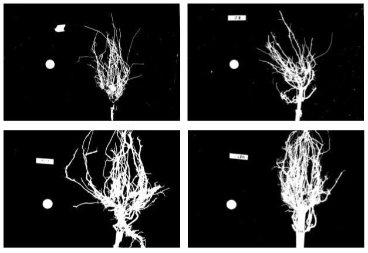
> 
> Our root mass ratios include white pixels that are not
> part of the plant in the image, do they not? The numbered labels and the 
> white circles in each image are preserved during the thresholding, and 
> therefore their pixels are included in our calculations. Those extra pixels
> might have a slight impact on our root mass ratios, especially the labels, 
> since the labels are not the same size in each image. How might we remove
> the labels and circles before calculating the ratio, so that our results are
> more accurate? Brainstorm and think about some options, given what we have 
> learned so far.
> 
> > ## Solution
> > 
> > One approach we might take is to try to completely mask out a region from
> > each image, particularly, the area containing the white circle and the 
> > numbered label. If we had coordinates for a rectangular area on the image
> > that contained the circle and the label, we could mask the area out easily
> > by using techniques we learned in the 
> > [Drawing and Bitwise Operations]({{ page.root }}/04-drawing-bitwise/) 
> > episode. 
> > 
> > However, a closer inspection of the binary images raises some issues with
> > that approach. Since the roots are not always constrained to a certain area
> > in the image, and since the circles and labels are in different locations 
> > each time, we would have difficulties coming up with a single rectangle
> > that would work for *every* image. We could create a different masking 
> > rectangle for each image, but that is not a practicable approach if we have
> > hundreds or thousands of images to process. 
> > 
> > Another approach we could take is to apply two thresholding steps to the
> > image. First, we could use simple binary thresholding to select and remove 
> > the white circle and label from the image, and then use Otsu's method to 
> > turn on the pixels in the plant portion of the image. 
> {: .solution}
{: .challenge}

> ## Ignoring more of the images -- implementation
> 
> Navigate to the **Desktop/workshops/image-processing/07-thresholding** 
> directory, and edit the **RootMassImproved.py** program. This is a copy of 
> the **RootMass.py** program developed above. Modify the program to apply 
> simple inverse binary thresholding to remove the white circle and label from 
> the image before applying Otsu's method. Comments in the program show you 
> where you should make your changes. 
> 
> > ## Solution 
> > 
> > Here is how we can apply an initial round of thresholding to remove the 
> > label and circle from the image. 
> > 
> > ~~~
> > '''
> >  * Python program to determine root mass, as a ratio of pixels in the
> >  * root system to the number of pixels in the entire image.
> >  * 
> >  * This version applies thresholding twice, to get rid of the white 
> >  * circle and label from the image before performing the root mass 
> >  * ratio calculations. 
> >  *
> >  * usage: python RootMassImproved.py <filename> <kernel-size>
> > '''
> > import cv2
> > import sys
> > 
> > # get filename and kernel size values from command line
> > filename = sys.argv[1]
> > k = int(sys.argv[2])
> > 
> > # read the original image, converting to grayscale
> > img = cv2.imread(filename, cv2.IMREAD_GRAYSCALE)
> > 
> > # blur before thresholding
> > blur = cv2.GaussianBlur(img, (k, k), 0)
> > 
> > # WRITE CODE HERE
> > # perform inverse binary thresholding to create a mask that will remove
> > # the white circle and label.
> > (t, mask) = cv2.threshold(blur, 250, 255, cv2.THRESH_BINARY_INV)
> > 
> > # WRITE CODE HERE
> > # use the mask you just created to remove the circle and label from the
> > # blur image, saving the result back in the blur variable
> > blur = cv2.bitwise_and(blur, mask)
> > 
> > # perform adaptive thresholding to produce a binary image
> > (t, binary) = cv2.threshold(blur, 0, 255, cv2.THRESH_BINARY + 
> > 	cv2.THRESH_OTSU)
> > 
> > # save binary image; first find extension beginning
> > dot = filename.index(".")
> > binaryFileName = filename[:dot] + "-binary" + filename[dot:]
> > cv2.imwrite(binaryFileName, binary)
> > 
> > # determine root mass ratio
> > rootPixels = cv2.countNonZero(binary)
> > w = binary.shape[1]
> > h = binary.shape[0]
> > density = rootPixels / (w * h)
> > 
> > # output in format suitable for .csv
> > print(filename, density, sep=",")
> > ~~~
> > {: .python}
> > 
> > Here are the binary images produced by this program. We have not completely 
> > removed the offending white pixels. Outlines still remain. However, we have
> > reduced the number of extraneous pixels, which should make the output more
> > accurate. 
> > 
> > 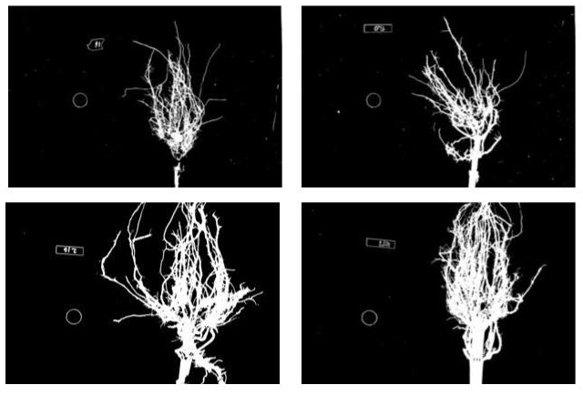
> > 
> > The output of the improved program does illustrate that the white circles
> > and labels were skewing our root mass ratios: 
> > 
> > ~~~
> > trial-016.jpg,0.0458984375
> > trial-020.jpg,0.059057513297872344
> > trial-216.jpg,0.13744381648936171
> > trial-293.jpg,0.13165076462765957
> > ~~~
> > {: .output}
> {: .solution}
{: .challenge}
