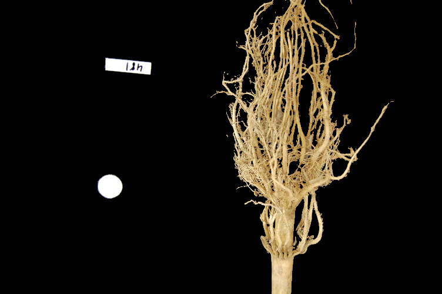
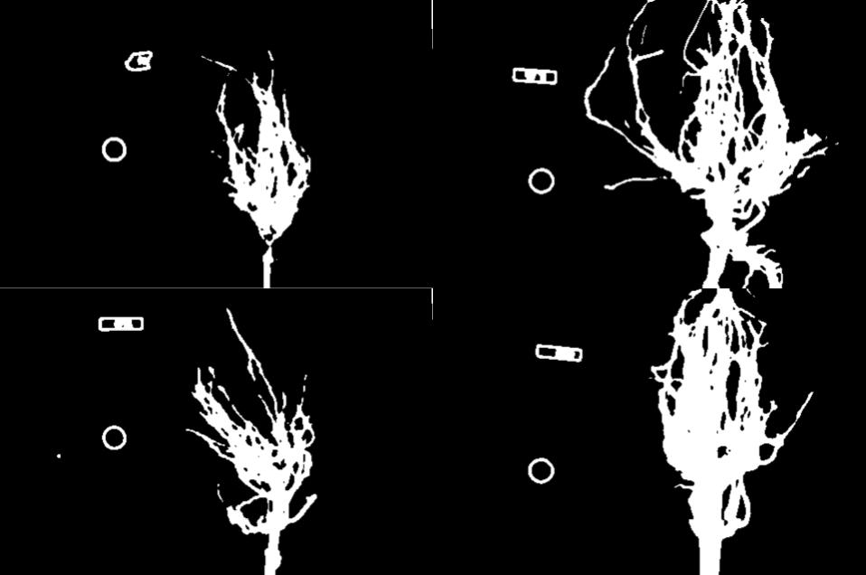

In this episode, we will learn how to use skimage functions to apply 
thresholding to an image. Thresholding is a type of *image segmentation*,
where we change the pixels of an image to make the image easier to 
analyze. In thresholding, we convert an image from color or grayscale into a 
*binary image*, i.e., one that is simply black and white. Most frequently, we 
use thresholding as a way to select areas of interest of an image, while 
ignoring the parts we are not concerned with. We have already done some simple 
thresholding, in the "Manipulating pixels" section of the 
[Skimage Images]({{ page.root }}/03-skimage-images/) episode. In that case, we
used a simple NumPy array manipulation to separate the pixels belonging to the
root system of a plant from the black background. In this episode, we will 
learn how to use skimage functions to perform thresholding. Then, we will use the
masks returned by these functions to select the parts of an image we are 
interested in. 

## Simple thresholding

Consider this image, with a series of crudely cut shapes set against a white 
background. The black outline around the image is not part of the image.

Now suppose we want to select only the shapes from the image. In other words,
we want to leave the pixels belonging to the shapes "on," while turning the 
rest of the pixels "off," by setting their color channel values to zeros. The
skimage library has several different methods of thresholding. We will start 
with the simplest version, which involves an important step of human 
input. Specifically, in this simple, *fixed-level thresholding*, we have to 
provide a threshold value `t`.

The process works like this. First, we will load the original image and convert
it to grayscale.

~~~
import numpy as np
import matplotlib.pyplot as plt
import skimage.io
import skimage.color
import skimage.filters

# load the image
image = skimage.io.imread("../../fig/06-junk-before.jpg")

# convert the image to grayscale
gray_image = skimage.color.rgb2gray(image)
~~~
{: .language-python}

Next, we would like to apply the threshold `t`, a number in the closed range [0.0, 1.0]. Pixels with color values on one  side of `t` will be turned "on," while pixels with color values on the other side will be turned "off." To use this process, we first have to determine a "good" value for `t`. How might we do that? One way is to look at the grayscale histogram of the image and try to identify what grayscale ranges correspond to the shapes in the image or the background.

The histogram for the shapes image shown above can be produced as in the [Creating Histograms]({{ page.root }}/05-creating-histograms/) episode.

~~~
# create a histogram of the blurred grayscale image
histogram, bin_edges = np.histogram(gray_image, bins=256, range=(0.0, 1.0))

plt.plot(bin_edges[0:-1], histogram)
plt.title("Grayscale Histogram")
plt.xlabel("grayscale value")
plt.ylabel("pixels")
plt.xlim(0, 1.0)
plt.show()
~~~
{: .language-python}

Since the image has a white background, most of the pixels in the image are white. This corresponds nicely to what we see in the histogram: there is a peak near the value of 1.0. If we want to select the shapes and not the background, we want to turn off the white background pixels, while leaving the pixels for the shapes turned on. So, we should choose a value of `t` somewhere before the large peak and turn pixels above that value "off". Let us choose `t=0.8`.

To apply the threshold `t`, we can use the numpy comparison operators to create a mask. Here, we want to turn "on" all pixels which have values smaller than the threshold, so we use the less operator `<` to compare the `blurred_image` to the threshold `t`. The operator returns a mask, that we capture in the variable `binary_mask`. It has only one channel, and each of its values is either 0 or 1. The binary mask created by the thresholding operation can be shown with `skimage.io.imshow`.

~~~
# create a mask based on the threshold
t = 0.8
binary_mask = blurred_image < t
skimage.io.imshow(binary_mask)
plt.show()
~~~
{: .language-python}

You can see that the areas where the shapes were in the original area are now white, while the rest of the mask image is black.

We can now apply the `binary_mask` to the original colored image as we have learned in the [Drawing and Bitwise Operations]({{ page.root}}/04-drawing/) episode. What we are left with is only the colored shapes from the original.

~~~
# use the binary_mask to select the "interesting" part of the image
selection = np.zeros_like(image)
selection[binary_mask] = image[binary_mask]

skimage.io.imshow(selection)
plt.show()
~~~
{: .language-python}

> ## More practice with simple thresholding (15 min)
> 
> Now, it is your turn to practice. Suppose we want to use simple thresholding
> to select only the colored shapes from this image: 
> 
> 
> 
> First, plot the grayscale histogram as in **Desktop/workshops/image-processing05-creating-histograms** and examine the distribution of grayscale values in the image. What do you think would be a good value for the threshold `t`?
> 
> > ## Solution
> > 
> > The histogram for the **more-junk.jpg** image can be shown with
> >
> > ~~~
> > import numpy as np
> > import matplotlib.pyplot as plt
> > import skimage.color
> > import skimage.filters
> > import skimage.io
> >
> > image = skimage.io.imread("../../fig/06-more-junk.jpg", as_gray=True)
> > histogram, bin_edges = np.histogram(image, bins=256, range=(0.0, 1.0))
> >
> > plt.plot(bin_edges[0:-1], histogram)
> > plt.title("Graylevel histogram")
> > plt.xlabel("gray value")
> > plt.ylabel("pixel count")
> > plt.xlim(0, 1.0)
> > plt.show()
> > ~~~
> > {: .python}
> >
> > 
> >
> > We can see a large spike around 0.3, and a smaller spike around 0.7. The
> > spike near 0.3 represents the darker background, so it seems like a value
> > close to `t=0.5` would be a good choice.
> {: .solution}
>
> Next, create a mask to turn the pixels above the threshold `t` on and pixels below the threshold `t` off. Note that unlike the image with a white background we used above, here the peak for the background color is at a lower gray level than the shapes. Therefore, change the comparison operator less `<` to greater `>` to create the appropriate mask. Then apply the mask to the image and view the thresholded image. If everything works as it should, your output should show inly the colored shapes on a black background.
>
> > ## Solution
> >
> > Here are the commands to create and view the binary mask
> > ~~~
> > t = 0.5
> > binary_mask = image < t
> > skimage.io.imshow(binary_mask)
> > plt.show()
> > ~~~
> > {: .language-python}
> > 
> > 
> > 
> > And here are the commands to apply the mask and view the thresholded image
> > ~~~
> > selection = np.zeros_like(image)
> > selection[binary_mask] = image[binary_mask]
> > skimage.io.imshow(selection)
> > plt.show()
> > ~~~
> > {: .python}
> >
> > 
> > 
> {: .solution}
{: .challenge}

## Adaptive thresholding

The downside of the simple thresholding technique is that we have to make an educated guess about the threshold `t` by inspecting the histogram. There are also *adaptive thresholding* methods that can determine the threshold automatically for us. One such method is *[Otsu's method](https://en.wikipedia.org/wiki/Otsu%27s_method)*. It is particularly useful for situations where the grayscale histogram of an image has two peaks that correspond to background and objects of interest.

> ## Denoising an image before thresholding
> In practice, it is often necessary to denoise the image before thresholding, which can be done with one of the methods from the [Blurring]({{ page.root }}/06-blurring/) episode.
{: .callout}

Consider this image of a maize root system which we have seen before in the [Skimage Images]({{ page.root }}/03-skimage-images/) episode.

We use Gaussian blur with a sigma of 1.0 to denoise the root image. Let us look at the grayscale histogram of the denoised image.

~~~
image = skimage.io.imread("../../fig/06-roots-original.jpg")

# convert the image to grayscale
gray_image = skimage.color.rgb2gray(image)

# blur the image to denoise
sigma = 1.0
blurred_image = skimage.filter.gaussian(gray_image, sigma=sigma)

# show the histogram of the blurred image
histogram, bin_edges = np.histogram(blurred_image, bins=256, range=(0.0, 1.0))
plt.plot(bin_edges[0:-1], histogram)
plt.title("Graylevel histogram")
plt.xlabel("gray value")
plt.ylabel("pixel count")
plt.xlim(0, 1.0)
plt.show()
~~~
{: .language-python}

The histogram has a significant peak around 0.2, and a second, smaller peak very near 1.0. Thus, this image is a good candidate for thresholding with Otsu's method. The mathematical details of how this work are complicated (see the [skimage documentation](https://scikit-image.org/docs/dev/api/skimage.filters.html#threshold-otsu) if you are interested), but the outcome is that Otsu's method finds a threshold value between the two peaks of a grayscale histogram.

The `skimage.filters.threshold_otsu()` function can be used to determine the adaptive threshold via Otsu's method. Then numpy comparison operators can be used to apply it as before. Here are the Python commands to determine the threshold `t` with Otsu's method.
~~~
# perform adaptive thresholding
t = skimage.filters.threshold_otsu(blurred_image)
print (t)
~~~
{: .language-python}

For this root image and a Gaussian blur with the chosen sigma of 1.0, the computed threshold value is 0.42. No we can create a binary mask with the comparison operator `>`. As we have seen before, pixels above the threshold value will be turned on, those below the threshold will be turned off.

~~~
# create a binary mask with the threshold found by Otsu's method
binary_mask = blurred_image > t
skimage.io.imshow(binary_mask)
plt.show()
~~~
{: .language-python}

Finally, we use the mask to select the foreground:

~~~
# apply the binary mask to select the foreground
selection = np.zeros_like(image)
selection[binary_mask] = image[binary_mask]

skimage.io.imshow(selection)
plt.show()
~~~
{: .language-python}

## Application: measuring root mass

Let us now turn to an application where we can apply thresholding and other
techniques we have learned to this point. Consider these four maize root 
system images.

Now suppose we are interested in the amount of plant material in each image, 
and in particular how that amount changes from image to image. Perhaps the 
images represent the growth of the plant over time, or perhaps the images show
four different maize varieties at the same phase of their growth. In any case,
the question we would like to answer is, "how much root mass is in each image?"
We will construct a Python program to measure this value for a single image, 
and then create a Bash script to execute the program on each trial image in 
turn. 

Our strategy will be this:

1. Read the image, converting it to grayscale as it is read. For this 
application we do not need the color image.
2. Blur the image.
3. Use Otsu's method of thresholding to create a binary image, where the pixels
that were part of the maize plant are white, and everything else is black.
4. Save the binary image so it can be examined later.
5. Count the white pixels in the binary image, and divide by the number of 
pixels in the image. This ratio will be a measure of the root mass of the 
plant in the image.
6. Output the name of the image processed and the root mass ratio. 

Here is a Python program to implement this root-mass-measuring strategy. Almost
all of the code should be familiar, and in fact, it may seem simpler than the
code we have worked on thus far, because we are not displaying any of the 
images with this program. Our program here is intended to run and produce its 
numeric result -- a measure of the root mass in the image -- without human 
intervention.

~~~
"""
 * Python program to determine root mass, as a ratio of pixels in the
 * root system to the number of pixels in the entire image.
 *
 * usage: python RootMass.py <filename> <sigma>
"""
import sys
import numpy as np
import skimage.io
import skimage.filters

# get filename and sigma value from command line
filename = sys.argv[1]
sigma = float(sys.argv[2])

# read the original image, converting to grayscale
img = skimage.io.imread(fname=filename, as_gray=True)
~~~
{: .language-python}

The program begins with the usual imports and reading of command-line 
parameters. Then, we read the original image, based on the filename parameter,
in grayscale. 

Next the grayscale image is blurred with a Gaussian that is defined by the sigma parameter.

~~~
# blur before thresholding
blur = skimage.filters.gaussian(img, sigma=sigma)
~~~
{: .language-python}

Following that, we create a binary image with Otsu's method for 
thresholding, just as we did in the previous section. Since the program is 
intended to produce numeric output, without a person shepherding it, it does
not display any of the images.

~~~
# perform adaptive thresholding to produce a binary image
t = skimage.filters.threshold_otsu(blur)
binary = blur > t
~~~
{: .language-python}

We do, however, want to save the binary images, in case we wish to examine them
at a later time. That is what this block of code does:
~~~
# save binary image; first find beginning of file extension
dot = filename.index(".")
binary_file_name = filename[:dot] + "-binary" + filename[dot:]
skimage.io.imsave(fname=binary_file_name, arr=skimage.img_as_ubyte(binary))
~~~
{: .language-python}

This code does a little bit of string manipulation to determine the filename 
to use when the binary image is saved. For example, if the input filename being
processed is **trial-020.jpg**, we want to save the corresponding binary image
as **trial-020-binary.jpg**. To do that, we first determine the index of the 
dot between the filename and extension -- and note that we assume that there is
only one dot in the filename! Once we have the location of the dot, we can use
slicing to pull apart the filename string, inserting "-binary" in between the
end of the original name and the extension. Then, the binary image is saved via
a call to the `skimage.io.imsave()` function. 
In order to convert from the binary range of 0 and 1 of the mask to a gray level image that can be saved as png, we use the `skimage.img_as_ubyte` utility function.

Finally, we can examine the code that is the reason this program exists! This
block of code determines the root mass ratio in the image:

~~~
# determine root mass ratio
rootPixels = np.count_nonzero(binary)
w = binary.shape[1]
h = binary.shape[0]
density = rootPixels / (w * h)

# output in format suitable for .csv
print(filename, density, sep=",")
~~~
{: .language-python}

Recall that we are working with a binary image at this point; every pixel in 
the image is either zero (black) or 1 (white). We want to count the number
of white pixels, which is easily accomplished with a call to the 
`np.count_nonzero` function. Then we determine the width and height of the
image, via the first and second elements of the image's `shape`. Then the
density ratio is calculated by dividing the number of white pixels by the 
total number of pixels in the image. Then, the program prints out the 
name of the file processed and the corresponding root density. 

If we run the program on the **trial-016.jpg** image, with a sigma value of 1.5,
we would execute the program this way:

~~~ 
python RootMass.py trial-016.jpg 1.5
~~~
{: .language-bash}

and the output we would see would be this:

~~~
trial-016.jpg,0.0482436835106383
~~~
{: .output}

We have four images to process in this example, and in a real-world scientific
situation, there might be dozens, hundreds, or even thousands of images to 
process. To save us the tedium of running the Python program on each image,
we can construct a Bash shell script to run the program multiple times for us.
Here is a sample script, which assumes that the images all start with the
**trial-** prefix and end with the **.jpg** file extension. The script also
assumes that the images, the **RootMass.py** program, and the script itself
are all in the same directory. 

~~~
#!/bin/bash
# Run the root density mass on all of the root system trail images.

# first, remove existing binary output images
rm *-binary.jpg

# then, execute the program on all the trail images
for f in trial-*.jpg
do
	python RootMass.py $f 1.5
done
~~~
{: .language-bash}

The script begins by deleting any prior versions of the binary images. After
that, the script uses a `for` loop to iterate through all of the input images,
and execute the **RootMass.py** on each image with a sigma of 1.5.
When we execute the script from the command line, we will see output like this:

~~~
trial-016.jpg,0.0482436835106383
trial-020.jpg,0.06346941489361702
trial-216.jpg,0.14073969414893617
trial-293.jpg,0.13607895611702128
~~~
{: .output}

It would probably be wise to save the output of our multiple runs to a file 
that we can analyze later on. We can do that very easily by redirecting the
output stream that would normally appear on the screen to a file. Assuming the
shell script is named **rootmass.sh**, this would do the trick:

~~~
bash rootmass.sh > rootmass.csv
~~~
{: .language-bash}

> ## Ignoring more of the images -- brainstorming (10 min - optional, not included in timing)
> 
> Let us take a closer look at the binary images produced by the 
> preceding program. 
> 
> 
> 
> Our root mass ratios include white pixels that are not
> part of the plant in the image, do they not? The numbered labels and the 
> white circles in each image are preserved during the thresholding, and 
> therefore their pixels are included in our calculations. Those extra pixels
> might have a slight impact on our root mass ratios, especially the labels, 
> since the labels are not the same size in each image. How might we remove
> the labels and circles before calculating the ratio, so that our results are
> more accurate? Brainstorm and think about some options, given what we have 
> learned so far.
> 
> > ## Solution
> > 
> > One approach we might take is to try to completely mask out a region from
> > each image, particularly, the area containing the white circle and the 
> > numbered label. If we had coordinates for a rectangular area on the image
> > that contained the circle and the label, we could mask the area out easily
> > by using techniques we learned in the 
> > [Drawing and Bitwise Operations]({{ page.root }}/04-drawing/)
> > episode. 
> > 
> > However, a closer inspection of the binary images raises some issues with
> > that approach. Since the roots are not always constrained to a certain area
> > in the image, and since the circles and labels are in different locations 
> > each time, we would have difficulties coming up with a single rectangle
> > that would work for *every* image. We could create a different masking 
> > rectangle for each image, but that is not a practicable approach if we have
> > hundreds or thousands of images to process. 
> > 
> > Another approach we could take is to apply two thresholding steps to the
> > image. First, we could use simple binary thresholding to select and remove 
> > the white circle and label from the image, and then use Otsu's method to 
> > turn on the pixels in the plant portion of the image. 
> {: .solution}
{: .challenge}

> ## Ignoring more of the images -- implementation (30 min - optional, not included in timing)
> 
> Navigate to the **Desktop/workshops/image-processing/07-thresholding** 
> directory, and edit the **RootMassImproved.py** program. This is a copy of 
> the **RootMass.py** program developed above. Modify the program to apply 
> simple inverse binary thresholding to remove the white circle and label from 
> the image before applying Otsu's method. Comments in the program show you 
> where you should make your changes. 
> 
> > ## Solution 
> > 
> > Here is how we can apply an initial round of thresholding to remove the 
> > label and circle from the image. 
> > 
> > ~~~
> > """
> >  * Python program to determine root mass, as a ratio of pixels in the
> >  * root system to the number of pixels in the entire image.
> >  *
> >  * This version applies thresholding twice, to get rid of the white
> >  * circle and label from the image before performing the root mass
> >  * ratio calculations.
> >  *
> >  * usage: python RootMassImproved.py <filename> <sigma>
> > """
> > import sys
> > import skimage.io
> > import skimage.filters
> >
> > # get filename and sigma value from command line
> > filename = sys.argv[1]
> > sigma = float(sys.argv[2])
> >
> > # read the original image, converting to grayscale
> > image = skimage.io.imread(fname=filename, as_gray=True)
> >
> > # blur before thresholding
> > blur = skimage.filters.gaussian(img, sigma=sigma)
> >
> > # WRITE CODE HERE
> > # perform binary thresholding to create a mask that selects
> > # the white circle and label, so we can remove it later
> > mask = blur > 0.95
> >
> > # WRITE CODE HERE
> > # use the mask you just created to remove the circle and label from the
> > # blur image
> > blur[mask] = 0
> >
> > # perform adaptive thresholding to produce a binary image
> > t = skimage.filters.threshold_otsu(blur)
> > binary = blur > t
> >
> > # save binary image; first find extension beginning
> > dot = filename.index(".")
> > binary_file_name = filename[:dot] + "-binary" + filename[dot:]
> > skimage.io.imsave(fname=binary_file_name, arr=binary)
> >
> > # determine root mass ratio
> > rootPixels = np.nonzero(binary)
> > w = binary.shape[1]
> > h = binary.shape[0]
> > density = float(rootPixels) / (w * h)
> >
> > # output in format suitable for .csv
> > print(filename, density, sep=",")
> > ~~~
> > {: .language-python}
> > 
> > Here are the binary images produced by this program. We have not completely 
> > removed the offending white pixels. Outlines still remain. However, we have
> > reduced the number of extraneous pixels, which should make the output more
> > accurate. 
> > 
> > 
> > 
> > The output of the improved program does illustrate that the white circles
> > and labels were skewing our root mass ratios: 
> > 
> > ~~~
> > trial-016.jpg,0.045935837765957444
> > trial-020.jpg,0.058800033244680854
> > trial-216.jpg,0.13705003324468085
> > trial-293.jpg,0.13164461436170213
> > ~~~
> > {: .output}
> {: .solution}
{: .challenge}

> ## Thresholding a bacteria colony image (15 min)
> 
> In the **Desktop/workshops/image-processing/07-thresholding** directory, you 
> will find an image named **colonies01.tif**; this is one of the images you
> will be working with in the morphometric challenge at the end of the 
> workshop. First, create a grayscale histogram of the image, and determine a
> threshold value for the image. Then, write a Python program to threshold a
> grayscale version of the image, leaving the pixels in the bacteria colonies
> "on," while turning the rest of the pixels in the image "off."
{: .challenge}
