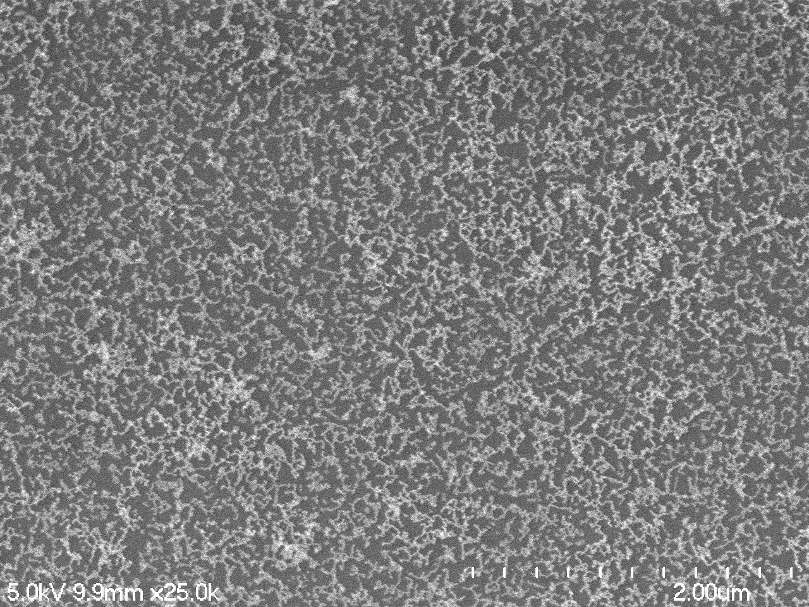

In this episode, we will provide two different challenges for you to attempt,
based on the skills you have acquired so far. One of the challenges will be
related to the shape of objects in images (*morphometrics*), while the other 
will be related to colors of objects in images (*colorimetrics*). We will not
provide solution code for either of the challenges, but your instructors should
be able to give you some gentle hints if you need them.

## Morphometrics: SEM nanoparticle connectedness

How connected are the nanoparticoles in the image?

## Colorimetrics: titration color analysis

The video showing the titration process first mentioned in the workshop 
[introduction]({{ page.root }}/01-introduction/) episode can be found in the 
**Desktop/workshops/image-processing/10-challenges/colorimetric** directory.
Write a Python program that uses OpenCV to analyze the video on a 
frame-by-frame basis. Your program should do the following:

1. Sample a kernel from the same location on each frame, and determine the 
	average red, green, and blue channel value.

2. Display a graph plotting the average color channel values as a function of
	the frame number, similar to this image:

	

3. Save the graph as an image named **titration.png**.

4. Output a CSV file named **titration.csv**, with each line containing
	the frame number, average red value, average green value, and average
	blue value
