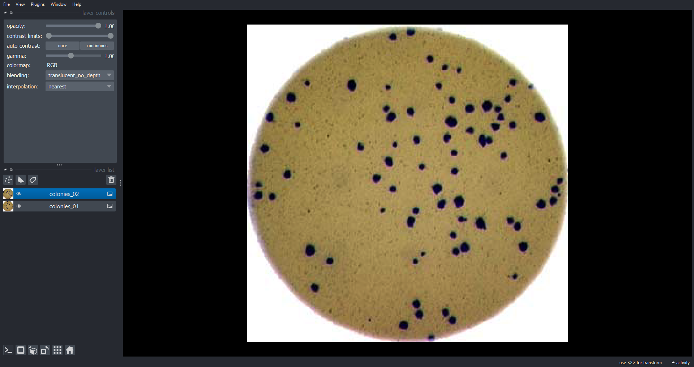
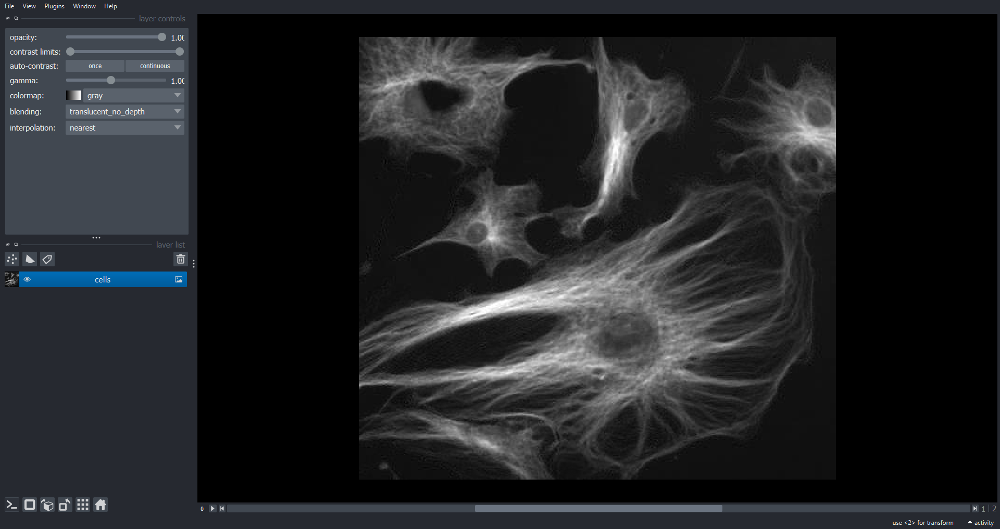
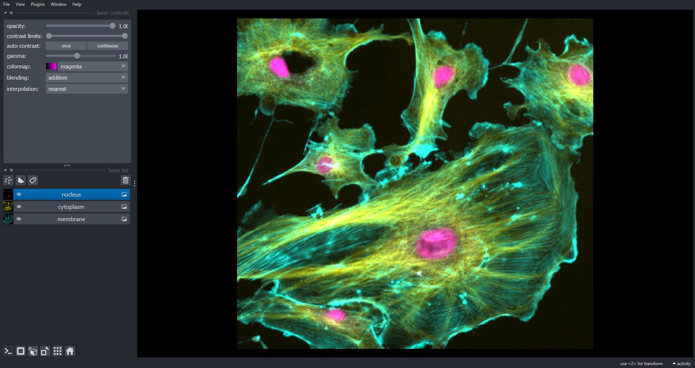
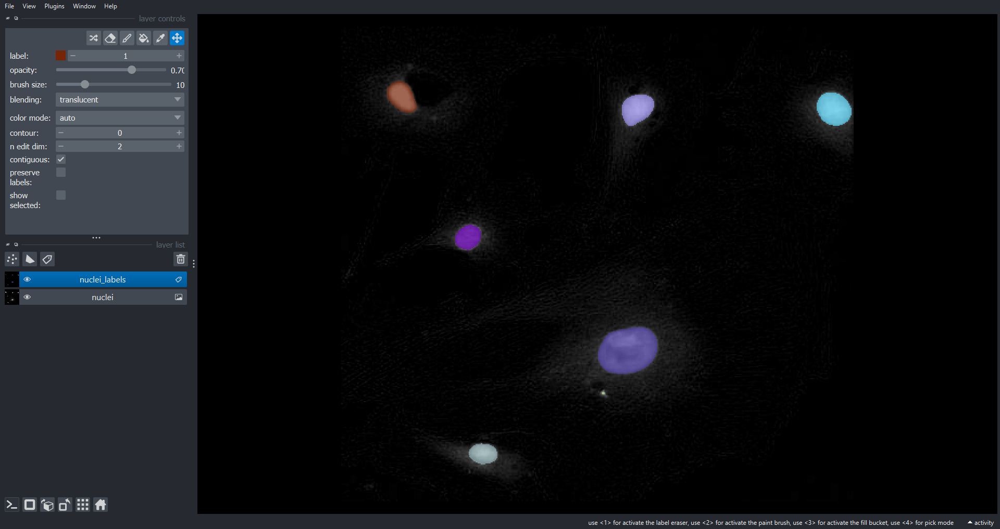
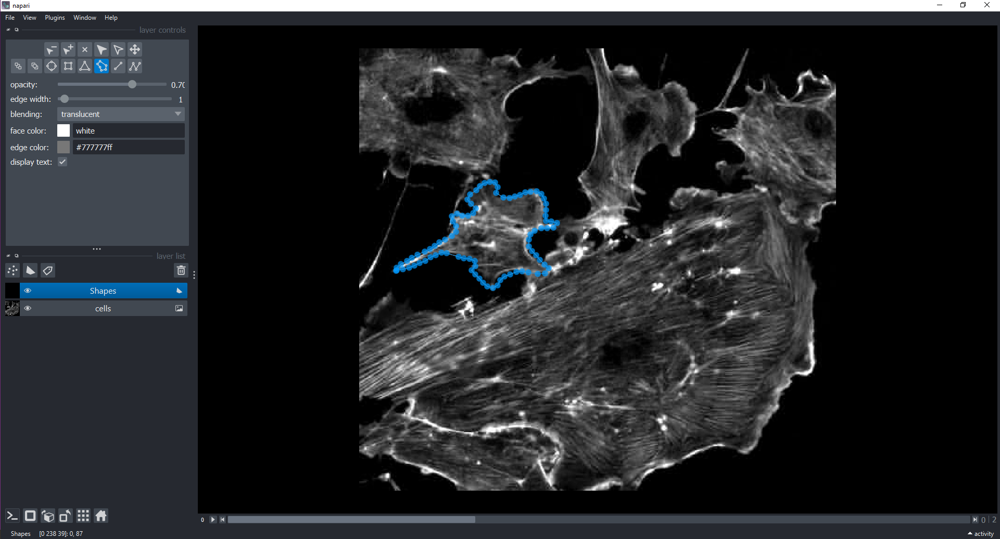
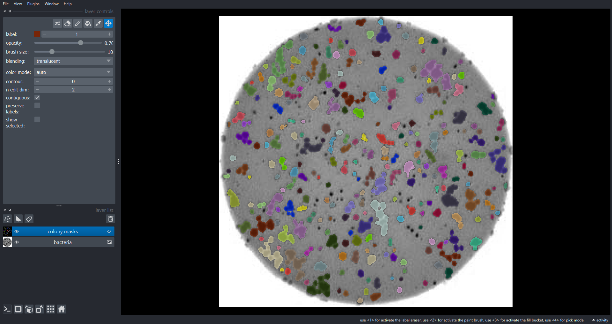

::::::::::::::::::::::::::::::::::::::: objectives

- Learn about multidimensional image data such as 3D volumetric stacks and timelapses.
- Visualize multidimensional data interactively using Napari.
- Learn to use the basic functionality of the Napari GUI including overlaying masks over images.
- Construct an analysis workflow to measure properties of 3D objects in a 3D volumetric image stack.
- Construct an analysis workflow to measure changes over time from a timelapse movie.

::::::::::::::::::::::::::::::::::::::::::::::::::

:::::::::::::::::::::::::::::::::::::::: questions

- How can we scikit-image to perform image processing tasks on multidimensional image data?
- How can we visualise the results using Napari?

::::::::::::::::::::::::::::::::::::::::::::::::::

In this episode we will move beyond 2D RGB image data and learn how to process and visualise
multidimensional image data including 3D volumes and timelapse movies. A 3D volumetric dataset
consists of a ordered sequence of 2D images (slices) where each slice in image a

:::::::::::::::::::::::::::::::::::::::: callout

## Unofficial episode

This additional episode is not part of the official
[Carpentries Image Processing with Python Lesson](https://datacarpentry.org/image-processing/).
It was developed by
[Jeremy Pike](https://www.birmingham.ac.uk/research/arc/rsg/staff/jeremy-pike.aspx)
from the
[Research Software Group](https://www.birmingham.ac.uk/research/arc/rsg/bear-software.aspx)
and the
[Institute for Interdisciplinary Data Science and AI](https://www.birmingham.ac.uk/research/data-science/index.aspx)
at the University of Birmingham.

::::::::::::::::::::::::::::::::::::::::::::::::::

## First, import the packages needed for this episode

```python
import imageio.v3 as iio
import skimage as ski
import numpy as np
import napari
```

## What is multidimensional image data?

Image data is often more complex than individual 2D (xy) images and can have additional
dimensionality and structure. Such multidimensional image data has many flavours
including multichannel, 3D volumes and timelapse movies. It is possible to combine these flavours to
produce higher n-dimensional data. For example a volumetric, multichannel, timelapse dataset would
have a 5D (2+1+1+1) structure.

### Multichannel image data

In many applications we can have different 2D images, or channels, of the same spatial area. We have
already seen a simple example of this in RGB colour images where we have 3 channels representing the
red, green and blue components. Another example is in fluorescence microscopy where we could have
images of different proteins. Modern techniques often allow for acquisition of much more than 3
protein channels.

### 3D volumetric data

Volumetric image data consists of an ordered sequence of 2D images (or slices) where each slice
corresponds to a, typically evenly spaced, axial position. Such data is common in biomedical
applications for example CT or MRI can be used to construct 3D volumes of the brain or heart.

### Timelapse movies

Timelapse movies are commonplace in everyday life. When you take a movie on your phone your acquire
an ordered sequence of 2D images (or timepoints/frames) where each image corresponds to a specific
point in time. Timelapse data is also common in scientific applications where we want to quantify
changes over time. For example imaging the growth of cells cultures/bacterial colonies/plant roots
etc over time.

## Interactive image visualisation with Napari

In the previous episodes we used `matplotlib.pyplot.imshow()` to display images. This is suitable
for basic visualisation of 2D multichannel image data but not well suited for more complex tasks
such as:

1. Interactive visualisation such as on-the-fly zooming in and out, rotation and toggling
   between channels.
2. Interactive image annotation. In [the *Drawing* episode](04-drawing.md) we used functions such
   as `ski.draw.rectangle()` to programmatically annotate images but not in an interactive
   user-friendly way.
3. Visualising 3D volumetric data either by toggling between slices or though a 3D rendering.
4. Visualising timelapse movies where the movie can be played and paused at specific timepoints (
   frames).
5. Visualising complex higher order data (4D, 5D etc.) such as timelapse, volumetric multichannel
   images.

[Napari](https://napari.org/stable/tutorials/fundamentals/quick_start.html) is a Python library for
fast visualisation,
annotation and analysis of n-dimensional image data. At its core is the
[`napari.Viewer` class](https://napari.org/stable/api/napari.Viewer.html#napari.Viewer). Creating a
Viewer instance within a notebook will launch a Napari graphical user interface (GUI) wih two-way
communication between the notebook and the GUI:

```python
viewer = napari.Viewer()
```

The Napari Viewer display data through
[Layers](https://napari.org/stable/api/napari.layers.html). There are different Layer subclasses for
different types of data. `Image` Layers are for image data and `Label` Layers are for
masks/segmentations. There are also Layer subclasses for `Points`, `Shapes`, `Surfaces` etc. Let's
load two RGB images and add them to the Viewer as `Image` Layers:

```python
colonies_01 = iio.imread(uri="data/colonies-01.tif")
colonies_02 = iio.imread(uri="data/colonies-02.tif")
viewer.add_image(data=colonies_01, name="colonies_01", rgb=True)
viewer.add_image(data=colonies_02, name="colonies_02", rgb=True)
napari.utils.nbscreenshot(viewer)
```
{alt='colonies napari ss'}

Here we use the `viewer.add_image()` function to add `Image` Layers to the Viewer. We set `rgb=True`
to display the three channel image as RGB. The `napari.utils.nbscreenshot()` function outputs a
screenshot of the Viewer to the notebook output. Now lets look at some multichannel image data

```python
cells = iio.imread(uri="data/FluorescentCells.tif")
print(cells.shape)
```

Like RGB data this image of cells also has three channels (stored in the first dimension of the
NumPy array). However, in this case we may want to visualise each channel independently. To do this
we do not set `rgb=True` when adding the image layer:

```python
viewer.layers.clear()
viewer.add_image(data=cells, name="cells")
```
{alt='cells napari ss'}

We can now scroll through the channels within Napari using the slider just below the image. This
approach will work with an arbitrary number of channels, not just three. With multichannel data it
is common to visualise colour overlays of selected channels where each channel has a different
colour map. In Napari we can do this programmatically using the `channel_axis` variable:

```python
viewer.layers.clear()
viewer.add_image(data=cells, name=["membrane", "cytoplasm", "nucleus"], channel_axis=0)
```

{alt='cells seperate napari ss'}

Using what we have learnt in the previous Episodes lets segment the nuclei . First we produce a
binary mask of the nuclei blurring the nuclei channel image and then thresholding with the Otsu
approach. Subsequently, we label the connected components within the mask to indentify individual
nuclei:

```python
blurred_nuclei = ski.filters.gaussian(cells[2], sigma=2.0)
t = ski.filters.threshold_otsu(blurred_nuclei)
nuclei_mask = blurred_nuclei > t
nuclei_labels = ski.measure.label(nuclei_mask, connectivity=2, return_num=False)
```

Now lets display the nuclei channel and overlay the labels using Napari as a `Label` layer:

```python
viewer.layers.clear()
viewer.add_image(data=cells[2], name="nuclei")
viewer.add_labels(data=nuclei_labels, name="nuclei_labels")
```
{alt='nuclei napari ss'}

We can also interactively annotate images with shapes using the a `Shapes` Layer. Let display all
channels and then do this within the GUI.

```python
viewer.layers.clear()
viewer.add_image(data=cells, name="cells")
# the instructor will demonstrate how to add a `Shapes` Layer and draw around cells using polygons
```
{alt='shapes napari ss'}

:::::::::::::::::::::::::::::::::::::::  challenge

## Using Napari as an image viewer (20 min)

In [the *Capstone challenge* episode](09-challenges.md) you made a function to count the number of
bacteria colonies in an image at to produce a new image that highlights the colonies. Modify this
function to make use Napari, as opposed to `Matplotlib`, to display both the original colony image
and the segmented individual colonies. Test this new function on `"data/colonies-03.tif"`. If you
did not complete the *Capstone challenge* epsidode you
can start with function from the
[solution](09-challenges.md#colony-counting-with-minimum-size-and-automated-threshold-optional-not-included-in-timing).
Hints:

1. A `napari.Viewer` object should be parsed to the function as an input parameter.
2. The original image should be added to the Viewer as an `Image` Layer.
3. The labelled colony image should be to the Viewer as an `Label` Layer.

:::::::::::::::::::::::::::::::::::::::  solution

Your new function might look something like this:

```python
def count_colonies_napari(image_filename, viewer, sigma=1.0, min_colony_size=10, connectivity=2):
  bacteria_image = iio.imread(image_filename)
  gray_bacteria = ski.color.rgb2gray(bacteria_image)
  blurred_image = ski.filters.gaussian(gray_bacteria, sigma=sigma)

  # create mask excluding the very bright pixels outside the dish
  # we dont want to include these when calculating the automated threshold
  mask = blurred_image < 0.90
  # calculate an automated threshold value within the dish using the Otsu method
  t = ski.filters.threshold_otsu(blurred_image[mask])
  # update mask to select pixels both within the dish and less than t
  mask = np.logical_and(mask, blurred_image < t)
  # remove objects smaller than specified area
  mask = ski.morphology.remove_small_objects(mask, min_size=min_colony_size)

  labeled_image, count = ski.measure.label(mask, return_num=True)
  print(f"There are {count} colonies in {image_filename}")

  # add the orginal image (RGB) to the Napari Viewer
  viewer.add_image(data=bacteria_image, name="bacteria", rgb=True)
  # add the labeled image to the Napari Viewer
  viewer.add_labels(data=labeled_image, name="colony masks")
```

To run this function on `"data/colonies-03.tif"`:

```python
viewer.layers.clear()  # or viewer = napari.Viewer() if you want a new Viewer
count_colonies_napari(image_filename="data/colonies-03.tif", viewer=viewer)
```

{alt='colonies napari 3 ss'}

:::::::::::::::::::::::::

::::::::::::::::::::::::::::::::::::::::::::::::::

:::::::::::::::::::::::::::::::::::::::  challenge

## Learning to use the Napari GUI (optional, not included in timing)

Take some time to further familiarize yourself with the Napari GUI. You could load some of the
course images and experiment with different features, or alternatively you could take a look at the
official [Viewer tutorial](https://napari.org/stable/tutorials/fundamentals/viewer.html).

::::::::::::::::::::::::::::::::::::::::::::::::::

::::::::::::::::::::::::::::::::::::::::  callout

## Napari plugins

[Plugins](https://napari.org/stable/plugins/index.html) extend Napari's core functionally and
allow you to add lots of cool and advanced features. There is an ever-increasing number of Napari
plugins which are available from the [Napari hub](https://www.napari-hub.org/). For example:

- [napari-animation](https://www.napari-hub.org/plugins/napari-animation) for making video
  annotations with key frames.
- [napari-segment-blobs-and-things-with-membranes](https://www.napari-hub.org/plugins/napari-segment-blobs-and-things-with-membranes)
  for adding common image processing operations to the Tools menu.
- [napari-skimage-regionprops](https://www.napari-hub.org/plugins/napari-skimage-regionprops) for
  measuring the properties of connected components from `Label` Layers.
- [napari-pyclesperanto-assistant](https://www.napari-hub.org/plugins/napari-pyclesperanto-assistant)
  for GPU-accelerated image processing operations.
- [napari-clusters-plotter](https://www.napari-hub.org/plugins/napari-clusters-plotter) for
  clustering objects according to their properties including dimensionality reduction techniques
  like PCA and UMAP.
- [napari-acceleration-pixel-and-object-classification](https://www.napari-hub.org/plugins/napari-accelerated-pixel-and-object-classification)
  for Random Forest-based pixel and object classification.
- [cellpose-napari](https://www.napari-hub.org/plugins/cellpose-napari)
  and [stardist-napari](https://www.napari-hub.org/plugins/stardist-napari) for pretrained deep
  learning-based models to segment cells and nuclei.
- [napari-n2v](https://www.napari-hub.org/plugins/napari-n2v) for self-supervised deep
  learning-based denosing.
- [napari-assistant](https://www.napari-hub.org/plugins/napari-assistant), a meta-plugin for
  building image processing workflows.

::::::::::::::::::::::::::::::::::::::::::::::::::

::::::::::::::::::::::::::::::::::::::::  callout

## Getting help on image.sc

[image.sc](https://forum.image.sc/) is a community forum for all software-oriented aspects of
scientific imaging, particularly (but not limited to) image analysis, processing, acquisition,
storage, and management. Its great place to get help and ask questions which are either general or
specific to a particular tool. There are active sections
for [python](https://forum.image.sc/tag/python), [scikit-image](https://forum.image.sc/tag/scikit-image)
and [Napari](https://forum.image.sc/tag/napari).

::::::::::::::::::::::::::::::::::::::::::::::::::

## Processing 3D volumetric data

## Processing timelapse movies

:::::::::::::::::::::::::::::::::::::::: keypoints

- We can access the Napari n-dimensional image viewer with `Napari.Viewer` objects.
- `Image` and `Label` Layers can be added to a viewer with `Napari.Viewer.add_image()`
  and `Napari.Viewer.add_label()` respectively.
- Many scikit-image functions such as `ski.filters.gaussian()`, `ski.threshold.threshold_otsu()`,
  `ski.measure.label()` and `ski.measure.regionprops()` work with 3D image data.
- Iterate through time-points to analyse timelapse movies.

::::::::::::::::::::::::::::::::::::::::::::::::::
